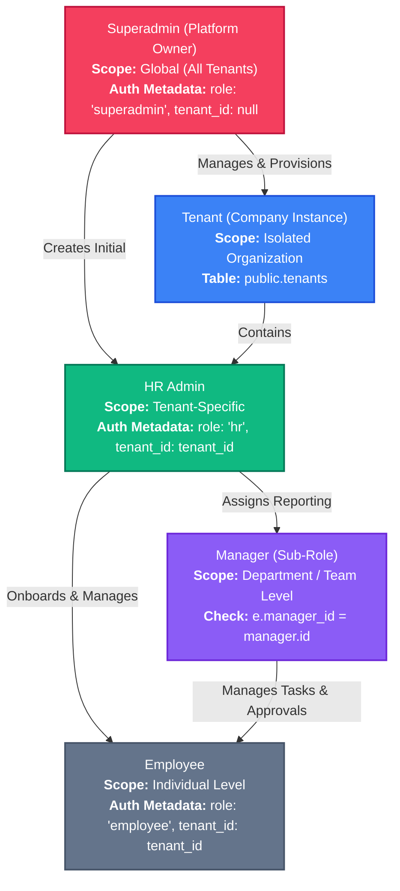
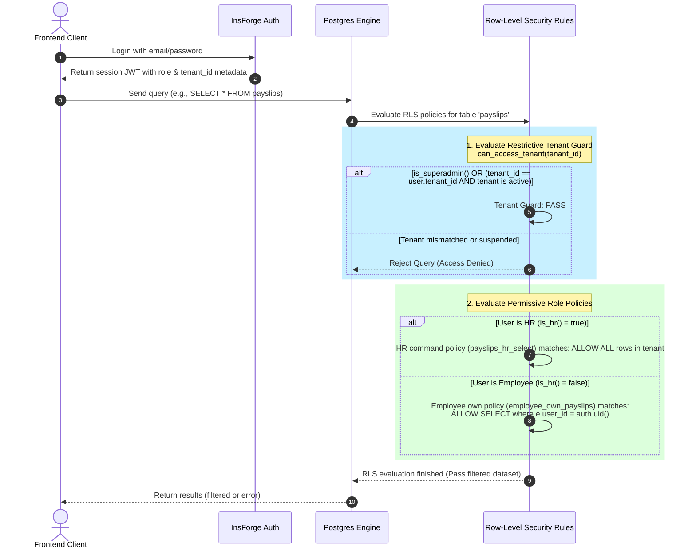

# HRMS Roles, Functions, and Access Control Architecture

This document provides a detailed breakdown of the user roles in the TalentMesh HRMS, their specific system functions, and how these roles are managed at the database level using the InsForge platform, JWT metadata, and PostgreSQL Row-Level Security (RLS) policies.

---

## 1. Role Hierarchy and Identity Model

The HRMS recognizes three primary auth roles, plus a dynamic sub-role (Manager). Below is the logical hierarchy showing how they relate to the platform, tenants, and each other.



---

## 2. Detailed Functions by Role

### 🔑 Superadmin (Platform Admin)
Operates at the global platform level and manages all software-as-a-service (SaaS) tenant instances.

*   **Tenant Provisioning & Subscriptions**: Creates and manages company tenant accounts (`public.tenants`), changes subscription plans (`trial`, `starter`, `growth`, `pro`), and overrides status (`active`, `suspended`, `cancelled`).
*   **Initial Tenant HR Provisioning**: Runs the secure edge function `create-hr-admin-user` or database RPC `set_hr_user_metadata` to register and verify the initial HR administrator for a new company tenant.
*   **Platform Auditing**: Accesses platform-wide audit trails (`public.platform_audit_logs`) to track tenant creation, modification, and subscription state changes.
*   **Global Diagnostics**: Troubleshoots errors across database schemas and reviews edge function performance indicators.

### 💼 HR Admin
The administrative owner of a single tenant instance. Responsible for company configuration, employee lifecycles, and approvals.

*   **Employee Lifecycle Management**:
    *   Initiates employee onboarding (via the `create-employee-user` edge function).
    *   Updates employee statuses (`active`, `inactive`, `terminated`).
    *   Resets password hashes for tenant employees using `set_employee_password_by_hr`.
*   **Time & Attendance Rules**:
    *   Configures office geofences, shifts, holiday calendars, and attendance verification requirements (e.g. mandatory selfies).
    *   Reviews, overrides, or approves daily attendance records and punch-out overrides.
    *   Grants and manages work-mode exceptions (Work From Home, Client Visit, Business Travel).
*   **Leave Management**:
    *   Defines leave types and sets leave balances and annual allocations.
    *   Reviews and approves or rejects leave requests (`public.leaves`).
*   **Financial & Payroll**:
    *   Sets up employee salary structures (`public.salary_structures`).
    *   Triggers and processes monthly payroll runs (`public.payroll_runs`).
    *   Generates employee payslips (`public.payslips`).
    *   Approves or rejects overtime records and expense claims.
*   **Task & Policy Administration**:
    *   Creates and assigns tasks (`public.tasks`).
    *   Uploads and publishes official corporate documents and HR policies (`public.hr_policies`).

### 👥 Employee
A regular staff member with access restricted strictly to their own data and team collaboration features.

*   **Daily Attendance Operations**:
    *   Punches in and out (supplying geolocation data, verified IPs, and selfie verification).
    *   Initiates and ends work breaks (`public.attendance_breaks`).
    *   Requests work-mode exceptions for approval.
*   **Self-Service Leave & Finance**:
    *   Checks personal leave balances and submits leave requests.
    *   Views own salary structure and historical payslips.
    *   Submits monthly Income Tax (IT) declarations and reimbursement expenses.
*   **Task Submission**:
    *   Views assigned tasks and submits completed work with optional attachments.
*   **Communication & Directory**:
    *   Accesses the organization directory (`My Team`) to see designations and structures.
    *   Participates in public and group chat channels and views general announcements.

### 👥 Manager (Sub-Role)
A dynamic role designated to any employee who has one or more direct reports (where other employees' `manager_id` fields point to their employee `id`).

*   **Team Performance Monitoring**: Views profiles, roles, and status details of direct team members.
*   **Managerial Approvals**: Approves or rejects team leave applications and attendance corrections before they go to HR (if required by tenant workflow configuration).
*   **Task Management**: Reviews task completion quality for direct reports and provides feedback.

---

## 3. How Roles are Managed at the Database Level

The HRMS secures tenant data and enforces role constraints through three primary layers: **Auth Metadata Claims**, **Database Helper Functions**, and **Row-Level Security (RLS) Policies**.

### A. Auth Metadata Claims (The Token Source)
When a user authenticates, their JSON Web Token (JWT) contains metadata fields set directly on their user object in the auth schema (`auth.users.metadata`).

> [!NOTE]
> The structure of the metadata object is:
> ```json
> {
>   "role": "hr" | "employee" | "superadmin",
>   "tenant_id": "uuid-string-here" | null
> }
> ```

This token metadata is passed along with every SQL transaction and serves as the database's source of truth for the active caller's identity.

---

### B. Database Helper Functions
To check roles and enforce tenant boundaries safely in SQL queries and Row-Level Security, the schema defines the following helpers:

#### 1. `get_auth_tenant_id()`
Retrieves the tenant ID of the authenticated user from the JWT metadata.
```sql
CREATE OR REPLACE FUNCTION public.get_auth_tenant_id()
RETURNS uuid LANGUAGE sql STABLE SECURITY DEFINER SET search_path TO '' AS $$
  SELECT (metadata->>'tenant_id')::uuid
  FROM auth.users
  WHERE id = (SELECT auth.uid());
$$;
```

#### 2. `is_superadmin()`
Verifies if the current user exists in the active platform administrators list.
```sql
CREATE OR REPLACE FUNCTION public.is_superadmin()
RETURNS boolean LANGUAGE sql STABLE SECURITY DEFINER SET search_path TO '' AS $$
  SELECT EXISTS (
    SELECT 1 FROM public.platform_admins pa
    WHERE pa.user_id = (SELECT auth.uid())
      AND pa.is_active = true
      AND pa.role IN ('owner', 'support_admin', 'billing_admin')
  );
$$;
```

#### 3. `is_hr()`
Confirms if the user has the HR role and operates inside their verified tenant.
```sql
CREATE OR REPLACE FUNCTION public.is_hr()
RETURNS boolean LANGUAGE sql STABLE SECURITY DEFINER SET search_path TO '' AS $$
  SELECT EXISTS (
    SELECT 1 FROM auth.users u
    WHERE u.id = (SELECT auth.uid())
      AND u.metadata->>'role' = 'hr'
      AND NULLIF(u.metadata->>'tenant_id', '')::uuid = (SELECT public.get_auth_tenant_id())
  );
$$;
```

#### 4. `can_access_tenant(tenant_uuid)`
Restricts operations to the user's assigned tenant, while letting superadmins access everything.
```sql
CREATE OR REPLACE FUNCTION public.can_access_tenant(tenant_uuid uuid)
RETURNS boolean LANGUAGE sql STABLE SECURITY DEFINER SET search_path TO '' AS $$
  SELECT (SELECT public.is_superadmin())
    OR (
      tenant_uuid = (SELECT public.get_auth_tenant_id())
      AND (SELECT public.tenant_is_active(tenant_uuid))
    );
$$;
```

---

### C. Row-Level Security (RLS) Policy Execution Flow

All key tables in the database (e.g. `employees`, `attendance`, `leaves`, `payslips`, `tasks`) have Row-Level Security enabled. A query goes through tenant-isolation filters first, followed by command-specific policies.



#### Example RLS Policies in Action:

*   **Platform Administrators (`public.platform_admins`)**:
    *   `platform_admins_select_self`: Users can select their own record.
    *   `platform_admins_owner_all`: Only superadmins can run CRUD operations on other platform administrators.
*   **Employee Profile (`public.employees`)**:
    *   `tenant_isolation`: Restricts row access to the user's own tenant (unless superadmin).
    *   `employees_hr_all`: Allows HR admins full `ALL` commands on employee records.
    *   `employees_self_select` / `employees_self_update`: Allows employees to read and update their own profiles (matching `user_id = auth.uid()`).
*   **Payslips (`public.payslips`)**:
    *   `payslips_hr_select/insert/update/delete`: Grants HR admins complete management access.
    *   `employee_own_payslips`: Permits regular employees to read only their own payslips (joins through the `employees` table to verify ownership).

---

### D. Frontend Role Handling (State & Protection)

In the frontend application, the role is initialized and kept reactive in the React context provider [AuthContext](file:///c:/Users/Anuj/Desktop/hrms/HRMS-Talentmesh-Solutions/src/contexts/AuthContext.tsx).

1.  **Session Refresh**: On app load, `refreshUser()` calls `auth.getCurrentUser()` to retrieve JWT credentials.
2.  **Superadmin Verification**: Runs the database RPC `get_my_platform_role` to check for active superadmin records in `platform_admins`, overriding metadata parameters to prevent spoofing.
3.  **Role Fallback**: If the auth metadata does not specify a role, a database lookup is performed against the `employees` table matching `user_id = auth.uid()`. If a record is found, the role is fallback-assigned to `'employee'`, and their `tenant_id` is loaded.
4.  **Manager Determination**: A dynamic query counts employees inside the tenant who report to the current logged-in employee (`manager_id = employee.id`). If the count exceeds zero, `isManager` is marked `true`, rendering managers' views and team options.
