# Live Database Schema and ER Diagram (updateSuggestion Branch)
This document is automatically generated from the active PostgreSQL database instance on the `updateSuggestion` preview backend (`https://rq3qmu8y-jx7.ap-southeast.insforge.app`).

---

## 📊 Entity Relationship Diagram

```mermaid
erDiagram
    announcement_dismissals }|--|| announcements : "announcement_id -> id"
    activity }|--|| profiles : "user_id -> id"
    attendance }|--|| attendance_breaks : "current_break_id -> id"
    attendance }|--|| employees : "employee_id -> id"
    attendance }|--|| tenants : "tenant_id -> id"
    attendance_corrections }|--|| employees : "employee_id -> id"
    attendance_corrections }|--|| employees : "reviewed_by -> id"
    attendance_corrections }|--|| tenants : "tenant_id -> id"
    attendance_location_exceptions }|--|| employees : "approved_by -> id"
    attendance_location_exceptions }|--|| employees : "cancelled_by -> id"
    attendance_location_exceptions }|--|| employees : "employee_id -> id"
    attendance_location_exceptions }|--|| employees : "requested_by -> id"
    attendance_location_exceptions }|--|| tenants : "tenant_id -> id"
    audit_logs }|--|| employees : "actor_id -> id"
    audit_logs }|--|| tenants : "tenant_id -> id"
    attendance_breaks }|--|| attendance : "attendance_id -> id"
    attendance_breaks }|--|| employees : "employee_id -> id"
    attendance_breaks }|--|| tenants : "tenant_id -> id"
    chat_channels }|--|| employees : "created_by -> id"
    chat_channels }|--|| tenants : "tenant_id -> id"
    employee_shifts }|--|| employees : "employee_id -> id"
    employee_shifts }|--|| shifts : "shift_id -> id"
    employee_shifts }|--|| tenants : "tenant_id -> id"
    employee_documents }|--|| employees : "employee_id -> id"
    employee_documents }|--|| tenants : "tenant_id -> id"
    holidays }|--|| tenants : "tenant_id -> id"
    hr_policies }|--|| tenants : "tenant_id -> id"
    hr_policies }|--|| employees : "uploaded_by -> id"
    chat_messages }|--|| chat_channels : "channel_id -> id"
    chat_messages }|--|| employees : "sender_id -> id"
    chat_messages }|--|| tenants : "tenant_id -> id"
    calendar_events }|--|| employees : "employee_id -> id"
    calendar_events }|--|| tasks : "task_id -> id"
    calendar_events }|--|| tenants : "tenant_id -> id"
    leaves }|--|| employees : "employee_id -> id"
    leaves }|--|| leave_types : "leave_type_id -> id"
    leaves }|--|| employees : "reviewed_by -> id"
    leaves }|--|| tenants : "tenant_id -> id"
    payroll_runs }|--|| employees : "approved_by -> id"
    payroll_runs }|--|| employees : "run_by -> id"
    payroll_runs }|--|| tenants : "tenant_id -> id"
    notifications }|--|| employees : "employee_id -> id"
    notifications }|--|| tenants : "tenant_id -> id"
    notifications }|--|| profiles : "user_id -> id"
    leave_types }|--|| tenants : "tenant_id -> id"
    office_locations }|--|| tenants : "tenant_id -> id"
    overtime_records }|--|| employees : "approved_by -> id"
    overtime_records }|--|| attendance : "attendance_id -> id"
    overtime_records }|--|| employees : "employee_id -> id"
    overtime_records }|--|| tenants : "tenant_id -> id"
    leave_balances }|--|| employees : "employee_id -> id"
    leave_balances }|--|| leave_types : "leave_type_id -> id"
    leave_balances }|--|| tenants : "tenant_id -> id"
    payslips }|--|| employees : "employee_id -> id"
    payslips }|--|| payroll_runs : "payroll_run_id -> id"
    payslips }|--|| tenants : "tenant_id -> id"
    task_submissions }|--|| employees : "employee_id -> id"
    task_submissions }|--|| employees : "reviewed_by -> id"
    task_submissions }|--|| tasks : "task_id -> id"
    task_submissions }|--|| tenants : "tenant_id -> id"
    tenant_settings }|--|| tenants : "tenant_id -> id"
    salary_structures }|--|| employees : "created_by -> id"
    salary_structures }|--|| employees : "employee_id -> id"
    salary_structures }|--|| tenants : "tenant_id -> id"
    tasks }|--|| employees : "assigned_by -> id"
    tasks }|--|| employees : "assigned_to -> id"
    tasks }|--|| projects : "project_id -> id"
    tasks }|--|| tenants : "tenant_id -> id"
    shifts }|--|| tenants : "tenant_id -> id"
    attendance_audit_logs }|--|| attendance : "attendance_id -> id"
    attendance_audit_logs }|--|| tenants : "tenant_id -> id"
    attendance_selfies }|--|| attendance : "attendance_id -> id"
    attendance_selfies }|--|| employees : "employee_id -> id"
    attendance_selfies }|--|| tenants : "tenant_id -> id"
    chat_channel_members }|--|| chat_channels : "channel_id -> id"
    chat_channel_members }|--|| employees : "employee_id -> id"
    chat_channel_members }|--|| tenants : "tenant_id -> id"
    employees }|--|| employees : "created_by -> id"
    employees }|--|| employees : "manager_id -> id"
    employees }|--|| tenants : "tenant_id -> id"
    posts }|--|| employees : "author_id -> id"
    posts }|--|| tenants : "tenant_id -> id"
    post_reactions }|--|| employees : "employee_id -> id"
    post_reactions }|--|| posts : "post_id -> id"
    post_reactions }|--|| tenants : "tenant_id -> id"
    projects }|--|| employees : "created_by -> id"
    projects }|--|| employees : "manager_id -> id"
    projects }|--|| tenants : "tenant_id -> id"
    insurance_policies }|--|| employees : "employee_id -> id"
    insurance_policies }|--|| tenants : "tenant_id -> id"
    expenses }|--|| employees : "employee_id -> id"
    expenses }|--|| payroll_runs : "payroll_run_id -> id"
    expenses }|--|| employees : "reviewed_by -> id"
    expenses }|--|| tenants : "tenant_id -> id"
    it_declaration_windows }|--|| employees : "opened_by -> id"
    it_declaration_windows }|--|| tenants : "tenant_id -> id"
    it_declarations }|--|| employees : "employee_id -> id"
    it_declarations }|--|| tenants : "tenant_id -> id"
    it_declarations }|--|| employees : "verified_by -> id"
```

---

## 🔍 Isolated & Useless Tables (Targeted for Cleanup)
The following tables are isolated from the core HRMS product and are candidates for cleanup or have been successfully removed:

| Table Name | Description | Status |
|------------|-------------|--------|

| *None* | All recruitment module tables have been successfully deleted. | ✅ **Cleaned** |
| `test_log` | Useless test table. | ⚠️ **Unused / Candidate for Deletion** |
| `test_mcp_sync` | Useless test table. | ⚠️ **Unused / Candidate for Deletion** |

---

## 🗄️ Core Tables and Columns Documentation

### `activity` (✅ Core HRMS Table)
*Description: Logs user activity history.*

**Columns:**
| Column Name | Data Type | Nullable? | Foreign Key? |
|-------------|-----------|-----------|--------------|
| `id` | `uuid` | ❌ No |  |
| `user_id` | `uuid` | ✅ Yes | 🔑 Links to [`profiles.id`](#profiles) |
| `type` | `text` | ❌ No |  |
| `title` | `text` | ✅ Yes |  |
| `description` | `text` | ✅ Yes |  |
| `meta` | `text` | ✅ Yes |  |
| `created_at` | `timestamp with time zone` | ✅ Yes |  |

### `admin_users` (✅ Core HRMS Table)
*Description: Internal table syncing admin roles for policy assessments.*

**Columns:**
| Column Name | Data Type | Nullable? | Foreign Key? |
|-------------|-----------|-----------|--------------|
| `user_id` | `uuid` | ❌ No |  |

### `ai_suggestion_cache` (✅ Core HRMS Table)
*Description: Cache storage for AI suggestions.*

**Columns:**
| Column Name | Data Type | Nullable? | Foreign Key? |
|-------------|-----------|-----------|--------------|
| `query_key` | `text` | ❌ No |  |
| `suggestions` | `jsonb` | ❌ No |  |
| `expires_at` | `timestamp with time zone` | ❌ No |  |
| `created_at` | `timestamp with time zone` | ✅ Yes |  |

### `announcement_dismissals` (✅ Core HRMS Table)
*Description: Records which users dismissed specific announcements.*

**Columns:**
| Column Name | Data Type | Nullable? | Foreign Key? |
|-------------|-----------|-----------|--------------|
| `id` | `uuid` | ❌ No |  |
| `announcement_id` | `uuid` | ❌ No | 🔑 Links to [`announcements.id`](#announcements) |
| `user_id` | `uuid` | ❌ No |  |
| `dismissed_at` | `timestamp with time zone` | ✅ Yes |  |

### `announcements` (✅ Core HRMS Table)
*Description: Company-wide announcements created by HR.*

**Columns:**
| Column Name | Data Type | Nullable? | Foreign Key? |
|-------------|-----------|-----------|--------------|
| `id` | `uuid` | ❌ No |  |
| `title` | `text` | ❌ No |  |
| `message` | `text` | ❌ No |  |
| `type` | `text` | ✅ Yes |  |
| `is_active` | `boolean` | ✅ Yes |  |
| `show_as_banner` | `boolean` | ✅ Yes |  |
| `target_roles` | `ARRAY` | ✅ Yes |  |
| `scheduled_at` | `timestamp with time zone` | ✅ Yes |  |
| `expires_at` | `timestamp with time zone` | ✅ Yes |  |
| `view_count` | `integer` | ✅ Yes |  |
| `dismiss_count` | `integer` | ✅ Yes |  |
| `created_at` | `timestamp with time zone` | ✅ Yes |  |
| `updated_at` | `timestamp with time zone` | ✅ Yes |  |
| `image_url` | `text` | ✅ Yes |  |

### `attendance` (✅ Core HRMS Table)
*Description: Main clock-in/out records, locations, and verification status.*

**Columns:**
| Column Name | Data Type | Nullable? | Foreign Key? |
|-------------|-----------|-----------|--------------|
| `id` | `uuid` | ❌ No |  |
| `employee_id` | `uuid` | ❌ No | 🔑 Links to [`employees.id`](#employees) |
| `date` | `date` | ❌ No |  |
| `punch_in` | `timestamp with time zone` | ✅ Yes |  |
| `punch_out` | `timestamp with time zone` | ✅ Yes |  |
| `punch_out_allowed` | `boolean` | ❌ No |  |
| `punch_in_ip` | `text` | ✅ Yes |  |
| `punch_out_ip` | `text` | ✅ Yes |  |
| `work_hours` | `numeric` | ✅ Yes |  |
| `status` | `text` | ❌ No |  |
| `notes` | `text` | ✅ Yes |  |
| `created_at` | `timestamp with time zone` | ❌ No |  |
| `tenant_id` | `uuid` | ❌ No | 🔑 Links to [`tenants.id`](#tenants) |
| `punch_in_lat` | `numeric` | ✅ Yes |  |
| `punch_in_lng` | `numeric` | ✅ Yes |  |
| `punch_in_location_accuracy` | `numeric` | ✅ Yes |  |
| `punch_in_location_status` | `text` | ✅ Yes |  |
| `punch_out_lat` | `numeric` | ✅ Yes |  |
| `punch_out_lng` | `numeric` | ✅ Yes |  |
| `punch_out_location_accuracy` | `numeric` | ✅ Yes |  |
| `punch_out_location_status` | `text` | ✅ Yes |  |
| `is_late` | `boolean` | ✅ Yes |  |
| `session_status` | `text` | ✅ Yes |  |
| `auto_closed` | `boolean` | ✅ Yes |  |
| `total_break_minutes` | `integer` | ❌ No |  |
| `current_break_id` | `uuid` | ✅ Yes | 🔑 Links to [`attendance_breaks.id`](#attendancebreaks) |
| `current_break_start` | `timestamp with time zone` | ✅ Yes |  |
| `location_accuracy` | `numeric` | ✅ Yes |  |
| `location_confidence` | `text` | ✅ Yes |  |
| `location_status` | `text` | ✅ Yes |  |
| `remote_exception_id` | `uuid` | ✅ Yes |  |
| `verification_snapshot` | `jsonb` | ✅ Yes |  |

### `attendance_audit_logs` (✅ Core HRMS Table)
*Description: Audit trail of changes made to attendance logs.*

**Columns:**
| Column Name | Data Type | Nullable? | Foreign Key? |
|-------------|-----------|-----------|--------------|
| `id` | `uuid` | ❌ No |  |
| `tenant_id` | `uuid` | ❌ No | 🔑 Links to [`tenants.id`](#tenants) |
| `attendance_id` | `uuid` | ❌ No | 🔑 Links to [`attendance.id`](#attendance) |
| `action` | `text` | ❌ No |  |
| `details` | `jsonb` | ✅ Yes |  |
| `performed_by` | `uuid` | ✅ Yes |  |
| `created_at` | `timestamp with time zone` | ✅ Yes |  |

### `attendance_breaks` (✅ Core HRMS Table)
*Description: Tracks break start/end times and durations for employees.*

**Columns:**
| Column Name | Data Type | Nullable? | Foreign Key? |
|-------------|-----------|-----------|--------------|
| `id` | `uuid` | ❌ No |  |
| `tenant_id` | `uuid` | ❌ No | 🔑 Links to [`tenants.id`](#tenants) |
| `employee_id` | `uuid` | ❌ No | 🔑 Links to [`employees.id`](#employees) |
| `attendance_id` | `uuid` | ❌ No | 🔑 Links to [`attendance.id`](#attendance) |
| `break_type` | `text` | ❌ No |  |
| `started_at` | `timestamp with time zone` | ❌ No |  |
| `ended_at` | `timestamp with time zone` | ✅ Yes |  |
| `duration_minutes` | `integer` | ✅ Yes |  |
| `over_limit_minutes` | `integer` | ✅ Yes |  |
| `created_at` | `timestamp with time zone` | ❌ No |  |

### `attendance_corrections` (✅ Core HRMS Table)
*Description: Requests by employees to correct past punch records.*

**Columns:**
| Column Name | Data Type | Nullable? | Foreign Key? |
|-------------|-----------|-----------|--------------|
| `id` | `uuid` | ❌ No |  |
| `tenant_id` | `uuid` | ❌ No | 🔑 Links to [`tenants.id`](#tenants) |
| `employee_id` | `uuid` | ❌ No | 🔑 Links to [`employees.id`](#employees) |
| `attendance_date` | `date` | ❌ No |  |
| `requested_punch_in` | `time without time zone` | ✅ Yes |  |
| `requested_punch_out` | `time without time zone` | ✅ Yes |  |
| `reason` | `text` | ❌ No |  |
| `status` | `text` | ❌ No |  |
| `reviewed_by` | `uuid` | ✅ Yes | 🔑 Links to [`employees.id`](#employees) |
| `reviewed_at` | `timestamp with time zone` | ✅ Yes |  |
| `rejection_reason` | `text` | ✅ Yes |  |
| `created_at` | `timestamp with time zone` | ❌ No |  |

### `attendance_location_exceptions` (✅ Core HRMS Table)
*Description: Pre-approved permissions for remote/out-of-office punches.*

**Columns:**
| Column Name | Data Type | Nullable? | Foreign Key? |
|-------------|-----------|-----------|--------------|
| `id` | `uuid` | ❌ No |  |
| `tenant_id` | `uuid` | ❌ No | 🔑 Links to [`tenants.id`](#tenants) |
| `employee_id` | `uuid` | ❌ No | 🔑 Links to [`employees.id`](#employees) |
| `exception_type` | `text` | ❌ No |  |
| `start_date` | `date` | ❌ No |  |
| `end_date` | `date` | ❌ No |  |
| `reason` | `text` | ❌ No |  |
| `status` | `text` | ❌ No |  |
| `requested_by` | `uuid` | ✅ Yes | 🔑 Links to [`employees.id`](#employees) |
| `approved_by` | `uuid` | ✅ Yes | 🔑 Links to [`employees.id`](#employees) |
| `approved_at` | `timestamp with time zone` | ✅ Yes |  |
| `cancelled_by` | `uuid` | ✅ Yes | 🔑 Links to [`employees.id`](#employees) |
| `cancelled_at` | `timestamp with time zone` | ✅ Yes |  |
| `created_at` | `timestamp with time zone` | ❌ No |  |
| `updated_at` | `timestamp with time zone` | ❌ No |  |

### `attendance_selfies` (✅ Core HRMS Table)
*Description: Stores paths to photos taken at punch-in/out for identity verification.*

**Columns:**
| Column Name | Data Type | Nullable? | Foreign Key? |
|-------------|-----------|-----------|--------------|
| `id` | `uuid` | ❌ No |  |
| `attendance_id` | `uuid` | ❌ No | 🔑 Links to [`attendance.id`](#attendance) |
| `tenant_id` | `uuid` | ❌ No | 🔑 Links to [`tenants.id`](#tenants) |
| `employee_id` | `uuid` | ❌ No | 🔑 Links to [`employees.id`](#employees) |
| `type` | `text` | ❌ No |  |
| `storage_path` | `text` | ❌ No |  |
| `captured_at` | `timestamp with time zone` | ❌ No |  |
| `created_at` | `timestamp with time zone` | ❌ No |  |

### `audit_logs` (✅ Core HRMS Table)
*Description: General application audit log.*

**Columns:**
| Column Name | Data Type | Nullable? | Foreign Key? |
|-------------|-----------|-----------|--------------|
| `id` | `uuid` | ❌ No |  |
| `tenant_id` | `uuid` | ❌ No | 🔑 Links to [`tenants.id`](#tenants) |
| `actor_id` | `uuid` | ✅ Yes | 🔑 Links to [`employees.id`](#employees) |
| `actor_role` | `text` | ✅ Yes |  |
| `action` | `text` | ❌ No |  |
| `target_type` | `text` | ✅ Yes |  |
| `target_id` | `uuid` | ✅ Yes |  |
| `details` | `jsonb` | ✅ Yes |  |
| `ip_address` | `text` | ✅ Yes |  |
| `created_at` | `timestamp with time zone` | ❌ No |  |
| `metadata` | `jsonb` | ✅ Yes |  |
| `user_agent` | `text` | ✅ Yes |  |
| `status` | `text` | ✅ Yes |  |

### `calendar_events` (✅ Core HRMS Table)
*Description: Internal calendar events.*

**Columns:**
| Column Name | Data Type | Nullable? | Foreign Key? |
|-------------|-----------|-----------|--------------|
| `id` | `uuid` | ❌ No |  |
| `employee_id` | `uuid` | ❌ No | 🔑 Links to [`employees.id`](#employees) |
| `date` | `date` | ❌ No |  |
| `type` | `text` | ✅ Yes |  |
| `task_id` | `uuid` | ✅ Yes | 🔑 Links to [`tasks.id`](#tasks) |
| `notes` | `text` | ✅ Yes |  |
| `created_at` | `timestamp with time zone` | ❌ No |  |
| `tenant_id` | `uuid` | ❌ No | 🔑 Links to [`tenants.id`](#tenants) |

### `chat_channel_members` (✅ Core HRMS Table)
*Description: Links employees to chat channels.*

**Columns:**
| Column Name | Data Type | Nullable? | Foreign Key? |
|-------------|-----------|-----------|--------------|
| `id` | `uuid` | ❌ No |  |
| `channel_id` | `uuid` | ❌ No | 🔑 Links to [`chat_channels.id`](#chatchannels) |
| `employee_id` | `uuid` | ❌ No | 🔑 Links to [`employees.id`](#employees) |
| `tenant_id` | `uuid` | ❌ No | 🔑 Links to [`tenants.id`](#tenants) |

### `chat_channels` (✅ Core HRMS Table)
*Description: Group or direct chat channels.*

**Columns:**
| Column Name | Data Type | Nullable? | Foreign Key? |
|-------------|-----------|-----------|--------------|
| `id` | `uuid` | ❌ No |  |
| `name` | `text` | ❌ No |  |
| `description` | `text` | ✅ Yes |  |
| `type` | `text` | ❌ No |  |
| `target_departments` | `ARRAY` | ✅ Yes |  |
| `created_by` | `uuid` | ✅ Yes | 🔑 Links to [`employees.id`](#employees) |
| `created_at` | `timestamp with time zone` | ❌ No |  |
| `is_announcement` | `boolean` | ✅ Yes |  |
| `tenant_id` | `uuid` | ❌ No | 🔑 Links to [`tenants.id`](#tenants) |

### `chat_messages` (✅ Core HRMS Table)
*Description: Chat messages within channels.*

**Columns:**
| Column Name | Data Type | Nullable? | Foreign Key? |
|-------------|-----------|-----------|--------------|
| `id` | `uuid` | ❌ No |  |
| `sender_id` | `uuid` | ❌ No | 🔑 Links to [`employees.id`](#employees) |
| `channel` | `text` | ❌ No |  |
| `content` | `text` | ❌ No |  |
| `attachment_url` | `text` | ✅ Yes |  |
| `attachment_name` | `text` | ✅ Yes |  |
| `is_deleted` | `boolean` | ❌ No |  |
| `created_at` | `timestamp with time zone` | ❌ No |  |
| `channel_id` | `uuid` | ✅ Yes | 🔑 Links to [`chat_channels.id`](#chatchannels) |
| `tenant_id` | `uuid` | ❌ No | 🔑 Links to [`tenants.id`](#tenants) |
| `client_message_id` | `uuid` | ✅ Yes |  |

### `employee_documents` (✅ Core HRMS Table)
*Description: Document repository for employees (contracts, IDs, etc.).*

**Columns:**
| Column Name | Data Type | Nullable? | Foreign Key? |
|-------------|-----------|-----------|--------------|
| `id` | `uuid` | ❌ No |  |
| `tenant_id` | `uuid` | ❌ No | 🔑 Links to [`tenants.id`](#tenants) |
| `employee_id` | `uuid` | ❌ No | 🔑 Links to [`employees.id`](#employees) |
| `file_name` | `text` | ❌ No |  |
| `file_url` | `text` | ❌ No |  |
| `file_key` | `text` | ❌ No |  |
| `size` | `integer` | ❌ No |  |
| `uploaded_at` | `timestamp with time zone` | ❌ No |  |

### `employee_onboarding` (✅ Core HRMS Table)
*Description: Status tracking for employee onboarding workflows.*

**Columns:**
| Column Name | Data Type | Nullable? | Foreign Key? |
|-------------|-----------|-----------|--------------|
| `id` | `uuid` | ❌ No |  |
| `tenant_id` | `uuid` | ❌ No |  |
| `auth_user_id` | `uuid` | ❌ No |  |
| `status` | `text` | ❌ No |  |
| `last_error` | `text` | ✅ Yes |  |
| `created_at` | `timestamp with time zone` | ✅ Yes |  |
| `updated_at` | `timestamp with time zone` | ✅ Yes |  |
| `expired_at` | `timestamp with time zone` | ✅ Yes |  |

### `employee_shifts` (✅ Core HRMS Table)
*Description: Assigns shifts to employees for specific timeframes.*

**Columns:**
| Column Name | Data Type | Nullable? | Foreign Key? |
|-------------|-----------|-----------|--------------|
| `id` | `uuid` | ❌ No |  |
| `tenant_id` | `uuid` | ❌ No | 🔑 Links to [`tenants.id`](#tenants) |
| `employee_id` | `uuid` | ❌ No | 🔑 Links to [`employees.id`](#employees) |
| `shift_id` | `uuid` | ❌ No | 🔑 Links to [`shifts.id`](#shifts) |
| `effective_from` | `date` | ❌ No |  |
| `effective_to` | `date` | ✅ Yes |  |
| `created_at` | `timestamp with time zone` | ❌ No |  |

### `employees` (✅ Core HRMS Table)
*Description: Main employee records including payroll, contact, bio and directory fields.*

**Columns:**
| Column Name | Data Type | Nullable? | Foreign Key? |
|-------------|-----------|-----------|--------------|
| `id` | `uuid` | ❌ No |  |
| `user_id` | `uuid` | ✅ Yes |  |
| `full_name` | `text` | ❌ No |  |
| `email` | `text` | ❌ No |  |
| `phone` | `text` | ✅ Yes |  |
| `date_of_birth` | `date` | ✅ Yes |  |
| `gender` | `text` | ✅ Yes |  |
| `address` | `text` | ✅ Yes |  |
| `city` | `text` | ✅ Yes |  |
| `state` | `text` | ✅ Yes |  |
| `pincode` | `text` | ✅ Yes |  |
| `department` | `text` | ✅ Yes |  |
| `designation` | `text` | ✅ Yes |  |
| `employee_code` | `text` | ✅ Yes |  |
| `date_of_joining` | `date` | ✅ Yes |  |
| `employment_type` | `text` | ✅ Yes |  |
| `status` | `text` | ❌ No |  |
| `aadhaar_number` | `text` | ✅ Yes |  |
| `pan_number` | `text` | ✅ Yes |  |
| `bank_name` | `text` | ✅ Yes |  |
| `account_number` | `text` | ✅ Yes |  |
| `ifsc_code` | `text` | ✅ Yes |  |
| `emergency_contact_name` | `text` | ✅ Yes |  |
| `emergency_contact_phone` | `text` | ✅ Yes |  |
| `emergency_contact_relation` | `text` | ✅ Yes |  |
| `profile_photo_url` | `text` | ✅ Yes |  |
| `created_by` | `uuid` | ✅ Yes | 🔑 Links to [`employees.id`](#employees) |
| `created_at` | `timestamp with time zone` | ❌ No |  |
| `updated_at` | `timestamp with time zone` | ❌ No |  |
| `role` | `USER-DEFINED` | ✅ Yes |  |
| `tenant_id` | `uuid` | ❌ No | 🔑 Links to [`tenants.id`](#tenants) |
| `work_mode` | `text` | ❌ No |  |
| `manager_id` | `uuid` | ✅ Yes | 🔑 Links to [`employees.id`](#employees) |
| `grade` | `text` | ✅ Yes |  |
| `blood_group` | `text` | ✅ Yes |  |
| `work_location` | `text` | ✅ Yes |  |
| `linkedin_url` | `text` | ✅ Yes |  |
| `employee_bio` | `text` | ✅ Yes |  |

### `expenses` (✅ Core HRMS Table)
*Description: Employee expense claims with status and payroll references.*

**Columns:**
| Column Name | Data Type | Nullable? | Foreign Key? |
|-------------|-----------|-----------|--------------|
| `id` | `uuid` | ❌ No |  |
| `tenant_id` | `uuid` | ❌ No | 🔑 Links to [`tenants.id`](#tenants) |
| `employee_id` | `uuid` | ❌ No | 🔑 Links to [`employees.id`](#employees) |
| `title` | `text` | ❌ No |  |
| `amount` | `numeric` | ❌ No |  |
| `currency` | `text` | ❌ No |  |
| `category` | `text` | ❌ No |  |
| `expense_date` | `date` | ❌ No |  |
| `description` | `text` | ✅ Yes |  |
| `receipt_url` | `text` | ✅ Yes |  |
| `receipt_name` | `text` | ✅ Yes |  |
| `status` | `text` | ❌ No |  |
| `reviewed_by` | `uuid` | ✅ Yes | 🔑 Links to [`employees.id`](#employees) |
| `reviewed_at` | `timestamp with time zone` | ✅ Yes |  |
| `rejection_reason` | `text` | ✅ Yes |  |
| `payroll_run_id` | `uuid` | ✅ Yes | 🔑 Links to [`payroll_runs.id`](#payrollruns) |
| `reimbursed_at` | `timestamp with time zone` | ✅ Yes |  |
| `created_at` | `timestamp with time zone` | ❌ No |  |

### `holidays` (✅ Core HRMS Table)
*Description: Gazetted/company holiday list.*

**Columns:**
| Column Name | Data Type | Nullable? | Foreign Key? |
|-------------|-----------|-----------|--------------|
| `id` | `uuid` | ❌ No |  |
| `name` | `text` | ❌ No |  |
| `date` | `date` | ❌ No |  |
| `type` | `text` | ✅ Yes |  |
| `description` | `text` | ✅ Yes |  |
| `created_at` | `timestamp with time zone` | ❌ No |  |
| `tenant_id` | `uuid` | ❌ No | 🔑 Links to [`tenants.id`](#tenants) |

### `hr_policies` (✅ Core HRMS Table)
*Description: Policy documents uploaded by HR.*

**Columns:**
| Column Name | Data Type | Nullable? | Foreign Key? |
|-------------|-----------|-----------|--------------|
| `id` | `uuid` | ❌ No |  |
| `title` | `text` | ❌ No |  |
| `description` | `text` | ✅ Yes |  |
| `file_url` | `text` | ❌ No |  |
| `file_name` | `text` | ✅ Yes |  |
| `uploaded_by` | `uuid` | ✅ Yes | 🔑 Links to [`employees.id`](#employees) |
| `visible_to` | `text` | ❌ No |  |
| `department_filter` | `text` | ✅ Yes |  |
| `created_at` | `timestamp with time zone` | ❌ No |  |
| `updated_at` | `timestamp with time zone` | ❌ No |  |
| `tenant_id` | `uuid` | ❌ No | 🔑 Links to [`tenants.id`](#tenants) |

### `insurance_policies` (✅ Core HRMS Table)
*Description: Employee group health/life insurance policy detail records.*

**Columns:**
| Column Name | Data Type | Nullable? | Foreign Key? |
|-------------|-----------|-----------|--------------|
| `id` | `uuid` | ❌ No |  |
| `tenant_id` | `uuid` | ❌ No | 🔑 Links to [`tenants.id`](#tenants) |
| `employee_id` | `uuid` | ❌ No | 🔑 Links to [`employees.id`](#employees) |
| `insurer_name` | `text` | ❌ No |  |
| `policy_number` | `text` | ❌ No |  |
| `policy_type` | `text` | ❌ No |  |
| `coverage_amount` | `numeric` | ✅ Yes |  |
| `premium_amount` | `numeric` | ✅ Yes |  |
| `premium_frequency` | `text` | ✅ Yes |  |
| `start_date` | `date` | ✅ Yes |  |
| `expiry_date` | `date` | ✅ Yes |  |
| `status` | `text` | ❌ No |  |
| `rm_name` | `text` | ✅ Yes |  |
| `rm_phone` | `text` | ✅ Yes |  |
| `rm_email` | `text` | ✅ Yes |  |
| `rm_company` | `text` | ✅ Yes |  |
| `notes` | `text` | ✅ Yes |  |
| `policy_document_url` | `text` | ✅ Yes |  |
| `created_at` | `timestamp with time zone` | ❌ No |  |
| `updated_at` | `timestamp with time zone` | ❌ No |  |

### `it_declaration_windows` (✅ Core HRMS Table)
*Description: Open/closed window periods for tax declarations.*

**Columns:**
| Column Name | Data Type | Nullable? | Foreign Key? |
|-------------|-----------|-----------|--------------|
| `id` | `uuid` | ❌ No |  |
| `tenant_id` | `uuid` | ❌ No | 🔑 Links to [`tenants.id`](#tenants) |
| `financial_year` | `text` | ❌ No |  |
| `is_open` | `boolean` | ❌ No |  |
| `opens_at` | `timestamp with time zone` | ✅ Yes |  |
| `closes_at` | `timestamp with time zone` | ✅ Yes |  |
| `opened_by` | `uuid` | ✅ Yes | 🔑 Links to [`employees.id`](#employees) |
| `created_at` | `timestamp with time zone` | ✅ Yes |  |

### `it_declarations` (✅ Core HRMS Table)
*Description: Detailed tax investment declarations submitted by employees.*

**Columns:**
| Column Name | Data Type | Nullable? | Foreign Key? |
|-------------|-----------|-----------|--------------|
| `id` | `uuid` | ❌ No |  |
| `tenant_id` | `uuid` | ❌ No | 🔑 Links to [`tenants.id`](#tenants) |
| `employee_id` | `uuid` | ❌ No | 🔑 Links to [`employees.id`](#employees) |
| `financial_year` | `text` | ❌ No |  |
| `tax_regime` | `text` | ❌ No |  |
| `ppf_amount` | `numeric` | ✅ Yes |  |
| `lic_premium` | `numeric` | ✅ Yes |  |
| `elss_mutual_fund` | `numeric` | ✅ Yes |  |
| `nsc_amount` | `numeric` | ✅ Yes |  |
| `home_loan_principal` | `numeric` | ✅ Yes |  |
| `tuition_fees` | `numeric` | ✅ Yes |  |
| `other_80c` | `numeric` | ✅ Yes |  |
| `health_insurance_self` | `numeric` | ✅ Yes |  |
| `health_insurance_parents` | `numeric` | ✅ Yes |  |
| `hra_rent_paid_annual` | `numeric` | ✅ Yes |  |
| `hra_landlord_name` | `text` | ✅ Yes |  |
| `hra_landlord_pan` | `text` | ✅ Yes |  |
| `home_loan_interest` | `numeric` | ✅ Yes |  |
| `prev_employer_income` | `numeric` | ✅ Yes |  |
| `prev_employer_tds` | `numeric` | ✅ Yes |  |
| `prev_employer_name` | `text` | ✅ Yes |  |
| `lta_amount` | `numeric` | ✅ Yes |  |
| `medical_reimbursement` | `numeric` | ✅ Yes |  |
| `status` | `text` | ❌ No |  |
| `submitted_at` | `timestamp with time zone` | ✅ Yes |  |
| `verified_by` | `uuid` | ✅ Yes | 🔑 Links to [`employees.id`](#employees) |
| `verified_at` | `timestamp with time zone` | ✅ Yes |  |
| `hr_notes` | `text` | ✅ Yes |  |
| `created_at` | `timestamp with time zone` | ✅ Yes |  |
| `updated_at` | `timestamp with time zone` | ✅ Yes |  |

### `leave_balances` (✅ Core HRMS Table)
*Description: Available/accrued leave counts per type per employee.*

**Columns:**
| Column Name | Data Type | Nullable? | Foreign Key? |
|-------------|-----------|-----------|--------------|
| `id` | `uuid` | ❌ No |  |
| `tenant_id` | `uuid` | ❌ No | 🔑 Links to [`tenants.id`](#tenants) |
| `employee_id` | `uuid` | ❌ No | 🔑 Links to [`employees.id`](#employees) |
| `leave_type_id` | `uuid` | ❌ No | 🔑 Links to [`leave_types.id`](#leavetypes) |
| `year` | `integer` | ❌ No |  |
| `total_allocated` | `numeric` | ❌ No |  |
| `carried_forward` | `numeric` | ❌ No |  |
| `used_days` | `numeric` | ❌ No |  |
| `pending_days` | `numeric` | ❌ No |  |
| `balance` | `numeric` | ❌ No |  |
| `last_accrual_date` | `date` | ✅ Yes |  |
| `updated_at` | `timestamp with time zone` | ❌ No |  |

### `leave_types` (✅ Core HRMS Table)
*Description: Categories of leaves (Casual, Sick, Paid).*

**Columns:**
| Column Name | Data Type | Nullable? | Foreign Key? |
|-------------|-----------|-----------|--------------|
| `id` | `uuid` | ❌ No |  |
| `tenant_id` | `uuid` | ❌ No | 🔑 Links to [`tenants.id`](#tenants) |
| `name` | `text` | ❌ No |  |
| `code` | `text` | ❌ No |  |
| `days_per_year` | `numeric` | ❌ No |  |
| `accrual_type` | `text` | ❌ No |  |
| `carry_forward_enabled` | `boolean` | ❌ No |  |
| `carry_forward_max_days` | `numeric` | ❌ No |  |
| `encashment_enabled` | `boolean` | ❌ No |  |
| `applicable_from_day` | `integer` | ❌ No |  |
| `probation_restricted` | `boolean` | ❌ No |  |
| `requires_document` | `boolean` | ❌ No |  |
| `min_notice_days` | `integer` | ❌ No |  |
| `max_consecutive_days` | `integer` | ✅ Yes |  |
| `is_active` | `boolean` | ❌ No |  |
| `sort_order` | `integer` | ❌ No |  |
| `created_at` | `timestamp with time zone` | ❌ No |  |
| `updated_at` | `timestamp with time zone` | ❌ No |  |
| `is_paid` | `boolean` | ❌ No |  |

### `leaves` (✅ Core HRMS Table)
*Description: Leave requests and approval status.*

**Columns:**
| Column Name | Data Type | Nullable? | Foreign Key? |
|-------------|-----------|-----------|--------------|
| `id` | `uuid` | ❌ No |  |
| `employee_id` | `uuid` | ❌ No | 🔑 Links to [`employees.id`](#employees) |
| `leave_type` | `text` | ✅ Yes |  |
| `start_date` | `date` | ❌ No |  |
| `end_date` | `date` | ❌ No |  |
| `total_days` | `integer` | ✅ Yes |  |
| `reason` | `text` | ❌ No |  |
| `status` | `text` | ❌ No |  |
| `reviewed_by` | `uuid` | ✅ Yes | 🔑 Links to [`employees.id`](#employees) |
| `reviewed_at` | `timestamp with time zone` | ✅ Yes |  |
| `rejection_reason` | `text` | ✅ Yes |  |
| `applied_at` | `timestamp with time zone` | ❌ No |  |
| `tenant_id` | `uuid` | ❌ No | 🔑 Links to [`tenants.id`](#tenants) |
| `leave_type_id` | `uuid` | ✅ Yes | 🔑 Links to [`leave_types.id`](#leavetypes) |
| `approved_business_days` | `integer` | ✅ Yes |  |

### `notifications` (✅ Core HRMS Table)
*Description: In-app user notifications.*

**Columns:**
| Column Name | Data Type | Nullable? | Foreign Key? |
|-------------|-----------|-----------|--------------|
| `id` | `uuid` | ❌ No |  |
| `employee_id` | `uuid` | ❌ No | 🔑 Links to [`employees.id`](#employees) |
| `title` | `text` | ❌ No |  |
| `body` | `text` | ❌ No |  |
| `type` | `text` | ✅ Yes |  |
| `reference_id` | `uuid` | ✅ Yes |  |
| `is_read` | `boolean` | ❌ No |  |
| `created_at` | `timestamp with time zone` | ❌ No |  |
| `tenant_id` | `uuid` | ❌ No | 🔑 Links to [`tenants.id`](#tenants) |
| `user_id` | `uuid` | ✅ Yes | 🔑 Links to [`profiles.id`](#profiles) |
| `message` | `text` | ✅ Yes |  |
| `metadata` | `jsonb` | ✅ Yes |  |
| `updated_at` | `timestamp with time zone` | ✅ Yes |  |

### `office_locations` (✅ Core HRMS Table)
*Description: Registered office coordinates for geofenced attendance checks.*

**Columns:**
| Column Name | Data Type | Nullable? | Foreign Key? |
|-------------|-----------|-----------|--------------|
| `id` | `uuid` | ❌ No |  |
| `tenant_id` | `uuid` | ❌ No | 🔑 Links to [`tenants.id`](#tenants) |
| `name` | `text` | ❌ No |  |
| `lat` | `numeric` | ❌ No |  |
| `lng` | `numeric` | ❌ No |  |
| `radius_meters` | `integer` | ❌ No |  |
| `is_active` | `boolean` | ❌ No |  |
| `created_at` | `timestamp with time zone` | ✅ Yes |  |
| `updated_at` | `timestamp with time zone` | ✅ Yes |  |

### `overtime_records` (✅ Core HRMS Table)
*Description: Approved employee overtime work logs.*

**Columns:**
| Column Name | Data Type | Nullable? | Foreign Key? |
|-------------|-----------|-----------|--------------|
| `id` | `uuid` | ❌ No |  |
| `tenant_id` | `uuid` | ❌ No | 🔑 Links to [`tenants.id`](#tenants) |
| `employee_id` | `uuid` | ❌ No | 🔑 Links to [`employees.id`](#employees) |
| `attendance_id` | `uuid` | ❌ No | 🔑 Links to [`attendance.id`](#attendance) |
| `date` | `date` | ❌ No |  |
| `regular_hours` | `numeric` | ❌ No |  |
| `overtime_hours` | `numeric` | ❌ No |  |
| `overtime_rate` | `numeric` | ❌ No |  |
| `overtime_amount` | `numeric` | ✅ Yes |  |
| `approved` | `boolean` | ❌ No |  |
| `approved_by` | `uuid` | ✅ Yes | 🔑 Links to [`employees.id`](#employees) |
| `created_at` | `timestamp with time zone` | ❌ No |  |

### `payroll_runs` (✅ Core HRMS Table)
*Description: Monthly payroll processing records.*

**Columns:**
| Column Name | Data Type | Nullable? | Foreign Key? |
|-------------|-----------|-----------|--------------|
| `id` | `uuid` | ❌ No |  |
| `tenant_id` | `uuid` | ❌ No | 🔑 Links to [`tenants.id`](#tenants) |
| `month` | `integer` | ❌ No |  |
| `year` | `integer` | ❌ No |  |
| `status` | `text` | ❌ No |  |
| `total_gross` | `numeric` | ✅ Yes |  |
| `total_deductions` | `numeric` | ✅ Yes |  |
| `total_net` | `numeric` | ✅ Yes |  |
| `employee_count` | `integer` | ✅ Yes |  |
| `run_by` | `uuid` | ✅ Yes | 🔑 Links to [`employees.id`](#employees) |
| `approved_by` | `uuid` | ✅ Yes | 🔑 Links to [`employees.id`](#employees) |
| `approved_at` | `timestamp with time zone` | ✅ Yes |  |
| `paid_at` | `timestamp with time zone` | ✅ Yes |  |
| `notes` | `text` | ✅ Yes |  |
| `created_at` | `timestamp with time zone` | ✅ Yes |  |

### `payslips` (✅ Core HRMS Table)
*Description: Generated PDF salary statements linked to payroll runs.*

**Columns:**
| Column Name | Data Type | Nullable? | Foreign Key? |
|-------------|-----------|-----------|--------------|
| `id` | `uuid` | ❌ No |  |
| `tenant_id` | `uuid` | ❌ No | 🔑 Links to [`tenants.id`](#tenants) |
| `payroll_run_id` | `uuid` | ❌ No | 🔑 Links to [`payroll_runs.id`](#payrollruns) |
| `employee_id` | `uuid` | ❌ No | 🔑 Links to [`employees.id`](#employees) |
| `month` | `integer` | ❌ No |  |
| `year` | `integer` | ❌ No |  |
| `days_in_month` | `integer` | ❌ No |  |
| `working_days` | `integer` | ❌ No |  |
| `days_present` | `integer` | ❌ No |  |
| `days_absent` | `integer` | ❌ No |  |
| `days_on_leave` | `integer` | ❌ No |  |
| `half_days` | `integer` | ❌ No |  |
| `basic_monthly` | `numeric` | ❌ No |  |
| `hra_monthly` | `numeric` | ❌ No |  |
| `special_allowance` | `numeric` | ❌ No |  |
| `other_allowances` | `numeric` | ❌ No |  |
| `gross_salary` | `numeric` | ❌ No |  |
| `pf_employee` | `numeric` | ❌ No |  |
| `pf_employer` | `numeric` | ❌ No |  |
| `esi_employee` | `numeric` | ❌ No |  |
| `esi_employer` | `numeric` | ❌ No |  |
| `tds` | `numeric` | ❌ No |  |
| `other_deductions` | `numeric` | ❌ No |  |
| `total_deductions` | `numeric` | ❌ No |  |
| `net_payable` | `numeric` | ❌ No |  |
| `pdf_url` | `text` | ✅ Yes |  |
| `emailed_at` | `timestamp with time zone` | ✅ Yes |  |
| `created_at` | `timestamp with time zone` | ✅ Yes |  |
| `policy_snapshot` | `jsonb` | ✅ Yes |  |

### `platform_admins` (✅ Core HRMS Table)
*Description: Platform-level superadmin users.*

**Columns:**
| Column Name | Data Type | Nullable? | Foreign Key? |
|-------------|-----------|-----------|--------------|
| `user_id` | `uuid` | ❌ No |  |
| `email` | `text` | ❌ No |  |
| `role` | `text` | ❌ No |  |
| `is_active` | `boolean` | ❌ No |  |
| `created_at` | `timestamp with time zone` | ❌ No |  |
| `updated_at` | `timestamp with time zone` | ❌ No |  |

### `platform_audit_logs` (✅ Core HRMS Table)
*Description: Audit logs for system/tenant setup changes.*

**Columns:**
| Column Name | Data Type | Nullable? | Foreign Key? |
|-------------|-----------|-----------|--------------|
| `id` | `uuid` | ❌ No |  |
| `actor_user_id` | `uuid` | ✅ Yes |  |
| `actor_email` | `text` | ✅ Yes |  |
| `action` | `text` | ❌ No |  |
| `target_table` | `text` | ✅ Yes |  |
| `target_id` | `uuid` | ✅ Yes |  |
| `before_data` | `jsonb` | ✅ Yes |  |
| `after_data` | `jsonb` | ✅ Yes |  |
| `created_at` | `timestamp with time zone` | ❌ No |  |

### `platform_settings` (✅ Core HRMS Table)
*Description: Global configuration variables.*

**Columns:**
| Column Name | Data Type | Nullable? | Foreign Key? |
|-------------|-----------|-----------|--------------|
| `key` | `text` | ❌ No |  |
| `value` | `jsonb` | ❌ No |  |
| `updated_at` | `timestamp with time zone` | ✅ Yes |  |

### `post_reactions` (✅ Core HRMS Table)
*Description: No description provided.*

**Columns:**
| Column Name | Data Type | Nullable? | Foreign Key? |
|-------------|-----------|-----------|--------------|
| `id` | `uuid` | ❌ No |  |
| `tenant_id` | `uuid` | ❌ No | 🔑 Links to [`tenants.id`](#tenants) |
| `post_id` | `uuid` | ❌ No | 🔑 Links to [`posts.id`](#posts) |
| `employee_id` | `uuid` | ❌ No | 🔑 Links to [`employees.id`](#employees) |
| `reaction` | `text` | ❌ No |  |
| `created_at` | `timestamp with time zone` | ❌ No |  |

### `posts` (✅ Core HRMS Table)
*Description: No description provided.*

**Columns:**
| Column Name | Data Type | Nullable? | Foreign Key? |
|-------------|-----------|-----------|--------------|
| `id` | `uuid` | ❌ No |  |
| `tenant_id` | `uuid` | ❌ No | 🔑 Links to [`tenants.id`](#tenants) |
| `author_id` | `uuid` | ❌ No | 🔑 Links to [`employees.id`](#employees) |
| `content` | `text` | ❌ No |  |
| `image_url` | `text` | ✅ Yes |  |
| `type` | `text` | ❌ No |  |
| `is_pinned` | `boolean` | ❌ No |  |
| `created_at` | `timestamp with time zone` | ❌ No |  |
| `updated_at` | `timestamp with time zone` | ❌ No |  |

### `profiles` (✅ Core HRMS Table)
*Description: Core user profile identities.*

**Columns:**
| Column Name | Data Type | Nullable? | Foreign Key? |
|-------------|-----------|-----------|--------------|
| `id` | `uuid` | ❌ No |  |
| `name` | `text` | ✅ Yes |  |
| `email` | `text` | ✅ Yes |  |
| `role` | `text` | ✅ Yes |  |
| `avatar_url` | `text` | ✅ Yes |  |
| `location` | `text` | ✅ Yes |  |
| `phone` | `text` | ✅ Yes |  |
| `bio` | `text` | ✅ Yes |  |
| `company_id` | `uuid` | ✅ Yes |  |
| `is_active` | `boolean` | ✅ Yes |  |
| `mfa_enabled` | `boolean` | ✅ Yes |  |
| `completed_onboarding` | `boolean` | ✅ Yes |  |
| `onboarding_step` | `integer` | ✅ Yes |  |
| `password_set_at` | `timestamp with time zone` | ✅ Yes |  |
| `created_at` | `timestamp with time zone` | ✅ Yes |  |
| `updated_at` | `timestamp with time zone` | ✅ Yes |  |
| `role_id` | `text` | ✅ Yes |  |
| `status` | `text` | ✅ Yes |  |

### `projects` (✅ Core HRMS Table)
*Description: Project definitions under which tasks are organized.*

**Columns:**
| Column Name | Data Type | Nullable? | Foreign Key? |
|-------------|-----------|-----------|--------------|
| `id` | `uuid` | ❌ No |  |
| `tenant_id` | `uuid` | ❌ No | 🔑 Links to [`tenants.id`](#tenants) |
| `name` | `text` | ❌ No |  |
| `description` | `text` | ✅ Yes |  |
| `status` | `text` | ❌ No |  |
| `manager_id` | `uuid` | ✅ Yes | 🔑 Links to [`employees.id`](#employees) |
| `start_date` | `date` | ✅ Yes |  |
| `end_date` | `date` | ✅ Yes |  |
| `created_by` | `uuid` | ✅ Yes | 🔑 Links to [`employees.id`](#employees) |
| `created_at` | `timestamp with time zone` | ❌ No |  |
| `updated_at` | `timestamp with time zone` | ❌ No |  |

### `rate_limits` (✅ Core HRMS Table)
*Description: API endpoint call rate limiting logs.*

**Columns:**
| Column Name | Data Type | Nullable? | Foreign Key? |
|-------------|-----------|-----------|--------------|
| `tenant_id` | `uuid` | ❌ No |  |
| `user_id` | `uuid` | ❌ No |  |
| `endpoint` | `text` | ❌ No |  |
| `request_count` | `integer` | ❌ No |  |
| `window_start` | `timestamp with time zone` | ❌ No |  |

### `salary_structures` (✅ Core HRMS Table)
*Description: Salary templates and basic/allowance breakdown settings.*

**Columns:**
| Column Name | Data Type | Nullable? | Foreign Key? |
|-------------|-----------|-----------|--------------|
| `id` | `uuid` | ❌ No |  |
| `tenant_id` | `uuid` | ❌ No | 🔑 Links to [`tenants.id`](#tenants) |
| `employee_id` | `uuid` | ❌ No | 🔑 Links to [`employees.id`](#employees) |
| `effective_from` | `date` | ❌ No |  |
| `ctc_annual` | `numeric` | ❌ No |  |
| `basic_percent` | `numeric` | ❌ No |  |
| `hra_percent` | `numeric` | ❌ No |  |
| `special_allowance` | `numeric` | ❌ No |  |
| `pf_applicable` | `boolean` | ❌ No |  |
| `esi_applicable` | `boolean` | ❌ No |  |
| `tds_monthly` | `numeric` | ❌ No |  |
| `other_allowances` | `numeric` | ❌ No |  |
| `created_by` | `uuid` | ✅ Yes | 🔑 Links to [`employees.id`](#employees) |
| `created_at` | `timestamp with time zone` | ✅ Yes |  |

### `shifts` (✅ Core HRMS Table)
*Description: Shift timing profiles.*

**Columns:**
| Column Name | Data Type | Nullable? | Foreign Key? |
|-------------|-----------|-----------|--------------|
| `id` | `uuid` | ❌ No |  |
| `tenant_id` | `uuid` | ❌ No | 🔑 Links to [`tenants.id`](#tenants) |
| `name` | `text` | ❌ No |  |
| `start_time` | `time without time zone` | ❌ No |  |
| `end_time` | `time without time zone` | ❌ No |  |
| `working_days` | `ARRAY` | ❌ No |  |
| `half_day_cutoff_override` | `time without time zone` | ✅ Yes |  |
| `is_default` | `boolean` | ❌ No |  |
| `is_active` | `boolean` | ❌ No |  |
| `created_at` | `timestamp with time zone` | ❌ No |  |
| `updated_at` | `timestamp with time zone` | ❌ No |  |
| `punch_in_opens_minutes_before` | `integer` | ✅ Yes |  |
| `late_mark_grace_override` | `integer` | ✅ Yes |  |

### `task_submissions` (✅ Core HRMS Table)
*Description: Uploaded completions for tasks.*

**Columns:**
| Column Name | Data Type | Nullable? | Foreign Key? |
|-------------|-----------|-----------|--------------|
| `id` | `uuid` | ❌ No |  |
| `task_id` | `uuid` | ❌ No | 🔑 Links to [`tasks.id`](#tasks) |
| `employee_id` | `uuid` | ❌ No | 🔑 Links to [`employees.id`](#employees) |
| `notes` | `text` | ✅ Yes |  |
| `attachment_url` | `text` | ✅ Yes |  |
| `attachment_name` | `text` | ✅ Yes |  |
| `submitted_at` | `timestamp with time zone` | ❌ No |  |
| `reviewed_by` | `uuid` | ✅ Yes | 🔑 Links to [`employees.id`](#employees) |
| `reviewed_at` | `timestamp with time zone` | ✅ Yes |  |
| `review_notes` | `text` | ✅ Yes |  |
| `status` | `text` | ❌ No |  |
| `submission_type` | `text` | ✅ Yes |  |
| `candidate_name` | `text` | ✅ Yes |  |
| `resume_url` | `text` | ✅ Yes |  |
| `resume_name` | `text` | ✅ Yes |  |
| `recruitment_notes` | `text` | ✅ Yes |  |
| `metrics` | `jsonb` | ✅ Yes |  |
| `tenant_id` | `uuid` | ❌ No | 🔑 Links to [`tenants.id`](#tenants) |

### `tasks` (✅ Core HRMS Table)
*Description: Task assignments with status, priority, and project links.*

**Columns:**
| Column Name | Data Type | Nullable? | Foreign Key? |
|-------------|-----------|-----------|--------------|
| `id` | `uuid` | ❌ No |  |
| `title` | `text` | ❌ No |  |
| `description` | `text` | ✅ Yes |  |
| `assigned_to` | `uuid` | ❌ No | 🔑 Links to [`employees.id`](#employees) |
| `assigned_by` | `uuid` | ❌ No | 🔑 Links to [`employees.id`](#employees) |
| `department_filter` | `text` | ✅ Yes |  |
| `priority` | `text` | ❌ No |  |
| `due_date` | `date` | ✅ Yes |  |
| `due_time` | `time without time zone` | ✅ Yes |  |
| `status` | `text` | ❌ No |  |
| `created_at` | `timestamp with time zone` | ❌ No |  |
| `updated_at` | `timestamp with time zone` | ❌ No |  |
| `tenant_id` | `uuid` | ❌ No | 🔑 Links to [`tenants.id`](#tenants) |
| `attendance_lock_date` | `date` | ✅ Yes |  |
| `auto_red_marked_at` | `timestamp with time zone` | ✅ Yes |  |
| `project_id` | `uuid` | ✅ Yes | 🔑 Links to [`projects.id`](#projects) |

### `tenant_settings` (✅ Core HRMS Table)
*Description: Configuration variables scoped to specific tenants.*

**Columns:**
| Column Name | Data Type | Nullable? | Foreign Key? |
|-------------|-----------|-----------|--------------|
| `id` | `uuid` | ❌ No |  |
| `tenant_id` | `uuid` | ❌ No | 🔑 Links to [`tenants.id`](#tenants) |
| `key` | `text` | ❌ No |  |
| `value` | `text` | ❌ No |  |
| `updated_at` | `timestamp with time zone` | ❌ No |  |

### `tenants` (✅ Core HRMS Table)
*Description: Customer tenant entities under the SaaS system.*

**Columns:**
| Column Name | Data Type | Nullable? | Foreign Key? |
|-------------|-----------|-----------|--------------|
| `id` | `uuid` | ❌ No |  |
| `company_name` | `text` | ❌ No |  |
| `subdomain` | `text` | ❌ No |  |
| `plan` | `text` | ❌ No |  |
| `status` | `text` | ❌ No |  |
| `timezone` | `text` | ❌ No |  |
| `punch_in_start` | `time without time zone` | ❌ No |  |
| `punch_in_cutoff` | `time without time zone` | ❌ No |  |
| `work_hours_per_day` | `numeric` | ❌ No |  |
| `lunch_break_minutes` | `integer` | ❌ No |  |
| `punch_out_gate_enabled` | `boolean` | ❌ No |  |
| `max_employees` | `integer` | ❌ No |  |
| `logo_url` | `text` | ✅ Yes |  |
| `created_at` | `timestamp with time zone` | ❌ No |  |
| `updated_at` | `timestamp with time zone` | ❌ No |  |

### `test_log` (⚠️ Unused Test Table)
*Description: Useless test table.*

**Columns:**
| Column Name | Data Type | Nullable? | Foreign Key? |
|-------------|-----------|-----------|--------------|
| `msg` | `text` | ✅ Yes |  |

### `test_mcp_sync` (⚠️ Unused Test Table)
*Description: Useless test table.*

**Columns:**
| Column Name | Data Type | Nullable? | Foreign Key? |
|-------------|-----------|-----------|--------------|
| `id` | `integer` | ❌ No |  |
| `val` | `text` | ✅ Yes |  |

