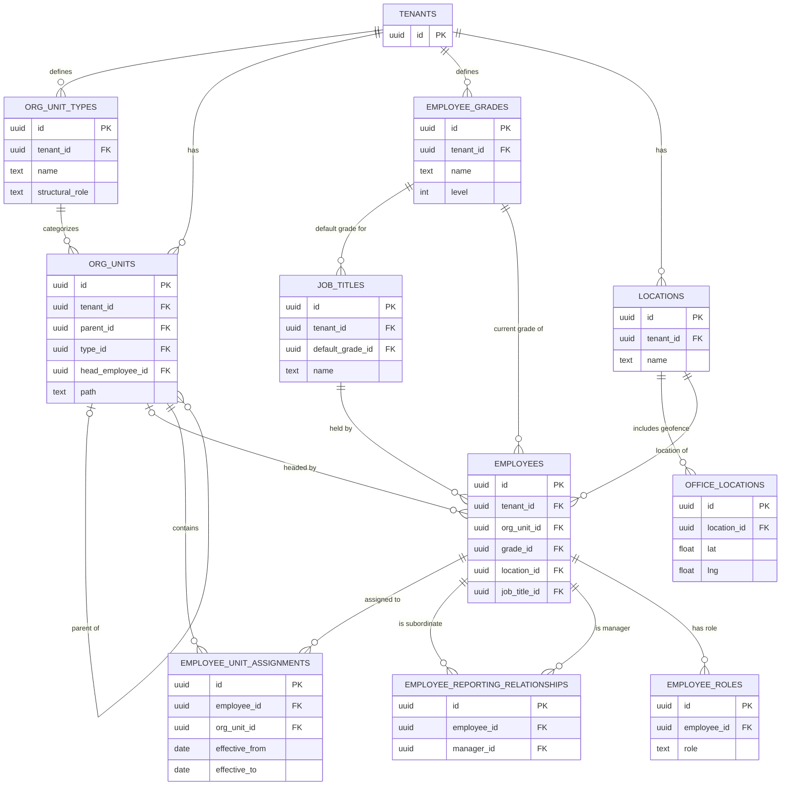

# 02 - Organisation Module: Database Schema & ER Diagram

> **Note**: All tables listed below are fully integrated, actively deployed to production, and enforce tenant isolation through strict Row Level Security (RLS).

## 1. Key Entities

### The Organisation Tree
- **`org_unit_types`**: The tenant names its levels (e.g., "Practice", "Chapter", "Vertical"); but it does not invent their meaning. Each type maps to a strict system-understood `structural_role` (`division`, `department`, or `team`).
- **`org_units`**: The actual hierarchical departments. Crucially, this table maintains a materialized `path` column (e.g., `/div-1/dept-3/team-9/`) to make deep descendant queries (like "get everyone in Engineering and below") extremely fast without recursive CTEs.

### Grades & Titles
- **`employee_grades`**: Grade is *not* structural. It is where per-company defaults hang (e.g., default leave policies, probation months, notice periods).
- **`job_titles`**: Holds the designations. Job titles define a `default_grade_id` to assist during hiring, but an employee's actual grade can differ.

### Locations
- **`locations`**: The organisational branch (e.g., Ahmedabad Office).
- **`office_locations`**: The physical geo-fence for attendance (lat/lng/radius). A single `location` can encompass multiple physical `office_locations`.

### Employees & History
- **`employees`**: The master record holding point-in-time references (foreign keys) to an employee's current unit, grade, title, and location.
- **`employee_unit_assignments`**: Unit membership is **effective-dated**. When someone transfers teams, their history is preserved here. This is critical so that historical payroll cost allocation is not retroactively destroyed.
- **`employee_reporting_relationships`**: Also effective-dated. It tracks who reported to whom at any point in time.

### Identity & Roles
- **HR Identity:** The system resolves HR privileges by checking the authentication JWT (`get_auth_tenant_id()` and `metadata.role = 'hr'`).
- **Elevated Grants:** `employee_roles` holds specific non-JWT grants like `owner`, scoped `manager`, or `payroll_admin`. 

---

## 2. Entity-Relationship (ER) Diagram

