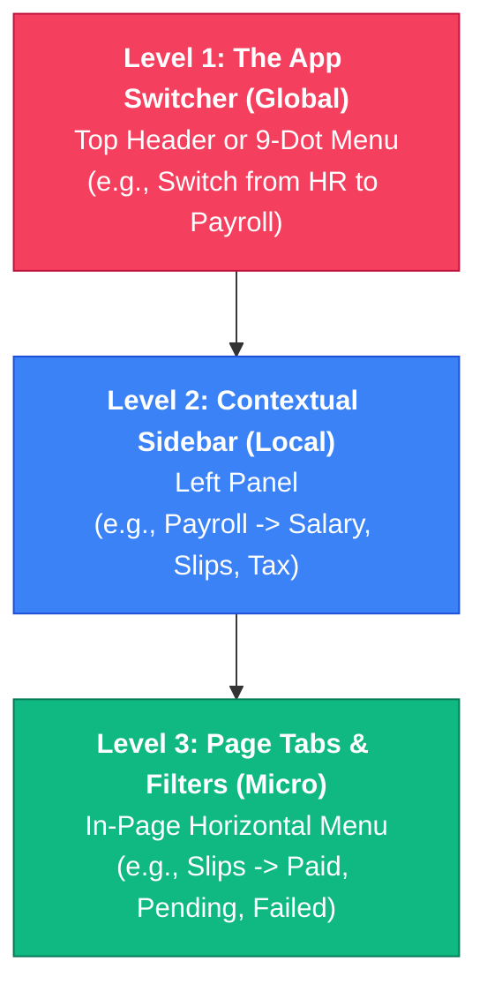

this are just ideas not implmentation you can brain storm using best hrms software out there and take inspiration from open source softwar

---

Listed directory HRMS-Talentmesh-Solutions
Listed directory src
Listed directory admin
Listed directory hr
Listed directory employee
Listed directory payroll
Viewed README.md:1-96
Viewed HRMS_Roles_and_Functions.md:1-234
Viewed LIVE_DATABASE_SCHEMA_AND_ER.md:1-150
Viewed App.tsx:1-262
Viewed RightNowChangesWeMade.md:1-41

The **TalentMesh HRMS** platform is organized into **4 Primary Portals** containing **14 Core Functional Modules** across the application.

---

### 🏛️ High-Level Portals (User Roles & Scopes)

1. **Superadmin Portal** (`/admin/*`) — Platform level management for tenant provisioning & company accounts.
2. **HR Administration Portal** (`/hr/*`) — Central HR controls, attendance, policies, and employee lifecycle management.
3. **Payroll Portal** (`/payroll/*` & `/payroll/employee/*`) — Salary structure setup, payroll execution, tax declarations, and payslips.
4. **Employee Self-Service Portal** (`/employee/*`) — Personal dashboard, smart punch, leaves, tasks, profile, and team views.

---

### 📦 14 Core Functional Modules

| # | Module Name | Scope / Description | Key Frontend Views |
|---|---|---|---|
| 1 | **Employee Lifecycle & Onboarding** | Employee onboarding wizard, directory, profile management, ID card generation, and exit/offboarding workflows. | [EmployeeList.tsx](file:///c:/Users/Anuj/Desktop/hrms/HRMS-Talentmesh-Solutions/src/hr/EmployeeList.tsx), [OnboardingWizard.tsx](file:///c:/Users/Anuj/Desktop/hrms/HRMS-Talentmesh-Solutions/src/employee/OnboardingWizard.tsx), [MyExit.tsx](file:///c:/Users/Anuj/Desktop/hrms/HRMS-Talentmesh-Solutions/src/employee/MyExit.tsx), [IDCardPage.tsx](file:///c:/Users/Anuj/Desktop/hrms/HRMS-Talentmesh-Solutions/src/employee/IDCardPage.tsx) |
| 2 | **Time & Attendance Management** | Geofenced/IP smart punch-in/out, selfie verification, shift scheduling, break logs, and attendance correction overrides. | [PunchInOut.tsx](file:///c:/Users/Anuj/Desktop/hrms/HRMS-Talentmesh-Solutions/src/employee/PunchInOut.tsx), [Attendance.tsx](file:///c:/Users/Anuj/Desktop/hrms/HRMS-Talentmesh-Solutions/src/hr/Attendance.tsx), [ShiftManagement.tsx](file:///c:/Users/Anuj/Desktop/hrms/HRMS-Talentmesh-Solutions/src/hr/ShiftManagement.tsx) |
| 3 | **Leave Management** | Custom leave types, leave balance allocation, request submission, and multi-tier manager/HR approval workflows. | [LeaveManagement.tsx](file:///c:/Users/Anuj/Desktop/hrms/HRMS-Talentmesh-Solutions/src/hr/LeaveManagement.tsx), [MyLeaves.tsx](file:///c:/Users/Anuj/Desktop/hrms/HRMS-Talentmesh-Solutions/src/employee/MyLeaves.tsx) |
| 4 | **Payroll & Payslips** | Salary structure configuration, monthly payroll runs execution, payslip generation, and tax declaration (IT) submission & verification. | [RunPayroll.tsx](file:///c:/Users/Anuj/Desktop/hrms/HRMS-Talentmesh-Solutions/src/payroll/hr/RunPayroll.tsx), [SalaryStructures.tsx](file:///c:/Users/Anuj/Desktop/hrms/HRMS-Talentmesh-Solutions/src/payroll/hr/SalaryStructures.tsx), [MyPayslips.tsx](file:///c:/Users/Anuj/Desktop/hrms/HRMS-Talentmesh-Solutions/src/payroll/employee/MyPayslips.tsx) |
| 5 | **Project Management System (PMS)** | Creating projects, assigning project managers/members, setting deadlines, and tracking project-specific tasks. | [ProjectList.tsx](file:///c:/Users/Anuj/Desktop/hrms/HRMS-Talentmesh-Solutions/src/hr/pms/ProjectList.tsx), [EmployeeProjectView.tsx](file:///c:/Users/Anuj/Desktop/hrms/HRMS-Talentmesh-Solutions/src/employee/pms/EmployeeProjectView.tsx) |
| 6 | **Task Orchestration** | Departmental task assignment, status updates, completion proof submission, and automated overdue marking. | [TaskManagement.tsx](file:///c:/Users/Anuj/Desktop/hrms/HRMS-Talentmesh-Solutions/src/hr/TaskManagement.tsx), [MyTasks.tsx](file:///c:/Users/Anuj/Desktop/hrms/HRMS-Talentmesh-Solutions/src/employee/MyTasks.tsx) |
| 7 | **Expenses & Reimbursements** | Expense claim submission with receipts, HR verification/approval, and integration with monthly payroll. | [Expenses.tsx (HR)](file:///c:/Users/Anuj/Desktop/hrms/HRMS-Talentmesh-Solutions/src/hr/Expenses.tsx), [Expenses.tsx (Employee)](file:///c:/Users/Anuj/Desktop/hrms/HRMS-Talentmesh-Solutions/src/employee/Expenses.tsx) |
| 8 | **Group Insurance & Benefits** | Health/life insurance policy allocation, coverage details view, and claim support. | [Insurance.tsx (HR)](file:///c:/Users/Anuj/Desktop/hrms/HRMS-Talentmesh-Solutions/src/hr/Insurance.tsx), [Insurance.tsx (Employee)](file:///c:/Users/Anuj/Desktop/hrms/HRMS-Talentmesh-Solutions/src/employee/Insurance.tsx) |
| 9 | **Policy & Document Center** | Uploading corporate policies, compliance guidelines repository, and digital employee access. | [PolicyUpload.tsx](file:///c:/Users/Anuj/Desktop/hrms/HRMS-Talentmesh-Solutions/src/hr/PolicyUpload.tsx), [PolicyCenter.tsx](file:///c:/Users/Anuj/Desktop/hrms/HRMS-Talentmesh-Solutions/src/hr/PolicyCenter.tsx) |
| 10 | **Company Calendar & Holidays** | Annual holiday list management, calendar event orchestration, and leave/holiday synchronization. | [HolidayList.tsx](file:///c:/Users/Anuj/Desktop/hrms/HRMS-Talentmesh-Solutions/src/hr/HolidayList.tsx), [Calendar.tsx](file:///c:/Users/Anuj/Desktop/hrms/HRMS-Talentmesh-Solutions/src/hr/Calendar.tsx) |
| 11 | **TalentMesh Connect (Chat & Social Feed)** | Real-time channel chat, direct messaging, company announcements, and social post reactions. | [Connect.tsx](file:///c:/Users/Anuj/Desktop/hrms/HRMS-Talentmesh-Solutions/src/shared/pages/Connect.tsx), [Chat.tsx](file:///c:/Users/Anuj/Desktop/hrms/HRMS-Talentmesh-Solutions/src/hr/Chat.tsx) |
| 12 | **Office Locations & Geofencing** | Configuring company office locations, GPS coordinates, geofence radius bounds, and location exception approvals. | [OfficeLocations.tsx](file:///c:/Users/Anuj/Desktop/hrms/HRMS-Talentmesh-Solutions/src/hr/OfficeLocations.tsx) |
| 13 | **Organization Structure & Org Chart** | Visual organizational hierarchy, department & designation mapping, and manager-reporting relationships. | [OrgStructureManagement.tsx](file:///c:/Users/Anuj/Desktop/hrms/HRMS-Talentmesh-Solutions/src/hr/OrgStructureManagement.tsx), [OrgChart.tsx](file:///c:/Users/Anuj/Desktop/hrms/HRMS-Talentmesh-Solutions/src/shared/pages/OrgChart.tsx) |
| 14 | **Multi-Tenant Administration (Superadmin)** | Company provisioning, initial HR admin creation, subscription plan management, and SaaS tenant monitoring. | [AllCompanies.tsx](file:///c:/Users/Anuj/Desktop/hrms/HRMS-Talentmesh-Solutions/src/admin/AllCompanies.tsx), [AddCompany.tsx](file:///c:/Users/Anuj/Desktop/hrms/HRMS-Talentmesh-Solutions/src/admin/AddCompany.tsx) |

---

### 📂 Directory Mapping in Codebase (`src/`)

```text
src/
├── admin/       # Superadmin Portal (Tenant management)
├── hr/          # HR Admin Portal (Attendance, Leaves, Shifts, PMS, Policies, etc.)
├── employee/    # Employee Portal (Punch, Leaves, Profile, Expenses, PMS view, etc.)
├── payroll/     # Payroll Sub-system (Salaries, Runs, Payslips, Tax Declarations)
└── shared/      # Common modules (Login, Connect/Social, OrgChart, ProductSelector)
```

----

A modular approach is a fantastic direction for an HRMS. As systems grow, a monolithic sidebar with 20+ items becomes overwhelming. Taking inspiration from systems like **Frappe HR**, **Odoo**, and **Rippling**, shifting to an "App-centric" or "Workspace" model dramatically reduces cognitive load and makes the system feel much cleaner.

Here are some UX/UI ideas to transition TalentMesh HRMS into a modular, user-centric platform:

### 1. The "App Switcher" Navigation Paradigm
Instead of throwing all links into one giant sidebar, break the system into distinct "Apps" or "Modules". 

*   **Global App Launcher:** Use a 9-dot grid icon (like Google Workspace) in the top-left or top-right header. Clicking it opens a modal or full-screen menu showing the available modules as large, clickable icons (e.g., Core HR, Payroll, Time & Attendance, Performance).
*   **Contextual Sidebars:** When a user clicks into the "Payroll" module, the sidebar should completely change to only show Payroll-related links (Salary Structures, Run Payroll, Tax Declarations, Reports). This keeps the user focused entirely on the task at hand.

### 2. Proposed Module Groupings
Based on your current features, you could structure the UX into these distinct Workspaces:

*   **Core HR (People):** Employee Directory, Org Chart, Onboarding/Offboarding, Policy Center, ID Cards.
*   **Time & Attendance:** Smart Punch, Shift Management, Leaves, Office Locations (Geofencing), Calendar/Holidays.
*   **Payroll & Finance:** Salary Structures, Payroll Runs, Payslips, Tax Declarations, Expense Claims.
*   **Talent & Performance (PMS):** Projects, Task Management, Goals/Milestones.
*   **Workspace / Connect:** Internal Chat, Social Feed, Announcements.

### 3. Role-Aware Module Dashboards
When a user enters a module, the landing page should intelligently adapt based on their role:
*   **Inside "Time & Attendance":**
    *   *Employee View:* Sees their personal punch clock, their leave balances, and their upcoming shifts.
    *   *HR/Manager View:* Sees a bird's-eye view of today's absentee rate, pending leave approvals, and shift coverage gaps.

### 4. Global "Unified" Dashboard vs. Module Dashboards
You will still want one landing page when the user first logs in. Make this a **Widget-Based Global Dashboard**.
*   The dashboard pulls in summary "cards" from the various modules. 
*   *Example:* A "Quick Punch" widget from the Time module, a "Next Payday" widget from the Payroll module, and a "Pending Tasks" widget from the PMS module.
*   Clicking "View All" on any of these widgets seamlessly transitions the user into that specific module's full interface.

### 5. Unified Settings Hub
One common pitfall in modular apps is scattering the settings. Keep the UX clean by having one centralized "Settings" gear icon in the global header. 
*   Inside Settings, provide a layout (like a vertical tab list) that is categorized by module (e.g., General, Attendance Rules, Payroll Config, Shift Types).
*   This way, an HR Admin knows exactly where to go to configure *anything* in the system, even if the daily usage is split into different modules.

### 6. "Enable/Disable" Module UX (The Marketplace Feel)
If you plan to sell this as SaaS (like Frappe or Rippling), build a "Modules" or "Apps" administration page where the Superadmin or Company Admin can toggle modules on or off. 
*   If a small company doesn't use your PMS or Chat, they toggle it off. 
*   The UI reacts by removing those icons from the App Switcher, ensuring the interface stays incredibly lightweight for users who only need Core HR and Payroll.

### UI Inspiration / Aesthetic Tips
*   **Color Coding:** Assign a subtle theme color or specific icon style to each module. For instance, Payroll might use green accents, while Time & Attendance uses blue. When navigating into a module, the active state highlights in the sidebar can subtly reflect this color.
*   **Breadcrumbs are Critical:** When deep inside a module (e.g., `Payroll / Tax Declarations / 2026`), robust breadcrumbs help the user remember which "App" they are currently operating in without feeling lost.

Would you like to explore how we could restructure the current React Router (`App.tsx`) to support this App-Switcher/Workspace UX pattern?


-----

Created ux_modular_architecture.md

I've thought deeply about this and put together a comprehensive UX Architecture document for you to review: [ux_modular_architecture.md](file:///C:/Users/Anuj/.gemini/antigravity-ide/brain/81c165f2-058e-4df6-97a8-d03071b9bff8/ux_modular_architecture.md).

Here are the biggest takeaways from the deep dive on how to make the HRMS feel like a premium, modular OS rather than a monolithic website:

### 1. The "Operating System" Navigation (3 Tiers)
To pull this off effectively, you need a rigid 3-tier navigation structure:
1.  **L1 (The App Switcher):** A global top-bar or a 9-dot grid menu. This is where you switch entirely between universes (e.g., jumping from "Time & Attendance" to "Payroll").
2.  **L2 (The Contextual Sidebar):** Once you select "Payroll", the left sidebar completely changes. It *only* shows Payroll-related links (Salary, Slips, Tax). This creates a "Focus Mode" and removes visual clutter.
3.  **L3 (Page Tabs):** Inside the "Tax" page, use horizontal tabs to filter data (e.g., Submitted, Verified, Rejected).

### 2. The Global Command Palette (`Ctrl+K`)
In deeply modular systems, clicking through nested menus frustrates power users. Implementing a global search (like Spotlight on Mac or Linear's command palette) is a game changer. 
*   No matter what module an HR admin is in, hitting `Ctrl+K` and typing "Run Payroll" should instantly teleport them into the Payroll module and start the wizard.

### 3. Cross-Module Drawers (Don't break the flow!)
The biggest risk with modules is creating silos. If an HR admin is running Payroll (Module A) and needs to double-check an employee's unpaid leaves (Module B), you cannot force them to navigate away, load a new page, and lose their place in Payroll.
*   **The Solution:** Use right-side **Slide-Over Drawers**. If they click on "Leave Deductions" in Payroll, a drawer slides in from the right showing the Time module data. They check it, close the drawer, and are instantly back in their Payroll flow.

### 4. The "App Store" Configuration
SaaS products like Rippling and Frappe excel because they don't force every feature on every client. 
*   Build a settings page where a company can literally toggle modules ON or OFF. 
*   If a 10-person startup doesn't need your Project Management System (PMS), they turn it off. The UI instantly adapts, hiding the PMS icon from the App Switcher. The system feels lightweight and custom-tailored to them.

Check out the markdown document I created for a visual wireframe of how this would look on screen! How does this structure align with your vision?

---

# Deep Dive: Modular UX Architecture for TalentMesh HRMS

To truly elevate the user experience to the level of modern enterprise platforms (like Frappe, Rippling, or Linear), we must move away from a "flat" application where everything lives in one sidebar. 

Instead, we treat the HRMS as an **Operating System** that runs specialized **Apps** (Modules). Here is a deep dive into how to construct this experience.

## 1. The Three-Tier Navigation Hierarchy

The core of a modular system is separating *where you are going* (L1) from *what you are doing* (L2) and *how you are sorting it* (L3).



### 💡 UX Concept: The "Focus Mode" Sidebar
When a user clicks "Time & Attendance" from the global app switcher, the entire left sidebar animates and replaces its contents. **They are now trapped in the Time & Attendance ecosystem.** This removes visual clutter. They no longer see "Insurance" or "Expenses" while trying to approve a timesheet.

---

## 2. Cross-Module Bridging (The Slide-Over Drawer)

**The Problem:** Modules are great for focus, but HR workflows are interconnected. If HR is running Payroll (Payroll Module) and notices an anomaly, they might need to check the employee's Attendance (Time Module). Forcing them to navigate out of Payroll, into Time, and back again destroys productivity.

**The UX Solution: Action Slide-Overs (Drawers)**
Whenever a user needs to reference data from another module, do not navigate them away. Instead, slide in a side-panel (drawer) from the right side of the screen.

> [!TIP]
> **Example Workflow:**
> 1. HR is in the **Payroll Module**, viewing John's pending payslip.
> 2. They click on the "Leave Deductions" line item.
> 3. A right-side drawer slides in displaying John's leave history from the **Time Module**.
> 4. HR verifies the data, closes the drawer, and is instantly back exactly where they left off in Payroll.

---

## 3. The Universal "Command Center" (Ctrl+K)

In deeply modular systems, clicking through menus can feel slow for power users. 

**The UX Solution:** Implement a global command palette triggered by `Ctrl+K` or `Cmd+K`.
This acts as a "Spotlight Search" for the entire HRMS. It ignores module boundaries.

*   **Search Entities:** Typing "Anuj" immediately shows their Employee Profile (HR), pending Expenses (Finance), and current Tasks (PMS).
*   **Search Actions:** Typing "Run" suggests the `Run Payroll` action, immediately teleporting the user into the Payroll module and starting the wizard.
*   **Search Navigation:** Typing "Holi" suggests navigating to the `Holiday Calendar`.

---

## 4. The "Home" OS Desktop vs. App Dashboards

You need to differentiate between the global landing page and the module landing pages.

### A. The Global OS Dashboard (The "Morning View")
When users log in, they don't land in a module. They land on the "Home" screen. This screen is highly personalized and acts as an aggregator.
*   **Universal Inbox:** A single feed showing approvals needed across *all* modules (e.g., 2 Leave Requests, 1 Expense Claim, 1 Task Review).
*   **My Day Widget:** Shows today's shift (Time), upcoming meeting (Calendar), and current assigned project (PMS).

### B. The Module Dashboards (The "Work View")
When a user enters the **Payroll Module**, the dashboard completely changes to be hyper-specific:
*   Visual graphs of month-over-month salary expenses.
*   Tax declaration submission progress rings (e.g., "85% of employees submitted").
*   Quick links to "Generate Payslips".

---

## 5. Visual Wireframe Concept

Here is how the layout structurally looks on screen:

```text
+-----------------------------------------------------------------------------+
| [TalentMesh Logo]    [ ⌘K Search Everything... ]      [+] Add   [App Grid]  | <-- Global Header (Never changes)
+----------------+------------------------------------------------------------+
|  TIME & ATTEN. |                                                            |
|  ------------- |  ## Approvals (L3 Tabs: [Pending] [History])               | <-- Page Content
|                |                                                            |
|  Dashboard     |  +------------------------------------------------------+  |
|  Approvals     |  | John Doe - Sick Leave (Aug 15 - Aug 17)              |  |
|  Shifts        |  | [ Approve ] [ Reject ]                               |  |
|  Calendar      |  +------------------------------------------------------+  |
|                |                                                            |
|                |  +------------------------------------------------------+  |
|                |  | Jane Smith - Shift Change Request                    |  |
|                |  | [ Approve ] [ Reject ]                               |  |
|                |  +------------------------------------------------------+  |
+----------------+------------------------------------------------------------+
       ^
       |
  Contextual Sidebar 
  (Only shows Time & Attendance links because that App is selected)
```

## 6. The "App Store" Configuration

To make the system feel truly premium and flexible for different companies (Tenants):
*   Create a Superadmin or HR settings page called **"Installed Modules"**.
*   Display modules like cards: *Performance Management*, *Expense Tracking*, *Company Connect*.
*   If an HR admin toggles "Performance Management" OFF, the app completely vanishes from the L1 App Switcher, and all related database views are hidden. 
*   **UX Benefit:** Small companies don't feel overwhelmed by an enterprise-sized tool; it scales with their needs.
