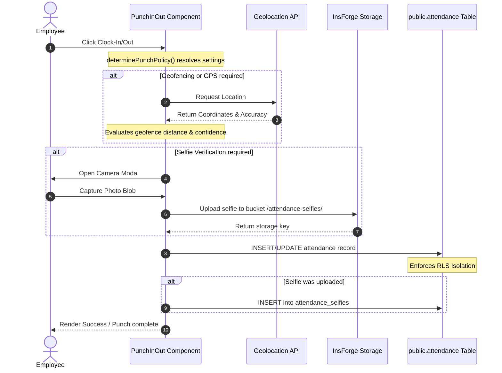
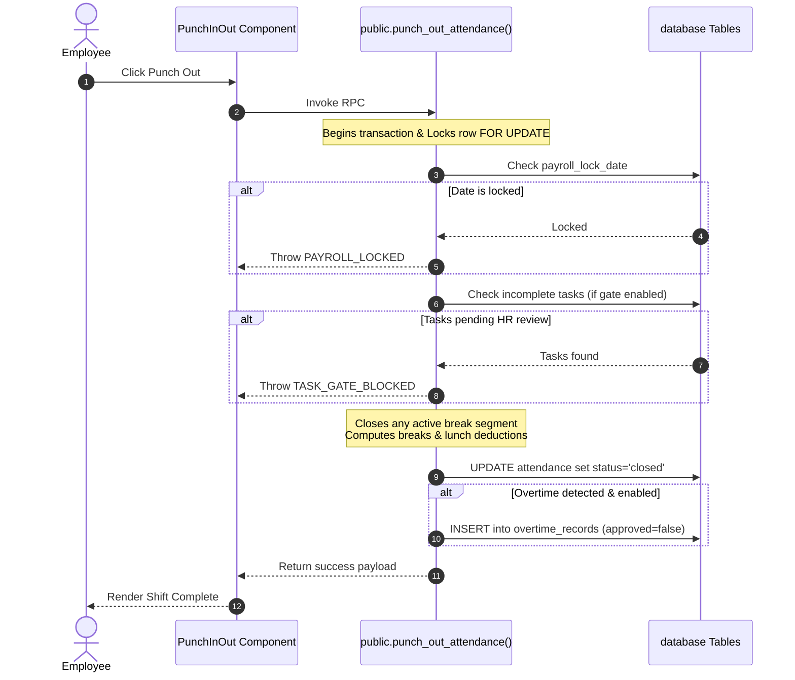

# ⏰ Time Clock, Break Tracking & Location Geo-fencing Subsystem

This document details the architecture, data models, client-side policy structures, and database transactional mechanics that govern employee work hours, shifts, breaks, and geographic validations in the TalentMesh HRMS.

---

## 1. 🗄️ Database Tables Schema

These tables manage clocking states, shift breaks, location constraints, and exceptions.

### `attendance`
Core daily log for employee presence.
* `id` (`uuid`, Primary Key)
* `tenant_id` (`uuid`, Foreign Key -> `tenants.id`)
* `employee_id` (`uuid`, Foreign Key -> `employees.id`)
* `date` (`date`, NOT NULL) - Date of the log.
* `punch_in` / `punch_out` (`timestamp with time zone`) - Check-in and check-out timestamps.
* `punch_out_allowed` (`boolean`, Default `true`) - Status flag indicating whether the employee has cleared the task gate.
* `punch_in_ip` / `punch_out_ip` (`text`) - Client IP captured at check-in/out.
* `punch_in_lat` / `punch_in_lng` / `punch_in_location_accuracy` (`numeric`) - GPS data captured at clock-in.
* `punch_in_location_status` (`text`) - Clock-in status (e.g. `'office_verified'`, `'outside_geofence'`, `'selfie_missing'`).
* `punch_out_lat` / `punch_out_lng` / `punch_out_location_accuracy` (`numeric`) - GPS data captured at clock-out.
* `punch_out_location_status` (`text`) - Clock-out status.
* `location_accuracy` / `location_confidence` / `location_status` (`text`/`numeric`) - Consolidated location statistics.
* `status` (`text`, NOT NULL) - Presence status: `'present'`, `'absent'`, `'half_day'`, or `'on_leave'`.
* `is_late` (`boolean`, Default `false`) - Indicates if check-in occurred after the shift grace period.
* `session_status` (`text`) - Session state machine status: `'open'` (clocked in) or `'closed'` (clocked out).
* `auto_closed` (`boolean`, Default `false`) - Flag indicating if the session was force-closed by a midnight cleanup job.
* `notes` (`text`) - General remarks or explanation logs.
* `work_hours` (`numeric`) - Total calculated work hours (excluding break time deductions).
* `total_break_minutes` (`integer`, NOT NULL, Default `0`) - Total cumulative duration of all completed breaks.
* `current_break_id` (`uuid`, References `attendance_breaks.id`) - References the active break session, if any.
* `current_break_start` (`timestamp with time zone`) - Timestamp of when the active break started.
* `remote_exception_id` (`uuid`, References `attendance_location_exceptions.id`) - Reference to the active location exception that bypassed geofencing.
* `verification_snapshot` (`jsonb`) - Metadata capture of accuracy constraints, work mode, and policies resolved at execution time.
* `created_at` (`timestamp with time zone`)

### `attendance_breaks`
Tracks break segments within an active attendance session.
* `id` (`uuid`, Primary Key)
* `tenant_id` (`uuid`, Foreign Key -> `tenants.id` ON DELETE CASCADE)
* `employee_id` (`uuid`, Foreign Key -> `employees.id` ON DELETE CASCADE)
* `attendance_id` (`uuid`, Foreign Key -> `attendance.id` ON DELETE CASCADE)
* `break_type` (`text`) - Sub-type check: `'lunch'`, `'short_break'`, or `'tea_break'`.
* `started_at` (`timestamp with time zone`, NOT NULL)
* `ended_at` (`timestamp with time zone`)
* `duration_minutes` (`integer`) - Computed duration of the break session.
* `over_limit_minutes` (`integer`, Default `0`) - Overtime break duration relative to policy limits.
* `created_at` (`timestamp with time zone`)

### `office_locations`
Authorized geofencing zones defined per tenant.
* `id` (`uuid`, Primary Key)
* `tenant_id` (`uuid`, Foreign Key -> `tenants.id` ON DELETE CASCADE)
* `name` (`text`) - Description of the geofenced area (e.g. `"Headquarters"`).
* `lat` / `lng` (`numeric`) - Coordinate center point of the fence.
* `radius_meters` (`integer`) - Radius limit for geofencing compliance checks.
* `is_active` (`boolean`, Default `true`)

### `attendance_location_exceptions`
HR-approved exceptions that bypass geofencing checking.
* `id` (`uuid`, Primary Key)
* `tenant_id` (`uuid`, Foreign Key -> `tenants.id` ON DELETE CASCADE)
* `employee_id` (`uuid`, Foreign Key -> `employees.id` ON DELETE CASCADE)
* `exception_type` (`text`, NOT NULL) - Type of exception (CHECK: `'work_from_home'`, `'client_visit'`, `'business_travel'`, `'field_work'`, `'other'`).
* `start_date` / `end_date` (`date`, NOT NULL) - Date range during which the exception is active.
* `reason` (`text`, NOT NULL) - Detailed explanation from requestor.
* `status` (`text`, NOT NULL, Default `'pending'`) - Lifecycle status (CHECK: `'pending'`, `'approved'`, `'rejected'`, `'cancelled'`, `'expired'`).
* `requested_by` (`uuid`, References `employees.id`) - Employee who requested the exception.
* `approved_by` (`uuid`, References `employees.id`) - HR employee who approved the exception.
* `approved_at` (`timestamp with time zone`) - Timestamp of approval.
* `cancelled_by` (`uuid`, References `employees.id`) - Employee or manager who cancelled the request.
* `cancelled_at` (`timestamp with time zone`) - Timestamp of cancellation.
* `created_at` (`timestamp with time zone`, NOT NULL)
* `updated_at` (`timestamp with time zone`, NOT NULL)

### `attendance_selfies`
Links validation selfies uploaded to storage during clock-in/out.
* `id` (`uuid`, Primary Key)
* `tenant_id` (`uuid`, Foreign Key -> `tenants.id` ON DELETE CASCADE)
* `employee_id` (`uuid`, Foreign Key -> `employees.id` ON DELETE CASCADE)
* `attendance_id` (`uuid`, Foreign Key -> `attendance.id` ON DELETE CASCADE)
* `type` (`text`, NOT NULL) - Scopes capture (CHECK: `'punch_in'`, `'punch_out'`).
* `storage_path` (`text`, NOT NULL) - The bucket key returned by InsForge storage.
* `captured_at` (`timestamp with time zone`, NOT NULL) - Verification selfie capture timestamp.
* `created_at` (`timestamp with time zone`, NOT NULL)
* *Unique Index Constraint:* `uq_attendance_selfie_direction(attendance_id, type)` - Prevents multiple selfies for the same clocking direction.

### `attendance_corrections`
Regularization requests submitted by employees to manually correct attendance.
* `id` (`uuid`, Primary Key)
* `tenant_id` (`uuid`, Foreign Key -> `tenants.id` ON DELETE CASCADE)
* `employee_id` (`uuid`, Foreign Key -> `employees.id` ON DELETE CASCADE)
* `attendance_date` (`date`, NOT NULL) - Date of attendance being regularized.
* `requested_punch_in` (`time without time zone`) - Proposed clock-in time.
* `requested_punch_out` (`time without time zone`) - Proposed clock-out time.
* `reason` (`text`, NOT NULL) - Employee's reasoning for correction.
* `status` (`text`, NOT NULL, Default `'pending'`) - Approval status (CHECK: `'pending'`, `'approved'`, `'rejected'`).
* `reviewed_by` (`uuid`, References `employees.id`) - HR reviewer who processed the request.
* `reviewed_at` (`timestamp with time zone`) - Review timestamp.
* `rejection_reason` (`text`) - Notes from HR if rejected.
* `created_at` (`timestamp with time zone`, NOT NULL)

### `overtime_records`
Persists system-detected overtime hours awaiting HR approval after each employee punch-out.
* `id` (`uuid`, Primary Key)
* `tenant_id` (`uuid`, Foreign Key → `tenants.id`)
* `employee_id` (`uuid`, Foreign Key → `employees.id`)
* `attendance_id` (`uuid`, Foreign Key → `attendance.id`) — The source attendance session that generated the record. A unique index (`uq_overtime_attendance`) ensures at most one overtime record per attendance row.
* `date` (`date`, NOT NULL) — Calendar day of the overtime session.
* `regular_hours` (`numeric`) — The expected shift hours (`p_expected_shift_hours`) used as the baseline for overtime calculation.
* `overtime_hours` (`numeric`) — Computed excess hours: `GREATEST(0, actual_work_hours − regular_hours)`, rounded to 2 decimal places.
* `overtime_rate` (`numeric`) — The pay multiplier pulled from `tenant_settings.overtime_rate` at punch-out time (e.g. `1.5`).
* `overtime_amount` (`numeric`) — Final monetary value settled during payroll finalization by `RunPayroll.tsx`.
* `approved` (`boolean`, Default `false`) — `false` = pending HR review; `true` = approved and included in payroll.
* `approved_by` (`uuid`, Foreign Key → `employees.id`) — HR employee who approved; set by `hr_set_overtime_status()` RPC.
* `created_at` (`timestamp with time zone`)


---

## 📱 2. Client-Side Punch Policy & Location Resolution

The frontend component ([PunchInOut.tsx](file:///c:/Users/Anuj/Desktop/hrms/HRMS-Talentmesh-Solutions/src/employee/PunchInOut.tsx)) manages clocking policies and captures verification parameters.

### Policy Rules Resolution
Before starting the clocking sequence, the client resolves the configuration via `determinePunchPolicy`:

1. **Geofencing Check Override**:
   * Reads tenant setting `remote_work_handling` (`always_allowed` / `hr_approved_exceptions` / `office_only`).
   * If `always_allowed`, geofencing is bypassed (`geofenceRequired = false`).
   * If `hr_approved_exceptions`, the client checks the employee's `work_mode`:
     * If `remote`, geofencing is bypassed.
     * If `hybrid` or `office`, the client queries the `attendance_location_exceptions` table for an approved exception matching today's date:
       ```sql
       SELECT id, exception_type 
       FROM public.attendance_location_exceptions
       WHERE tenant_id = :tenant_id 
         AND employee_id = :employee_id 
         AND status = 'approved'
         AND start_date <= :TODAY 
         AND end_date >= :TODAY;
       ```
       If found, geofencing is bypassed and the exception record ID is attached.

2. **Selfie Policy**:
   * Reads setting `attendance_selfie_mode` (`disabled` / `both` / `punch_in` / `punch_out`).
   * Sets `selfieRequired = true` if the current direction matches the configuration.

3. **GPS Policy**:
   * Location verification is required if geofencing is enabled or if `gps_verification_mode` is not `'disabled'`.

### Geolocation Capture & Confidence Tiers
If GPS verification is required, the client invokes the HTML5 Geolocation API:
* **Confidence Resolution**:
  * Accuracy $\le$ `high_confidence_max` (default 50m) $\rightarrow$ **High Confidence**
  * Accuracy $\le$ `medium_confidence_max` (default 150m) $\rightarrow$ **Medium Confidence**
  * Accuracy $\le$ `low_confidence_max` (default 300m) $\rightarrow$ **Low Confidence**
  * Accuracy $>$ 300m $\rightarrow$ **Very Low Confidence** (triggers low confidence logs)
* **Strict Validation Gates**:
  If geofencing is required and coordinates are captured:
  * Distance to `office_lat` and `office_lng` is calculated using the Haversine formula.
  * If the distance exceeds `geofence_radius_meters`:
    * If `gps_verification_mode = 'strict'`, the check-in is blocked.
    * If `gps_verification_mode = 'warn'`, the clocking completes with status `'outside_geofence'` and displays a warning to the user.

---

## ⚡ 3. Server-Side Database RPC Mechanics

Clocking states and break transitions are handled through transaction-safe `SECURITY DEFINER` RPC functions inside [add-break-tracking.sql](file:///c:/Users/Anuj/Desktop/hrms/HRMS-Talentmesh-Solutions/migrations/20260601120000_add-break-tracking.sql).

### `public.start_employee_break()`
Locks the attendance row to safely initiate a break.
1. **Validation Checks**:
   * Verifies the attendance record is open, check-in is not null, and punch-out is null.
   * Checks if a break is already active (`current_break_id IS NOT NULL`). If true, throws exception `EMPLOYEE_ALREADY_ON_BREAK`.
2. **Execution**:
   * Inserts an active break record into `public.attendance_breaks`.
   * Sets the `current_break_id` and `current_break_start` pointers on the parent `attendance` record.
   * Logs a record in `public.audit_logs` (action: `'attendance.break_started'`).

### `public.end_employee_break()`
Ends the active break session and computes duration.
1. **Validation Checks**:
   * Verifies the attendance record is open.
   * Checks if `current_break_id` is null. If true, throws exception `EMPLOYEE_NOT_ON_BREAK`.
2. **Execution**:
   * Computes break duration in minutes: `duration = rounded_minutes(now - started_at)`.
   * Resolves break limits from settings:
     * Lunch breaks check `lunch_break_minutes` from `public.tenants`.
     * Short breaks check setting `short_break_limit_minutes` (default 15m) from `public.tenant_settings`.
   * Calculates over-limit minutes: `over_limit = max(0, duration - limit)`.
   * Updates the `attendance_breaks` row with `ended_at`, `duration_minutes`, and `over_limit_minutes`.
   * Clears break pointers and updates `total_break_minutes` on `public.attendance`.

### Trigger `trg_auto_close_active_break`
Fires `BEFORE UPDATE ON public.attendance` when an active check-in session is ended or forced closed (`NEW.punch_out IS NOT NULL OR NEW.session_status = 'closed'`). If `current_break_id` is set, the trigger automatically ends the active break session using the punch-out time, increments `total_break_minutes`, and clears active break pointers in a single transaction.

### `public.punch_out_attendance()`
Ends the workday session, calculates hours, and logs overtime.
1. **Locking**: Locks the target attendance row using `FOR UPDATE` to prevent race conditions.
2. **Lock Checks**: Verifies if the session date is before or equal to the `payroll_lock_date` string. If so, blocks the punch-out (`PAYROLL_LOCKED` exception).
3. **Task Gate**:
   * If `punch_out_gate_enabled` is true, the function queries for incomplete tasks due today or prior:
     ```sql
     SELECT COUNT(*) FROM tasks
     WHERE tenant_id = :p_tenant_id AND assigned_to = :employee_id
       AND status IN ('assigned', 'submitted', 'rejected', 'overdue');
     ```
     If the count is greater than zero, it blocks the check-out and throws a `TASK_GATE_BLOCKED` exception.
4. **Break Termination**: Triggers active break closure if not already ended.
5. **Work Hours Calculation**:
   * Reads settings `break_tracking_enabled` and `break_deduction_mode` (`fixed` / `actual`).
   * Calculates total elapsed hours: `raw_hours = now - punch_in`.
   * If tracking is enabled and mode is `actual`, it deducts `total_break_minutes`. If no breaks were recorded, it falls back to policy `lunch_break_minutes` (if `raw_hours >= 5`).
   * If mode is `fixed`, it deducts policy `lunch_break_minutes` (if `raw_hours >= 5`).
6. **Overtime Processing**:
   * If overtime is enabled and the calculated work hours exceed the expected shift duration (`p_expected_shift_hours`), it inserts a record into `public.overtime_records` with status `approved = false` for HR review.

---

## 📊 4. Late Marks Edge Function

The serverless function ([calculate-late-marks.ts](file:///c:/Users/Anuj/Desktop/hrms/HRMS-Talentmesh-Solutions/functions/calculate-late-marks.ts)) computes employee punctuality metrics.

### Calculation Logic
* **Date Resolving**: Resolves the start and end dates of the requested month using local boundaries.
* **Late Sessions Count**: Queries the `attendance` table for check-ins marked late:
  ```sql
  SELECT COUNT(id) FROM public.attendance
  WHERE tenant_id = :tenant_id 
    AND employee_id = :employee_id
    AND is_late = true
    AND status NOT IN ('absent', 'half_day')
    AND date >= :start_date AND date <= :end_date;
  ```
* **Deduction Hours**:
  * Reads setting `late_mark_threshold` (default 3 lates).
  * Reads setting `late_mark_deduction_hours` (default 0.5 hours).
  * Calculates excess lates: `excess = max(0, late_count - threshold)`.
  * Deducts payroll hours: `deduction = excess * deduction_rate`.

---

## 🔄 5. Workflows & Lifecycle Diagrams

### Client-Side Punch Verification Flow



### Server-Side Check-Out Transaction



---

## ⏱️ 5. Overtime Approval Workflow

Overtime is a **three-phase lifecycle** spanning punch-out, HR review, and payroll finalization.

### Phase 1 — Auto-Detection at Punch-Out

Inside the `punch_out_attendance()` RPC (triggered by `PunchInOut.tsx`), after computing final work hours:
```sql
v_overtime_hours := ROUND(GREATEST(0, v_work_hours - p_expected_shift_hours), 2);
IF p_overtime_hours > 0 THEN
  INSERT INTO overtime_records (
    tenant_id, employee_id, attendance_id, date,
    regular_hours, overtime_hours, overtime_rate, overtime_amount, approved
  ) VALUES (
    ..., p_expected_shift_hours, v_overtime_hours, p_overtime_rate,
    ROUND(v_overtime_hours * p_overtime_rate, 2), false  -- starts unapproved
  );
END IF;
```
* Overtime is only generated when the tenant setting `overtime_enabled = true`.
* The RPC receives `p_overtime_rate` from the client, which reads `tenant_settings.overtime_rate` (default `1.5`).

### Phase 2 — HR Review & Approval

HR users see pending overtime records in the **Attendance → Overtime tab** of [Attendance.tsx](file:///c:/Users/Anuj/Desktop/hrms/HRMS-Talentmesh-Solutions/src/hr/Attendance.tsx).

**Actions available:**
| Action | RPC Called | Behaviour |
|---|---|---|
| Approve single | `hr_set_overtime_status(p_approved=true)` | Sets `approved=true`, `approved_by=<hr_id>` |
| Reject single | `hr_set_overtime_status(p_approved=false)` | Deletes the row entirely |
| Approve All Pending | Loops `hr_set_overtime_status(p_approved=true)` | Sequential loop over all unapproved rows |

**`public.hr_set_overtime_status()` RPC signature:**
```sql
CREATE OR REPLACE FUNCTION public.hr_set_overtime_status(
  p_tenant_id  uuid,
  p_overtime_id uuid,
  p_approved   boolean
) RETURNS void LANGUAGE plpgsql SECURITY DEFINER;
```
* Guard rails:
  * Calls `assert_hr_for_tenant()` — rejects if caller is not an HR employee for that tenant.
  * Calls `assert_date_range_unlocked()` — rejects if the `payroll_lock_date` has passed the overtime record's date. The UI pre-checks this and shows a toast before even calling the RPC.
* On approval: `UPDATE overtime_records SET approved = true, approved_by = <hr_id>`.
* On rejection: `DELETE FROM overtime_records WHERE id = p_overtime_id` (record is removed permanently).
* Every outcome is written to `audit_logs` with action `'overtime.approved'` or `'overtime.rejected'`.

**Client-side payroll lock guard (in `Attendance.tsx`):**
```typescript
if (record && tenantSettings.payroll_lock_date && record.date <= tenantSettings.payroll_lock_date) {
  toastError("Payroll is locked for this date. Cannot approve overtime.");
  return;
}
```

### Phase 3 — Payroll Finalization

During a payroll run (`RunPayroll.tsx`), only `approved = true` records are consumed:
```typescript
db.from("overtime_records")
  .select("id,employee_id,regular_hours,overtime_hours,overtime_rate,approved,date")
  .eq("tenant_id", tenantId)
  .eq("approved", true)
  .gte("date", periodStart)
  .lte("date", periodEnd)
```
* Approved records are grouped by `employee_id`.
* `overtime_amount` is re-computed on the client using the employee's hourly rate:
  ```
  overtimeAmount = overtime_hours × overtime_rate × (annual_gross / (work_hours_per_day × working_days × 12))
  ```
* The final `overtime_amount` is written back to `overtime_records` during payroll finalization, and the payslip storage record includes it as a separate line item.
