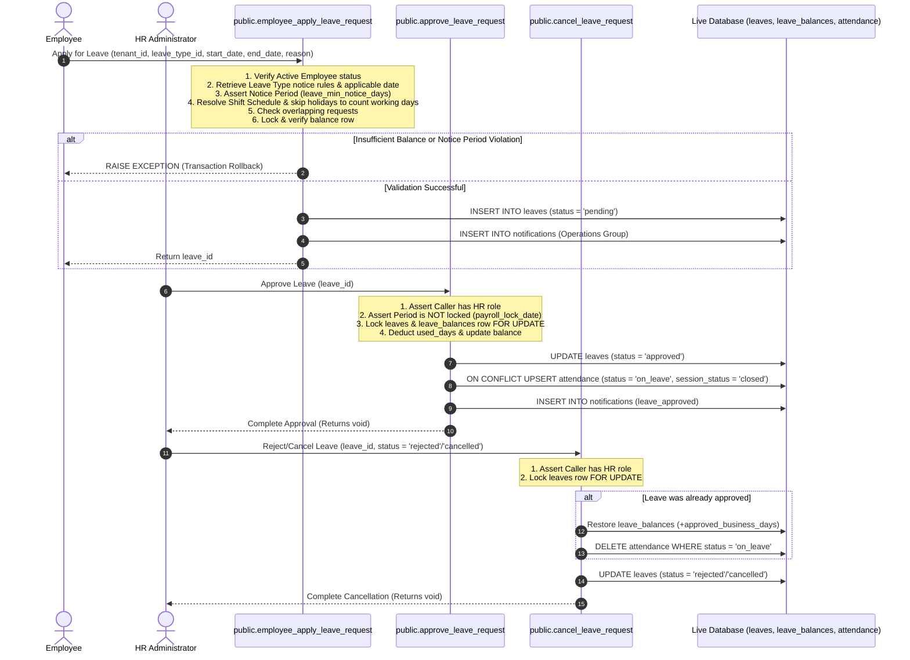
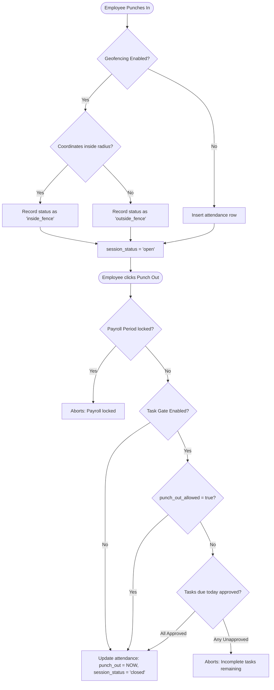
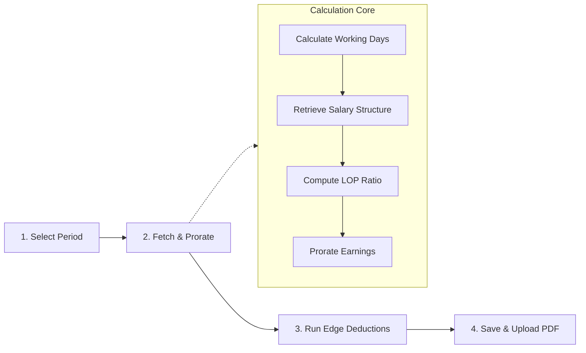

# TalentMesh HRMS Core Business Workflows & Lifecycle Rules

This document details the core workflows and business rules governing the **TalentMesh HRMS** platform, validated against the active DDL definitions, database RPCs, and live serverless functions on the InsForge BaaS backend.

---

## 📅 1. Leave Application & Approval Lifecycle

Leave requests flow through a secure state machine managed entirely inside transaction-safe database SQL functions (`SECURITY DEFINER` context) to ensure data atomicity, balance locking, and validation rules.

### Sequence Flow Diagram

### Business Rules & Validations (Live SQL Logic)

#### 1. Minimum Notice Periods & Employee Age Limits
* Notice period validation checks the global `leave_min_notice_days` from `tenant_settings` and compares it with the leave type's specific `min_notice_days` (resolving to the `GREATEST` value).
* Employees are blocked from requesting leaves if their seniority (days since `date_of_joining`) is less than the leave type's `applicable_from_day`.

#### 2. Leave Code to Enum Mapping
When writing to the database, leave codes from the `leave_types` table are mapped to structural type enums in the `leaves` table:
* `CL` → `'casual'`
* `SL` → `'sick'`
* `EL` → `'earned'`
* `UL` → `'unpaid'`
* `ML` → `'maternity'`
* `PL` → `'paternity'`
* Else → `'other'`

#### 3. Automatic Attendance Overwrite
Upon leave approval, the database inserts `on_leave` records into the `attendance` table for all working dates in the range:
* If a conflict exists (e.g. employee already clocked in that day), `ON CONFLICT` updates the status to `'on_leave'`, clears `punch_in`/`punch_out` times, locks `session_status = 'closed'`, and sets `punch_out_allowed = true`.

---

## ⏰ 2. Time Clocking, Location Validation & Task Gating

The daily attendance tracking flow validates IP addresses, geofencing coordinates, and restricts punching out if incomplete tasks are remaining (if configured by the organization).

### Process Flow Diagram

### Business Rules & Calculations (Live SQL Logic)

#### 1. Shift Schedule Mapping & Overtime Generation
* Daily shift timings, grace periods, and default configurations are queried from `shifts` and `employee_shifts`.
* If `overtime_enabled` is active in `tenant_settings`, and `work_hours` exceed the expected shift duration, a row is automatically inserted into `overtime_records` with a status of `'pending'`. 
* Manual adjustments made by HR in the database trigger an RPC audit record write in `audit_logs` with event type `attendance.edited` for historical compliance.

#### 2. Work Hours & Breaks Tracking (`hr_update_attendance`)
When updating attendance records, work hours are calculated using one of two deduction modes:
* **Fixed Lunch Deduction**: If actual break tracking is disabled, work hours are:
  $$\text{work\_hours} = \max(0, \text{raw\_hours} - \text{lunch\_break\_minutes})$$
  *(Applies only if raw shift duration is $\ge 5$ hours).*
* **Actual Break Deduction**: If `break_tracking_enabled = true` and `break_deduction_mode = 'actual'`, work hours are:
  $$\text{work\_hours} = \max(0, \text{raw\_hours} - \text{total\_break\_minutes})$$

---

## 💸 3. Monthly Payroll Calculation Pipeline

Payroll calculation is executed by the HR administrator through a multi-step stepper wizard, merging salary profile templates with real-time attendance and serverless edge calculations.

### Pipeline Steps & Logic

#### Step 1: Select Period & Lock Checks
The run check queries `tenant_settings` for the `payroll_lock_date` and the `payroll_runs` table. If the selected period is locked or already marked as `approved` or `paid`, calculations are blocked to prevent data corruption.

#### Step 2: Fetch & Prorate Calculations
1. **Working Days Calculation**:
   $$\text{Working Days} = \text{Days in Month} - \text{Sundays} - \text{Holidays not falling on Sunday}$$
2. **Loss of Pay (LOP) Divisor**: Determined by `lop_calculation_method` in `tenant_settings`:
   - `'calendar'`: Divisor is the number of days in the month (e.g. 28, 30, 31).
   - `'fixed_26'`: Divisor is fixed at 26.
   - `'working_days'`: Divisor is equal to the calculated Working Days.
3. **Prorating Earnings**: Gross monthly CTC is prorated using the LOP ratio:
   $$\text{LOP Ratio} = \frac{\text{Present Days} + (\text{Half Days} \times 0.5) + \text{Paid Leaves}}{\text{Divisor}}$$
   $$\text{Prorated Component} = \text{Component Monthly Rate} \times \text{LOP Ratio}$$

#### Step 3: Run Serverless Late Marks Deductions
The portal invokes the Deno serverless edge function `calculate-late-marks` in parallel batches of 20:
1. **Count Late Marks**: Counts days in the month range where `is_late = true` (excluding `'absent'` or `'half_day'` rows).
2. **Threshold Checks**: Reads the tenant's `late_mark_threshold` (defaults to 3) and `late_mark_deduction_hours` (defaults to 0.5) from `tenant_settings`.
3. **Compute Deduction Hours**:
   $$\text{Deduction Hours} = \max(0, \text{Late Count} - \text{Threshold}) \times \text{Late Mark Deduction Hours}$$
4. **Prorate Deduction Amount**: Computed on the frontend using the employee's work hours per day limit:
   $$\text{Late Deduction} = \text{Deduction Hours} \times \left( \frac{\text{Gross Salary}}{\text{Work Hours Per Day} \times \text{Working Days}} \right)$$

#### Step 4: Final Tax Deductions & Saved Records
1. **Provident Fund (PF)**: If active, calculated as 12% of the basic wage, capped to the prorated PF wage ceiling (`pf_wage_ceiling` defaults to 15,000):
   $$\text{PF Base} = \min(\text{Prorated Basic}, \text{Prorated Wage Ceiling})$$
   $$\text{PF Deduction} = \text{PF Base} \times 12\%$$
2. **State Insurance (ESI)**: If eligible (Gross Monthly Salary $\le$ `esi_gross_ceiling`), deduction is calculated on the actual earnings including overtime:
   $$\text{ESI Employee Deduction} = (\text{Prorated Gross} + \text{Overtime Amount}) \times 0.75\%$$
3. **Professional Tax (PT)**: Flat deduction mapped to the tenant's state rules or manual configuration overrides.
4. **Net Payable Salary**:
   $$\text{Net Salary} = \text{Prorated Gross} - (\text{PF} + \text{ESI} + \text{TDS} + \text{PT} + \text{Late Deductions})$$
5. **Payslip PDF Upload**: Generates the payslip, uploads the file to InsForge storage (`payslips/` bucket), and inserts/updates a record in the `payslips` table.
