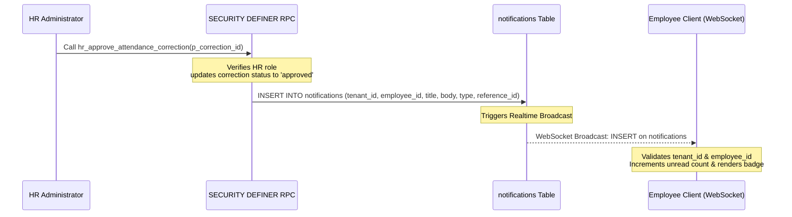
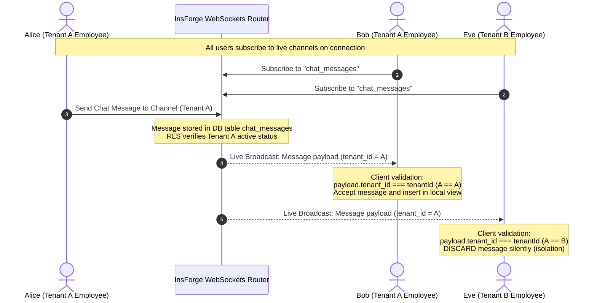

# 💬 Real-Time Chat & Workspace Notifications Engine

This document details the architecture, database schemas, and live operational flows of the real-time chat communication and tenant notification subsystems in the TalentMesh HRMS.

---

## 1. 🗄️ Database Tables Schema

These schemas reflect the exact live database columns and types verified from active code and schema triggers.

### `chat_channels`
Stores communication channels. Channels can be scoped globally, by department, or private (custom).
* `id` (`uuid`, Primary Key) - Auto-generated unique identifier.
* `tenant_id` (`uuid`, Foreign Key) - Scopes the channel to its organization.
* `name` (`text`) - URL-friendly, lowercased channel identifier (e.g., `general`, `dev-team`).
* `description` (`text`, Nullable) - Short summary of the channel's purpose.
* `type` (`text`) - Visibility boundary: `'global'`, `'department'`, or `'custom'` (private).
* `target_departments` (`text[]`) - Holds department strings (e.g., `{'sales', 'dev'}`) if `type = 'department'`.
* `created_by` (`uuid`, Foreign Key -> `employees.id`) - Reference to the employee who created the channel.
* `is_announcement` (`boolean`) - If `true`, only HR accounts can post messages; other users have read-only access.
* `is_system` (`boolean`) - System-wide generated channel flag (e.g. `general`).
* `created_at` / `updated_at` (`timestamptz`)

### `chat_channel_members`
Maps channel visibility for custom private channels (`type = 'custom'`).
* `id` (`uuid`, Primary Key)
* `tenant_id` (`uuid`, Foreign Key) - Scopes membership records to the organization.
* `channel_id` (`uuid`, Foreign Key -> `chat_channels.id` ON DELETE CASCADE)
* `employee_id` (`uuid`, Foreign Key -> `employees.id`) - Reference to the member employee.
* `joined_at` (`timestamptz`)

### `chat_messages`
Stores individual chat messages and attachments.
* `id` (`uuid`, Primary Key)
* `tenant_id` (`uuid`, Foreign Key) - Tenant scope.
* `channel_id` (`uuid`, Foreign Key -> `chat_channels.id` ON DELETE CASCADE)
* `channel` (`text`) - Redundant text indicator of channel name (e.g. `'general'`).
* `sender_id` (`uuid`, Foreign Key -> `employees.id`) - The employee posting the message.
* `content` (`text`) - Text message content.
* `attachment_url` (`text`, Nullable) - Storage URL link to chat attachments.
* `attachment_name` (`text`, Nullable) - Friendly filename of the attachment.
* `client_message_id` (`uuid`, Nullable) - Optimistic client reference ID to resolve delivery states.
* `is_deleted` (`boolean`) - Set to `true` on soft deletion of the message (filtered from active client view).
* `created_at` (`timestamptz`)

### `notifications`
User alerts generated in response to key business events.
* `id` (`uuid`, Primary Key)
* `tenant_id` (`uuid`, Foreign Key) - Organization boundary.
* `employee_id` (`uuid`, Foreign Key -> `employees.id`) - The user receiving the alert.
* `title` (`text`) - Alert header text (e.g. `"New Task Assigned"`).
* `body` (`text`) - Alert message details.
* `type` (`text`) - Categorization for routing and UI icons (e.g., `'task_assigned'`, `'task_approved'`, `'task_rejected'`, `'leave_approved'`, `'leave_rejected'`, `'punch_unlock'`, `'new_policy'`, `'general'`).
* `is_read` (`boolean`, Default `false`) - Read status of the notification.
* `reference_id` (`uuid`, Nullable) - References the source entity that triggered the notification (e.g., task UUID, leave UUID).
* `created_at` (`timestamptz`)

---

## 2. 🔌 Real-Time WebSocket Connection Lifecycle

TalentMesh uses the live `insforge.realtime` WebSockets implementation for client subscriptions.

### Client-Side Subscriptions

The frontend initializes a persistent WebSocket connection and sets up event handlers using React lifecycles.

#### A. Chat Subscriptions ([Chat.tsx](file:///c:/Users/Anuj/Desktop/hrms/HRMS-Talentmesh-Solutions/src/shared/Chat.tsx))
1. **Initialize Connection**:
   ```typescript
   await realtime.connect();
   ```
2. **Channel Subscriptions**:
   Clients register interest in database mutation streams:
   ```typescript
   await realtime.subscribe("chat_messages");
   await realtime.subscribe("chat_channels");
   await realtime.subscribe("chat_channel_members");
   ```
3. **Event Dispatching**:
   Listeners capture inserts and updates:
   ```typescript
   realtime.on("INSERT", handleInsertOrUpdate);
   realtime.on("UPDATE", handleInsertOrUpdate);
   ```
4. **Resynchronization**:
   To prevent missed messages during brief internet cuts, the client binds to the browser's `online` event to fetch missing segments for recently accessed channels and refresh sidebar layouts:
   ```typescript
   window.addEventListener("online", handleOnline);
   ```
5. **Clean Up**:
   ```typescript
   realtime.off("INSERT", handleInsertOrUpdate);
   realtime.off("UPDATE", handleInsertOrUpdate);
   realtime.unsubscribe("chat_messages");
   realtime.unsubscribe("chat_channels");
   realtime.unsubscribe("chat_channel_members");
   window.removeEventListener("online", handleOnline);
   ```

#### B. Scoped Chat Hook ([useChat.ts](file:///c:/Users/Anuj/Desktop/hrms/HRMS-Talentmesh-Solutions/src/hooks/useChat.ts))
For lightweight chat channels (like standard `#general`), a dedicated React hook manages subscriptions for the active channel:
* Connects and subscribes:
  ```typescript
  void realtime.connect();
  void realtime.subscribe(channel);
  ```
* Binds event listener:
  ```typescript
  realtime.on("message", tenantScopedHandler);
  ```
* Cleans up:
  ```typescript
  realtime.off("message", tenantScopedHandler);
  realtime.unsubscribe(channel);
  realtime.disconnect();
  ```

#### C. Notification Bell Subscriptions ([NotificationBell.tsx](file:///c:/Users/Anuj/Desktop/hrms/HRMS-Talentmesh-Solutions/src/shared/NotificationBell.tsx))
The notification bell listens for alerts targeting the specific logged-in user:
1. **Targeted Channel Subscription**:
   Subscribes directly to a user-specific broadcast feed:
   ```typescript
   await realtime.connect();
   await realtime.subscribe(`notifications:${employee.id}`);
   ```
2. **Listeners**:
   ```typescript
   realtime.on("INSERT", handler);
   realtime.on("INSERT_notification", handler);
   ```
3. **Clean Up**:
   ```typescript
   realtime.off("INSERT", handler);
   realtime.off("INSERT_notification", handler);
   realtime.unsubscribe(`notifications:${employee.id}`);
   ```

---

## 🔒 3. Multi-Tenant Message Isolation & Discard Policy

Multi-tenancy security is enforced at both the database level (hard constraints) and client level (interface integrity).

### Backend Row-Level Security (RLS)
The database enforces RESTRICTIVE RLS policies on all four tables using the tenant resolution helper:
```sql
CREATE POLICY tenant_active_restrictive ON public.[chat_channels/chat_channel_members/chat_messages/notifications]
AS RESTRICTIVE FOR ALL TO public
USING ((SELECT public.can_access_tenant(tenant_id)))
WITH CHECK ((SELECT public.can_access_tenant(tenant_id)));
```
This ensures that at the raw SQL layer, users cannot query or insert records belonging to other tenants.

### Client-Side Discard Policy
Because WebSockets events on general tables (like `chat_messages` table-level inserts) are broadcast across database connections, the client-side listeners explicitly filter out messages that do not belong to the active tenant. This prevents UI pollution and cross-tenant leakages.

#### Scenario: Real-Time Chat Message Broadcast
```typescript
const handleInsertOrUpdate = (payload: any) => {
  // If the broadcast payload tenant ID doesn't match the user's resolved tenant context, discard it.
  if (payload.tenant_id !== tenantId) return;
  
  // Scoped processing of matching tenant content...
};
```

#### Scenario: Scoped Hook Live Check
```typescript
const tenantScopedHandler = (payload: ChatMessage) => {
  if (payload.tenant_id === tenantId) {
    // Triggers local DB refetch to get verified messages
    fetchMessages();
  }
};
```

#### Scenario: Scoped Notifications Broadcast
```typescript
const handler = (payload: any) => {
  const eventChannel = payload?.meta?.channel;
  if (eventChannel && eventChannel !== `notifications:${employee.id}`) return;

  const newNotif = normalizeNotificationPayload(payload);
  if (!newNotif || newNotif.tenant_id !== tenantId || newNotif.employee_id !== employee.id) {
    return; // Discard invalid or cross-tenant event payloads
  }
  
  // Render notification...
};
```

---

## ⚡ 4. Notifications Dispatch Workflows

Notifications are dispatched either through server-side PostgreSQL database transactions (guaranteeing transaction safety) or client-side application logic.

### Server-Side Transactions (RPC & Trigger Inserts)

Critical workflow alerts are inserted directly in PL/pgSQL database functions. If the parent action (like approving leaves) fails, the notification is rolled back automatically.



#### A. Attendance Correction Approval/Rejection ([atomic workflows migration](file:///c:/Users/Anuj/Desktop/hrms/HRMS-Talentmesh-Solutions/migrations/20260602120000_atomic_hr_workflows.sql))
* **Approval Trigger**: Done inside `public.hr_approve_attendance_correction()`. Inserts a notification alerting the employee of the update:
  ```sql
  INSERT INTO notifications (tenant_id, employee_id, title, body, type, reference_id)
  VALUES (p_tenant_id, v_correction.employee_id, 'Attendance Correction Approved', 'Your attendance correction for ' || v_correction.attendance_date::text || ' has been approved and updated.', 'general', p_correction_id);
  ```
* **Rejection Trigger**: Done inside `public.hr_reject_attendance_correction()`. Details the rejection reason:
  ```sql
  INSERT INTO notifications (tenant_id, employee_id, title, body, type, reference_id)
  VALUES (p_tenant_id, v_correction.employee_id, 'Attendance Correction Rejected', 'Your correction request for ' || v_correction.attendance_date::text || ' was rejected. Reason: ' || trim(p_rejection_reason), 'general', p_correction_id);
  ```

#### B. Leave Requests Flow ([atomic workflows migration](file:///c:/Users/Anuj/Desktop/hrms/HRMS-Talentmesh-Solutions/migrations/20260602120000_atomic_hr_workflows.sql))
* **Leave Submission**: Done inside `public.submit_leave_request()`. Automatically fans out notifications to all active employees in the `operations` department (HR managers) within that tenant:
  ```sql
  INSERT INTO notifications (tenant_id, employee_id, title, body, type, reference_id)
  SELECT p_tenant_id, e.id, 'New Leave Request', v_employee.full_name || ' has requested ' || v_leave_type.name || ' from ' || p_start_date || ' to ' || p_end_date || '.', 'general', v_leave_id
  FROM employees e
  WHERE e.tenant_id = p_tenant_id AND e.department = 'operations' AND e.status = 'active';
  ```
* **Leave Approval**: Done inside `public.approve_leave_request()`. Alerts the employee that their request is approved:
  ```sql
  INSERT INTO notifications (tenant_id, employee_id, title, body, type, reference_id)
  VALUES (v_leave.tenant_id, v_leave.employee_id, 'Leave Approved', 'Your leave from ' || v_leave.start_date::text || ' to ' || v_leave.end_date::text || ' has been approved.', 'leave_approved', p_leave_id);
  ```
* **Leave Rejection/Cancellation**: Done inside `public.reject_leave_request()`. Identifies if cancelled or rejected, and updates employee:
  ```sql
  INSERT INTO notifications (tenant_id, employee_id, title, body, type, reference_id)
  VALUES (v_leave.tenant_id, v_leave.employee_id, CASE WHEN p_new_status = 'cancelled' THEN 'Leave Cancelled' ELSE 'Leave Rejected' END, CASE WHEN p_new_status = 'cancelled' THEN 'Your leave from ' || v_leave.start_date::text || ' to ' || v_leave.end_date::text || ' has been cancelled.' ELSE 'Your leave request was rejected.' || CASE WHEN p_rejection_reason IS NULL OR p_rejection_reason = '' THEN '' ELSE ' Reason: ' || p_rejection_reason END END, CASE WHEN p_new_status = 'cancelled' THEN 'general' ELSE 'leave_rejected' END, p_leave_id);
  ```

### Client-Side Dispatches (Application Inserts)

For task management workflows, the UI executes database inserts into `notifications` immediately after the respective database update completes:

#### A. Task Assignment ([TaskManagement.tsx](file:///c:/Users/Anuj/Desktop/hrms/HRMS-Talentmesh-Solutions/src/hr/TaskManagement.tsx))
When HR assigns a task to one or more employees:
```typescript
await db.from("notifications").insert([{
  tenant_id: tenantId,
  employee_id: emp.id,
  title: "New Task Assigned",
  body: `You have been assigned: "${form.title}"${form.due_date ? ` — due ${form.due_date}` : ""}`,
  type: "task_assigned",
}]);
```

#### B. Task Submission ([MyTasks.tsx](file:///c:/Users/Anuj/Desktop/hrms/HRMS-Talentmesh-Solutions/src/employee/MyTasks.tsx))
When an employee completes a task, the client reads the operations department roster and inserts a notification for HR review:
```typescript
const { data: hrEmps } = await db.from("employees").select("id").eq("tenant_id", tenantId).eq("department", "operations");
if (hrEmps && hrEmps.length > 0) {
  await db.from("notifications").insert(
    hrEmps.map((h: { id: string }) => ({
      employee_id: h.id,
      tenant_id: tenantId,
      title: "Task Submitted",
      body: `${employee.full_name} submitted: "${task.title}"`,
      type: "general",
      reference_id: task.id,
    }))
  );
}
```

#### C. Task Review (Approval/Rejection) ([TaskManagement.tsx](file:///c:/Users/Anuj/Desktop/hrms/HRMS-Talentmesh-Solutions/src/hr/TaskManagement.tsx))
* **Approval Notification**:
  ```typescript
  await db.from("notifications").insert([{
    tenant_id: tenantId,
    employee_id: task.assigned_to,
    title: "Task Approved ✅",
    body: `Your task "${task.title}" was approved — you can now punch out.`,
    type: "task_approved",
    reference_id: task.id,
  }]);
  ```
* **Rejection Notification**:
  ```typescript
  await db.from("notifications").insert([{
    tenant_id: tenantId,
    employee_id: task.assigned_to,
    title: "Task Rejected",
    body: `Your task "${task.title}" was rejected.${rejectNotes ? ` Reason: ${rejectNotes}` : ""} Please resubmit.`,
    type: "task_rejected",
    reference_id: task.id,
  }]);
  ```

---

## 🔄 5. End-to-End Chat Message & Notification Sequence


