# TalentMesh HRMS Database Schema Documentation

> **Last verified against live InsForge backend:** 2026-06-23
> All columns and table structures below have been validated by querying `information_schema.columns` on the live database.

---

## 🔒 Multi-Tenant Context & Row-Level Security (RLS)

TalentMesh HRMS is built on a **multi-tenant architecture**.

### 1. Tenant Isolation
* **`tenants`** is the root table.
* Almost every application table contains a `tenant_id` foreign key referencing `public.tenants(id)`.
* Database access is governed by **`RESTRICTIVE`** Row-Level Security (RLS) policies:
  ```sql
  CREATE POLICY tenant_active_restrictive ON public.[table_name]
  AS RESTRICTIVE FOR ALL TO public
  USING ((SELECT public.can_access_tenant(tenant_id)))
  WITH CHECK ((SELECT public.can_access_tenant(tenant_id)));
  ```
* This ensures that it is computationally impossible for any authenticated session to view or mutate rows belonging to another organization.

### 2. Role Resolution
* Roles (`hr`, `employee`, `superadmin`) are stored in `auth.users(metadata)` and also in the `employees.role` column (USER-DEFINED enum type).
* When a user performs an operation, database helper functions determine access:
  * **`public.get_auth_tenant_id()`**: Extracts the `tenant_id` from the JWT `app_metadata`.
  * **`public.is_superadmin()`**: Checks if the user exists in `public.platform_admins` and is active.
  * **`public.can_access_tenant(tenant_uuid)`**: Checks if the tenant is active and matches the user's tenant ID (or if the user is a platform superadmin).

---

## 📊 Entity Relationship Diagram (ERD)

The following Mermaid diagram maps the database tables, keys, and foreign relationship cardinality across the system:

```mermaid
erDiagram
    tenants ||--o{ employees : "contains (1:N)"
    tenants ||--o{ tenant_settings : "configures (1:N key-value)"
    tenants ||--o{ shifts : "defines (1:N)"
    tenants ||--o{ employee_shifts : "contains (1:N)"
    tenants ||--o{ attendance : "contains (1:N)"
    tenants ||--o{ overtime_records : "contains (1:N)"
    tenants ||--o{ leaves : "contains (1:N)"
    tenants ||--o{ leave_balances : "contains (1:N)"
    tenants ||--o{ leave_types : "defines (1:N)"
    tenants ||--o{ holidays : "defines (1:N)"
    tenants ||--o{ tasks : "contains (1:N)"
    tenants ||--o{ task_submissions : "contains (1:N)"
    tenants ||--o{ chat_channels : "contains (1:N)"
    tenants ||--o{ chat_channel_members : "contains (1:N)"
    tenants ||--o{ chat_messages : "contains (1:N)"
    tenants ||--o{ notifications : "contains (1:N)"
    tenants ||--o{ hr_policies : "contains (1:N)"
    tenants ||--o{ salary_structures : "defines (1:N)"
    tenants ||--o{ payroll_runs : "runs (1:N)"
    tenants ||--o{ payslips : "generates (1:N)"
    tenants ||--o{ calendar_events : "contains (1:N)"
    tenants ||--o{ office_locations : "defines (1:N)"
    tenants ||--o{ announcements : "broadcasts (1:N)"

    employees ||--o{ employee_shifts : "assigned to (1:N)"
    employees ||--o{ attendance : "logs (1:N)"
    employees ||--o{ attendance_breaks : "takes breaks (1:N)"
    employees ||--o{ overtime_records : "earns (1:N)"
    employees ||--o{ leaves : "requests (1:N)"
    employees ||--o{ leave_balances : "has balances (1:N)"
    employees ||--o{ tasks : "receives (1:N)"
    employees ||--o{ task_submissions : "submits (1:N)"
    employees ||--o{ chat_channel_members : "joins (1:N)"
    employees ||--o{ chat_messages : "posts (1:N)"
    employees ||--o{ notifications : "reads (1:N)"
    employees ||--o{ employee_documents : "has docs (1:N)"
    employees ||--o{ payslips : "receives (1:N)"
    employees ||--o{ calendar_events : "has events (1:N)"

    shifts ||--o{ employee_shifts : "maps to (1:N)"
    tasks ||--o{ task_submissions : "has submissions (1:N)"
    chat_channels ||--o{ chat_channel_members : "groups (1:N)"
    chat_channels ||--o{ chat_messages : "hosts (1:N)"
    attendance ||--o{ attendance_breaks : "tracks breaks (1:N)"
    payroll_runs ||--o{ payslips : "produces (1:N)"
```



---

## 🗄️ Detailed Schema Dictionary

### 1. Core Tenant & Platform Administration

#### `tenants`
Tracks subscription accounts (organizations).
* `id` (uuid, Primary Key)
* `name` (text) - Organization name.
* `subdomain` (text, Unique) - Subdomain used for routing.
* `plan` (text) - Subscription plan (`trial`, `starter`, `growth`, `pro`).
* `status` (text) - Tenant status (`trial`, `active`, `suspended`, `cancelled`).
* `max_employees` (integer) - Maximum onboarded employee limit.
* `stripe_customer_id` (text) - Billing reference.
* `created_at` / `updated_at` (timestamptz)

#### `tenant_settings`
Global rules and configurations stored as **key-value pairs** per tenant. There are **multiple rows per tenant** (one per setting key).
* `id` (uuid, Primary Key)
* `tenant_id` (uuid, Foreign Key -> `tenants.id`)
* `key` (text) - The settings key (e.g., `payroll_lock_date`, `timezone`, `late_mark_threshold`, `late_mark_deduction_hours`, `task_gate_enabled`, `geofence_enabled`, `geofence_radius_meters`, `office_lat`, `office_lng`, `overtime_enabled`, `lunch_break_minutes`).
* `value` (text) - The settings value serialized as a string.
* `updated_at` (timestamptz)

> ⚠️ **Important**: Do NOT query `tenant_settings` with `.select('*')` and expect one row. Always filter with `.in('key', ['key1', 'key2'])` and reduce the result array into a map.

#### `platform_admins` / `platform_audit_logs`
Superadmin access control bypass table and global logging.
* `platform_admins.user_id` (uuid, Primary Key -> `auth.users(id)`)
* `platform_admins.role` (text) - Platform owner role (`owner`, `support_admin`, `billing_admin`).

#### `rate_limits`
Tracks API call counts per endpoint per user for rate limiting via the `check_rate_limit` RPC.
* `id`, `tenant_id`, `user_id`, `endpoint` (text), `request_count` (integer), `window_start` (timestamptz)

#### `audit_logs` / `audit_log`
Dual audit logging tables for security-critical events (e.g., OTP verification, password changes).

---

### 2. Workforce & Shift Roster

#### `employees`
Stores complete HR profiles for onboarded users. **Verified live column names:**
* `id` (uuid, Primary Key)
* `tenant_id` (uuid, Foreign Key -> `tenants.id`)
* `user_id` (uuid) - Maps to `auth.users(id)` for session login.
* `full_name` (text) — ⚠️ Single combined name field (not `first_name`/`last_name`)
* `email` (text, NOT NULL)
* `phone` (text)
* `date_of_birth` (date)
* `gender` (text)
* `address` / `city` / `state` / `pincode` (text)
* `department` / `designation` (text)
* `employee_code` (text) - HR-assigned unique employee ID.
* `employment_type` (text) - e.g., `full_time`, `contract`, `intern`.
* `work_mode` (text, NOT NULL) - e.g., `on_site`, `remote`, `hybrid`.
* `date_of_joining` (date)
* `status` (text, NOT NULL) - e.g., `active`, `inactive`, `terminated`.
* `role` (USER-DEFINED enum) - Employee role type.
* `aadhaar_number` / `pan_number` (text) - KYC identifiers.
* `bank_name` (text)
* `account_number` (text) — ⚠️ Not `bank_account_number`
* `ifsc_code` (text) — ⚠️ Not `bank_ifsc_code`
* `emergency_contact_name` / `emergency_contact_phone` / `emergency_contact_relation` (text)
* `profile_photo_url` (text) — ⚠️ Not `profile_picture_url`; points to InsForge file storage.
* `created_by` (uuid -> `employees.id`) - HR who created the record.
* `created_at` / `updated_at` (timestamptz)

#### `employee_documents`
Stores uploaded KYC/HR documents linked to an employee.
* `id` (uuid, Primary Key)
* `tenant_id`, `employee_id`, `document_type` (text), `file_url` (text), `uploaded_at` (timestamptz)

#### `employee_onboarding`
Tracks the multi-step onboarding state machine for new hires.
* `id`, `tenant_id`, `employee_id`, `status` (text) - (`pending_auth`, `otp_verified`, `password_set`, `active`)

#### `shifts`
Custom timing shifts. **Verified live column names:**
* `id` (uuid, Primary Key)
* `tenant_id` (uuid, Foreign Key -> `tenants.id`)
* `name` (text) - Shift title (e.g., "Night Shift", "General").
* `start_time` / `end_time` (time without timezone)
* `working_days` (`integer[]`) - Active weekday numbers, PostgreSQL `EXTRACT(DOW)` / JS `Date.getDay()` convention: `0`=Sunday, `1`=Monday … `6`=Saturday. Typical value `{1,2,3,4,5,6}` (Mon–Sat, Sunday off). — ⚠️ An **integer array, not day-name strings**. Matched in SQL as `EXTRACT(DOW FROM d)::integer = ANY(working_days)`. Not to be confused with `payslips.working_days`, which is an unrelated scalar count of expected working days in a month.
* `punch_in_opens_minutes_before` (integer) — ⚠️ Not `early_punch_in_limit_mins`
* `half_day_cutoff_override` (time without timezone) - Optional per-shift half-day cutoff.
* `late_mark_grace_override` (integer) - Per-shift grace period in minutes.
* `is_default` (boolean)
* `is_active` (boolean)
* `created_at` / `updated_at` (timestamptz)

#### `employee_shifts`
Maps employees to specific shifts using effective dating.
* `id` (uuid, Primary Key)
* `tenant_id` (uuid, Foreign Key -> `tenants.id`)
* `employee_id` (uuid, Foreign Key -> `employees.id`)
* `shift_id` (uuid, Foreign Key -> `shifts.id`)
* `effective_from` (date) - Shift policy starts applying.
* `effective_to` (date) - Shift policy stops applying (nullable).

---

### 3. Time, Attendance & Leaves

#### `attendance`
Core daily logging table. **Verified live columns (32 total):**
* `id` (uuid, Primary Key)
* `tenant_id` (uuid, Foreign Key -> `tenants.id`)
* `employee_id` (uuid, Foreign Key -> `employees.id`)
* `date` (date, NOT NULL) - The calendar date of this record.
* `punch_in` / `punch_out` (timestamptz)
* `punch_out_allowed` (boolean, NOT NULL) - Override flag set by `on-task-approved` function.
* `punch_in_ip` / `punch_out_ip` (text)
* `punch_in_lat` / `punch_in_lng` / `punch_in_location_accuracy` (numeric) — ⚠️ Separate lat/lng columns, NOT a single jsonb blob
* `punch_in_location_status` (text) - (`inside_fence`, `outside_fence`, `denied`)
* `punch_out_lat` / `punch_out_lng` / `punch_out_location_accuracy` (numeric)
* `punch_out_location_status` (text)
* `location_accuracy` / `location_confidence` / `location_status` (text/numeric) - Aggregated location context.
* `status` (text, NOT NULL) - (`present`, `absent`, `half_day`, `on_leave`)
* `is_late` (boolean)
* `session_status` (text) - Current punch session state.
* `auto_closed` (boolean) - Set if the record was auto-closed by a scheduled job.
* `work_hours` (numeric)
* `notes` (text)
* `total_break_minutes` (integer, NOT NULL) — ⚠️ Not `total_break_seconds`
* `current_break_id` (uuid) - FK to active `attendance_breaks` row.
* `current_break_start` (timestamptz)
* `remote_exception_id` (uuid) - Links to an approved remote work exception.
* `verification_snapshot` (jsonb) - Snapshot of facial/GPS verification data.
* `created_at` (timestamptz)

#### `attendance_breaks`
Tracks individual break sessions within an attendance record.
* `id` (`uuid`, Primary Key)
* `tenant_id` (`uuid`, Foreign Key -> `tenants.id` ON DELETE CASCADE)
* `employee_id` (`uuid`, Foreign Key -> `employees.id` ON DELETE CASCADE)
* `attendance_id` (`uuid`, Foreign Key -> `attendance.id` ON DELETE CASCADE)
* `break_type` (`text`, CHECK: `'lunch'`, `'short_break'`, `'tea_break'`)
* `started_at` (`timestamp with time zone`, NOT NULL, Default `now()`)
* `ended_at` (`timestamp with time zone`) - Null when the break is active.
* `duration_minutes` (`integer`) - Computed length of the break.
* `over_limit_minutes` (`integer`, Default `0`) - Break duration exceeding the allowed policy threshold.
* `created_at` (`timestamp with time zone`, Default `now()`)

#### `attendance_corrections`
Regularization requests submitted by employees to manually correct attendance.
* `id` (`uuid`, Primary Key)
* `tenant_id` (`uuid`, Foreign Key -> `tenants.id` ON DELETE CASCADE)
* `employee_id` (`uuid`, Foreign Key -> `employees.id` ON DELETE CASCADE)
* `attendance_date` (`date`, NOT NULL) - Calendar date of attendance being regularized.
* `requested_punch_in` (`time without time zone`) - Proposed check-in time.
* `requested_punch_out` (`time without time zone`) - Proposed check-out time.
* `reason` (`text`, NOT NULL) - Justification for the correction.
* `status` (`text`, NOT NULL, Default `'pending'`) - Current approval status (CHECK: `'pending'`, `'approved'`, `'rejected'`).
* `reviewed_by` (`uuid`, References `employees.id`) - HR employee who reviewed this regularization.
* `reviewed_at` (`timestamp with time zone`) - Review timestamp.
* `rejection_reason` (`text`) - Optional feedback from reviewer on rejection.
* `created_at` (`timestamp with time zone`, Default `now()`)

#### `attendance_selfies`
Links validation selfies uploaded to storage during clock-in/out.
* `id` (`uuid`, Primary Key)
* `tenant_id` (`uuid`, Foreign Key -> `tenants.id` ON DELETE CASCADE)
* `employee_id` (`uuid`, Foreign Key -> `employees.id` ON DELETE CASCADE)
* `attendance_id` (`uuid`, Foreign Key -> `attendance.id` ON DELETE CASCADE)
* `type` (`text`, NOT NULL) - Punch event type (CHECK: `'punch_in'`, `'punch_out'`).
* `storage_path` (`text`, NOT NULL) - Path key mapping to InsForge storage.
* `captured_at` (`timestamp with time zone`, Default `now()`)
* `created_at` (`timestamp with time zone`, Default `now()`)
* *Unique Index Constraint:* `uq_attendance_selfie_direction(attendance_id, type)`

#### `attendance_location_exceptions`
HR-approved remote work/geofencing exceptions.
* `id` (`uuid`, Primary Key)
* `tenant_id` (`uuid`, Foreign Key -> `tenants.id` ON DELETE CASCADE)
* `employee_id` (`uuid`, Foreign Key -> `employees.id` ON DELETE CASCADE)
* `exception_type` (`text`, NOT NULL) - Exception type (CHECK: `'work_from_home'`, `'client_visit'`, `'business_travel'`, `'field_work'`, `'other'`).
* `start_date` / `end_date` (`date`, NOT NULL) - Calendar date range.
* `reason` (`text`, NOT NULL) - Business justification.
* `status` (`text`, NOT NULL, Default `'pending'`) - Lifecycle status (CHECK: `'pending'`, `'approved'`, `'rejected'`, `'cancelled'`, `'expired'`).
* `requested_by` (`uuid`, References `employees.id`)
* `approved_by` (`uuid`, References `employees.id`)
* `approved_at` (`timestamp with time zone`)
* `cancelled_by` (`uuid`, References `employees.id`)
* `cancelled_at` (`timestamp with time zone`)
* `created_at` / `updated_at` (`timestamp with time zone`, Default `now()`)

#### `attendance_audit_logs`
Immutable log of all attendance state changes.
* `id` (`uuid`, Primary Key)
* `tenant_id` (`uuid`, Foreign Key -> `tenants.id`)
* `attendance_id` (`uuid`, References `attendance.id`)
* `action` (`text`, NOT NULL) - Event descriptor (e.g. `'attendance.approved'`, `'attendance.punch_out'`).
* `details` (`jsonb`) - Rich context (IPs, coordinates, override details).
* `performed_by` (`uuid`, References `employees.id`) - Admin or user actor.
* `created_at` (`timestamp with time zone`, Default `now()`)

#### `office_locations`
Stores the GPS coordinates used for geofencing checks.
* `id` (`uuid`, Primary Key)
* `tenant_id` (`uuid`, Foreign Key -> `tenants.id` ON DELETE CASCADE)
* `name` (`text`) - Geofence area name.
* `lat` / `lng` (`numeric`) - Coordinate center.
* `radius_meters` (`integer`) - Radius limit for geofencing checks.
* `is_active` (`boolean`, Default `true`)

#### `overtime_records`
Holds accrued overtime hours waiting for HR review.
* `id` (`uuid`, Primary Key)
* `tenant_id` (`uuid`, Foreign Key -> `tenants.id`)
* `employee_id` (`uuid`, Foreign Key -> `employees.id`)
* `attendance_id` (`uuid`, Foreign Key -> `attendance.id`)
* `date` (`date`, NOT NULL) - Overtime calendar date.
* `regular_hours` (`numeric`) - Expected shift hours.
* `overtime_hours` (`numeric`) - Calculated overtime hours.
* `overtime_rate` (`numeric`) - Multiplication rate (e.g. `1.5`).
* `overtime_amount` (`numeric`) - Computed total overtime payout amount.
* `approved` (`boolean`, Default `false`) - `false` = pending, `true` = approved.
* `approved_by` (`uuid`, References `employees.id`)
* `created_at` (`timestamp with time zone`, Default `now()`)

#### `leave_types`
Tenant-defined leave type catalogue (e.g., CL, SL, PL).
* `id` (`uuid`, Primary Key)
* `tenant_id` (`uuid`, Foreign Key -> `tenants.id` ON DELETE CASCADE)
* `name` (`text`, NOT NULL)
* `code` (`text`, NOT NULL)
* `max_days` (`integer`, NOT NULL)
* `is_active` (`boolean`, Default `true`)

#### `leaves`
Employee leave request records.
* `id` (`uuid`, Primary Key)
* `tenant_id` (`uuid`, Foreign Key -> `tenants.id` ON DELETE CASCADE)
* `employee_id` (`uuid`, Foreign Key -> `employees.id` ON DELETE CASCADE)
* `leave_type` (`text`, NOT NULL) - Matches `leave_types.code`.
* `start_date` / `end_date` (`date`, NOT NULL) - Leave dates.
* `reason` (`text`, NOT NULL) - Employee comments.
* `rejection_reason` (`text`) - Reviewer comments.
* `status` (`text`, NOT NULL, Default `'pending'`) - Life cycle (CHECK: `'pending'`, `'approved'`, `'rejected'`, `'cancelled'`).
* `half_day` (`boolean`, Default `false`)
* `half_day_session` (`text`) - `first_half` or `second_half`.
* `approved_by` (`uuid`, References `employees.id`)
* `approved_at` (`timestamp with time zone`)

#### `leave_balances`
Allocated leave entitlements tracker per year.
* `id` (`uuid`, Primary Key)
* `tenant_id` (`uuid`, Foreign Key -> `tenants.id` ON DELETE CASCADE)
* `employee_id` (`uuid`, Foreign Key -> `employees.id` ON DELETE CASCADE)
* `leave_type_id` (`uuid`, Foreign Key -> `leave_types.id` ON DELETE CASCADE)
* `year` (`integer`, NOT NULL) - Calendar year.
* `total_allocated` (`numeric`, Default `0`) - Monthly accrued + manually allocated leaves.
* `carried_forward` (`numeric`, Default `0`) - Unused leaves carried from previous year.
* `used_days` (`numeric`, Default `0`) - Total leaves consumed (approved status).
* `pending_days` (`numeric`, Default `0`) - Leaves in request pipeline (pending status).
* `balance` (`numeric`, Default `0`) - Remaining available entitlement: `(total_allocated + carried_forward - used_days)`.
* `last_accrual_date` (`date`)
* `updated_at` (`timestamp with time zone`, Default `now()`)
* *Unique Constraint:* `(tenant_id, employee_id, leave_type_id, year)`

#### `holidays`
List of holiday dates matching the tenant's holiday roster.
* `id` (uuid, Primary Key)
* `tenant_id` (uuid)
* `name` (text) / `date` (date)

---

### 4. Tasks & Submissions

#### `tasks`
Tasks assigned to employees. **Verified live column names:**
* `id` (uuid, Primary Key)
* `tenant_id` (uuid, Foreign Key -> `tenants.id`)
* `assigned_to` (uuid, Foreign Key -> `employees.id`) — ⚠️ Not `employee_id`
* `assigned_by` (uuid, Foreign Key -> `employees.id`) - HR who created the task.
* `title` / `description` (text)
* `status` (text) - (`assigned`, `submitted`, `approved`, `rejected`, `overdue`)
* `priority` (text)
* `due_date` (date)
* `due_time` (time without timezone)
* `department_filter` (text) - Optionally scopes task visibility.
* `attendance_lock_date` (date) - Payroll lock cutoff reference.
* `auto_red_marked_at` (timestamptz) - Set by `daily-incomplete-task-marker` cron.
* `created_at` / `updated_at` (timestamptz)

#### `task_submissions`
* `id` (uuid, Primary Key)
* `tenant_id` (uuid)
* `task_id` (uuid, references `tasks.id` on delete cascade)
* `employee_id` (uuid, Foreign Key -> `employees.id`)
* `comment` / `file_url` (text)
* `submitted_at` (timestamptz)

#### `calendar_events`
Stores per-employee calendar dot events (red/green) generated by task and attendance crons.
* `id`, `tenant_id`, `employee_id`, `date` (date), `type` (text - `red`/`green`), `description` (text)

---

### 5. Payroll

#### `salary_structures`
Defines the component breakdown of an employee's salary package.
* `id` (`uuid`, Primary Key)
* `tenant_id` (`uuid`, Foreign Key -> `tenants.id`)
* `employee_id` (`uuid`, Foreign Key -> `employees.id`)
* `effective_from` (`date`, NOT NULL) - Start date when structure becomes active.
* `ctc_annual` (`numeric`, NOT NULL) - Total annual CTC.
* `basic_percent` (`numeric`, NOT NULL, Default `40`) - Basic salary percentage of CTC.
* `hra_percent` (`numeric`, NOT NULL, Default `50`) - House Rent Allowance percentage of Basic.
* `special_allowance` (`numeric`, NOT NULL, Default `0`) - Balancing allowance.
* `pf_applicable` (`boolean`, NOT NULL, Default `true`) - provident fund flag.
* `esi_applicable` (`boolean`, NOT NULL, Default `false`) - state insurance flag.
* `tds_monthly` (`numeric`, NOT NULL, Default `0`) - Monthly TDS deduction.
* `other_allowances` (`numeric`, NOT NULL, Default `0`)
* `created_by` (`uuid`, References `employees.id`) - HR employee who configured it.
* `created_at` (`timestamp with time zone`, Default `now()`)
* *Unique Constraint:* `(tenant_id, employee_id, effective_from)`

#### `payroll_runs`
Represents a monthly batch payroll run.
* `id` (`uuid`, Primary Key)
* `tenant_id` (`uuid`, Foreign Key -> `tenants.id`)
* `month` (`integer`, NOT NULL) - Calendar month (CHECK: `1` to `12`).
* `year` (`integer`, NOT NULL)
* `status` (`text`, NOT NULL, Default `'draft'`) - Processing status (CHECK: `'draft'`, `'under_review'`, `'approved'`, `'paid'`).
* `total_gross` (`numeric`) - Aggregate gross salary for this run.
* `total_deductions` (`numeric`) - Aggregate deductions.
* `total_net` (`numeric`) - Aggregate net payout.
* `employee_count` (`integer`) - Total employees processed.
* `run_by` (`uuid`, References `employees.id`) - HR who ran the payroll.
* `approved_by` (`uuid`, References `employees.id`) - HR who approved the payroll.
* `approved_at` (`timestamp with time zone`) - Approval timestamp.
* `paid_at` (`timestamp with time zone`) - Payout release timestamp.
* `notes` (`text`) - Processing remarks.
* `created_at` (`timestamp with time zone`, Default `now()`)
* *Unique Constraint:* `(tenant_id, month, year)`

#### `payslips`
Individual payslip generated per employee per payroll run.
* `id` (`uuid`, Primary Key)
* `tenant_id` (`uuid`, Foreign Key -> `tenants.id`)
* `payroll_run_id` (`uuid`, Foreign Key -> `payroll_runs.id` ON DELETE CASCADE)
* `employee_id` (`uuid`, Foreign Key -> `employees.id`)
* `month` (`integer`, NOT NULL) - (CHECK: `1` to `12`).
* `year` (`integer`, NOT NULL)
* `days_in_month` (`integer`, NOT NULL)
* `working_days` (`integer`, NOT NULL) - Net expected working days (excludes Sundays/holidays).
* `days_present` (`integer`, NOT NULL)
* `days_absent` (`integer`, NOT NULL)
* `days_on_leave` (`integer`, NOT NULL)
* `half_days` (`integer`, NOT NULL, Default `0`)
* `basic_monthly` (`numeric`, NOT NULL)
* `hra_monthly` (`numeric`, NOT NULL)
* `special_allowance` (`numeric`, NOT NULL)
* `other_allowances` (`numeric`, NOT NULL)
* `gross_salary` (`numeric`, NOT NULL)
* `pf_employee` (`numeric`, NOT NULL, Default `0`)
* `pf_employer` (`numeric`, NOT NULL, Default `0`)
* `esi_employee` (`numeric`, NOT NULL, Default `0`)
* `esi_employer` (`numeric`, NOT NULL, Default `0`)
* `tds` (`numeric`, NOT NULL, Default `0`)
* `other_deductions` (`numeric`, NOT NULL, Default `0`)
* `total_deductions` (`numeric`, NOT NULL)
* `net_payable` (`numeric`, NOT NULL)
* `pdf_url` (`text`) - Storage link key.
* `emailed_at` (`timestamp with time zone`) - Timestamp of delivery email.
* `created_at` (`timestamp with time zone`, Default `now()`)
* `policy_snapshot` (`jsonb`) - Snapshot of calculation parameters.
* *Unique Constraint:* `(tenant_id, payroll_run_id, employee_id)`

---

### 6. Chat & Notifications

#### `chat_channels`
* `id` (uuid, Primary Key)
* `tenant_id` (uuid)
* `name` / `description` / `type` (text) - Type can be `global`, `department`, or `custom` (private).
* `created_by` (uuid -> `employees.id`)
* `is_announcement` (boolean) - If true, only HR/admin can send messages.
* `is_system` (boolean) - If true, represents the tenant-wide auto-created channel.

#### `chat_channel_members`
* `id`, `tenant_id`, `channel_id` (uuid -> `chat_channels.id`), `employee_id` (uuid), `joined_at` (timestamptz)

#### `chat_messages`
* `id`, `tenant_id`, `channel_id`, `employee_id` (uuid), `message` (text), `file_url` / `file_type` / `file_name` (text)

#### `announcements`
HR-broadcast announcements targeted to specific employee groups.
* `id` (`uuid`, Primary Key)
* `title` (`text`, NOT NULL) - Heading of the announcement.
* `message` (`text`, NOT NULL) - Body content.
* `type` (`text`, NOT NULL) - Category (CHECK: `'info'`, `'warning'`, `'success'`, `'danger'`).
* `is_active` (`boolean`, Default `true`)
* `show_as_banner` (`boolean`, Default `false`) - Toggles banner display in the portal.
* `target_roles` (`ARRAY`) - Postgres array of roles scoped to view this broadcast.
* `scheduled_at` (`timestamp with time zone`) - Launch timestamp.
* `expires_at` (`timestamp with time zone`) - Expiry date/time.
* `view_count` (`integer`, Default `0`)
* `dismiss_count` (`integer`, Default `0`)
* `image_url` (`text`) - Associated media link.
* `created_at` / `updated_at` (`timestamp with time zone`, Default `now()`)

#### `announcement_dismissals`
Tracks per-employee acknowledgement/dismissal actions of announcements.
* `id` (`uuid`, Primary Key)
* `announcement_id` (`uuid`, Foreign Key -> `announcements.id` ON DELETE CASCADE)
* `user_id` (`uuid`, Foreign Key -> `auth.users.id` ON DELETE CASCADE)
* `dismissed_at` (`timestamp with time zone`, Default `now()`)

#### `notifications`
* `id`, `tenant_id`, `employee_id` (uuid), `title` / `message` / `type` (text), `is_read` (boolean), `reference_id` (uuid) - Points to triggering entity.

#### `hr_policies`
Core record created for each HR policy or handbook document published to staff.
* `id` (`uuid`, Primary Key)
* `tenant_id` (`uuid`, Foreign Key → `tenants.id`)
* `title` (`text`, NOT NULL) — Document display name shown to employees.
* `description` (`text`) — Optional HR notes or abstract about the document.
* `file_url` (`text`, NOT NULL) — Public download URL returned by InsForge Storage after upload to the `hr-policies` bucket.
* `file_name` (`text`, NOT NULL) — Original filename as uploaded, e.g. `Leave_Policy_2026.pdf`.
* `uploaded_by` (`uuid`, Foreign Key → `employees.id`) — The HR employee who published the document.
* `visible_to` (`text`, NOT NULL) — Audience scope: `'all'` (all active employees), `'hr_only'` (operations dept only), or `'department-specific'` (single dept).
* `department_filter` (`text`) — Only populated when `visible_to = 'department-specific'`. Matches `employees.department` values.
* `created_at` (`timestamp with time zone`, Default `now()`)

---

## 🔄 Core Database Integration Workflows

### 1. Employee Onboarding Flow
```
[HR Action: Submits Wizard]
         │
         ├──► Call Edge Function: create-employee-user
         │      (Creates auth account in InsForge, triggers OTP mail, sets tenant_id in JWT metadata)
         │
         ├──► Call Edge Function: verify-employee-code (OTP Verification)
         │
         ├──► Call Edge Function: set-employee-password
         │
         ├──► Insert Row: public.employees
         │      (Inserts personal, bank, and KYC details linked to the auth user_id)
         │
         ├──► Call Edge Function: finalize-onboarding
         │      (Updates employee_onboarding status to 'active')
         │
         └──► DB Auto-Trigger / Rpc: Seed leave_balances
                (Allocates leave type balances from leave_types for the current calendar year)
```

### 2. Time Clock & Punch-Out Task Gate Flow
When an employee tries to clock out, the database enforces rules defined in `tenant_settings`:
```
[Employee clicks: Punch Out]
         │
         ├──► Check Task Gate: Call Edge Function check-punch-out-gate
         │      Reads tenant_settings key 'task_gate_enabled'
         │      IF enabled: Query tasks WHERE assigned_to = ME AND due_date = TODAY
         │                           AND status NOT IN ('approved')
         │      - IF count > 0 AND punch_out_allowed = FALSE: Return TASK_GATE_BLOCKED
         │
         ├──► Geofence check: If tenant_settings.geofence_enabled = TRUE:
         │      (Compare punch coordinates against office_locations geofence radius)
         │
         ├──► Calc work_hours: (punch_out - punch_in) - total_break_minutes
         │
         └──► Auto-Generate Overtime: If overtime_enabled = TRUE and work_hours > shift hours:
                (Insert record into public.overtime_records in 'pending' status)
```

### 3. Task Approval → Punch-Out Unlock Flow
```
[HR approves task submission]
         │
         ├──► Edge Function: on-task-approved
         │      (UPDATE attendance SET punch_out_allowed = true WHERE employee_id = X AND date = TODAY)
         │      (UPSERT calendar_events type='green')
         │
         └──► Notification sent to employee: 'punch_unlock'
                (Employee can now punch out normally)
```

### 4. Payroll Calculation Flow
```
[HR initiates payroll run for Month/Year]
         │
         ├──► INSERT payroll_runs (status = 'processing')
         │
         ├──► For each active employee:
         │      ├──► Call Edge Function: calculate-late-marks
         │      │      (Count attendance WHERE is_late = true for the month)
         │      │      (Read tenant_settings keys: late_mark_threshold, late_mark_deduction_hours)
         │      │      (Compute deduction = excess_lates * deduction_hours)
         │      │
         │      ├──► Fetch salary_structures for the employee
         │      └──► INSERT payslips (gross, deductions, net)
         │
         └──► UPDATE payroll_runs (status = 'finalized')
```
