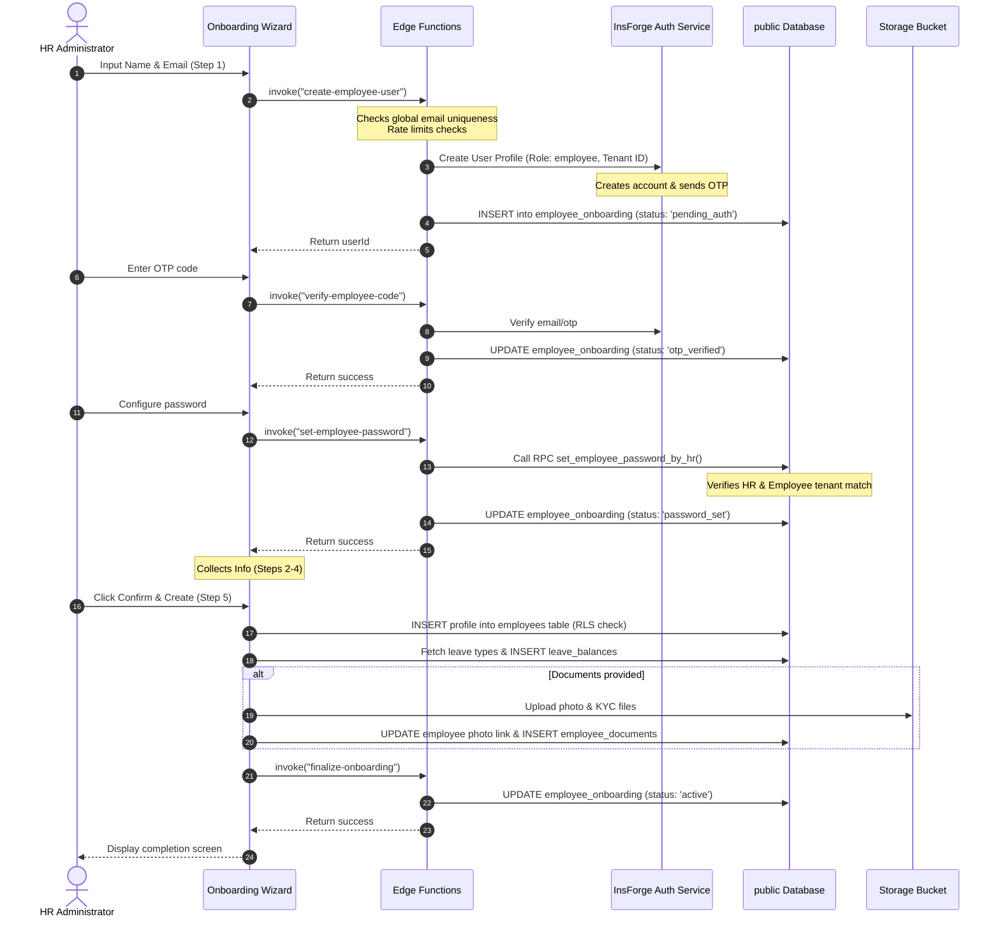

# 🏢 Employee Onboarding & KYC Document Storage Pipeline

This document details the architecture, onboarding states machine, serverless Deno Edge Functions, and KYC storage pipeline that govern new employee registration and document collection in the TalentMesh HRMS.

---

## 1. 🗄️ Database Tables Schema

These schemas capture onboarding progress, file attachments, and profile variables.

### `employees` (Onboarding Fields)
Stores complete employee records. Verification of key onboarding fields:
* `id` (`uuid`, Primary Key)
* `user_id` (`uuid`, Foreign Key -> `auth.users.id`) - Links the database record to the authentication session user.
* `tenant_id` (`uuid`, Foreign Key -> `tenants.id`) - Organization bound.
* `full_name` (`text`) - Combined name.
* `email` (`text`, Unique) - Personal/work email, verified globally.
* `phone` (`text`)
* `employee_code` (`text`, Unique) - HR-assigned employee code.
* `date_of_joining` (`date`)
* `status` (`text`, Default `'active'`) - Status during insertion is `'active'`.
* `profile_photo_url` (`text`, Nullable) - Storage URL for the employee's photo avatar.
* `aadhaar_number` / `pan_number` (`text`) - KYC identification numbers.
* `bank_name` / `account_number` / `ifsc_code` (`text`) - Banking credentials.
* `emergency_contact_name` / `emergency_contact_phone` / `emergency_contact_relation` (`text`) - Emergency details.

### `employee_onboarding`
Tracks the state machine of new hire onboarding.
* `id` (`uuid`, Primary Key)
* `tenant_id` (`uuid`, Foreign Key -> `tenants.id` ON DELETE CASCADE)
* `auth_user_id` (`uuid`) - References the created auth user UUID.
* `status` (`text`, Default `'pending_auth'`) - State states:
  * `'pending_auth'`: Auth profile created, OTP sent to email.
  * `'otp_verified'`: OTP verified successfully.
  * `'password_set'`: Login password configured.
  * `'active'`: Employee row created and onboarding finalized.
  * `'expired'`: Onboarding aborted/stale (older than 7 days, set by clean-up cron).
* `expired_at` (`timestamp with time zone`, Nullable) - Date when onboarding expired.
* `last_error` (`text`, Nullable) - Stores description of last failure.
* `created_at` / `updated_at` (`timestamp with time zone`)

### `employee_documents`
KYC and official documents linked to employee folders.
* `id` (`uuid`, Primary Key)
* `tenant_id` (`uuid`, Foreign Key)
* `employee_id` (`uuid`, Foreign Key -> `employees.id` ON DELETE CASCADE)
* `file_name` (`text`) - Original filename.
* `file_url` (`text`) - Public storage URL.
* `file_key` (`text`) - Storage path key in the bucket (e.g. `tenant_id/employee_id/uuid.pdf`).
* `size` (`integer`) - File size in bytes.
* `uploaded_at` (`timestamp with time zone`, Default `now()`)

### `leave_balances`
Initialized automatically for the newly onboarded employee for all active leave types in the tenant.
* `id` (`uuid`, Primary Key)
* `tenant_id` (`uuid`, Foreign Key)
* `employee_id` (`uuid`, Foreign Key -> `employees.id` ON DELETE CASCADE)
* `leave_type_id` (`uuid`, Foreign Key)
* `balance` (`numeric`) - Accrued starting balance.
* `year` (`integer`) - Resolved tenant year.

---

## 🚀 2. Onboarding Wizard Lifecycle

The HR creator initiates onboarding via a 5-step wizard component ([EmployeeCreate.tsx](file:///c:/Users/Anuj/Desktop/hrms/HRMS-Talentmesh-Solutions/src/hr/EmployeeCreate.tsx)).

### Step 1: Personal Details & Auth Account Creation
* **Input Fields**: Full Name, Email, Phone.
* **Authentication Gating**:
  1. Clicking "Next" calls the Edge Function `create-employee-user` which creates the user profile in InsForge Auth and sends a 6-digit OTP verification code.
  2. The UI enters a **Verification Modal**. HR inputs the 6-digit OTP received by the employee, invoking Edge Function `verify-employee-code`.
  3. Once validated, the UI moves to **Password Configuration**. HR sets the password, calling Edge Function `set-employee-password` (hashed with bcrypt).
  4. Upon success, Step 1 resolves, setting the status to `"done"`.

### Step 2: Employment Info
* **Input Fields**: Department, Designation, Employee Code, Date of Joining, Employment Type, Work Mode (`office` / `remote` / `hybrid`).

### Step 3: KYC & Banking
* **Input Fields**: Aadhaar Number, PAN Number, Bank Name, Account Number, IFSC Code.
* **Format Checks**:
  * Aadhaar: Exactly 12 digits.
  * PAN: Matches regex `/^[A-Z]{5}[0-9]{4}[A-Z]{1}$/`.

### Step 4: Emergency Contact
* **Input Fields**: Emergency Contact Name, Emergency Contact Phone, Relationship.

### Step 5: Review & Profile Creation
* **Profile Review**: Displays all step values for validation.
* **Transactional Insert**:
  1. **Insert Profile**: Inserts the profile row into `employees`.
  2. **Seeding Leave Balances**: Seeding query runs to initialize `leave_balances` for the current tenant year.
  3. **File Uploads**: Files are uploaded to storage:
     * Profile picture upload to `employee-profile-photos` bucket (updates `employees.profile_photo_url`).
     * Aadhaar/PAN files upload to `employee-documents` bucket (creates records in `employee_documents` table).
  4. **State Finalization**: Invokes Edge Function `finalize-onboarding` which transitions the onboarding state to `'active'` in `employee_onboarding`.

---

## ⚙️ 3. Edge Functions Architecture

Onboarding Edge Functions run in the serverless Deno runtime, bypassing client exposures and enforcing rate limits.

### A. `create-employee-user` ([create-employee-user.ts](file:///c:/Users/Anuj/Desktop/hrms/HRMS-Talentmesh-Solutions/functions/create-employee-user.ts))
1. **Authorization Guard**: Verifies caller JWT role is `'hr'` and matches the tenant context.
2. **Rate Limiting**: Checks `check_rate_limit()` RPC (maximum 20 requests per hour).
3. **Cross-Tenant Validation**: Calls `check_employee_exists_by_email` RPC. If the email exists globally in `employees`, it rejects the request (`CROSS_TENANT_EMAIL_CONFLICT`).
4. **Orphaned Auth Clean-up**:
   * Resolves existing user accounts via `get_auth_user_details_by_email_v2`.
   * If the email exists in Auth but has no corresponding `employees` database record, and is older than 30 minutes, it deletes the orphaned auth account (`deleteAuthUser`) and recreates it.
5. **Creation**: Creates the user account, setting app metadata claims `{ role: "employee", tenant_id: tenantId }`, and registers `'pending_auth'` state in `employee_onboarding`.

### B. `verify-employee-code` ([verify-employee-code.ts](file:///c:/Users/Anuj/Desktop/hrms/HRMS-Talentmesh-Solutions/functions/verify-employee-code.ts))
1. **OTP Verification**: Invokes InsForge email verification endpoint (`/api/auth/email/verify`).
2. **State Transition**: Updates `employee_onboarding.status` to `'otp_verified'`.
3. **Audit Log**: Inserts a log entry (action: `'employee.otp_verified'`).

### C. `set-employee-password` ([set-employee-password.ts](file:///c:/Users/Anuj/Desktop/hrms/HRMS-Talentmesh-Solutions/functions/set-employee-password.ts))
1. **Hashing**: Hashes the password on the server using `bcrypt` (10 rounds).
2. **Credentials Update**: Calls RPC `set_employee_password_by_hr` using the HR user's token. The RPC checks that the HR user and target employee belong to the exact same `tenant_id` before committing.
3. **State Transition**: Updates `employee_onboarding.status` to `'password_set'`.

### D. `finalize-onboarding` ([finalize-onboarding.ts](file:///c:/Users/Anuj/Desktop/hrms/HRMS-Talentmesh-Solutions/functions/finalize-onboarding.ts))
1. **Validation**: Verifies HR role and tenant mappings.
2. **State Transition**: Sets `employee_onboarding.status` to `'active'`, ending the onboarding transaction.

---

## 🔄 4. State Recovery, Resumability & Conflict Handling

To ensure robust execution across network drops and browser interruptions:

### Draft Recovery Flow
* The form state is serialized and cached in `sessionStorage` (`hrms_employee_draft_${tenantId}`) on every keypress.
* If HR reloads the page, a banner appears offering to **Resume Draft** or **Discard Draft** (clears cache).

### Resuming Unfinished Flows
If the browser is closed mid-way through Step 1 (after auth user creation) and the HR admin restarts with the same email, the UI checks the database via RPC `check_onboarding_resumable`:
```sql
CREATE OR REPLACE FUNCTION public.check_onboarding_resumable(p_email text, p_tenant_id uuid)
RETURNS TABLE(auth_user_id uuid, status text, employee_id uuid)
```
If the email has a pending onboarding session in `employee_onboarding` and no active profile in `employees`:
* Prompt: *"An onboarding flow already exists for this email... Would you like to resume it?"*
* Confirming resumes the session, auto-populating fields and jumping directly to the corresponding auth step (`pending_auth` / `otp_verified` / `password_set`).

---

## 🔄 5. End-to-End Onboarding Sequence


