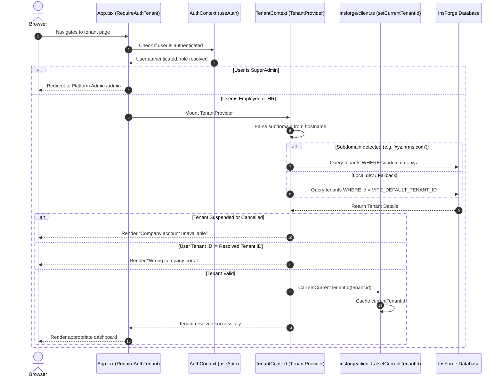

# TalentMesh HRMS Frontend Architecture & State Management

This document maps out the frontend structure, route hierarchy, security guarding, and state management mechanisms in the **TalentMesh HRMS** React client.

---

## 🏛️ Architecture Overview

The TalentMesh frontend is a Single-Page Application (SPA) built using **React 19**, **Vite**, and **TypeScript**, styled with **Tailwind CSS**. It connects to the InsForge backend using the `@insforge/sdk`.

The frontend is divided into three distinct portals based on the user's role:
1. **Platform Admin Portal (`/admin/*`)**: For superadmins managing companies, plans, and tenants.
2. **HR Admin Portal (`/hr/*` & `/payroll/*`)**: For HR administrators managing employees, attendance, shifts, tasks, leaves, policies, and running payroll.
3. **Employee Portal (`/employee/*` & `/payroll/employee/*`)**: For staff members to clock in/out, apply for leaves, view tasks, view payslips, read policies, and chat.

### Core Data Flow Architecture

```mermaid
graph TD
    Browser[Web Browser]
    
    %% Context Layer
    subgraph Context Layer [Context & Identity Layer]
        AuthCtx[AuthContext]
        TenantCtx[TenantContext]
    end
    
    %% API / Client Layer
    subgraph API Layer [InsForge SDK Wrapper Client]
        SDK[createClient]
        DB[Database Client db]
        Auth[Auth Client auth]
        Func[Custom Functions wrapper]
        RPCInt[RPC 401 Interceptor]
    end
    
    %% Hooks Layer
    subgraph UI Hooks [Custom React Hooks]
        useAuth[useAuth]
        useTenant[useTenant]
        useAttendance[useAttendance]
        useLeaves[useLeaves]
        useTasks[useTasks]
        useChat[useChat]
    end

    %% UI Pages
    subgraph Portals [React Portals]
        EmployeePortal[Employee Portal]
        HRPortal[HR Portal]
        AdminPortal[Platform Admin Portal]
    end

    Browser -->|URL / Subdomain| TenantCtx
    AuthCtx -->|JWT / Role| useAuth
    TenantCtx -->|Subdomain / tenant_id| useTenant
    TenantCtx -->|setCurrentTenantId| SDK
    
    useTenant -.-> UI Hooks
    useAuth -.-> UI Hooks
    
    UI Hooks -->|Queries| DB
    UI Hooks -->|Triggers| Func
    
    Func -->|Appends tenant_id| SDK
    DB -->|Retries on 401| RPCInt
    RPCInt -->|getCurrentUser| Auth
    
    EmployeePortal --> useAttendance & useLeaves & useTasks
    HRPortal --> useLeaves & useTasks & useChat
    AdminPortal --> AuthCtx
```

---

## 🚦 Route Guarding & Tenancy Resolution

Routes are guarded and nested in [`src/App.tsx`](file:///c:/Users/Anuj/Desktop/hrms/HRMS-Talentmesh-Solutions/src/App.tsx) based on authentication, tenant context, and user roles.

### Guard Roles

1. **`RequireSuperAdmin`**: Blocks access to the platform admin portal unless the user has the `superadmin` role.
2. **`RequireRole`**: Validates whether the user's role matches the required portal permission (e.g. restricts `/hr/*` to `hr` role and `/employee/*` to `employee` role).
3. **`RequireAuthTenant`**: Forces domain-based tenant resolution prior to rendering nested workspace portals.

### Tenancy Context Initialization Sequence

The following diagram illustrates how the frontend parses the subdomain, resolves the tenant, and configures the SDK client on entry:



---

## ⚡ State Management Pattern

The application does not use external state packages (like Redux or Zustand). Instead, state management relies on **React Context** for global configuration/credentials, and **Custom Hooks** for component-level data fetch and mutation scopes.

### 1. Global Contexts

#### A. Auth Context ([`AuthContext.tsx`](file:///c:/Users/Anuj/Desktop/hrms/HRMS-Talentmesh-Solutions/src/contexts/AuthContext.tsx))
Manages credentials, sessions, and roles globally.
* **State Managed**:
  - `user`: Holds ID, email, metadata, and profile.
  - `role`: (`employee` | `hr` | `superadmin`). Resolved from JWT app metadata, platform admins bypass table, or fetched dynamically from the `employees` table.
  - `tenantId`: Organization ID matching the authenticated user.
  - `loading`: Block state during initial user token checks.
* **Key Actions**:
  - `login(email, password)`: Handles credential checks and blocks login if the organization is suspended.
  - `verifyEmail(email, otp)`: Finishes onboarding verification.
  - `logout()`: Clears credentials and active sessions.

#### B. Tenant Context ([`TenantContext.tsx`](file:///c:/Users/Anuj/Desktop/hrms/HRMS-Talentmesh-Solutions/src/contexts/TenantContext.tsx))
Holds metadata about the currently accessed organization.
* **State Managed**:
  - `tenant`: The current `Tenant` object containing configuration rules (e.g., `timezone`, `lunch_break_minutes`, `punch_out_gate_enabled`, `logo_url`).
  - `tenantId`: Resolved company ID.
  - `isLoading`: Block state during subdomain querying.

---

### 2. Custom Hooks Layer (Local Page State)

Each page or feature has a dedicated custom hook in `src/hooks/` that encapsulates state, handles API calls, and exposes actions. Hooks fetch the `tenantId` from `useTenant()` to enforce data isolation automatically.

#### Custom Hook Inventory & State Responsibilities

| Hook | State Managed | Primary DB Operations / SDK Calls |
|---|---|---|
| [`useAttendance`](file:///c:/Users/Anuj/Desktop/hrms/HRMS-Talentmesh-Solutions/src/hooks/useAttendance.ts) | `items` (Attendance[]), `loading` | Fetches daily logs, performs punch-in insertions (`date` formatted locally), and punch-out updates. |
| [`useLeaves`](file:///c:/Users/Anuj/Desktop/hrms/HRMS-Talentmesh-Solutions/src/hooks/useLeaves.ts) | `requests` (Leave[]), `loading` | Retrieves leave balances, queries leave history, and triggers leave request insertions. |
| [`useTasks`](file:///c:/Users/Anuj/Desktop/hrms/HRMS-Talentmesh-Solutions/src/hooks/useTasks.ts) | `tasks` (Task[]), `loading` | Queries assigned tasks, handles task completions and submission details. |
| [`useEmployeeShift`](file:///c:/Users/Anuj/Desktop/hrms/HRMS-Talentmesh-Solutions/src/hooks/useEmployeeShift.ts) | `shifts` (Shift[]), `loading` | Maps staff members to shifts using effective dates (`effective_from`, `effective_to`). |
| [`useChat`](file:///c:/Users/Anuj/Desktop/hrms/HRMS-Talentmesh-Solutions/src/hooks/useChat.ts) | `channels`, `messages` | Exposes Realtime subscriptions via WebSockets (`realtime`) to fetch new chat channel communications instantly. |

---

## 🛠️ API & SDK Wrapper Integrations ([`client.ts`](file:///c:/Users/Anuj/Desktop/hrms/HRMS-Talentmesh-Solutions/src/insforge/client.ts))

The client wrapper ensures strict tenant isolation and connection persistence through two middleware intercepts:

### 1. Realtime Functions Metadata Injection
Mutating edge function requests are intercepted to automatically append `tenant_id` metadata. This prevents developers from forgetting parameters:
```typescript
const withTenantMetadata = (body: unknown) => {
  const tenantId = getCurrentTenantId();
  if (!tenantId || !body || typeof body !== "object" || body instanceof FormData || Array.isArray(body)) {
    return body;
  }
  return {
    ...body,
    tenant_id: tenantId,
    metadata: { ...body.metadata, tenant_id: tenantId }
  };
};
```

### 2. Auto-Retry Session RPC Interceptor
If an database RPC execution triggers a JWT token expiration error, the client intercepts the error, runs a silent `getCurrentUser()` token refresh, and automatically retries the RPC call in the background to prevent user session interruption:
```typescript
(database as any).rpc = async (fn: string, args?: Record<string, unknown>) => {
  const res = await originalRpc(fn, args);
  if (res.error && (res.error.message?.includes("invalid token") || res.error.message?.includes("jwt"))) {
    // Attempt silent token refresh
    const refresh = await baseInsforge.auth.getCurrentUser();
    if (refresh.data?.user) {
      return originalRpc(fn, args); // Retry RPC
    }
  }
  return res;
};
```
