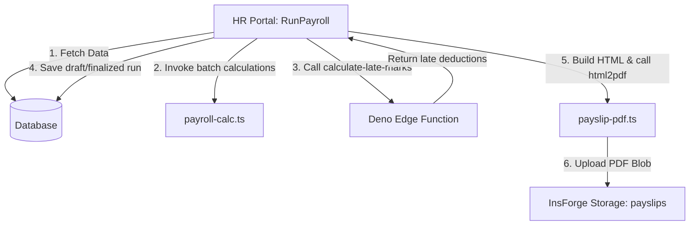

# Salary Structures & Payslip Generation Subsystem

The **Salary Structures & Payslip Generation Module** handles employee salary structures, calculates monthly pay dynamically using active attendance data, applies statutory regulations, integrates with a Deno Edge Function for late mark deductions, and handles client-side PDF rendering and storage mapping.

---

## 🏛️ Architecture Overview

The system consists of the following key directories and components:
1. **Salary Management Portal**: 
   * [SalaryStructures.tsx](file:///c:/Users/Anuj/Desktop/hrms/HRMS-Talentmesh-Solutions/src/payroll/hr/SalaryStructures.tsx) — Main dashboard listing all employee salaries, CTCs, and configurations.
   * [SalaryForm.tsx](file:///c:/Users/Anuj/Desktop/hrms/HRMS-Talentmesh-Solutions/src/payroll/hr/SalaryForm.tsx) — Slider and edit form for configuring a salary structure, featuring automatic CTC balancing.
2. **Monthly Payroll Processing Wizard**:
   * [RunPayroll.tsx](file:///c:/Users/Anuj/Desktop/hrms/HRMS-Talentmesh-Solutions/src/payroll/hr/RunPayroll.tsx) — Stepper wizard to select periods, compute monthly numbers, perform overrides, and finalize payroll runs.
   * [payroll-calc.ts](file:///c:/Users/Anuj/Desktop/hrms/HRMS-Talentmesh-Solutions/src/payroll/hr/payroll-calc.ts) — Pure utility file defining formulas, calculations, and attendance normalization rules.
3. **PDF Generation & Storage Engine**:
   * [payslip-pdf.ts](file:///c:/Users/Anuj/Desktop/hrms/HRMS-Talentmesh-Solutions/src/payroll/hr/payslip-pdf.ts) — HTML layout formatting, client-side rendering utilizing `html2pdf.js`, and upload pipelines.
   * [Payslips.tsx](file:///c:/Users/Anuj/Desktop/hrms/HRMS-Talentmesh-Solutions/src/payroll/hr/Payslips.tsx) — HR view to filter payroll runs, regenerate slips, open PDFs, and bulk-email links.

### Data Flow Diagram



---

## 📊 Database Schema Entities

The payroll subsystem maps directly to three primary tables in the InsForge database:

### 1. `salary_structures`
Defines the component breakdown of an employee's salary package.
* `id` (uuid, Primary Key)
* `tenant_id` (uuid, Foreign Key -> `tenants.id`)
* `employee_id` (uuid, Foreign Key -> `employees.id`)
* `effective_from` (date) - Starting date when this structure is applied.
* `ctc_annual` (numeric) - Total annual CTC.
* `basic_percent` (numeric) - Percentage of CTC allocated to Basic salary.
* `hra_percent` (numeric) - Percentage of Basic salary allocated to House Rent Allowance.
* `special_allowance` (numeric) - Balancing allowance component.
* `pf_applicable` (boolean) - Toggles Provident Fund eligibility.
* `esi_applicable` (boolean) - Toggles Employee State Insurance eligibility.
* `tds_monthly` (numeric) - Tax deducted at source monthly override.
* `other_allowances` (numeric) - Additional monthly allowances.
* `created_by` (uuid -> `employees.id`) - HR manager who configured the structure.

> [!NOTE]  
> If an employee receives a salary revision mid-month, HR inserts a new structure with a new `effective_from` date. The system identifies mid-month revisions in `RunPayroll.tsx` and issues audit events.

### 2. `payroll_runs`
Represents the processing batch for a specific month.
* `id` (`uuid`, Primary Key)
* `tenant_id` (`uuid`, Foreign Key -> `tenants.id`)
* `month` (`integer`, 1-12)
* `year` (`integer`)
* `status` (`text`) — State of the run (CHECK: `'draft'`, `'under_review'`, `'approved'`, or `'paid'`).
* `total_gross` (`numeric`)
* `total_deductions` (`numeric`)
* `total_net` (`numeric`)
* `employee_count` (`integer`)
* `run_by` (`uuid`, References `employees.id`) - HR employee who executed the run.
* `approved_by` (`uuid`, References `employees.id`) - HR employee who approved the run.
* `approved_at` (`timestamp with time zone`) - Timestamp of approval.
* `paid_at` (`timestamp with time zone`) - Timestamp of payout release.
* `notes` (`text`) - Processing remarks.
* `created_at` (`timestamp with time zone`, Default `now()`)

### 3. `payslips`
Individual monthly record generated per employee under a payroll run.
* `id` (`uuid`, Primary Key)
* `tenant_id` (`uuid`, Foreign Key -> `tenants.id`)
* `payroll_run_id` (`uuid`, Foreign Key -> `payroll_runs.id` ON DELETE CASCADE)
* `employee_id` (`uuid`, Foreign Key -> `employees.id`)
* `month` (`integer`, 1-12)
* `year` (`integer`)
* `days_in_month` (`integer`)
* `working_days` (`integer`) - Net expected working days in period (excluding Sundays and holidays).
* `days_present` (`integer`)
* `days_absent` (`integer`)
* `days_on_leave` (`integer`)
* `half_days` (`integer`, Default `0`)
* `basic_monthly` (`numeric`) - Calculated monthly basic salary.
* `hra_monthly` (`numeric`) - Calculated monthly HRA.
* `special_allowance` (`numeric`) - Calculated monthly special allowance.
* `other_allowances` (`numeric`) - Additional monthly allowances.
* `gross_salary` (`numeric`) - Earned monthly gross salary before deductions.
* `pf_employee` (`numeric`, Default `0`) - Provident Fund employee deduction.
* `pf_employer` (`numeric`, Default `0`) - Provident Fund employer contribution.
* `esi_employee` (`numeric`, Default `0`) - ESI employee deduction.
* `esi_employer` (`numeric`, Default `0`) - ESI employer contribution.
* `tds` (`numeric`, Default `0`) - Monthly Tax Deducted at Source.
* `other_deductions` (`numeric`, Default `0`) - Custom payroll adjustments.
* `total_deductions` (`numeric`) - Total calculated deductions.
* `net_payable` (`numeric`) - Final net payout amount: `(gross_salary - total_deductions)`.
* `pdf_url` (`text`) - Path key mapping to the generated PDF in InsForge storage.
* `emailed_at` (`timestamp with time zone`) - Timestamp of email delivery check.
* `created_at` (`timestamp with time zone`, Default `now()`)
* `policy_snapshot` (`jsonb`) - Copy of calculation settings and constants applied during the run.

---

## ⚙️ Calculation Engine (`payroll-calc.ts`)

The core calculations are processed programmatically to ensure precision.

### 1. Working Days Count
The payroll period's active working days are calculated using calendar month properties and excluding Sundays and non-Sunday holidays:
```typescript
function countSundays(year: number, month: number) { ... }
export function getWorkingDays(year: number, month: number, holidayDates: string[]) {
  const total = new Date(year, month, 0).getDate();
  const sundays = countSundays(year, month);
  const prefix = `${year}-${String(month).padStart(2, "0")}`;
  const holidaysNotSunday = holidayDates.filter((d) => {
    return d.startsWith(prefix) && new Date(d).getDay() !== 0;
  }).length;
  return Math.max(total - sundays - holidaysNotSunday, 1);
}
```

### 2. LOP (Loss of Pay) & Proration Divisor
Proration calculations determine the ratio (`daysRatio`) used to prorate salary components. This behavior is governed by the tenant setting `lop_calculation_method`:
1. **`working_days`**: Divisor is the calculated working days for that month.
   $$\text{daysRatio} = \frac{\text{normalizedPaidDays}}{\text{workingDays}}$$
2. **`calendar`**: Divisor is the total calendar days in the month.
   $$\text{daysRatio} = \frac{\text{daysInMonth} - \text{totalDeductibleDays}}{\text{daysInMonth}}$$
3. **`fixed_26`**: Divisor is fixed at 26.
   $$\text{daysRatio} = \frac{\text{normalizedPaidDays}}{26}$$

### 3. Attendance Normalization
Before performing calculations, the engine executes a normalization step to prevent invalid input anomalies where the sum of paid days and unpaid days exceeds the actual working days of the period:
* **Paid Days**: $\text{daysPresent} + (\text{halfDays} \times 0.5) + \text{paidLeaveDays}$
* **Explicit Unpaid Days**: $\text{daysAbsent} + \text{unpaidLeaveDays}$
* **Anomaly Condition**: $\text{totalTrackedDays} = \text{paidDays} + \text{explicitUnpaidDays} > \text{workingDays}$

If an anomaly is detected, the engine prioritizes paid days:
1. $\text{normalizedPaidDays} = \min(\text{paidDays}, \text{workingDays})$
2. $\text{normalizedUnpaidDays} = \max(0, \text{workingDays} - \text{normalizedPaidDays})$
3. $\text{unaccountedDays} = \max(0, \text{workingDays} - (\text{normalizedPaidDays} + \text{normalizedUnpaidDays}))$
4. $\text{totalDeductibleDays} = \text{normalizedUnpaidDays} + \text{unaccountedDays}$

### 4. Statutory Deductions Formulas
* **Employee Provident Fund (PF)**:
  Applies only if `pf_applicable` is toggled. It is calculated as 12% of the basic salary, capped at a wage ceiling (default ₹15,000, which is also prorated by the LOP ratio):
  $$\text{proratedPfCeiling} = \text{pfWageCeiling} \times \text{daysRatio}$$
  $$\text{pfBase} = \min(\text{proratedBasic}, \text{proratedPfCeiling})$$
  $$\text{pfEmployee} = \text{pfBase} \times 0.12$$
  $$\text{pfEmployer} = \text{pfBase} \times 0.12$$

* **Employee State Insurance (ESI)**:
  Applies only if `esi_applicable` is toggled AND the full, non-prorated gross monthly salary is less than or equal to the ESI eligibility gross ceiling (default ₹21,000). The calculation base includes both the prorated gross salary and accrued overtime earnings:
  $$\text{esiBase} = \text{proratedGross} + \text{overtimeAmount}$$
  $$\text{esiEmployee} = \text{esiBase} \times 0.0075$$
  $$\text{esiEmployer} = \text{esiBase} \times 0.0325$$

* **Professional Tax (PT)**:
  Deducted dynamically based on the tenant's configured state or manual override:
  * Falls back to state defaults: Karnataka, Maharashtra, Telangana, Andhra Pradesh, Gujarat: ₹200; Tamil Nadu: ₹209.
  * Direct manual override if `professional_tax_manual_amount` is defined in tenant settings.

---

## 🎨 Salary Config Mode & Auto Balance

When designing or modifying an employee's salary structure in the HR portal, HR managers can choose between two creation modes:

### 1. Auto Balance Mode (Recommended)
This mode automatically calculates the monthly `special_allowance` required to align the breakdown components with the target Monthly CTC. The system factors in employer PF and ESI contributions to guarantee that the total Cost to Company (CTC) matches the expectation exactly:
1. $\text{monthlyCtc} = \frac{\text{ctcAnnual}}{12}$
2. $\text{basicMonthly} = \text{monthlyCtc} \times \frac{\text{basicPercent}}{100}$
3. $\text{hraMonthly} = \text{basicMonthly} \times \frac{\text{hraPercent}}{100}$
4. $\text{pfEmployer} = \begin{cases} \min(\text{basicMonthly}, 15000) \times 0.12 & \text{if PF applicable} \\ 0 & \text{otherwise} \end{cases}$
5. $\text{allowance} = \begin{cases} \frac{\text{monthlyCtc} - \text{pfEmployer}}{1.0325} - (\text{basicMonthly} + \text{hraMonthly} + \text{otherAllowances}) & \text{if ESI applicable and Gross} \le 21000 \\ \text{monthlyCtc} - \text{pfEmployer} - (\text{basicMonthly} + \text{hraMonthly} + \text{otherAllowances}) & \text{otherwise} \end{cases}$

### 2. Manual Design Mode
Allows HR managers to edit all components freely. To prevent billing discrepancies, a validator ensures that the calculated total monthly cost matches the expected CTC:
$$\text{Calculated Cost} = \text{grossMonthly} + \text{pfEmployer} + \text{esiEmployer}$$
$$\text{Variance} = \text{Calculated Cost} - \text{monthlyCtc}$$
$$\text{Constraint}: |\text{Variance}| \le \text{₹}10$$

---

## ⚡ Late Mark Deduction Flow

The system integrates late mark attendance rules directly into the payroll run deductions layer using a Deno Edge Function:

1. **Invoke Edge Function**: During step 2 of the payroll wizard, `RunPayroll.tsx` queries late mark statistics in parallel batches for active employees by invoking the [calculate-late-marks.ts](file:///c:/Users/Anuj/Desktop/hrms/HRMS-Talentmesh-Solutions/functions/calculate-late-marks.ts) function.
2. **Process Logic**:
   * Evaluates the employee's attendance records where `is_late = true` and `status` is not `absent` or `half_day` for the given monthly range.
   * Retrieves two tenant settings keys: `late_mark_threshold` (default 3) and `late_mark_deduction_hours` (default 0.5 hours).
   * Computes excess marks and deduction hours:
     $$\text{excessLates} = \max(0, \text{lateCount} - \text{threshold})$$
     $$\text{deductionHours} = \text{excessLates} \times \text{lateMarkDeductionHours}$$
3. **Prorate Deductions**: The frontend translates deduction hours into a currency deduction based on the employee's hourly rate:
   $$\text{hourlyRate} = \frac{\text{proratedGross}}{\text{workHoursPerDay} \times \text{workingDays}}$$
   $$\text{lateDeductionAmount} = \text{deductionHours} \times \text{hourlyRate}$$
4. **Result**: The resulting amount is added to `otherDeductions` and `totalDeductions` and displayed to HR before saving.

---

## 📄 PDF Generation & Storage Pipeline

Once payroll is approved, individual PDF files are generated and uploaded to the InsForge backend:

1. **HTML Template Compilation**:
   * In [payslip-pdf.ts](file:///c:/Users/Anuj/Desktop/hrms/HRMS-Talentmesh-Solutions/src/payroll/hr/payslip-pdf.ts), the helper compilation code builds a standardized HTML structure containing the tenant's profile logo, employee details, pay period summaries, and a dual-column layout mapping Earnings and Deductions side-by-side.
2. **Client-Side rendering via iframe**:
   * An invisible `iframe` is appended to the document body. The HTML is written to the frame.
   * A promise-chain waits for all images to complete loading to avoid truncated renders.
   * The client-side library `html2pdf.js` captures the `iframe` elements and exports a PDF Blob:
     ```typescript
     html2pdf()
       .set({
         margin: 0,
         filename: "payslip.pdf",
         image: { type: "jpeg", quality: 0.98 },
         html2canvas: { scale: 2, useCORS: true, logging: false, backgroundColor: "#ffffff" },
         jsPDF: { unit: "mm", format: "a4", orientation: "portrait" },
       })
       .from(iframeTarget)
       .toPdf()
       .outputPdf("blob")
     ```
3. **Upload to InsForge**:
   * The generated PDF Blob is uploaded to the InsForge Storage bucket: `"payslips"`.
   * **Storage path structure**:
     `{tenant_id}/{year}/{month}/{employee_id}.pdf`  
     *e.g., `111035ce-979c-429a-a482-ddfa87dbfe6e/2026/06/0431f0f6-225f-4fb1-86b7-3fd32684c7f4.pdf`*

---

## 📧 Email Notification Rules

Payslip notifications support a batch delivery wizard:
* **mailto Batch Cap**: Due to browser URL characters limits, bulk notifications batch recipient email strings inside groups of **30** (`RECIPIENT_BATCH_SIZE`).
* **Maximum Limits**: A safety limit restricts mail preparation up to **10 batches** (total 300 employees). For sizes exceeding this threshold, the portal displays a notice directing the user to use the export/queue workflow.
* **Email Status Flags**: In the current architecture, marking a payslip email status as `Prepared` signifies that the client's mail composer window was successfully opened with the recipient's metadata. In future implementations (incorporating the `send-payslip-email` Edge Function), the flag will check actual transmission feedback logs.
