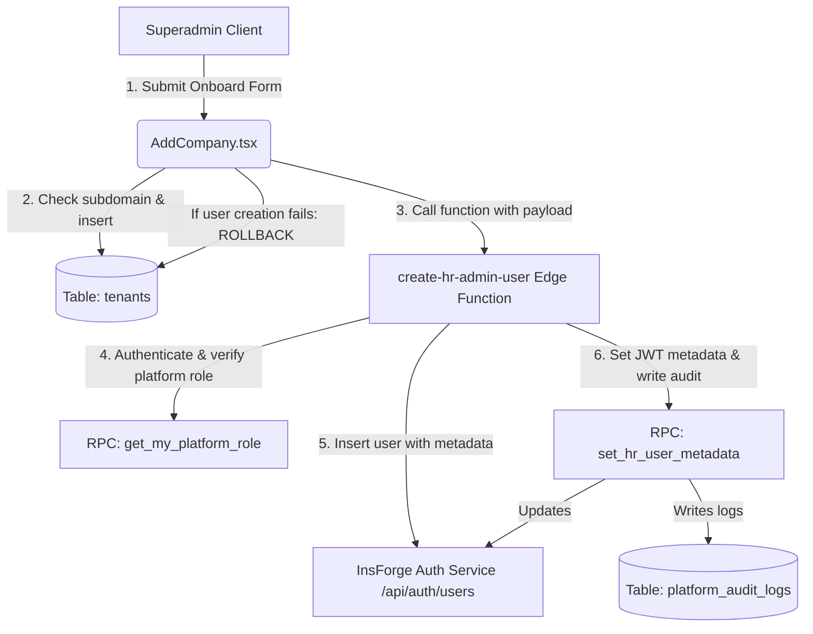

# Platform Administration & Tenant Provisioning Module

The **Platform Administration & Tenant Provisioning Module** is the master control panel of the TalentMesh HRMS. It is used by platform owners and support administrators to onboard client companies (tenants), manage plan tiers, suspend/reactivate tenants, and audit system-wide modifications.

---

## 🏛️ Architecture Overview

The platform admin console is securely isolated from the standard multi-tenant employee/HR portal:
1. **Superadmin Console Interface**:
   * [AdminLayout.tsx](file:///c:/Users/Anuj/Desktop/hrms/HRMS-Talentmesh-Solutions/src/admin/AdminLayout.tsx) — Main layout housing navigation guards and Superadmin-specific views.
   * [AdminDashboard.tsx](file:///c:/Users/Anuj/Desktop/hrms/HRMS-Talentmesh-Solutions/src/admin/AdminDashboard.tsx) — Key platform statistics, including tenant counts, employee aggregation, and monthly recurring revenue (MRR) estimates.
   * [AddCompany.tsx](file:///c:/Users/Anuj/Desktop/hrms/HRMS-Talentmesh-Solutions/src/admin/AddCompany.tsx) — Form to provision new tenants and seed their initial HR admin credentials.
   * [AllCompanies.tsx](file:///c:/Users/Anuj/Desktop/hrms/HRMS-Talentmesh-Solutions/src/admin/AllCompanies.tsx) — Directory to search, audit details, edit plans, and suspend/reactivate client tenants.
2. **Onboarding Edge Function**:
   * [index.js](file:///c:/Users/Anuj/Desktop/hrms/HRMS-Talentmesh-Solutions/functions/create-hr-admin-user/index.js) — Deno-based endpoint executing privileged account creation.
3. **Database Security Controls**:
   * Defined in [insforge-enterprise-01-core.sql](file:///c:/Users/Anuj/Desktop/hrms/HRMS-Talentmesh-Solutions/insforge-enterprise-01-core.sql) and [insforge-enterprise-02-functions-policies.sql](file:///c:/Users/Anuj/Desktop/hrms/HRMS-Talentmesh-Solutions/insforge-enterprise-02-functions-policies.sql).
   * Gated via Row-Level Security (RLS) tables, automated triggers, and transactional SQL helpers.

### Data Flow Diagram



---

## 🔐 Platform Security & Auth Guards

To protect cross-tenant boundary integrity, the platform console implements multi-tiered access gates:

### 1. Database-Level Role Resolution
Superadmin authorization does NOT rely on client-side claims. Database privileges are resolved using dedicated SQL functions:
* **`platform_admins` Table**: Maps `user_id` -> `auth.users(id)` and assigns administrative roles: `owner`, `support_admin`, `billing_admin`.
* **`public.is_superadmin()`**: Returns `true` if the executing session's `auth.uid()` corresponds to an active platform administrator:
  ```sql
  CREATE OR REPLACE FUNCTION public.is_superadmin()
  RETURNS boolean AS $$
    SELECT EXISTS (
      SELECT 1 FROM public.platform_admins pa
      WHERE pa.user_id = (SELECT auth.uid()) AND pa.is_active = true
    );
  $$ LANGUAGE sql SECURITY DEFINER;
  ```

### 2. Frontend Security Guards
* **Navigation Guards**: Inside [App.tsx](file:///c:/Users/Anuj/Desktop/hrms/HRMS-Talentmesh-Solutions/src/App.tsx), the `RequireSuperAdmin` component wraps the `/admin/*` routes. If the authenticated session's role is not `'superadmin'`, the client is redirected to the login screen.
* **Portal Isolation Redirect**: Inside `RequireAuthTenant`, if a user logs in with the `'superadmin'` role but attempts to access a standard tenant route, they are automatically redirected to the platform dashboard (`/admin/dashboard`).
* **Active Tenant Enforcement**: Inside `AuthContext.tsx`, the `isTenantLoginBlocked(tenantId)` helper checks if the tenant status is `'suspended'` or `'cancelled'`. If so, regular employees are blocked and signed out immediately. Platform superadmins bypass this block to allow administration of suspended accounts.

---

## 🏢 Tenant Onboarding Pipeline

Provisioning a new client organization is handled as a single transactional saga inside `AddCompany.tsx`:

### 1. Form Configuration & Tiers
The onboarding form validates inputs against standard billing config metrics:
* **`trial`**: Max Employees: 10, Rate: Free
* **`starter`**: Max Employees: 25, Rate: ₹99/user
* **`growth`**: Max Employees: 100, Rate: ₹149/user
* **`pro`**: Max Employees: 9999 (Unlimited), Rate: ₹249/user

### 2. Subdomain Validation
Subdomains must be lowercase, alphanumeric, and contain no special characters other than hyphens (pattern `^[a-z0-9-]+$`).
The client verifies subdomain uniqueness before creating records:
```sql
SELECT id FROM public.tenants WHERE subdomain = :clean_subdomain;
```

### 3. Tenant Insertion & Account Rollback Saga
1. Inserts the tenant record: `company_name`, `subdomain`, `plan`, `max_employees`, and `status` (`trial` if plan is trial, else `active`).
2. Invokes the `create-hr-admin-user` edge function, transmitting the `tenant_id` and a temporary password generated via `generateTempPassword()`.
3. **Rollback Guard**: If user creation or metadata configuration fails at the Edge Function layer, the frontend intercepts the failure and executes a rollback query on the database, deleting the created tenant record to prevent orphaned records:
   ```typescript
   if (fnErr) {
     await db.from("tenants").delete().eq("id", tenantId);
     setError(fnErr.message);
   }
   ```

---

## ⚡ Edge Function & RPC Metadata Integration

The [create-hr-admin-user](file:///c:/Users/Anuj/Desktop/hrms/HRMS-Talentmesh-Solutions/functions/create-hr-admin-user/index.js) Deno Edge Function is responsible for provisioning the tenant's primary HR administrator account:

### 1. Privilege Verification
To prevent malicious privilege escalation, the function extracts the user token from the request header and makes a loopback call to the database RPC `get_my_platform_role` using the caller's JWT:
```javascript
const platformRoleRes = await fetch(`${baseUrl}/api/database/rpc/get_my_platform_role`, {
  method: "POST",
  headers: { Authorization: `Bearer ${userToken}` }
});
```
If the token does not belong to a valid platform admin, the function aborts with `403 Forbidden`.

### 2. Service-Role Account Creation
The function calls the InsForge auth users endpoint using the master `INSFORGE_SERVICE_ROLE_KEY` to register the new user with specific app metadata containing the tenant ID:
```javascript
const createRes = await fetch(`${baseUrl}/api/auth/users`, {
  method: "POST",
  headers: { Authorization: `Bearer ${adminKey}` },
  body: JSON.stringify({
    email,
    password: temp_password,
    name: name,
    autoConfirm: true,
    metadata: { role: "hr", tenant_id }
  })
});
```

### 3. DB RPC: `set_hr_user_metadata(...)`
After creating the user, the function invokes the database RPC [set_hr_user_metadata](file:///c:/Users/Anuj/Desktop/hrms/HRMS-Talentmesh-Solutions/insforge-enterprise-02-functions-policies.sql#L1-L30):
* Verifies `is_superadmin()` is true.
* Updates the core `auth.users` schema columns, setting `email_verified = true` and synchronizing the `metadata` and `profile` JSON values.
* Writes a record to `platform_audit_logs` (action: `'CREATE_HR_ADMIN'`).

---

## 📊 Platform Auditing & Database Triggers

The platform maintains audit logs of all global modifications to support billing and compliance:

### 1. Schema: `platform_audit_logs`
* `id` (uuid, Primary Key)
* `actor_user_id` (uuid -> auth.users) — Superadmin who performed the change.
* `actor_email` (text) — Email of the superadmin.
* `action` (text) — Event type (e.g., `'CREATE_HR_ADMIN'`, `'INSERT'`, `'UPDATE'`, `'DELETE'`).
* `target_table` (text) — Table impacted (e.g., `'tenants'`, `'auth.users'`).
* `target_id` (uuid) — Primary Key of the impacted row.
* `before_data` (jsonb, Nullable) — Row state before change.
* `after_data` (jsonb, Nullable) — Row state after change.
* `created_at` (timestamptz)

### 2. Tenant Mutation Auditing Trigger
A database trigger automatically intercepts all changes on the `tenants` table and writes audit records:
```sql
CREATE OR REPLACE FUNCTION public.audit_tenant_changes()
RETURNS trigger AS $$
DECLARE
  actor_email text;
BEGIN
  IF NOT (SELECT public.is_superadmin()) THEN
    RETURN COALESCE(NEW, OLD);
  END IF;

  SELECT email INTO actor_email FROM auth.users WHERE id = (SELECT auth.uid());

  INSERT INTO public.platform_audit_logs (actor_user_id, actor_email, action, target_table, target_id, before_data, after_data)
  VALUES (
    (SELECT auth.uid()),
    actor_email,
    TG_OP,
    TG_TABLE_NAME,
    COALESCE(NEW.id, OLD.id),
    CASE WHEN TG_OP IN ('UPDATE', 'DELETE') THEN to_jsonb(OLD) ELSE NULL END,
    CASE WHEN TG_OP IN ('INSERT', 'UPDATE') THEN to_jsonb(NEW) ELSE NULL END
  );
  RETURN COALESCE(NEW, OLD);
END;
$$ LANGUAGE plpgsql SECURITY DEFINER;

CREATE TRIGGER tenants_platform_audit
AFTER INSERT OR UPDATE OR DELETE ON public.tenants
FOR EACH ROW EXECUTE FUNCTION public.audit_tenant_changes();
```

---

## 📈 Admin Dashboard Metrics

The [AdminDashboard.tsx](file:///c:/Users/Anuj/Desktop/hrms/HRMS-Talentmesh-Solutions/src/admin/AdminDashboard.tsx) computes real-time business performance metrics:
1. **Total Tenant Counts**: Aggregates all records in the `tenants` table, grouping them by active, trial, or suspended status.
2. **Aggregate Employee Count**: Queries the database to count active records across all tenant boundaries:
   ```sql
   SELECT COUNT(id) FROM public.employees;
   ```
3. **Monthly Recurring Revenue (MRR) Estimate**: Dynamically computes monthly revenue by checking tenant billing structures:
   * **Formula**:
     $$\text{MRR} = \sum_{t \in \text{Tenants}} \text{PLAN\_RATES}[t.\text{plan}] \times t.\text{employee\_count}$$
   * **PLAN_RATES**: `starter` = ₹99, `growth` = ₹149, `pro` = ₹249, `trial` = ₹0.
