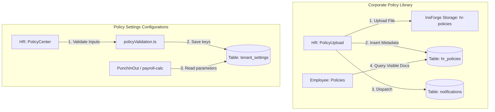

# HR Policies & Reference Document Center

The **HR Policies & Reference Document Center** coordinates corporate policy management and system-wide setting policies. The system is split into two distinct sub-modules:
1. **Corporate Policy Library**: A document management system where HR uploads handbooks or rules (PDF/DOCX) targeting specific employees, which are stored in the InsForge backend and displayed to workers.
2. **Global Policy Configurations**: An administrative settings hub where HR configures business constraints (attendance thresholds, leave rules, salary proration models, task limits) that dictate system behavior.

---

## 🏛️ Architecture Overview

The policy center spans across the following UI views and schemas:
* **Corporate Policy Library**:
  * [PolicyUpload.tsx](file:///c:/Users/Anuj/Desktop/hrms/HRMS-Talentmesh-Solutions/src/hr/PolicyUpload.tsx) — HR view to upload, assign visibility, delete, and view policy documents.
  * [Policies.tsx](file:///c:/Users/Anuj/Desktop/hrms/HRMS-Talentmesh-Solutions/src/employee/Policies.tsx) — Employee Self-Service view listing only documents relevant to their role/department.
  * **InsForge Storage Bucket**: `"hr-policies"`.
  * **Database Table**: `hr_policies`.
* **Global Policy Configurations**:
  * [PolicyCenter.tsx](file:///c:/Users/Anuj/Desktop/hrms/HRMS-Talentmesh-Solutions/src/hr/PolicyCenter.tsx) — Stepper tab settings panel (Attendance, Leave, Salary, Task, Company profile).
  * [policyValidation.ts](file:///c:/Users/Anuj/Desktop/hrms/HRMS-Talentmesh-Solutions/src/utils/policyValidation.ts) — Business rule validation layer executing checks before saving configurations.
  * **Database Table**: `tenant_settings` (key-value schema).

### Data Flow Diagram



---

## 📂 1. Corporate Policy Library

The document publishing pipeline handles corporate guidelines and distributes notifications to target staff.

### Database Entity: `hr_policies`
* `id` (uuid, Primary Key)
* `tenant_id` (uuid, Foreign Key -> `tenants.id`)
* `title` (text, NOT NULL) — Document title.
* `description` (text, Nullable) — Document summary.
* `file_url` (text, NOT NULL) — Public link to the file stored in the `"hr-policies"` bucket.
* `file_name` (text, NOT NULL) — Original upload file name.
* `uploaded_by` (uuid -> `employees.id`) — HR manager who uploaded the document.
* `visible_to` (text) — Defines visibility scope: `'all'` (entire company), `'hr_only'` (operations department), or `'department-specific'` (scoped to a filter).
* `department_filter` (text, Nullable) — Target department filter (e.g. `'dev'`, `'sales'`) if visibility is `'department-specific'`.
* `created_at` (timestamptz)

### Storage upload pipeline
1. HR uploads a document (Vite blocks types other than `.pdf`, `.doc`, `.docx`).
2. The client formats a unique file path to avoid name collisions:
   $$\text{filePath} = \text{policies/}\text{random\_slug} - \text{timestamp}.\text{extension}$$
3. Uploads the Blob to the InsForge Storage bucket `"hr-policies"` via `storage.from("hr-policies").upload(filePath, file)`.
4. Returns the public file URL (`publicUrl`).
5. Inserts the metadata row into the `hr_policies` table. If the database insertion fails, the client automatically executes a cleanup query to remove the orphaned file from storage:
   ```typescript
   if (insertError) {
     await storage.from("hr-policies").remove(filePath);
     throw insertError;
   }
   ```

### Visibility Resolution & Querying
When an employee opens [Policies.tsx](file:///c:/Users/Anuj/Desktop/hrms/HRMS-Talentmesh-Solutions/src/employee/Policies.tsx), the portal retrieves only authorized documents:
1. Performs a query filtering by `tenant_id` and matching `visible_to` properties:
   ```sql
   SELECT * FROM hr_policies
   WHERE tenant_id = :tenant_id
     AND visible_to IN ('all', :has_department_specific_flag);
   ```
2. Client-side code applies a secondary filter:
   * Returns `true` if `visible_to` is `'all'`.
   * Returns `true` if `visible_to` is `'department-specific'` AND the employee's `department` field matches `department_filter` exactly.
   * Returns `false` otherwise.

### Notification Dispatcher
When a policy is successfully published, the system calculates the recipient audience based on the visibility settings and inserts notification logs:
* Visibility `'all'`: targets all active employees under the tenant.
* Visibility `'hr_only'`: targets active employees belonging to the `'operations'` department.
* Visibility `'department-specific'`: targets active employees belonging to the selected department.
* **Notification Payload**:
  ```json
  {
    "tenant_id": "tenant_id",
    "employee_id": "target_employee_id",
    "title": "New HR Policy Document",
    "body": "[Visibility Prefix] [Policy Title]",
    "type": "new_policy"
  }
  ```
  *(Prefixes: `"New Company Policy:"` or `"New Policy for [Dept]:"`)*

---

## ⚙️ 2. Global Policy Configurations

The **Policy Center** (`PolicyCenter.tsx`) manages operational system constants per tenant. These variables are saved to the key-value table `tenant_settings`.

### Core Settings & Tabs Mapping

| Tab Key | Setting Key (stored in `tenant_settings`) | Description |
| :--- | :--- | :--- |
| **Attendance** | `late_mark_enabled` (boolean) | Controls late check-in tracking. |
| | `late_mark_grace_minutes` (integer) | Grace buffer before clock-in is marked late. |
| | `late_mark_threshold` (integer) | Max allowed late clock-ins before salary deductions trigger. |
| | `late_mark_deduction_hours` (numeric) | Hourly rate deducted per excess late mark. |
| | `overtime_enabled` (boolean) | Toggles overtime approvals. |
| | `overtime_rate` (numeric) | Overtime multiplier (default: 1.5). |
| | `geofence_enabled` (boolean) | Toggles GPS boundaries validation. |
| | `office_lat` / `office_lng` (numeric) | Office coordinates. |
| | `geofence_radius_meters` (integer) | Distance limit for verification check. |
| | `regularization_enabled` (boolean) | Toggles manual check-in correction requests. |
| | `break_tracking_enabled` (boolean) | Toggles lunch/break trackers. |
| | `break_deduction_mode` (`fixed` / `actual`) | Fixed deduction (uses `lunch_break_minutes`) vs actual recorded break times. |
| | `remote_work_handling` (text) | `'disabled'` (office only) / `'hr_approved_exceptions'` / `'always_allowed'`. |
| | `gps_verification_mode` (text) | `'disabled'` / `'warn'` / `'strict'`. |
| | `attendance_selfie_mode` (text) | `'disabled'` / `'punch_in'` / `'punch_out'` / `'both'`. |
| | `high_confidence_max` / `medium_confidence_max` / `low_confidence_max` (numeric) | GPS accuracy confidence thresholds (default: 50m / 150m / 300m). |
| **Leave** | `leave_min_notice_days` (integer) | Advance notice days required to submit a leave request. |
| | `leave_carry_forward` (boolean) | Toggles carry forward of unused leaves to the next year. |
| **Salary** | `lop_calculation_method` (text) | Proration proration logic: `'calendar'` (days in month) / `'working_days'` (actual working days) / `'fixed_26'` (fixed at 26). |
| | `pf_wage_ceiling` (integer) | Maximum basic salary subject to PF calculations (default: ₹15,000). |
| | `esi_gross_ceiling` (integer) | Gross salary eligibility limit for ESI (default: ₹21,000). |
| | `professional_tax_state` / `professional_tax_manual_amount` (text/numeric) | PT deductions parameters. |
| **Task** | `punch_out_gate_enabled` (boolean) | Blocks clock-outs if employee has unfinished tasks due today. |
| | `task_eod_redmark_time` (time) | EOD cutoff time for unfinished tasks (e.g. `'23:30'`). |
| | `task_grace_period_minutes` (integer) | Buffer minutes before task triggers lateness. |
| **Company** | `company_name` (text, stored in `tenants`) | Tenant corporate name. |
| | `logo_url` (text, stored in `tenants`) | Corporate logo (uploaded to `"company-assets"` bucket). |
| | `timezone` (text, stored in `tenants`) | Tenant local timezone (e.g. `'Asia/Kolkata'`). |

---

## ⚡ 3. Client-Side Policy Validations

To prevent database calculations failures, [policyValidation.ts](file:///c:/Users/Anuj/Desktop/hrms/HRMS-Talentmesh-Solutions/src/utils/policyValidation.ts) enforces strict validation rules before saving settings:

### 1. Attendance Policy Checks
* **Grace Minutes / Thresholds / Deductions**: Must not be negative.
* **Overtime Rate**: Must be at least `1.0`.
* **Geofencing**: Radius must be at least `50` meters. Latitude and Longitude must be valid numbers.
* **Regularization Window**: Must be at least `1` day.
* **Break Limits**: Short break duration limit must be a positive integer.
* **GPS Confidence Thresholds**:
  * High, Medium, and Low confidence limits must be positive numbers.
  * Must satisfy:
    $$\text{high\_confidence\_max} < \text{medium\_confidence\_max} < \text{low\_confidence\_max}$$

### 2. Task & Leave Policy Checks
* **Task Grace Period**: Must be between `0` and `480` minutes (8 hours limit).
* **Leave Notice Days**: Must not be negative.

### 3. Salary Policy Checks
* **PF Wage Ceiling / ESI Gross Ceiling**: Must not be negative.
* **Professional Tax**: If PT mode is manual, the amount must not be negative.

### 4. Custom Leave Types Checks
* Name and code are required.
* **Days per Year**: Must be non-negative.
* **Carry Forward**: If enabled, maximum carry forward days is required and must be non-negative.
* **Applicable After Days / Minimum Notice Days**: Must be valid non-negative integers.
* **Maximum Consecutive Days**: Must be at least `1` day.
