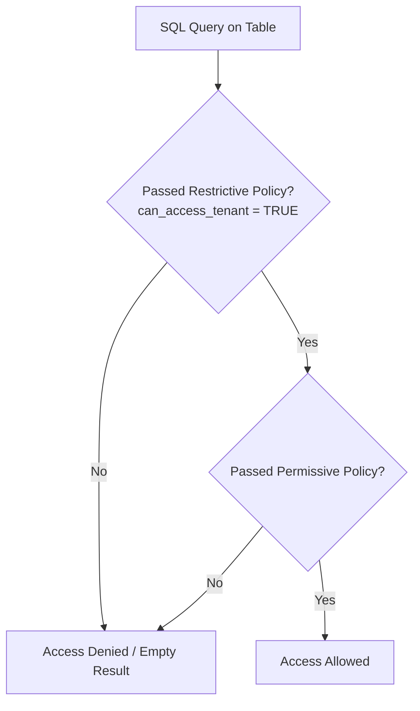

# TalentMesh HRMS Security, RLS & Authorization Architecture

> **Last verified against live InsForge BaaS database:** 2026-06-23
> Row Level Security (RLS) statuses, policy definitions, and utility routines detailed below represent the exact security configuration active on the production backend.

TalentMesh HRMS enforces multi-tenant data isolation and role-based access control (RBAC) at the database engine level using PostgreSQL Row Level Security (RLS), custom security context views, and strict security-definer routines.

---

## 🔒 1. Multi-Tenant Context & JWT Claims Structure

Authentication and session identity are managed through the InsForge Auth system. JWT tokens issued to authenticated clients carry specific metadata within their payload that defines the caller's organization boundaries and roles.

### JWT Metadata Claims
* **`tenant_id`**: The UUID of the organization the user belongs to.
* **`role`**: The user's role: `'employee'` or `'hr'`.
* Platform superadmins bypass normal organization limits and do not contain a `tenant_id` in their JWT metadata.

---

## 🛠️ 2. Security Context Helpers (Verified Live SQL Functions)

The database security context is resolved through five core helper routines. These functions are declared as **`SECURITY DEFINER`** with a restricted **`SET search_path TO ''`** to prevent search-path hijacking attacks.

### `public.get_auth_tenant_id()`
Extracts and typecasts the active organization UUID directly from the authenticated session user's metadata:
```sql
CREATE OR REPLACE FUNCTION public.get_auth_tenant_id()
RETURNS uuid
LANGUAGE sql
STABLE
SECURITY DEFINER
SET search_path TO ''
AS $$
  SELECT (metadata->>'tenant_id')::uuid
  FROM auth.users
  WHERE id = (SELECT auth.uid());
$$;
```

### `public.is_superadmin()`
Resolves whether the active session user is a platform superadmin by querying the platforms admin table:
```sql
CREATE OR REPLACE FUNCTION public.is_superadmin()
RETURNS boolean
LANGUAGE sql
STABLE
SECURITY DEFINER
SET search_path TO ''
AS $$
  SELECT EXISTS (
    SELECT 1
    FROM public.platform_admins pa
    WHERE pa.user_id = (SELECT auth.uid())
      AND pa.is_active = true
      AND pa.role IN ('owner', 'support_admin', 'billing_admin')
  );
$$;
```

### `public.tenant_is_active(tenant_uuid uuid)`
Checks if the target tenant exists and has an active status (`'trial'` or `'active'`):
```sql
CREATE OR REPLACE FUNCTION public.tenant_is_active(tenant_uuid uuid)
RETURNS boolean
LANGUAGE sql
STABLE
SECURITY DEFINER
SET search_path TO ''
AS $$
  SELECT EXISTS (
    SELECT 1
    FROM public.tenants t
    WHERE t.id = tenant_uuid
      AND t.status IN ('trial', 'active')
  );
$$;
```

### `public.can_access_tenant(tenant_uuid uuid)`
Governs the restrictive policies across all tenantized tables. Access is granted if the user is a platform superadmin OR if the requested tenant matches the user's tenant ID and the tenant is active:
```sql
CREATE OR REPLACE FUNCTION public.can_access_tenant(tenant_uuid uuid)
RETURNS boolean
LANGUAGE sql
STABLE
SECURITY DEFINER
SET search_path TO ''
AS $$
  SELECT (SELECT public.is_superadmin())
    OR (
      tenant_uuid = (SELECT public.get_auth_tenant_id())
      AND (SELECT public.tenant_is_active(tenant_uuid))
    );
$$;
```

### `public.is_hr()`
Resolves whether the calling user has HR permissions for the tenant context:
```sql
CREATE OR REPLACE FUNCTION public.is_hr()
RETURNS boolean
LANGUAGE sql
STABLE
SECURITY DEFINER
SET search_path TO ''
AS $$
  SELECT EXISTS (
    SELECT 1
    FROM auth.users u
    WHERE u.id = (SELECT auth.uid())
      AND u.metadata->>'role' = 'hr'
      AND NULLIF(u.metadata->>'tenant_id', '')::uuid = (SELECT public.get_auth_tenant_id())
  );
$$;
```

---

## 🛡️ 3. Row-Level Security (RLS) Policy Blueprint

PostgreSQL evaluates RLS policies by combining permissive policies with `OR`, and restrictive policies with `AND`. Restrictive policies act as a mandatory filter that all queries must pass.

### RLS Policies on Core Tables



### Key RLS Policies Inventory

| Table | Policy Name | Type | CMD Scope | Role | Qual (USING) / With Check (WITH CHECK) |
|---|---|---|---|---|---|
| **`tenants`** | `tenants_select_own` | PERMISSIVE | SELECT | authenticated | `id = get_auth_tenant_id() AND tenant_is_active(id)` |
| | `tenants_update_own_hr` | PERMISSIVE | UPDATE | authenticated | `id = get_auth_tenant_id() AND is_hr()` |
| | `tenants_superadmin_select_all` | PERMISSIVE | SELECT | authenticated | `is_superadmin()` |
| | `tenants_superadmin_update_all` | PERMISSIVE | UPDATE | authenticated | `is_superadmin()` |
| **`employees`** | `tenant_isolation` | PERMISSIVE | ALL | authenticated | `can_access_tenant(tenant_id)` |
| | `tenant_active_restrictive` | RESTRICTIVE | ALL | public | `can_access_tenant(tenant_id)` |
| | `employees_hr_all` | PERMISSIVE | ALL | authenticated | `is_hr()` |
| | `employees_self_select` | PERMISSIVE | SELECT | authenticated | `user_id = auth.uid()` |
| | `employees_self_update` | PERMISSIVE | UPDATE | authenticated | `user_id = auth.uid()` |
| **`attendance`** | `tenant_isolation` | PERMISSIVE | ALL | authenticated | `tenant_id = get_auth_tenant_id()` |
| | `tenant_active_restrictive` | RESTRICTIVE | ALL | public | `can_access_tenant(tenant_id)` |
| | `attendance_hr_all` | PERMISSIVE | ALL | authenticated | `is_hr()` |
| | `attendance_self_read` | PERMISSIVE | SELECT | authenticated | `exists (SELECT 1 FROM employees e WHERE e.id = employee_id AND e.user_id = auth.uid())` |
| | `attendance_self_update` | PERMISSIVE | UPDATE | authenticated | `exists (SELECT 1 FROM employees e WHERE e.id = employee_id AND e.user_id = auth.uid())` |
| | `attendance_self_write` | PERMISSIVE | INSERT | authenticated | `exists (SELECT 1 FROM employees e WHERE e.id = employee_id AND e.user_id = auth.uid())` |
| **`leaves`** | `tenant_isolation` | PERMISSIVE | ALL | authenticated | `tenant_id = get_auth_tenant_id()` |
| | `tenant_active_restrictive` | RESTRICTIVE | ALL | public | `can_access_tenant(tenant_id)` |
| | `leaves_hr_all` | PERMISSIVE | ALL | authenticated | `is_hr()` |
| | `leaves_self_insert` | PERMISSIVE | INSERT | authenticated | `exists (SELECT 1 FROM employees e WHERE e.id = employee_id AND e.user_id = auth.uid())` |
| | `leaves_self_read` | PERMISSIVE | SELECT | authenticated | `exists (SELECT 1 FROM employees e WHERE e.id = employee_id AND e.user_id = auth.uid())` |
| **`tasks`** | `tenant_isolation` | PERMISSIVE | ALL | authenticated | `tenant_id = get_auth_tenant_id()` |
| | `tenant_active_restrictive` | RESTRICTIVE | ALL | public | `can_access_tenant(tenant_id)` |
| | `tasks_hr_all` | PERMISSIVE | ALL | authenticated | `is_hr()` |
| | `tasks_self_read` | PERMISSIVE | SELECT | authenticated | `exists (SELECT 1 FROM employees e WHERE e.id = assigned_to AND e.user_id = auth.uid())` |
| | `tasks_self_update` | PERMISSIVE | UPDATE | authenticated | `exists (SELECT 1 FROM employees e WHERE e.id = assigned_to AND e.user_id = auth.uid())` |

---

## 🛡️ 4. Security Hardening & Privilege Escalation Defenses

### 1. Server-Side Identity Derivation in RPCs
Mutating workflows (like submitting/approving tasks or applying/approving leaves) do NOT trust caller-supplied employee or HR identifiers. The database routines resolve the actor's employee record internally using the authenticated user context (`auth.uid()`):
```sql
-- Safe context resolution inside the RPC:
v_caller_uid := auth.uid();
SELECT id INTO v_employee_id
FROM public.employees
WHERE user_id = v_caller_uid
  AND tenant_id = p_tenant_id;
```
If the calling user attempts to submit a task for another employee, the internal mapping fails and triggers an authentication exception, preventing impersonation attacks.

### 2. Restrictive Tenant Isolation
By deploying `tenant_active_restrictive` as a RESTRICTIVE policy, the database engine enforces a tenant check on every query:
```sql
CREATE POLICY tenant_active_restrictive 
ON public.[table_name] 
AS RESTRICTIVE FOR ALL TO public 
USING ((SELECT public.can_access_tenant(tenant_id))) 
WITH CHECK ((SELECT public.can_access_tenant(tenant_id)));
```
Even if a developer accidentally writes a permissive policy without a tenant check, this restrictive policy enforces organization isolation.

---

## ⚡ 5. Database Rate Limiting Mechanics

To prevent denial-of-service and brute force requests, administrative database RPCs call the `public.check_rate_limit` function.

### Rate Limiter Query Pattern
Before executing operations like creating employees or changing credentials, the API client checks the rate limits:
```sql
SELECT public.check_rate_limit(
  p_tenant_id := tenantId,
  p_user_id := actorId,
  p_endpoint := 'create-employee-user',
  p_max_requests := 20,
  p_window_interval := '1 hour'
);
```
If the request count exceeds the limit within the defined window, the database returns `false` (or throws an exception), blocking the operation.
