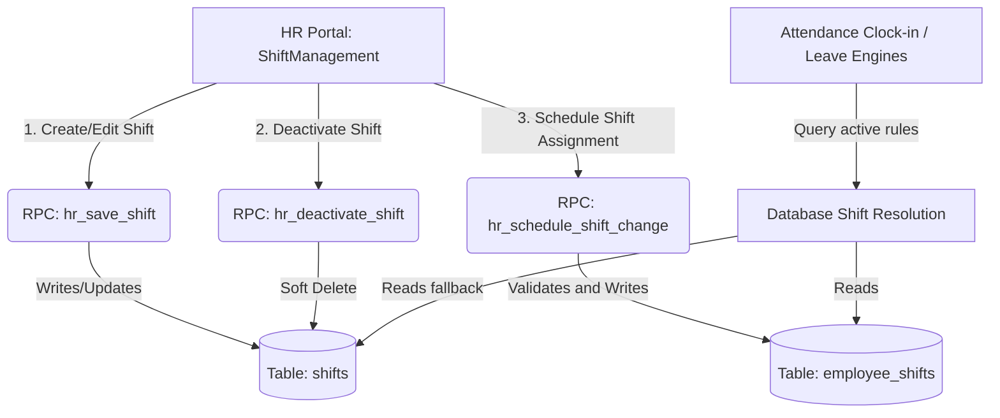

# Shift Rostering & Scheduling Engine

The **Shift Rostering & Scheduling Engine** is responsible for defining work timing templates (shifts), mapping employees to these shifts using effective-dated historical records, and resolving which shift applies to a user on any given calendar date. This system serves as the foundational timing matrix used by the attendance, late check-in, and leave management subsystems.

---

## 🏛️ Architecture Overview

The subsystem spans across the React frontend and transactional PostgreSQL database procedures:
1. **Rostering Admin Panel**:
   * [ShiftManagement.tsx](file:///c:/Users/Anuj/Desktop/hrms/HRMS-Talentmesh-Solutions/src/hr/ShiftManagement.tsx) — HR interface for creating/editing shifts, configuring company-wide default templates, scheduling individual shift assignments, and processing bulk reassignments.
2. **Server-Side Transactional RPCs**:
   * Located within database migrations (specifically [20260602120000_atomic_hr_workflows.sql](file:///c:/Users/Anuj/Desktop/hrms/HRMS-Talentmesh-Solutions/migrations/20260602120000_atomic_hr_workflows.sql)).
   * `public.hr_save_shift` — Creates or edits a shift template and transactionally updates default settings.
   * `public.hr_deactivate_shift` — Implements soft-delete validations to preserve historical data.
   * `public.hr_schedule_shift_change` — Enforces future-dated, gapless scheduling for employee assignments.

### Data Flow Diagram



---

## 🗄️ Database Entities & Constraints

The shift scheduling engine operates on two core tables in the InsForge database:

### 1. `shifts`
Stores shift timing templates defined per tenant:
* `id` (uuid, Primary Key)
* `tenant_id` (uuid, Foreign Key -> `tenants.id`)
* `name` (text, NOT NULL) — Display name of the shift (e.g., `"Day Shift"`, `"Night Shift"`).
* `start_time` (time without timezone) — Shift start boundary.
* `end_time` (time without timezone) — Shift end boundary.
* `working_days` (integer[]) — Array of integers `[0-6]` representing working days, where `0 = Sunday` and `6 = Saturday`.
* `half_day_cutoff_override` (time without timezone, Nullable) — Custom half-day cutoff timing for this specific shift.
* `punch_in_opens_minutes_before` (integer, Default: 60) — Buffer window in minutes indicating how early check-in is allowed prior to `start_time`.
* `late_mark_grace_override` (integer, Nullable) — Grace minutes override before late check-in triggers.
* `is_default` (boolean) — Toggles whether the shift is the fallback shift template for the entire organization.
* `is_active` (boolean, Default: true) — Controls visibility for deactivations (soft-delete flag).

### 2. `employee_shifts`
Maps employees to shift templates using gapless effective dating:
* `id` (uuid, Primary Key)
* `tenant_id` (uuid, Foreign Key -> `tenants.id`)
* `employee_id` (uuid, Foreign Key -> `employees.id`)
* `shift_id` (uuid, Foreign Key -> `shifts.id`)
* `effective_from` (date, NOT NULL) — Calendar date when the shift assignment starts.
* `effective_to` (date, Nullable) — Calendar date when the shift assignment ends (inclusive). If null, the shift applies indefinitely.

> [!WARNING]  
> A unique index `uq_employee_shifts_effective_from` exists on `(tenant_id, employee_id, effective_from)`. This constraint blocks assigning multiple shifts starting on the same day for an employee.

---

## ⚡ Server-Side Database RPC Mechanics

All mutations on shifts and assignments are gated through transactional PostgreSQL database functions to enforce data integrity:

### 1. `public.hr_save_shift(...)`
Handles the creation and updating of shift templates:
* **Authorization**: Invokes `assert_hr_for_tenant(p_tenant_id)` to verify the actor has administrative privileges.
* **Input Validation**:
  * Shift name must not be empty.
  * `p_working_days` must contain at least one day and integers must be between `0` (Sunday) and `6` (Saturday).
* **Concurrency Guard**: Executes a `FOR UPDATE` lock on the tenant's shifts to serialize default state swaps:
  ```sql
  PERFORM 1 FROM shifts WHERE tenant_id = p_tenant_id FOR UPDATE;
  ```
* **Transactional Default Update**: If `p_is_default` is set to `true`, the function sets `is_default = false` on all other default shifts under the tenant to ensure only one default shift exists at any given time.
* **Execution**: Inserts a new record (if `p_shift_id` is null) or updates the existing row in the `shifts` table, setting `is_active = true`.
* **Audit Trail**: Logs to `audit_logs` with action `'shift.saved'`.

### 2. `public.hr_deactivate_shift(...)`
Deactivates a shift template (Soft-delete pattern):
* **Historical Integrity Design**: Deactivating a shift does NOT execute a hard `DELETE` query. Since hard deletions cascade and delete historical rows in `employee_shifts` (`ON DELETE CASCADE`), this would break payroll and attendance reproducibility. Soft deletion updates `is_active = false` instead, keeping all relationships and historical metrics intact.
* **Default Guard**: If the target shift is set as the default, the RPC counts other active default shifts. If none exist, it blocks deactivation and throws an exception:
  `Cannot remove the only default shift. Set another shift as default first.`
* **Audit Trail**: Logs to `audit_logs` with action `'shift.deactivated'`.

### 3. `public.hr_schedule_shift_change(...)`
Schedules employee shift reassignments to take effect on a future date (gapless scheduling):
* **Future Enforcement**: Blocks retrospective shift modifications. The effective starting date must be in the future relative to the database date:
  ```sql
  IF v_effective_from <= CURRENT_DATE THEN
    RAISE EXCEPTION 'Shift changes must be effective in the future';
  END IF;
  ```
* **Gapless Scheduling Logic**:
  To assign a new shift starting on date $D$ (`v_effective_from`), the database schedules the previous shift to end on $D - 1$ (`v_effective_to`):
  1. Finds the current active shift assignment for the employee where `effective_from <= D - 1` and `(effective_to IS NULL OR effective_to >= D - 1)`.
  2. Updates that previous assignment's end date:
     ```sql
     UPDATE employee_shifts
     SET effective_to = v_effective_to
     WHERE tenant_id = p_tenant_id AND employee_id = p_employee_id
       AND effective_from <= v_effective_to AND (effective_to IS NULL OR effective_to >= v_effective_to);
     ```
  3. Deletes any pre-existing future assignments that started precisely on $D$ to avoid overlapping conflicts.
  4. Inserts the new shift assignment starting on $D$ with `effective_to` set to `NULL` (active indefinitely).
* **Audit Trail**: Logs to `audit_logs` with action `'shift.assignment'`.

---

## 🔄 Date-Based Shift Resolution Logic

When attendance, late check-in, or leave components query which shift applies to an employee on a calendar date $T$, the database resolves the template using a tiered fallback sequence:

```
                      [Resolve Shift for Employee on Date T]
                                         │
                                         ▼
            Check: Is there an assignment in employee_shifts for T?
                     (effective_from <= T AND (effective_to IS NULL OR effective_to >= T))
                                         │
                    ┌────────────────────┴────────────────────┐
                    ▼ YES                                     ▼ NO
        Return assigned shift timings.            Check: Is there a default shift
                                                  active for this tenant?
                                                              │
                                        ┌─────────────────────┴─────────────────────┐
                                        ▼ YES                                       ▼ NO
                            Return default shift timings.                 Return company fallback:
                                                                          (punch_in_start or '09:00')
```

### SQL Resolution Queries

#### Tier 1: Explicit Shift Assignment
```sql
SELECT s.working_days, s.start_time, s.end_time, s.half_day_cutoff_override, s.late_mark_grace_override
FROM employee_shifts es
JOIN shifts s ON s.id = es.shift_id
WHERE es.tenant_id = :tenant_id
  AND es.employee_id = :employee_id
  AND es.effective_from <= :target_date
  AND (es.effective_to IS NULL OR es.effective_to >= :target_date)
ORDER BY es.effective_from DESC
LIMIT 1;
```

#### Tier 2: Tenant Default Fallback
If Tier 1 returns no rows, the system resolves the tenant's default active shift template:
```sql
SELECT working_days, start_time, end_time, half_day_cutoff_override, late_mark_grace_override
FROM shifts
WHERE tenant_id = :tenant_id
  AND is_default = true
  AND is_active IS NOT FALSE
LIMIT 1;
```

#### Tier 3: Core Settings Fallback
If Tier 2 is missing, the system defaults to the tenant's global fallback setting `punch_in_start` (or `'09:00'` if unset) and assumes standard Mon-Sat working days:
```sql
COALESCE(tenant.punch_in_start, '09:00')::time;
ARRAY[1,2,3,4,5,6]; -- Monday to Saturday
```

---

## ⚡ Integration Integration Points

The resolved shift rules are cross-referenced across three critical integration points in the HRMS application:

### 1. Attendance & Lateness Verification
During clock-in corrections, the system resolves the employee's active shift start boundary for that date. Lateness (`is_late = true`) is computed by checking if the punch-in timestamp exceeds `start_time` plus the grace period:
* Grace period resolves to:
  1. `late_mark_grace_override` from the resolved shift (if configured).
  2. `late_mark_grace_minutes` from global tenant settings (fallback).
  3. `0` minutes (default fallback).

### 2. Leave Application Notice Checks
When an employee submits a leave request, the database resolves the employee's active shift to retrieve the `working_days` array. The notice days validation only applies to shift-specified working days, excluding weekends or company holidays.

### 3. Leave Approval Balance Deductions
When HR approves a leave request spanning a date range, the database loops day-by-day and queries the employee's active shift working days array.
* If a date in the range matches a shift working day AND is not in the `holidays` table, the leave balance is deducted.
* If a date is a shift non-working day or holiday, no deduction is applied, preventing employees from losing leave balance for weekends or public holidays.

---

## 📱 Portal Frontend Implementation

The frontend interface ([ShiftManagement.tsx](file:///c:/Users/Anuj/Desktop/hrms/HRMS-Talentmesh-Solutions/src/hr/ShiftManagement.tsx)) coordinates shift administrative commands:

### 1. Future Scheduling Rule
All shift change forms initialize the effective starting date to tomorrow (`tomorrowString()`) by default. This enforces the database future-dating rule, ensuring that modifications do not retroactive alter today's attendance calculation logs.

### 2. Night Shift Boundary Check
The component parses end time and start time. If `end_time < start_time`, the system recognizes a **Night Shift** configuration and displays a warning to HR:
* *`Night Shift Detected: End time is before start time. Attendance systems will automatically cross the midnight boundary.`*
* Clock-in and clock-out routines handle attendance records crossing the midnight threshold.

### 3. Bulk Assignment Error Isolation
When bulk-assigning multiple employees to a shift, the frontend utilizes an isolated batch loop to run assignments independently:
```typescript
const succeeded: string[] = [];
const failed: { name: string; reason: string }[] = [];

for (const row of selectedRows) {
  try {
    await scheduleShiftChange(row, bulkShiftId);
    succeeded.push(row.employee.full_name);
  } catch (err) {
    failed.push({
      name: row.employee.full_name,
      reason: err instanceof Error ? err.message : "Unknown error",
    });
  }
}
```
* **Resilience Benefit**: Individual assignment failures (e.g., due to duplicate starting dates or lock conflicts) do not abort the entire batch. Succeeded assignments are applied, and HR is presented with a summary listing specific failed employees and their error reasons.
* **Audit Logging**: Logs the bulk mutation event, including arrays of succeeded and failed employee names.
