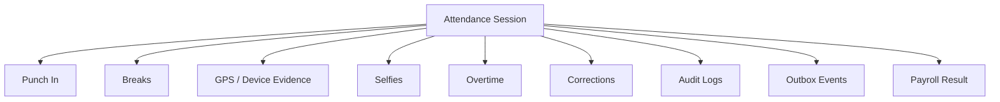
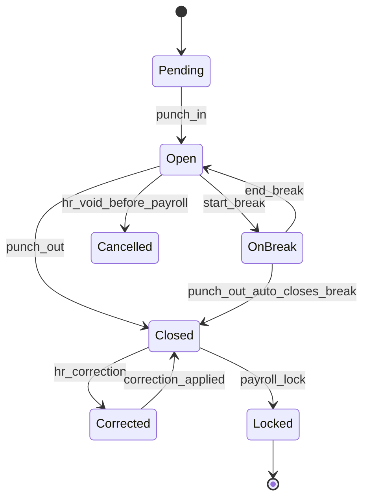
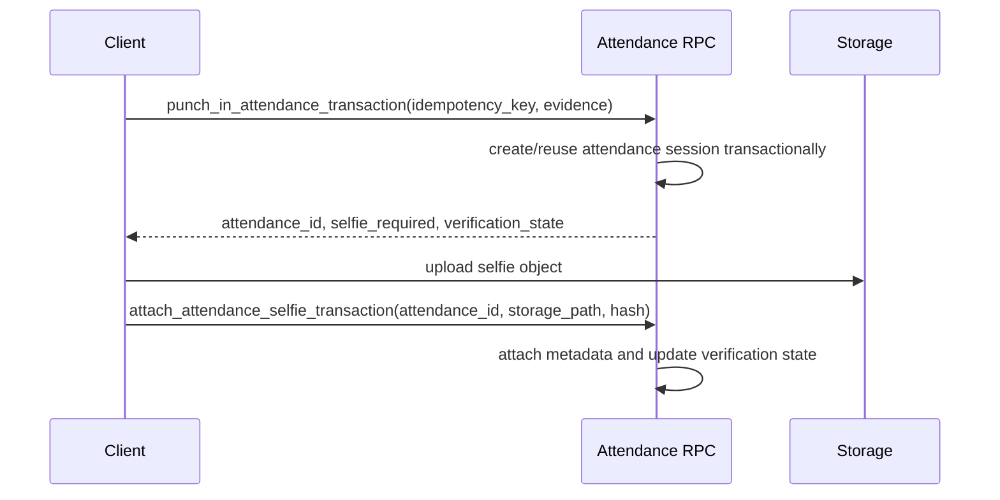
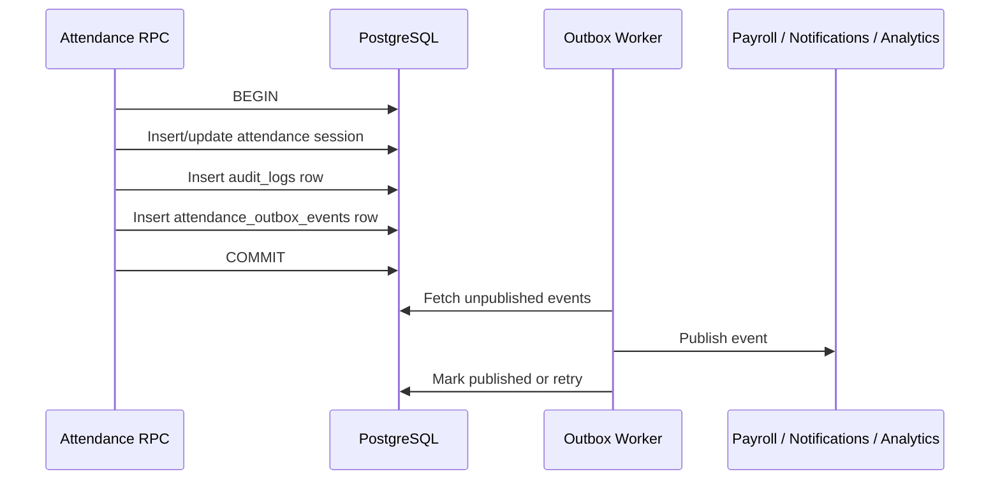

# Attendance and Shift Management Architecture Specification v1.0

**Status**: Living architecture specification  
**Baseline**: Extracted from `attendance_shift_management_audit_and_implementation_plan.md` v1.0  
**Branch**: `updateSuggestion`  
**Backend**: `https://rq3qmu8y.ap-southeast.insforge.app` (parent `rq3qmu8y` — the former `-jx7` branch preview is dead and retired)

> **Still current.** The transactional rules here (idempotency, `FOR UPDATE` locking, storage boundary,
> snapshots, outbox, RLS §12.1) are assumed and extended by
> [`attendance_shift_v2_decision_doc.md`](attendance_shift_v2_decision_doc.md), which is the
> **implementation authority**. Where the two differ on the punch → attendance path, v2 wins:
> §2–§4 here describe a single mutable session row, which v2 decision **D2** replaces with an
> immutable event log plus a derived day row.

---

## 1. Architecture Principles

| Principle | Rule |
|---|---|
| Attendance is a session | Punches, breaks, selfies, evidence, overtime, corrections, audit, and events belong to one attendance session |
| Backend is client-agnostic | React Web and future React Native clients use the same RPC contracts |
| SQL owns business state | Attendance state changes happen through database RPCs |
| Storage is separate | Selfie upload is outside SQL transaction and attached through follow-up RPC |
| Evidence is not proof | Backend validates and audits evidence but does not claim absolute GPS truth |
| History is reproducible | Snapshot only business facts required to reproduce decisions |
| Mutations are traceable | Every RPC uses `correlation_id`, audit logs, and optional outbox events |
| Payroll facts are immutable | Avoid physical deletes for payroll-relevant data |

---

## 2. Attendance Session Model



---

## 3. Attendance State Machine



Allowed state changes must be enforced in RPCs. Invalid transitions such as `Closed -> OnBreak`, `Locked -> PunchOut`, and duplicate `Open -> Open` punch-ins must be rejected by the database.

---

## 4. RPC Contracts

### 4.1 `punch_in_attendance_transaction`

Required behavior:

1. Assert employee belongs to tenant.
2. Assert employee is active.
3. Accept or generate `correlation_id`.
4. Accept idempotency key.
5. Return prior result for same idempotency key.
6. Resolve tenant business date in database.
7. Resolve active shift.
8. Validate working day and punch-in window.
9. Enforce payroll lock.
10. Validate location/selfie evidence schema.
11. Store shift, policy, and evidence snapshots.
12. Insert audit log.
13. Optionally insert outbox event.

### 4.2 `attach_attendance_selfie_transaction`

Required behavior:

1. Assert caller owns the attendance session or is HR.
2. Attach storage path and optional object hash.
3. Mark verification state as attached/failed/recoverable.
4. Be idempotent for retry after upload success.
5. Write audit log.

### 4.3 `punch_out_attendance`

Required behavior:

1. Lock attendance row with `FOR UPDATE`.
2. Reject if session is closed, cancelled, or locked.
3. Enforce task punch-out gate.
4. Enforce payroll lock.
5. Auto-close active break if present.
6. Use stored shift/policy snapshot for work-hour and overtime calculation.
7. Store punch-out evidence snapshot.
8. Write audit log and optional outbox event.

### 4.4 `submit_attendance_correction_transaction`

Required behavior:

1. Assert correction belongs to caller.
2. Enforce regularization window.
3. Enforce payroll lock.
4. Prevent duplicate pending correction drift.
5. Store requested old/new values and reason.
6. Write audit log and optional outbox event.

---

## 5. Storage Boundary

Selfie media upload must not be treated as part of the SQL transaction.



Do not perform storage upload while holding database locks.

---

## 6. Snapshot Strategy

Snapshot only fields required to reproduce historical business decisions.

Do not copy full rows or UI metadata into attendance snapshots.

Required version fields:

| Snapshot | Version Field |
|---|---|
| Shift snapshot | `shift_snapshot_version` or top-level `schema_version` |
| Policy snapshot | `policy_snapshot_version` |
| Evidence snapshot | `evidence_schema_version` |
| Verification snapshot | `verification_schema_version` |

Example:

```json
{
  "schema_version": 1,
  "shift": {
    "shift_id": "uuid",
    "start_time": "09:00",
    "end_time": "18:00",
    "working_days": [1, 2, 3, 4, 5],
    "grace_minutes": 10,
    "expected_hours": 8
  },
  "policy": {
    "policy_snapshot_version": 1,
    "late_mark_enabled": true,
    "break_deduction_mode": "fixed",
    "overtime_enabled": true
  }
}
```

---

## 7. Evidence Schema

Evidence is client-collected and server-evaluated. It is not absolute proof.

```json
{
  "schema_version": 1,
  "client_type": "web",
  "location": {
    "lat": 0,
    "lng": 0,
    "accuracy_meters": 50,
    "captured_at": "2026-07-12T10:00:00Z",
    "permission_state": "granted"
  },
  "device": {
    "platform": "web",
    "user_agent_hash": "optional"
  },
  "signals": {
    "gps_confidence": "high",
    "spoof_risk": "unknown",
    "device_attestation": null
  }
}
```

Future React Native clients may send Play Integrity, App Attest, DeviceCheck, root/jailbreak, mock-location, or foreground/background signals. These are trust signals, not proof of location.

---

## 8. Event Model and Outbox

Use the Transactional Outbox Pattern for reliable downstream events.



Minimum event fields:

| Field | Purpose |
|---|---|
| `id` | Event id |
| `tenant_id` | Tenant routing |
| `aggregate_type` | `attendance_session` |
| `aggregate_id` | Attendance id |
| `event_name` | Example: `attendance.punched_out` |
| `event_version` | Payload schema version |
| `payload` | Minimal business event |
| `correlation_id` | Traceability |
| `idempotency_key` | De-duplication |
| `published_at` | Delivery tracking |

---

## 9. Concurrency Rules

Idempotency handles retries. Row-level locking handles concurrent state changes.

Use `SELECT ... FOR UPDATE` in every RPC that mutates an existing attendance session.

Keep transactions short. Do not perform external network calls, storage uploads, notification delivery, or long-running worker logic while holding row locks.

---

## 10. Timezone Rules

| Concern | Rule |
|---|---|
| Storage | Store instants as UTC `timestamptz` |
| Business date | Compute attendance `date` from tenant timezone in DB |
| Display | Convert timestamps for UI display |
| DST | Use IANA timezone names, not fixed offsets |
| Cross-midnight shift | Session can span dates; business date should follow punch-in shift date |
| Historical timezone changes | Store tenant timezone and resolved business date on attendance row |

---

## 11. Soft-Delete and Immutability

Do not physically delete payroll-relevant records after they have been used in business workflows.

| Record | Preferred Action |
|---|---|
| Attendance session | `cancelled`, `voided`, or `superseded` with reason |
| Break record | `cancelled` or `superseded` |
| Correction request | `withdrawn`, `rejected`, `approved`, or `superseded` |
| Overtime record | `cancelled`, `approved`, `rejected`, or `superseded` |
| Selfie metadata | Retain metadata; purge object only through documented retention policy |

---

## 12. Security Rules

| Rule | Required Behavior |
|---|---|
| Employee self mutation | Employee can only mutate their own active attendance session through RPCs |
| HR tenant scope | HR can only manage attendance for their tenant |
| `SECURITY DEFINER` | Use only after tenant/role assertion |
| Search path | Every privileged function must set `search_path TO public` |
| Direct writes | Revoke only after replacement RPCs pass QA |
| Audit | Privileged RPCs write actor, role, target, old/new state, and correlation id |

### 12.1 Row-Level Security (RLS) Policy Design Principles

To ensure long-term maintainability, role scalability, and to prevent access regressions, the following principles govern RLS policy design:

1. **Invariant Constraints (Tenant Separation)**:
   - Tenant isolation and tenant active status checks must be defined as `RESTRICTIVE FOR ALL` policies. They act as absolute, non-bypassable gates that are implicitly `AND`ed with all other permissive operations.
2. **Role-Based Permissions**:
   - Role-specific access rules (such as `is_hr()`, `is_manager()`, `is_payroll()`, `is_auditor()`) must use operation-specific policies (`FOR SELECT`, `FOR INSERT`, `FOR UPDATE`, `FOR DELETE`) rather than `FOR ALL` policies. This ensures role evolution does not lead to broad write privilege regressions.
3. **Ownership-Based Permissions (Self Access)**:
   - Ownership-based policies (e.g. employee accessing their own records) should remain unified as a single `FOR ALL` policy (such as `attendance_corrections_self`) if and only if the exact same check applies to all operations. This avoids policy count explosion. If different operations require different checks, they should be split.
4. **Consistent Policy Naming Convention**:
   - Every RLS policy must follow the naming format: `<table>_<operation>_<role>`.
   - Examples:
     - `attendance_select_hr`
     - `attendance_insert_hr`
     - `attendance_corrections_self` (implicitly `FOR ALL`)
5. **Modification Governance**:
   - No RLS policy changes should alter existing authorization semantics without an approved ADR.

---

## 13. ADR Policy

Future architecture changes should be made through ADRs.

ADR template:

```md
# ADR-NNN: Title

## Status
Proposed | Accepted | Superseded

## Context
What changed or what problem appeared?

## Decision
What architecture decision are we making?

## Consequences
Trade-offs, risks, migration impact, operational impact.
```

