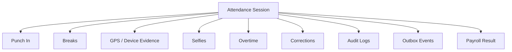
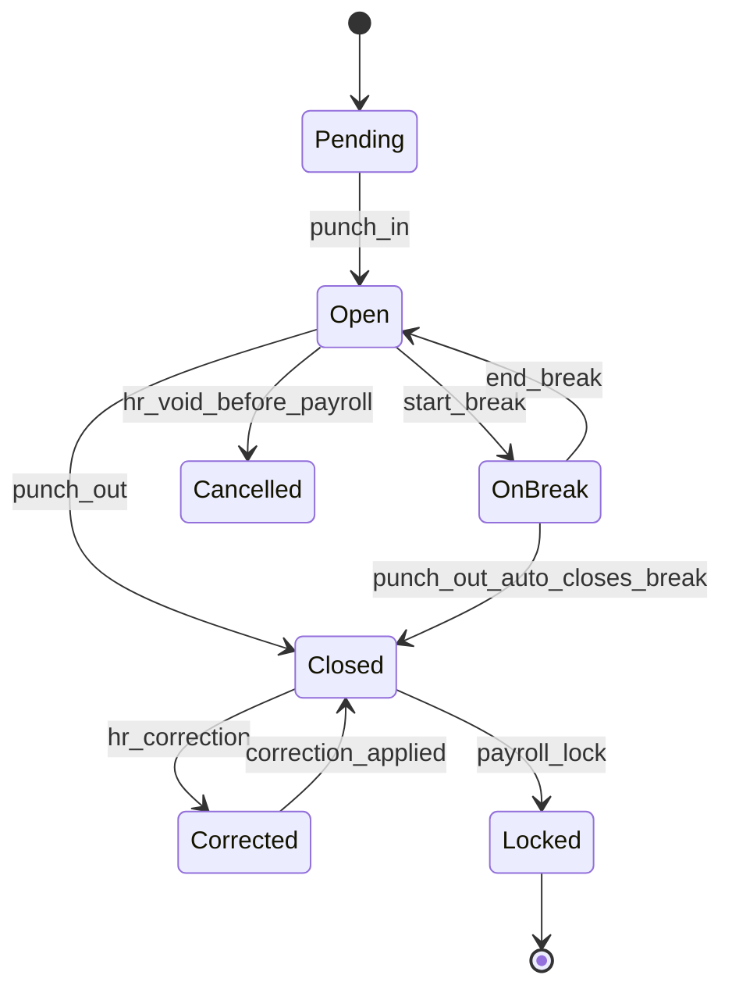
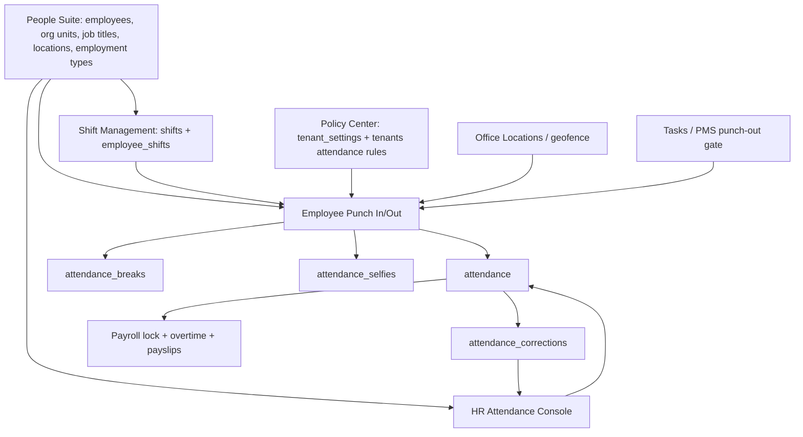
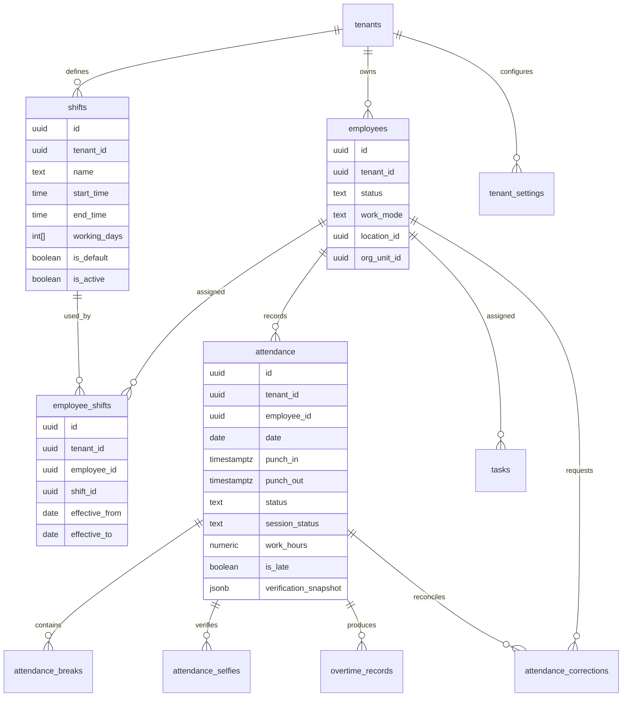
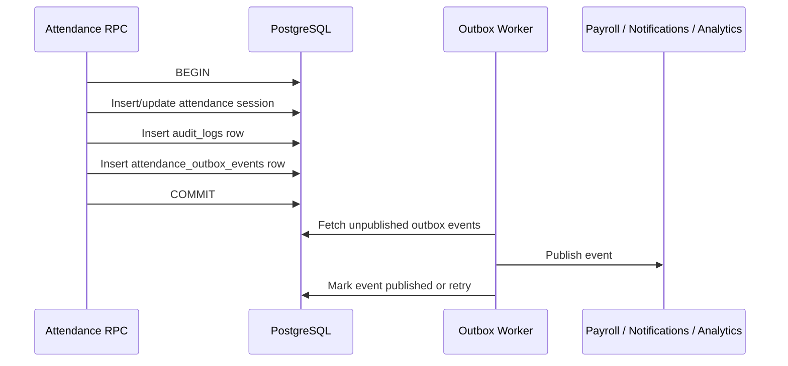
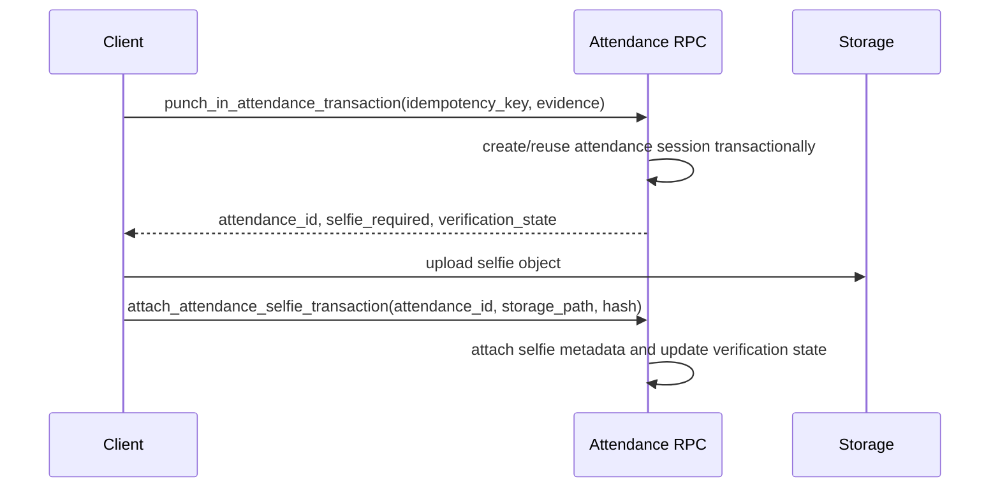
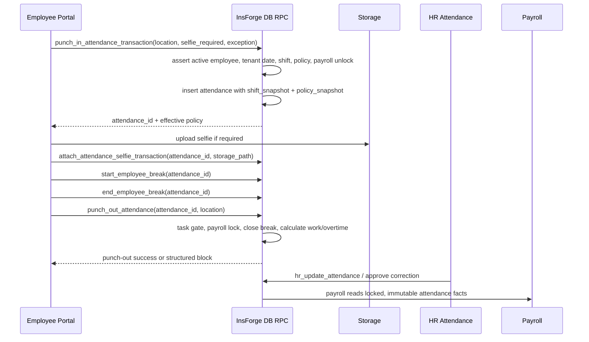

# Attendance and Shift Management Audit and Implementation Plan v1.0

**Branch**: `updateSuggestion`  
**Backend preview**: `https://rq3qmu8y-jx7.ap-southeast.insforge.app`  
**Document scope**: Attendance, Punch In/Out, Shift Management, Office Location geofencing, Attendance Corrections, Break Tracking, Overtime, Payroll lock, Task punch-out gate, and People Suite connections.  
**Documentation source rule**: This document belongs to `new update doc`. Do not use the old `doc` folder as implementation authority.
**Status**: Frozen architecture baseline v1.0. Future architecture changes should be documented through explicit ADRs instead of endlessly expanding this baseline.

---

## 1. Executive Verdict

The Attendance and Shift Management module is **usable but not yet production-hard enough for a best-practice HRMS rollout**.

The shift-management side is stronger than the punch/attendance side:

| Area | Current State | Verdict |
|---|---|---|
| Shift save/deactivate/schedule | Uses HR RPCs such as `hr_save_shift`, `hr_deactivate_shift`, and `hr_schedule_shift_change` | Strong foundation |
| Shift history | Uses soft deactivation and future-effective assignments | Good |
| Punch-out | Uses `punch_out_attendance` RPC with payroll lock and task gate checks | Good foundation |
| Punch-in | Still inserts directly into `attendance` from React | Needs hardening |
| Attendance date/time | Browser-local dates are used in employee screens, while some DB RPCs use tenant timezone | Needs standardization |
| Attendance snapshotting | Attendance rows do not clearly snapshot shift/policy used at punch-in | Needs hardening |
| Geofence | Client computes location status and DB stores it | Needs stronger server-side validation rules and audit clarity |
| Corrections/breaks/selfies | Uses RPCs for some flows, but RLS/direct API verification is required | Needs QA and possible restrictive policies |
| Reporting/performance | HR summary calls per-employee late-mark edge function | Needs scale pass |

**Recommendation**: Complete the safe release sequence in this document before calling Attendance and Shift Management production-ready.

### 1.1 Architecture Refinement Verdict

This plan intentionally follows a conservative enterprise pattern: **transactional database state, client-agnostic APIs, immutable evidence snapshots, and asynchronous/recoverable media attachment**.

The backend should not assume that a web browser or mobile app can prove physical truth. Instead, it should enforce policy, validate request structure, reject impossible values, and store tamper-evident evidence for audit and HR review.

The final design should work for:

| Client | Expected Backend Contract |
|---|---|
| React Web | Sends browser GPS evidence, camera selfie, client metadata, and idempotency key |
| React Native future app | Sends stronger native GPS evidence, permission metadata, foreground/background state, and anti-spoofing signals where available |
| Trusted future client | Uses the same RPCs and evidence contract without backend redesign |

This avoids overfitting attendance logic to the current React Web implementation.

### 1.2 Attendance Session Architecture

Treat attendance as an **Attendance Session**, not just a database row.

Everything created during a workday belongs to one session:



This keeps future features clean: compliance exceptions, manager approvals, device attestation, payroll locks, and analytics all attach to the session instead of becoming disconnected rows.

### 1.3 Attendance State Machine

Attendance mutations should follow a state machine. Transitions should happen only through RPCs.



Invalid transitions must be blocked by the database:

| Invalid Transition | Reason |
|---|---|
| `Closed -> OnBreak` | Cannot start a break after punch-out |
| `Locked -> PunchOut` | Payroll-locked sessions are immutable |
| `Cancelled -> Open` | Cancelled sessions should not be resurrected |
| `Open -> Open` with new punch-in | Duplicate open session |
| `OnBreak -> OnBreak` | Employee already has active break |

Recommended session states:

| State | Meaning |
|---|---|
| `pending_verification` | SQL attendance exists but required selfie/evidence attachment is still recoverable |
| `open` | Employee is punched in and not on break |
| `on_break` | Employee is currently on a break |
| `closed` | Employee punched out |
| `corrected` | HR approved a correction after closure |
| `locked` | Payroll lock prevents mutation |
| `cancelled` | Session voided before payroll with audit reason |

Existing `session_status` can evolve toward this model gradually. Do not break current screens in one step.

---

## 2. Connected Module Map

Attendance is not an isolated module. It is connected to the new People Suite, Policy Center, Payroll, Tasks, and Office Locations.



---

## 3. Current Architecture Observed

### 3.1 Employee Punch Flow

Primary frontend: `src/employee/PunchInOut.tsx`

Current behavior observed from source:

| Step | Current Implementation |
|---|---|
| Load active attendance | Queries `attendance` where `session_status = open` |
| Load closed record for today | Queries `attendance` by `date = TODAY` |
| Load policy | Queries `tenant_settings` |
| Load shift | Uses `useEmployeeShift()` from `src/hooks/useEmployeeShift.ts` |
| Punch-in | Direct `db.from("attendance").insert(...)` from frontend |
| Punch-out | Calls `db.rpc("punch_out_attendance", ...)` |
| Break start/end | Calls `start_employee_break` and `end_employee_break` RPCs |
| Selfie upload | Uploads to storage, then inserts `attendance_selfies` |
| Attendance correction request | Direct upsert into `attendance_corrections` |

### 3.2 Shift Management

Primary frontend: `src/hr/ShiftManagement.tsx`

Current behavior observed from source:

| Flow | Current Implementation |
|---|---|
| Create/update shift | `db.rpc("hr_save_shift", ...)` |
| Deactivate shift | `db.rpc("hr_deactivate_shift", ...)` |
| Single assignment | `db.rpc("hr_schedule_shift_change", ...)` |
| Bulk assignment | Loops over `hr_schedule_shift_change` with per-employee error isolation |
| Effective date | Tomorrow by default to avoid changing today's rules |
| Active employee list | Reads active employees from base `employees` table |

### 3.3 HR Attendance Console

Primary frontend: `src/hr/Attendance.tsx`

Current behavior observed from source:

| Flow | Current Implementation |
|---|---|
| Daily rows | Reads `attendance`, `shifts`, `employee_shifts`, `attendance_breaks`, `attendance_selfies` |
| HR edit attendance | Calls `hr_update_attendance` RPC |
| Payroll lock UI guard | Blocks edits when `dailyDate <= payroll_lock_date` |
| Correction approve/reject | Calls `hr_approve_attendance_correction` and `hr_reject_attendance_correction` |
| Summary | Client computes counts from attendance rows and invokes `calculate-late-marks` per employee |
| Export | Browser CSV export |

---

## 4. Core Data Model



---

## 5. Findings

### P0-A1: Punch-in is not transactional or idempotent

**Evidence**: `src/employee/PunchInOut.tsx` uses direct `db.from("attendance").insert(...)` for punch-in, while punch-out uses `punch_out_attendance`.

**Risk**:

| Risk | Example |
|---|---|
| Partial write | Attendance row is created but selfie insert/upload fails |
| Drift | Client can compute late/half-day differently than DB |
| Direct API bypass | A user may attempt direct API insert unless RLS and constraints are perfect |
| Race condition | Double-click or retry may create duplicate/open-session conflicts |
| Retry ambiguity | Network timeout after successful insert can make the client retry and create confusion |

**Required fix**: Add `punch_in_attendance_transaction` RPC and move all punch-in DB writes into it. The RPC must be **idempotent**, not only duplicate-protected.

Recommended idempotency behavior:

| Input | Behavior |
|---|---|
| Same employee, same tenant, same idempotency key | Return the original attendance session/result |
| Same employee, same tenant, different key, already open session | Return a structured `ALREADY_PUNCHED_IN` response or reject safely |
| Network retry after success | Returns the original result without creating another row |
| Double tap | One attendance session only |

Implementation options:

| Option | Pros | Cons | Recommendation |
|---|---|---|---|
| `attendance.idempotency_key` unique per tenant/employee/date | Simple and queryable | Adds nullable column | Recommended |
| Separate `idempotency_keys` table | Reusable across modules | More moving parts | Good future platform pattern |
| Rely only on unique open session constraints | Simple | Does not explain retry outcome cleanly | Not sufficient |

---

### P0-A2: Business date must be tenant-timezone authoritative

**Evidence**: `PunchInOut.tsx` and `useEmployeeShift.ts` use `formatLocalDate(new Date())`, which derives date from the browser/device timezone. Some DB functions, such as `punch_out_attendance`, already derive date from `tenant.timezone`.

**Risk**:

| Scenario | Failure |
|---|---|
| Employee travels to another timezone | Attendance date may be wrong for tenant payroll |
| Remote employee near midnight | Punch date may differ between browser and tenant |
| Night shift across midnight | Shift assignment date and attendance date can drift |
| HR correction | HR uses tenant timezone, employee uses browser timezone |

**Required fix**: Standardize on tenant timezone for attendance business dates. The DB should compute the authoritative attendance date inside punch RPCs.

---

### P0-A3: Attendance row does not clearly snapshot shift, policy, and evidence context

**Evidence**: Attendance rows store `verification_snapshot`, but there is no clearly observed immutable `shift_id`, `shift_snapshot`, or `policy_snapshot` column in the current code path. Punch-out receives `p_expected_shift_hours` from the client.

**Risk**:

| Scenario | Failure |
|---|---|
| HR edits shift after punch-in | Past attendance/overtime may be interpreted with new shift |
| Policy changes during the day | Punch-out may use different policy from punch-in |
| Payroll audit | Cannot prove which shift/grace/geofence settings were active |
| Overtime | Client-supplied expected hours can be stale or manipulated |

**Required fix**: Snapshot the resolved shift, policy, and evidence context on punch-in. Punch-out should use the stored snapshot instead of trusting client-supplied policy math.

Minimum immutable snapshot fields:

| Snapshot Area | Examples |
|---|---|
| Shift | `shift_id`, shift name, start/end time, working days, half-day cutoff, punch-in open window |
| Grace and late marks | late mark enabled, grace minutes, late threshold policy |
| Break policy | break tracking enabled, deduction mode, lunch minutes, short break limit |
| Overtime | overtime enabled, expected hours, overtime rate/multiplier |
| Geofence policy | geofence enabled, mode, radius, allowed office source |
| Office location | matched office id/name/lat/lng/radius if applicable |
| Employee work context | work mode, `location_id`, org unit, remote/hybrid status |
| Remote exception | exception id, approved by, valid dates, approval reason |
| Client evidence | client type, GPS accuracy, confidence, permission state, spoof-risk signals if available |

Historical attendance must remain reproducible years later even if shifts, office locations, employee work mode, or Policy Center settings change.

Snapshot design rule:

> Snapshot only the fields required to reproduce historical business decisions.

Do not blindly copy entire source rows into attendance snapshots. Avoid UI-only or operational metadata such as `color`, `icon`, `display_order`, `description`, `created_at`, and `updated_at` unless it directly affects attendance/payroll decisions.

Recommended snapshot format:

```json
{
  "schema_version": 1,
  "shift": {
    "shift_id": "uuid",
    "start_time": "09:00",
    "end_time": "18:00",
    "working_days": [1, 2, 3, 4, 5],
    "grace_minutes": 10,
    "expected_hours": 8
  },
  "policy": {
    "policy_snapshot_version": 1,
    "late_mark_enabled": true,
    "break_deduction_mode": "fixed",
    "overtime_enabled": true
  }
}
```

Versioning rule:

| Snapshot | Required Version Field |
|---|---|
| Shift snapshot | `shift_snapshot_version` or top-level `schema_version` |
| Policy snapshot | `policy_snapshot_version` |
| Evidence snapshot | `evidence_schema_version` |
| Verification snapshot | `verification_schema_version` |

This allows future migrations without rewriting or reinterpreting old attendance records incorrectly.

---

### P0-A4: Direct API/RLS hardening must be verified for attendance sub-tables

**Evidence**: Existing repo security notes mention previous RLS concerns around `attendance_breaks`, `attendance_selfies`, and `attendance_corrections`. Current employee flows still insert/update these tables directly or through RPCs.

**Risk**:

| Table | Risk |
|---|---|
| `attendance` | Employee could insert/update rows outside intended flow if policies are broad |
| `attendance_corrections` | Employee could update/delete another employee's request if RLS is weak |
| `attendance_breaks` | Employee could tamper with break records |
| `attendance_selfies` | Employee could tamper with selfie metadata |

**Required fix**: Run live RLS/API tests on preview and add restrictive self-only policies where needed. Prefer RPC-only writes for punch, breaks, corrections, and selfie metadata.

---

### P1-A5: Geofence evidence is client-collected and server-enforced

**Evidence**: Frontend computes GPS confidence, distance/geofence status, and sends location status to the DB. Policy Center validates geofence settings, but punch-in is still client-side DB insert.

**Risk**:

| Scenario | Failure |
|---|---|
| User tampers with request payload | Location status can be forged |
| Missing office location | Strict geofence can block valid employees or allow fallback to legacy lat/lng |
| Multi-location tenant | Current policy path may not fully align employee `location_id` with nearest office location |

**Required fix**: The DB RPC cannot independently prove physical GPS truth. It should not be described as "verifying GPS location" in an absolute sense.

The backend can and should:

| Backend Responsibility | Details |
|---|---|
| Validate required fields | Latitude/longitude/accuracy required when policy requires location |
| Validate structure | Numeric ranges, enum values, timestamp sanity, client type, evidence schema |
| Reject impossible values | Latitude outside `-90..90`, longitude outside `-180..180`, negative accuracy, stale evidence |
| Enforce policy | Strict mode block, remote exception checks, work mode rules |
| Store immutable evidence | Raw evidence snapshot and server evaluation result |
| Maintain audit trail | Who punched, when, client evidence, server decision, policy snapshot |

The backend cannot:

| Non-Goal | Reason |
|---|---|
| Prove the employee was physically at the location | GPS evidence can be spoofed, especially on compromised devices |
| Guarantee browser GPS integrity | Browser APIs do not provide trusted device attestation |
| Eliminate all spoofing | Even mobile-native apps reduce risk, they do not make spoofing impossible |

Future React Native clients may send additional trust signals:

| Platform | Optional Signal |
|---|---|
| Android | Play Integrity API result |
| iOS | App Attest or DeviceCheck result |
| Both | Root/jailbreak risk indicator, mock-location flag where available, foreground/background state |

These are additional trust signals, not proof of location. The server should store them in versioned evidence snapshots and incorporate them into risk scoring or HR review workflows.

---

### P1-A6: Break tracking should be fully policy-aware at punch-out

**Evidence**: Break start/end are RPC-backed and `punch_out_attendance` reads deduction settings, but punch-out still receives `p_lunch_minutes` and expected hours from the client.

**Risk**:

| Scenario | Failure |
|---|---|
| Policy changes after punch-in | Deductions may use new settings |
| Active break during punch-out | Needs guaranteed auto-close and audit trail |
| Duplicate break events | Must be blocked at DB level |

**Required fix**: Punch-out should close any active break transactionally, use snapshot policy where possible, and log break auto-close details.

---

### P1-A7: Correction request flow is direct client upsert

**Evidence**: `PunchInOut.tsx` upserts `attendance_corrections` directly.

**Risk**:

| Scenario | Failure |
|---|---|
| Payroll locked date | Client may block, but DB must enforce |
| Duplicate pending request | Needs DB unique and RPC behavior |
| Employee edits approved/rejected request | Must be prevented at DB level |

**Required fix**: Add `submit_attendance_correction_transaction` RPC with payroll lock, window, duplicate, and status checks.

---

### P1-A8: Summary and late mark calculations may not scale

**Evidence**: `src/hr/Attendance.tsx` invokes `calculate-late-marks` for each employee in summary view.

**Risk**:

| Scale | Failure |
|---|---|
| 1k employees | 1k edge function calls for one month summary |
| Slow network | HR summary becomes unstable |
| Rate limits | Function invocation bottlenecks |

**Required fix**: Add a monthly attendance summary RPC or materialized view that calculates late marks, present/absent/leave counts, overtime, and exceptions in one query.

Enterprise scale targets:

| Tenant Size | Recommended Pattern |
|---|---|
| 1k employees | Indexed aggregate RPC is sufficient |
| 10k employees | Aggregate RPC plus summary indexes and pagination |
| 50k employees | Monthly summary table or materialized view, possible partitioning by `tenant_id` and month |

Recommended indexes to verify before scale rollout:

| Table | Index Purpose |
|---|---|
| `attendance(tenant_id, date, employee_id)` | Daily and monthly attendance queries |
| `attendance(tenant_id, employee_id, date)` | Employee calendar and correction lookups |
| `attendance(tenant_id, session_status, employee_id)` | Open session lookup |
| `employee_shifts(tenant_id, employee_id, effective_from, effective_to)` | Shift resolution |
| `attendance_corrections(tenant_id, status, attendance_date)` | HR correction queue |
| `attendance_breaks(tenant_id, attendance_id, ended_at)` | Active break and audit views |
| `overtime_records(tenant_id, date, employee_id)` | Payroll/overtime summaries |

---

### P2-A9: Shift assignment is future-safe, but needs live constraint verification

**Evidence**: `hr_schedule_shift_change` updates current assignment `effective_to`, deletes a same-date future assignment, then inserts a new one. The archive references a unique index on `(tenant_id, employee_id, effective_from)`.

**Risk**:

| Scenario | Failure |
|---|---|
| Direct DB/API write | Overlapping assignments if exclusion/unique constraints are missing |
| Bulk schedule partially succeeds | UI handles this, but operations are not one all-or-nothing batch |
| Default shift inactive | UI and RPC guard exist, but live DB should be verified |

**Required fix**: Verify live constraints and add `validate_shift_integrity()` audit query. Keep per-employee bulk behavior unless HR explicitly wants all-or-nothing bulk assignment.

---

### P2-A10: HR attendance edits need snapshot-aware recalculation

**Evidence**: `hr_update_attendance` recomputes work hours from provided times and current tenant/break settings.

**Risk**:

| Scenario | Failure |
|---|---|
| Historical correction after policy change | Work hours may use current policy instead of historical policy |
| Night shift corrections | Date crossing logic exists, but max duration and shift policy should be verified |
| Approved overtime exists | Pending overtime is deleted, but approved overtime is preserved |

**Required fix**: HR edit RPC should use attendance snapshot values for historical rows and require explicit HR confirmation if overriding payroll-relevant approved overtime.

---

## 6. Target Best-Practice HRMS Behavior

A production-grade HRMS should behave like this:

| Real Life Scenario | Expected System Behavior |
|---|---|
| Employee punches in from office | DB creates one open attendance session with tenant date, shift snapshot, policy snapshot, GPS snapshot, and audit log |
| Employee is remote with approved exception | DB stores exception id and marks attendance as `remote_approved` |
| Employee tries strict geofence outside office | Frontend blocks, DB also rejects missing/invalid geofence evidence |
| Employee forgets punch-out | Scheduled job auto-closes or marks missing punch-out according to policy |
| Employee has pending EOD tasks | Punch-out RPC blocks with structured reason |
| Payroll period is locked | Punch, correction, HR edit, break updates, overtime changes are rejected by DB |
| HR changes shift | Change applies in future and does not mutate today's/past attendance interpretation |
| HR edits old attendance | Audit log captures who changed it, old/new values, reason, and payroll lock guard |
| Employee asks correction | Correction request uses RPC, respects regularization window, and cannot alter another employee's record |
| 1k employees | HR summary loads from one aggregated RPC, not 1k edge calls |

### 6.1 Event and Audit Design

Audit logs answer "who changed what and why." Domain events answer "what business event happened and what downstream systems should react."

Best-practice design should keep audit logs and domain events separate or at least clearly typed.

| Event | Producer | Future Consumers |
|---|---|---|
| `attendance.punched_in` | Punch-in RPC | Notifications, analytics, payroll pre-checks |
| `attendance.break_started` | Break RPC | Attendance dashboard, compliance reports |
| `attendance.break_ended` | Break RPC | Work-hour calculation, exception reports |
| `attendance.punched_out` | Punch-out RPC | Payroll, overtime, task compliance |
| `attendance.correction_submitted` | Correction RPC | HR inbox, manager notification |
| `attendance.corrected` | HR correction RPC | Payroll recalculation, audit report |
| `attendance.approved` | HR/payroll workflow | Payroll lock/release |

Recommended pattern: **Transactional Outbox**.

Do not publish notifications, payroll events, or analytics events directly from the request path. Insert an outbox event in the same SQL transaction as the attendance mutation, then let a worker publish it after commit.



Why outbox:

| Problem Without Outbox | Outbox Benefit |
|---|---|
| Attendance commits but event publish fails | Event remains pending for retry |
| Event publishes but attendance rolls back | Impossible because publish happens after commit |
| Duplicate worker retries | Use event id/idempotency key in consumers |
| Future integrations | Payroll, analytics, notification systems can subscribe safely |

Recommended first step: continue writing `audit_logs`, but structure `details` consistently with `event_name`, `correlation_id`, `idempotency_key`, `employee_id`, `attendance_id`, and old/new state. Add `attendance_outbox_events` when the first downstream integration needs reliable delivery, or include it earlier in Release A4 if implementation capacity allows.

Minimum outbox fields:

| Field | Purpose |
|---|---|
| `id` | Event id |
| `tenant_id` | Tenant routing |
| `aggregate_type` | `attendance_session` |
| `aggregate_id` | Attendance id |
| `event_name` | Example: `attendance.punched_out` |
| `event_version` | Event payload schema version |
| `payload` | Minimal event data |
| `correlation_id` | Trace request across systems |
| `idempotency_key` | De-duplicate publish/consume |
| `created_at` | Event creation time |
| `published_at` | Null until successfully published |
| `retry_count` | Worker retry tracking |
| `last_error` | Last publish failure |

### 6.2 Security Design Rules

Use `SECURITY DEFINER` only when the function must safely perform privileged multi-table writes after asserting the caller's tenant and role.

| Rule | Required Behavior |
|---|---|
| Employee self mutation | Employee can only mutate their own active attendance session through RPCs |
| HR tenant scope | HR can only manage attendance for their tenant |
| RLS bypass | Every `SECURITY DEFINER` RPC must call role/tenant assertion helpers before writes |
| Search path | Every privileged function must set `search_path TO public` |
| Direct writes | Revoke only after replacement RPCs pass QA |
| Audit | Privileged RPCs must write actor, role, target, old/new state, and correlation id |

Every public attendance mutation RPC should accept or generate a `correlation_id`.

| Flow | Correlation Requirement |
|---|---|
| Punch in | Same correlation id appears in attendance row, audit log, and outbox event |
| Attach selfie | References original attendance id and has its own correlation id |
| Start/end break | Correlates break row, audit, and outbox |
| Punch out | Correlates attendance update, overtime row, audit, and outbox |
| Correction approval | Correlates correction, attendance update, audit, and payroll recalculation event |

### 6.3 Concurrency Rules

Idempotency handles retries. Row-level locking handles concurrent state changes.

Use row locks in every RPC that mutates an existing attendance session:

```sql
SELECT *
FROM public.attendance
WHERE id = p_attendance_id
  AND tenant_id = p_tenant_id
FOR UPDATE;
```

Keep transactions as short as possible. Do not perform external network calls, storage uploads, notification delivery, or long-running worker logic while holding row locks.

Concurrency requirements:

| Operation | Required Guard |
|---|---|
| Punch in | Unique idempotency key and unique active/open session protection |
| Punch out | `SELECT ... FOR UPDATE` on attendance session |
| Start break | Lock attendance row and reject if already on break |
| End break | Lock attendance row and active break row |
| Correction approval | Lock correction row and attendance row |
| HR edit | Lock attendance row and check expected status/version |
| Payroll lock | Lock or atomically mark affected date range before finalizing payroll |

### 6.4 Soft-Delete and Immutability Rules

Enterprise HRMS systems should preserve historical facts.

Do not physically delete payroll-relevant records after they have been used in business workflows.

| Record | Preferred Action |
|---|---|
| Attendance session | `cancelled`, `voided`, or `superseded` with reason |
| Break record | `cancelled` or `superseded` |
| Correction request | `withdrawn`, `rejected`, `approved`, or `superseded` |
| Overtime record | `cancelled`, `approved`, `rejected`, or `superseded` |
| Selfie metadata | Retain metadata; purge object only through documented retention policy |

Physical deletion is only acceptable for:

| Case | Requirement |
|---|---|
| Legal/privacy retention purge | Must leave compliant audit tombstone where allowed |
| Failed media upload placeholder | Must not remove business attendance facts |
| Test/QA data reset | Only outside production or through approved cleanup process |

### 6.5 Timezone Design Rules

Enterprise time handling should follow this model:

| Concern | Rule |
|---|---|
| Storage | Store instants as UTC `timestamptz` |
| Business date | Compute attendance `date` from tenant timezone in DB |
| Display | Convert timestamps to user's/tenant's timezone in UI |
| DST | Use IANA timezone names such as `Asia/Kolkata` or `America/New_York`, not fixed offsets |
| Cross-midnight shift | One attendance session can span dates; business date should be punch-in shift date |
| Historical timezone changes | Store tenant timezone and resolved business date on attendance row |
| Night shift | Shift snapshot must include start/end time and date-resolution behavior |

---

## 7. Safe Release Plan

### Release A1: Attendance Foundation Audit and Live RLS Verification

**Goal**: Verify live backend behavior before changing production logic.

#### Database Tasks

1. Create a read-only verification script in `scratch/attendance_shift_audit_verify.mjs`.
2. Verify live tables and policies for:
   - `attendance`
   - `attendance_breaks`
   - `attendance_selfies`
   - `attendance_corrections`
   - `overtime_records`
   - `shifts`
   - `employee_shifts`
3. Verify direct API attempts as standard employee:
   - Can read own attendance.
   - Cannot read other employee attendance.
   - Cannot insert attendance for another employee.
   - Cannot update/delete another employee break.
   - Cannot update/delete another employee selfie metadata.
   - Cannot create correction for another employee.
4. Verify HR can read and manage tenant-scoped attendance.

#### Frontend Tasks

No frontend behavior changes in this release.

#### QA Checklist

| Test | Expected |
|---|---|
| Employee direct select other attendance | Empty or denied |
| Employee direct insert other attendance | Denied |
| Employee direct update other break | Denied |
| Employee direct delete other selfie | Denied |
| HR attendance dashboard | Still loads |
| Employee punch page | Still loads |

---

### Release A2: Idempotent Transactional Punch-In RPC

**Goal**: Move punch-in from direct client insert to DB RPC.

#### New Migration

Create `migrations/YYYYMMDDHHMMSS_attendance-punch-in-transaction.sql`.

#### New RPC

`public.punch_in_attendance_transaction(...)`

Minimum responsibilities:

1. Assert authenticated employee belongs to tenant.
2. Assert employee status is `active`.
3. Accept or generate a `correlation_id`.
4. Accept an idempotency key generated by the client.
5. Return prior result when the same key is retried.
6. Resolve tenant timezone.
7. Resolve authoritative attendance date in tenant timezone.
8. Resolve active shift for the employee on that tenant date.
9. Validate working day and punch-in-open window.
10. Reject duplicate open session when not an idempotent retry.
11. Reject if payroll lock covers attendance date.
12. Validate location/selfie evidence structure and enforce geofence policy.
13. Insert one `attendance` row with:
    - tenant date
    - punch-in timestamp
    - status
    - `session_status = open`
    - late flag
    - location verification
    - remote exception id
    - immutable `shift_snapshot`
    - immutable `policy_snapshot`
    - immutable `evidence_snapshot`
    - idempotency key
    - correlation id
14. Write audit log.
15. Optionally insert outbox event.
16. Return attendance id and snapshot.

#### Storage Boundary

Selfie media upload must not be treated as part of the SQL transaction.

Correct flow:



Failure behavior:

| Failure | Expected State |
|---|---|
| RPC succeeds, upload fails | Attendance remains open with `selfie_pending` or `selfie_missing_recoverable` |
| Upload succeeds, attach RPC fails | Client retries attach RPC idempotently |
| Client reconnects after timeout | Punch-in RPC returns existing session for same idempotency key |
| Storage provider changes later | Backend API remains unchanged |

#### Frontend Tasks

Update `src/employee/PunchInOut.tsx`:

1. Replace direct `db.from("attendance").insert(...)` with `db.rpc("punch_in_attendance_transaction", ...)`.
2. Keep selfie upload after RPC.
3. Add `attach_attendance_selfie_transaction` for metadata attachment.
4. On selfie failure, update attendance verification state through a small RPC instead of direct update.

#### Verification

| Test | Expected |
|---|---|
| Normal employee punch-in | One open attendance row |
| Double click punch-in | One succeeds, second rejected/idempotent |
| Same idempotency key retried | Same attendance id returned |
| Inactive employee punch-in | Rejected |
| Payroll locked date | Rejected |
| Strict geofence missing GPS | Rejected |
| Remote approved exception | Attendance has exception id |
| Audit log | `attendance.punched_in` exists |

---

### Release A3: Tenant-Timezone Date Standardization

**Goal**: Make the DB the source of truth for attendance business date.

#### Database Tasks

1. Ensure punch-in and punch-out RPCs derive business dates from `tenants.timezone`.
2. Ensure shift resolution uses tenant date, not browser date.
3. Add helper function:

```sql
public.get_tenant_business_date(p_tenant_id uuid, p_at timestamptz default now())
```

4. Add tests for:
   - India timezone
   - UTC tenant
   - DST timezone such as `America/New_York`
   - night shift across midnight
   - employee browser timezone mismatch

#### Frontend Tasks

1. Use DB-returned attendance date after punch-in.
2. Continue using browser date only for display defaults.
3. Prefer `getTenantDate(tenant.timezone)` where client-side date defaults are still needed.

#### QA Checklist

| Test | Expected |
|---|---|
| Punch at 00:15 tenant time | Correct tenant date |
| Browser timezone changed manually | Tenant date still correct after punch RPC |
| Night shift punch-out next morning | Same attendance session closes correctly |

---

### Release A4: Snapshot-Based Punch-Out and Overtime

**Goal**: Stop trusting client-supplied expected hours and current policy for historical calculations.

#### Database Tasks

1. Add nullable columns if missing:
   - `attendance.shift_id`
   - `attendance.shift_snapshot jsonb`
   - `attendance.policy_snapshot jsonb`
   - `attendance.evidence_snapshot jsonb`
   - `attendance.punch_in_verification_snapshot jsonb`
   - `attendance.punch_out_verification_snapshot jsonb`
2. Backfill snapshots for open/future records where possible.
3. Update `punch_out_attendance` to:
   - Lock attendance row.
   - Use stored policy snapshot for lunch/break/overtime calculation.
   - Use stored shift snapshot for expected hours.
   - Auto-close active break if present.
   - Recompute overtime server-side.
   - Write audit details with old/new state.

Do not require React Web-specific fields. Evidence snapshots should support a general client evidence schema:

```json
{
  "schema_version": 1,
  "client_type": "web",
  "location": {
    "lat": 0,
    "lng": 0,
    "accuracy_meters": 50,
    "captured_at": "2026-07-12T10:00:00Z",
    "permission_state": "granted"
  },
  "device": {
    "platform": "web",
    "user_agent_hash": "optional"
  },
  "signals": {
    "gps_confidence": "high",
    "spoof_risk": "unknown",
    "device_attestation": null
  }
}
```

Future React Native clients can send `client_type = "react_native"` with richer OS/device signals without changing the RPC contract.

#### Frontend Tasks

1. Stop passing `p_expected_shift_hours` from client if RPC no longer needs it.
2. Surface structured punch-out block reasons:
   - Payroll locked
   - Pending tasks
   - Invalid open session
   - Active break auto-closed

#### QA Checklist

| Test | Expected |
|---|---|
| HR changes shift after employee punches in | Punch-out uses original shift snapshot |
| Attendance policy changes during day | Punch-out uses original policy snapshot |
| Active break exists during punch-out | Break is closed and deducted correctly |
| Overtime enabled | Overtime calculated from snapshot expected hours |

---

### Release A5: Attendance Corrections Transaction

**Goal**: Move correction request upsert into an RPC.

#### New RPC

`public.submit_attendance_correction_transaction(...)`

Responsibilities:

1. Assert employee owns the request.
2. Assert attendance date is within regularization window.
3. Assert payroll date is not locked.
4. Reject if an approved correction already exists unless HR reopens it.
5. Upsert only pending self request.
6. Store old values, requested values, reason, and audit log.

#### Frontend Tasks

Update `src/employee/PunchInOut.tsx` correction flow to call RPC.

#### QA Checklist

| Test | Expected |
|---|---|
| Submit correction for own date | Pending request created |
| Submit correction outside window | Rejected |
| Submit correction for another employee | Rejected |
| Submit correction on payroll locked date | Rejected |
| Duplicate pending correction | Updates same pending request or returns clear duplicate message |

---

### Release A6: Attendance RLS and Direct Write Restriction

**Goal**: Make RPCs the only write path for sensitive attendance operations.

#### Database Tasks

1. Revoke direct employee writes where RPCs exist:
   - `attendance`
   - `attendance_breaks`
   - `attendance_corrections`
   - `attendance_selfies`
2. Keep self-read policies for employee portal.
3. Keep HR policies for HR portal.
4. Add restrictive tenant-active checks.
5. Review every `SECURITY DEFINER` attendance/shift function for:
   - tenant assertion
   - role assertion
   - `SET search_path TO public`
   - no caller-controlled SQL identifiers
   - safe audit logging

#### Required Before Revocation

Do not revoke until Releases A2 and A5 are verified because current frontend still needs some direct writes.

#### QA Checklist

| Test | Expected |
|---|---|
| Employee direct attendance insert | Denied |
| Employee punch through UI | Works via RPC |
| Employee direct correction insert | Denied |
| Employee correction through UI | Works via RPC |
| HR attendance edit | Works via HR RPC |

---

### Release A7: HR Attendance Scale and Reporting

**Goal**: Make HR summaries fast for 1k+ employees.

#### Database Tasks

Create one RPC:

```sql
public.get_attendance_month_summary(
  p_tenant_id uuid,
  p_year integer,
  p_month integer
)
```

Return:

| Field | Meaning |
|---|---|
| employee_id | Employee |
| full_name | Employee name |
| org_unit_name | Department/team |
| present_days | Present count |
| absent_days | Absent count |
| leave_days | Leave count |
| half_days | Half-day count |
| late_count | Late mark count |
| deduction_hours | Late deduction |
| overtime_hours | Total overtime |
| correction_pending_count | Pending corrections |

#### Frontend Tasks

1. Replace per-employee `calculate-late-marks` calls in `src/hr/Attendance.tsx`.
2. Add filters for org unit, shift, location, employment type.
3. Keep CSV export from returned rows.

#### Performance Target

| Dataset | Target |
|---|---|
| 1k employees, 1 month | Summary loads under 2 seconds on preview |
| 5k employees, 1 month | Summary loads under 5 seconds with indexes |
| 10k employees, 1 month | Summary uses aggregate RPC/materialized view and pagination |
| 50k employees, 1 month | Consider monthly partitioning or summary table refresh jobs |

---

### Release A8: Office Location and People Suite Alignment

**Goal**: Align geofence with normalized People Suite locations.

#### Current Gap

People Suite has normalized `locations`, and Attendance has Office Locations/geofence configuration. These are related concepts but not clearly unified.

#### Desired Behavior

| Employee Location | Attendance Geofence Behavior |
|---|---|
| Employee has `location_id` mapped to office branch | Default geofence uses that branch |
| Employee has no location | Use all active office locations or tenant default based on policy |
| Employee is remote | Require approved exception or remote policy |
| Employee is hybrid | Allow office geofence or HR-approved remote exception |

#### Implementation Tasks

1. Decide whether `office_locations` should reference normalized `locations.id`.
2. Add optional `location_id` to office geofence records if missing.
3. Update Policy Center and Office Locations UI to explain the relationship.
4. Update punch RPC to resolve allowed locations by:
   - employee `location_id`
   - tenant geofence mode
   - active exceptions
   - remote/hybrid work mode

---

## 8. Future Ideal Workflow



---

## 9. Exact QA Matrix

### 9.1 Users

| User | Purpose |
|---|---|
| HR Admin | Create shifts, assign shifts, edit attendance, approve corrections |
| Manager | Verify team attendance visibility if enabled |
| Normal employee | Punch, break, correction |
| Remote employee | Remote exception and geofence bypass |
| Hybrid employee | Office and remote behavior |
| Inactive employee | Must be blocked |
| Terminated employee | Must be blocked |
| Offboarding employee | Confirm policy: allowed until last working day or blocked after inactive |

### 9.2 Attendance Cases

| Case | Expected |
|---|---|
| Normal punch-in/out | Present with work hours |
| Late punch-in | `is_late = true` if policy enabled |
| Half-day cutoff | Status/flag matches policy |
| Non-working day | Punch blocked or explicitly recorded as exception based on policy |
| Night shift | One attendance session across midnight |
| Missing punch-out | Auto close or correction path |
| Payroll locked date | No employee/HR mutation allowed |

### 9.3 Shift Cases

| Case | Expected |
|---|---|
| Create default shift | Only one active default |
| Deactivate default shift | Block if it is the only default |
| Assign shift | Effective from tomorrow |
| Bulk assign 50 employees | Success/failure summary shows exact employees |
| Overlapping direct assignment attempt | DB rejects |
| Inactive employee assignment | RPC rejects |

### 9.4 Geofence Cases

| Case | Expected |
|---|---|
| Strict mode, inside office | Allowed |
| Strict mode, outside office | Blocked |
| Warn mode, outside office | Allowed with warning status |
| GPS denied, strict mode | Blocked |
| Remote with approved exception | Allowed and marked `remote_approved` |
| Remote without exception where exception required | Blocked |

### 9.5 Direct API/RLS Cases

| Case | Expected |
|---|---|
| Employee selects another employee attendance | Denied/empty |
| Employee inserts attendance for another employee | Denied |
| Employee updates another break | Denied |
| Employee deletes another selfie metadata | Denied |
| Employee submits correction for another employee | Denied |
| HR performs tenant attendance read | Allowed |

### 9.6 Performance Cases

| Case | Expected |
|---|---|
| HR daily view with 1k employees | Loads acceptably with indexes |
| HR monthly summary with 1k employees | Uses aggregate RPC, not N function calls |
| Punch page | Loads under 1 second on normal network |
| Shift management with 1k employees | Search/filter remains responsive |

---

## 10. Implementation Rules for Future Agents

1. Work only on the `updateSuggestion` frontend branch and the InsForge `updateSuggestion` preview backend.
2. Use `new update doc` as the documentation source of truth. Do not rely on the old `doc` folder.
3. Before editing InsForge SDK integration code, fetch current InsForge SDK docs as required by `AGENTS.md`.
4. Prefer new additive migrations over editing already-applied migrations.
5. Prefer RPC-first mutations for attendance, shift, correction, break, and payroll-sensitive operations.
6. Keep payroll lock checks in the database, not only in the UI.
7. Keep historical attendance reproducible by snapshotting shift and policy facts.
8. Do not revoke direct writes until the replacement RPC path is implemented and QA-passed.
9. Every release should include:
   - migration
   - frontend update
   - verification script
   - build check
   - manual QA notes
   - rollback notes

---

## 11. Recommended Next Release

The next safe release should be:

**Release A1: Attendance Foundation Audit and Live RLS Verification**

Why this first:

1. It confirms the real preview backend state before risky mutations.
2. It catches direct API/RLS leaks before adding more attendance features.
3. It gives us a stable baseline for transactional punch-in.

After A1 passes, proceed to:

1. **A2**: Transactional Punch-In RPC.
2. **A3**: Tenant-timezone standardization.
3. **A4**: Snapshot-based punch-out/overtime.
4. **A5**: Correction request RPC.
5. **A6**: RLS/direct write restriction.
6. **A7**: Scale reporting.
7. **A8**: Office Location and People Suite alignment.
