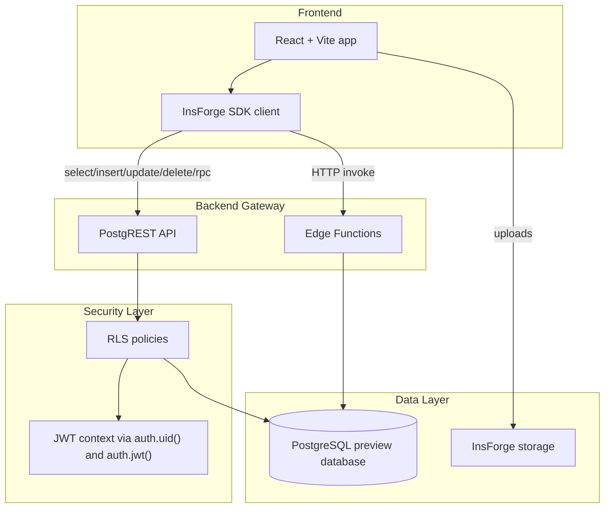
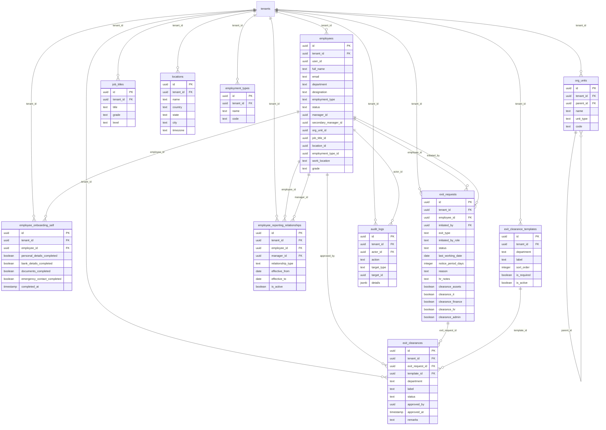
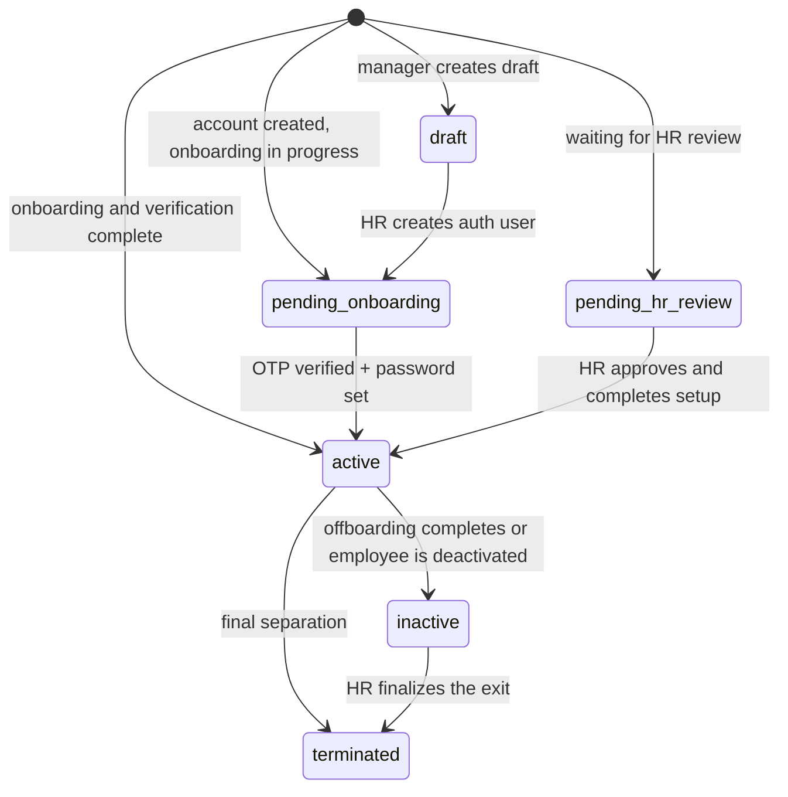
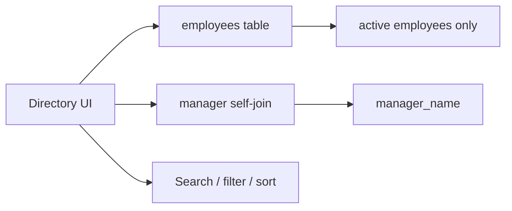
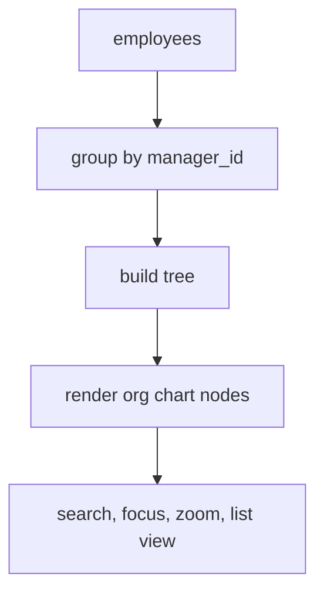
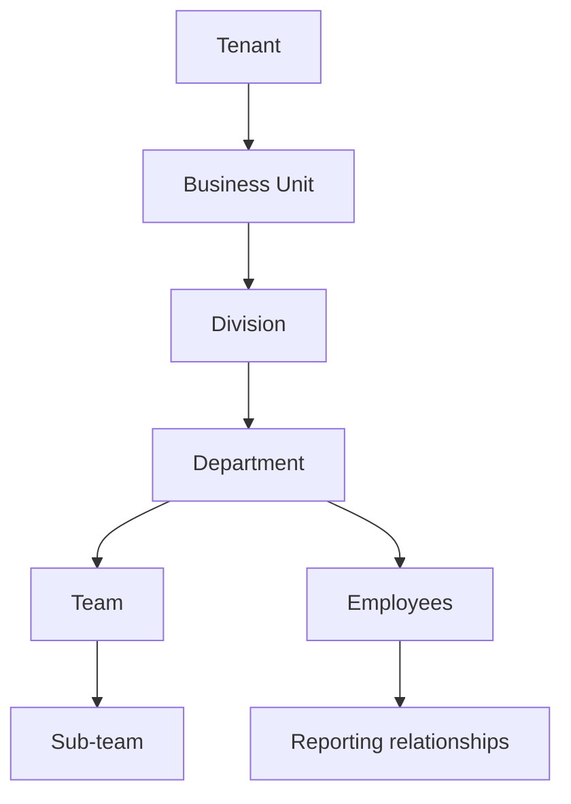
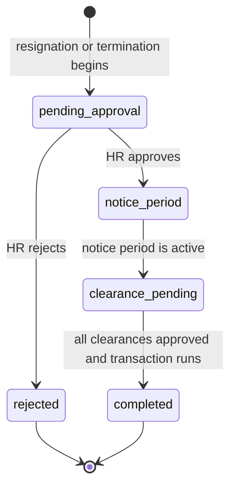
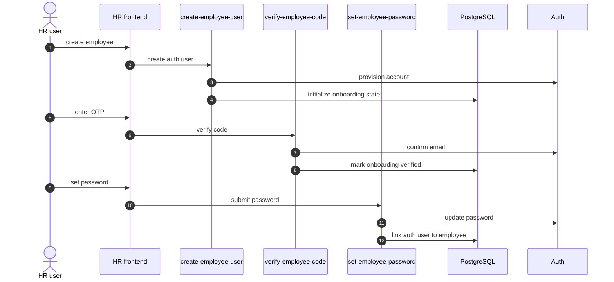
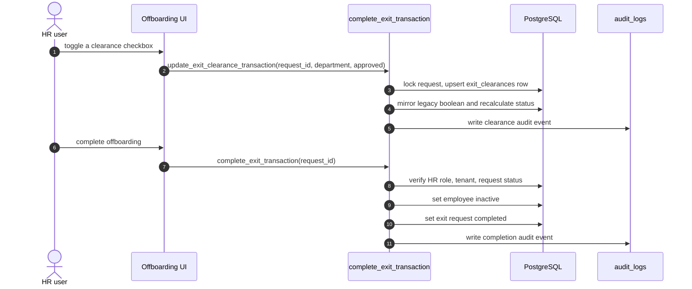

# TalentMesh HRMS Developer Guide
*UpdateSuggestion branch, live preview backend*

This document is the working source of truth for the current Employees, Directory, Org Chart, and Offboarding implementation.
It explains the live system as it exists now, plus the safe path we are using for the next changes.

For the full target-state implementation plan, market-grade feature blueprint, real-life workflows, and AI-agent guidance, also read:

- `new update doc/people_suite_full_implementation_plan.md`

For verified edge cases, scalability risks, and the next hardening release plan, also read:

- `new update doc/people_suite_edge_case_hardening_plan.md`

The main idea is simple:

1. Keep the current HRMS working.
2. Add new structure without breaking legacy fields.
3. Move sensitive workflows, especially Offboarding, into transactional server-side logic.
4. Let future developers read one file and understand the architecture quickly.

---

## Scope

This guide covers:

- Employees
- Directory
- Org Chart
- Offboarding
- Organization structure
- Live backend tables, policies, and functions that support those modules

It intentionally focuses on the `updateSuggestion` branch and the live preview backend:

- Frontend branch: `updateSuggestion`
- InsForge preview: `https://rq3qmu8y-jx7.ap-southeast.insforge.app`

---

## System Overview

The app is a React + Vite frontend using the InsForge SDK.
The backend is InsForge Postgres, PostgREST, RLS, and edge functions.

---

## Design Principle

We are using a phased migration strategy.

- Legacy columns stay in place.
- New normalized tables are added beside them.
- The UI reads legacy fields first when needed, and can gradually move to the new tables.
- Offboarding completion and clearance checkbox updates are now transactional instead of separate client-side updates.

This matters because the existing codebase already has production data and a lot of connected modules.
The safe path is to evolve the schema, not replace it in one shot.

---

## Live Domain Model

### Current core tables

| Module | Main tables |
| --- | --- |
| Employees | `employees`, `employee_onboarding_self` |
| Directory | `employees` |
| Org Chart | `employees`, `employee_reporting_relationships`, `org_units`, `job_titles`, `locations`, `employment_types` |
| Offboarding | `exit_requests`, `exit_clearances`, `exit_clearance_templates` |
| Audit | `audit_logs` |
| Tenant config | `tenants`, `tenant_settings`, `office_locations` |

### Important live compatibility fields

The existing employee record still uses these legacy fields:

- `department`
- `designation`
- `manager_id`
- `secondary_manager_id`
- `work_location`
- `employment_type`
- `grade`
- `status`

The new foundation tables were added without removing those columns.

---

## Live ER Diagram

---

## Employee Lifecycle

Employees still use the current lifecycle in the live system, with probation support already present.

### What the employee screen does

The Employees screens are built around the employee master record:

- create employee
- edit employee profile
- manage manager and secondary manager
- manage work mode and probation fields
- show onboarding/verification status

### Relevant frontend files

- [useOrgStructure.ts](</C:/Users/Anuj/Desktop/hrms/HRMS-Talentmesh-Solutions/src/hooks/useOrgStructure.ts>)
- [EmployeeCreate.tsx](</C:/Users/Anuj/Desktop/hrms/HRMS-Talentmesh-Solutions/src/hr/EmployeeCreate.tsx>)
- [EmployeeList.tsx](</C:/Users/Anuj/Desktop/hrms/HRMS-Talentmesh-Solutions/src/hr/EmployeeList.tsx>)
- [EmployeeDetail.tsx](</C:/Users/Anuj/Desktop/hrms/HRMS-Talentmesh-Solutions/src/hr/EmployeeDetail.tsx>)
- [OrgStructureManagement.tsx](</C:/Users/Anuj/Desktop/hrms/HRMS-Talentmesh-Solutions/src/hr/OrgStructureManagement.tsx>)

### Important implementation detail

Employee creation and HR profile edits still write the legacy profile fields, and they also dual-write normalized lookup IDs when lookup rows are selected.
The new org-structure tables are additive, so current screens keep working while we migrate them one at a time.

### Current dual-write coverage

| Screen | Legacy fields preserved | Normalized IDs written/read |
| --- | --- | --- |
| `EmployeeCreate` | `department`, `designation`, `employment_type`, `work_location` | writes `org_unit_id`, `job_title_id`, `employment_type_id`, `location_id` |
| `EmployeeDetail` | `department`, `designation`, `employment_type`, `work_location` | edits and activation write `org_unit_id`, `job_title_id`, `employment_type_id`, `location_id` |
| `EmployeeList` | filters still support legacy strings | filters can match `org_unit_id` and `location_id` |
| `Directory` | filters still support legacy strings | filters can match `org_unit_id` and `location_id` |
| `OrgChart` | falls back to legacy labels | displays normalized `org_units` and `job_titles` labels when IDs are present |
| `OrgStructureManagement` | does not remove legacy fields | maintains lookup rows used by employee forms and Org Chart |

### Lookup management

HR can maintain four normalized lookup sets from `/hr/org-structure`:

- `org_units`
- `job_titles`
- `locations`
- `employment_types`

The management screen creates and edits rows, and archives rows by toggling `is_active`.
It does not hard-delete lookup rows, because existing employees may still reference them.

`locations` here is intentionally different from the existing Office Locations screen.
`office_locations` stores attendance/geofence configuration, while `locations` stores employee structure metadata such as city, state, country, and timezone.

---

## Directory

Directory is the read-heavy employee browser.

It queries active employees, sorts and filters them, and shows:

- name
- designation
- department
- manager
- grade
- location
- contact entry points

### What matters in the live implementation

- It still displays `employees.department` and `employees.designation` for compatibility.
- Department and location filters are lookup-aware: they can match `org_unit_id` and `location_id`, then fall back to legacy strings.
- It currently treats `status = active` as the visible directory set.
- It uses the reporting line to show who each person reports to.

### Relevant frontend file

- [Directory.tsx](</C:/Users/Anuj/Desktop/hrms/HRMS-Talentmesh-Solutions/src/hr/Directory.tsx>)

---

## Org Chart

The Org Chart is the tree view of employee reporting.

Today the chart still uses `manager_id` and `secondary_manager_id` as the main reporting model.
The new additive tables are there to support a future configurable organization layer without breaking the current tree.
For display labels, Org Chart now prefers normalized lookup names from `org_units` and `job_titles` when `org_unit_id` or `job_title_id` is present.
If a lookup row is missing or inactive, the chart falls back to the legacy `department` and `designation` strings on `employees`.

Current decision: do not switch tree construction to `employee_reporting_relationships` yet.
That table should become the future reporting-line source only after we add backfill, dual-write, validation, and conflict handling for existing `manager_id` data.

### Current tree-building logic

### Org structure vision

The longer-term model we now support in the backend is:

### Why the new tables exist

- `org_units` gives a hierarchical structure beyond a single department string.
- `job_titles` makes titles and grades stable and reportable.
- `locations` lets the company model office geography cleanly.
- `employment_types` makes contract types configurable per tenant.
- `employee_reporting_relationships` prepares the app for richer reporting lines than a single manager field.

### Relevant frontend files

- [OrgChart.tsx](</C:/Users/Anuj/Desktop/hrms/HRMS-Talentmesh-Solutions/src/shared/pages/OrgChart.tsx>)
- [OrgChartNode.tsx](</C:/Users/Anuj/Desktop/hrms/HRMS-Talentmesh-Solutions/src/shared/components/OrgChartNode.tsx>)
- [orgChart.ts](</C:/Users/Anuj/Desktop/hrms/HRMS-Talentmesh-Solutions/src/utils/orgChart.ts>)

---

## Offboarding

Offboarding is the part that most needed hardening.

The old flow had split-state risk because sensitive state changes could be written from the client in separate calls.

We replaced the sensitive steps with transactional RPCs:

- `update_exit_clearance_transaction(p_request_id, p_department, p_approved, p_remarks)` updates one clearance item, mirrors the legacy boolean, recalculates the request status, and writes an audit event.
- `complete_exit_transaction(p_request_id)` completes the exit by making the employee inactive and the exit request completed in one database transaction.

### Offboarding state machine

### How clearance handling works now

There are two layers:

1. Legacy boolean fields on `exit_requests`
2. Normalized rows in `exit_clearances`

That means old UI behavior still works, but the new normalized table is the real foundation for future expansion.

### Clearance template model

`exit_clearance_templates` seeds the standard departments:

- assets
- it
- finance
- hr
- admin

Each exit request can now receive its own per-request clearance rows from the template set.

### Relevant frontend files

- [OffboardingManagement.tsx](</C:/Users/Anuj/Desktop/hrms/HRMS-Talentmesh-Solutions/src/hr/OffboardingManagement.tsx>)
- [InitiateExitModal.tsx](</C:/Users/Anuj/Desktop/hrms/HRMS-Talentmesh-Solutions/src/hr/components/InitiateExitModal.tsx>)
- [MyExit.tsx](</C:/Users/Anuj/Desktop/hrms/HRMS-Talentmesh-Solutions/src/employee/MyExit.tsx>)

### Relevant backend objects

- `public.exit_requests`
- `public.exit_clearances`
- `public.exit_clearance_templates`
- `public.complete_exit_transaction(uuid)`
- `public.update_exit_clearance_transaction(uuid, text, boolean, text)`
- `public.seed_exit_clearances()`

---

## Backend Functions

These are the live functions and helpers that support the current flow:

| Function | Purpose |
| --- | --- |
| `create-employee-user` | Creates the auth user for a new employee and stores tenant metadata |
| `verify-employee-code` | Verifies the employee OTP during activation |
| `set-employee-password` | Lets HR set or reset an employee password |
| `finalize-onboarding` | Marks onboarding complete |
| `complete_exit_transaction` | Atomically completes offboarding |
| `update_exit_clearance_transaction` | Atomically updates one clearance row, mirrors the legacy boolean, recalculates exit status, and writes an audit log |
| `seed_exit_clearances` | Seeds normalized clearance rows from templates |
| `check_rate_limit` | Protects sensitive actions from abuse |
| `is_hr` | JWT-based HR role helper |
| `can_access_tenant` | Tenant isolation helper |
| `get_auth_tenant_id` | Reads tenant context from JWT |

### Edge function flow for employee setup

### Offboarding transaction flow

---

## RLS And Safety

The live backend uses row-level security for tenant isolation.

### Important patterns

- `auth.uid()` identifies the signed-in user.
- `get_auth_tenant_id()` resolves tenant scope.
- `is_hr()` gates HR-only writes.
- `can_access_tenant()` is used on tenant-scoped tables.
- New tables were given explicit `SELECT` and HR `ALL` policies.

### Why this matters

The new foundation tables are not just schema sugar.
They let us evolve the organization model while keeping tenant isolation and future reporting safe.

### Safety rules we are following

- Do not remove legacy fields yet.
- Do not replace the UI all at once.
- Do not complete offboarding with two separate client writes.
- Do not add a future reporting table without indexes and RLS helpers.
- Do not let one active employee have two active exit requests.

---

## What Changed In This Update

This is the practical summary of the work that now exists in the branch:

- Offboarding completion is transactional.
- Offboarding clearance checkbox updates are transactional.
- Duplicate active exit requests are blocked.
- Clearance handling is normalized and template-driven.
- Employee-facing exit status reads normalized `exit_clearances` with legacy fallback.
- Organization structure foundations are added without breaking the old fields.
- Employee Create and Employee Detail dual-write normalized lookup IDs where available.
- Employee List and Directory filters are lookup-aware while retaining legacy fallback behavior.
- HR now has an Organization Setup screen for `org_units`, `job_titles`, and `employment_types`.
- HR now has an Organization Setup tab for normalized `locations`.
- Org Chart now displays normalized org-unit and job-title labels when lookup IDs are present.
- The UI and backend can now support a staged move from legacy department strings to configurable org units.

---

## How A New Developer Should Read This Codebase

1. Start with the Employees screens to understand the current profile lifecycle.
2. Read Directory next to see the read-only usage of the employee master table.
3. Read Org Chart to understand reporting-line traversal and tree rendering.
4. Read Offboarding last, because it is now the most sensitive workflow.
5. Treat the new tables as the migration layer, not as a forced rewrite.

---

## Current Release State

The previously planned safe release is now implemented on `updateSuggestion`:

- transactional clearance updates are handled by `update_exit_clearance_transaction`
- malformed old migration filenames were cleaned up and old pending backlog files were moved to `migration-archive/pending-review`
- normal `npx @insforge/cli db migrations up --all` now reports no pending local migrations
- gradual UI migration has started for `org_units`, `job_titles`, `locations`, and `employment_types`
- HR can maintain `org_units`, `job_titles`, `locations`, and `employment_types` from `/hr/org-structure`
- Org Chart renders lookup labels from normalized tables when available

## Remaining Safe Next Steps

The latest small safe-release pass completed these decisions:

1. Archived migrations were audited at a file level and remain quarantined in `migration-archive/pending-review`.
2. A normalized `locations` management tab was added to `/hr/org-structure`.
3. Org Chart stays on `manager_id` for tree construction for now; `employee_reporting_relationships` remains the future target after backfill and dual-write.
4. Legacy clearance booleans are not dropped or deprecated yet. The transactional RPC still mirrors them for compatibility while `exit_clearances` becomes the read foundation.

## Next Safe Release After This Pass

Keep the next release small:

1. Pick one archived migration at a time only after product ownership confirms the feature is still needed.
2. If reporting relationships become a priority, create a dedicated backfill migration from `employees.manager_id` to `employee_reporting_relationships`.
3. Add a compatibility report that identifies any offboarding views or exports still reading direct clearance booleans.
4. After every remaining offboarding consumer reads `exit_clearances`, then plan a separate deprecation release for direct legacy boolean writes.
