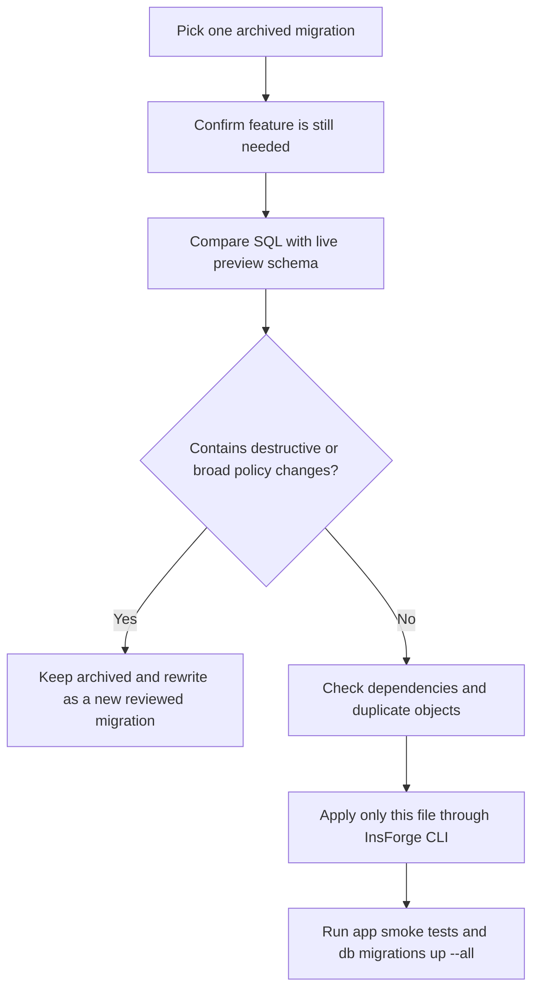

# Pending Migration Archive Audit

This audit covers the files currently quarantined in:

```text
target: updateSuggestion preview
archive folder: migration-archive/pending-review/
preview backend: https://rq3qmu8y-jx7.ap-southeast.insforge.app
```

No archived migration should be moved back into `migrations/` until it has a feature owner, live-schema comparison, and a single-file test plan.

## Safe Restore Gate



## Audit Summary

| File | Risk | Why it stays archived |
| --- | --- | --- |
| `20260529183000_create-monthly-accrual-job.sql` | Medium | Schedules a cron job. Restore only after confirming leave accrual rules, cron support, and idempotency. |
| `20260531200000_harden-hr-onboarding.sql` | Medium | Touches `auth.users` and onboarding helpers. Needs live auth-flow comparison before restore. |
| `20260531201000_storage-hardening.sql` | High | Changes `storage.buckets` and storage object policies. Needs storage policy review before restore. |
| `20260531201500_onboarding-state.sql` | Medium | Creates `employee_onboarding`; may overlap with the live `employee_onboarding_self` model. |
| `20260531202000_rate-limiting.sql` | Medium | Creates `rate_limits` and deletes old rows. Restore only after confirming the current rate-limit implementation. |
| `20260531202500_onboarding-cleanup.sql` | Medium | Adds cron cleanup and reads `auth.users`. Needs ownership of onboarding expiry behavior. |
| `20260531203000_storage-rls-hardening.sql` | High | Drops and recreates multiple storage policies. Do not apply without storage regression testing. |
| `20260531203500_onboarding-cleanup-refinement.sql` | Low/Medium | Refines onboarding cleanup. Restore only after the base cleanup migration is accepted. |
| `20260531204000_onboarding-recovery-hardening.sql` | Medium | Uses auth recovery helpers. Needs comparison with current activation and reset flows. |
| `20260601120000_add-break-tracking.sql` | Medium | Adds attendance break tables, RLS, triggers, and functions. Restore only as an attendance release. |
| `20260601140000_attendance-verification-enhancement.sql` | High | Adds attendance verification tables, cron, and broad policy rewrites. Needs attendance/geofence release plan. |
| `20260602120000_atomic-hr-workflows.sql` | High | Large workflow migration with delete operations across HR records. Rewrite into smaller reviewed migrations. |
| `20260615120000_security-rls-hardening.sql` | High | Drops and recreates policies across payroll/attendance tables. Needs full RLS regression test. |
| `20260615120001_security-rls-hardening-rollback.sql` | High | Explicit rollback migration. Never restore to active migrations as a forward migration. |
| `20260623190800_db-performance-tuning.sql` | High | Drops/recreates many policies and indexes. Needs live explain-plan and policy review. |
| `20260625120000_add-expenses-table.sql` | Medium | Adds expenses and payslip reimbursement fields. Restore only with payroll/expenses UI ownership. |
| `20260625121500_create-insurance-table.sql` | Medium | Adds insurance policy table and expiry cron. Restore only as an insurance feature release. |
| `20260625124500_create-it-declarations.sql` | Medium | Creates IT declaration tables. May overlap with the later IT declaration migration. |
| `20260627151500_delete-recruitment-tables.sql` | Critical | Drops fourteen recruitment/subscription tables and a function. Keep archived unless the product explicitly removes recruitment data. |
| `20260627160000_create-it-declaration-tables.sql` | Medium | Creates IT declaration tables with a different shape/policy set than the earlier file. Reconcile before choosing either version. |

## Current Decision

All files remain archived.

The active `migrations/` folder should continue to contain only migrations that are either already recorded on the updateSuggestion preview or intentionally prepared for the next focused release.

## Notes For Future Developers

- Do not batch-restore this folder.
- Do not restore rollback files as forward migrations.
- Do not restore storage, auth, RLS, cron, payroll, attendance, or destructive recruitment migrations without a feature-specific QA checklist.
- Prefer creating a new reviewed migration from the useful parts of an archived file instead of restoring old SQL unchanged.
