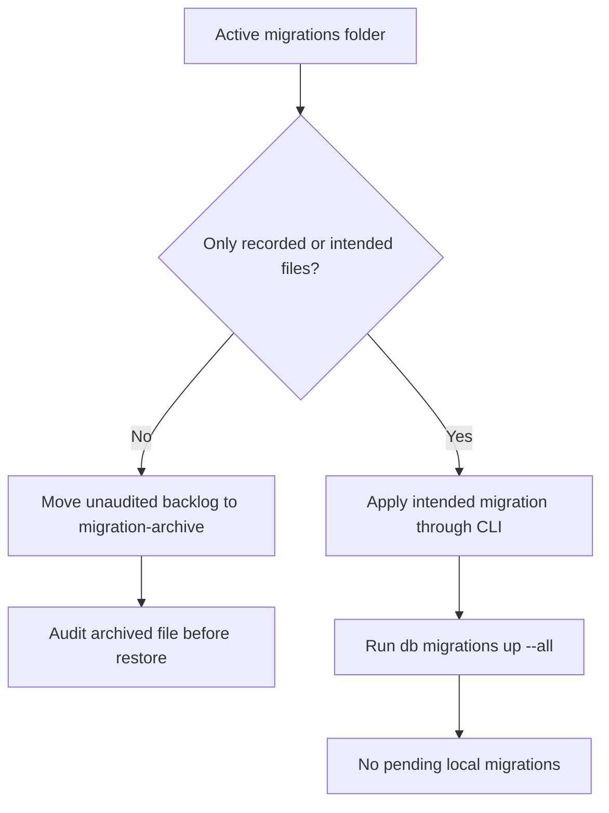
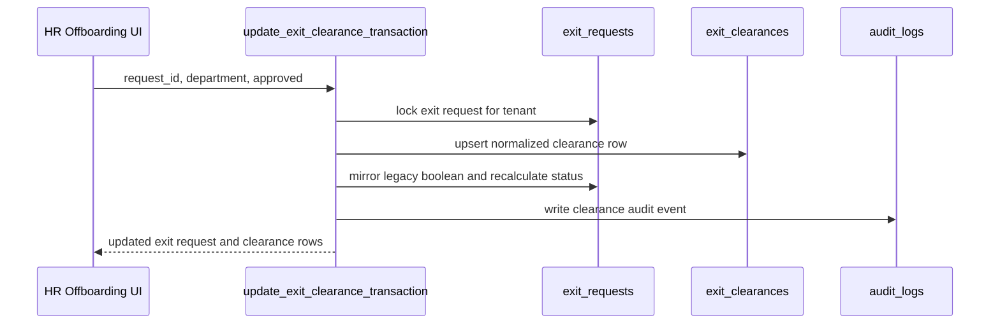
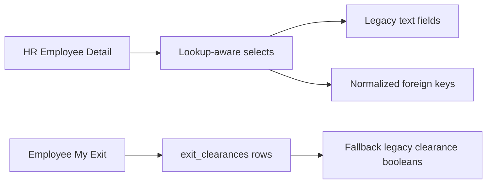

# Migration Cleanup Notes

This pass keeps the updateSuggestion branch safer for future InsForge migration commands.

## What changed

- Renamed malformed local migration filenames so the migration name portion uses hyphens instead of underscores.
- Kept the original timestamp versions unchanged.
- Moved unaudited old pending migration files out of the active `migrations/` root and into `migration-archive/pending-review`.
- Audited each archived pending migration at a file level and documented why each one should stay quarantined until feature ownership is confirmed.
- Recorded the two June 30 modernization migrations through normal InsForge CLI migration flow.
- Confirmed `npx @insforge/cli db migrations up --all` reports no pending local migrations.

## Why this matters

InsForge migration filenames must follow this shape:

```text
<14-digit-version>_<lowercase-hyphen-name>.sql
```

Underscores inside the migration name block migrations such as `up --all` because the CLI validates all local filenames first.

## Current caution

The offboarding safety foundation migration was originally applied to the updateSuggestion preview with the direct SQL helper because older pending local migrations blocked the normal ordered migration flow.

That has now been reconciled for the active modernization migrations:

- `20260630103000_offboarding-safety-foundations.sql`
- `20260630113000_transactional-clearance-updates.sql`

Both are recorded in InsForge migration history on the updateSuggestion preview.
The old backlog is archived for review and must not be restored blindly.



## Files to watch

- `20260630103000_offboarding-safety-foundations.sql`
- `20260630113000_transactional-clearance-updates.sql`

Both belong to the Employees, Directory, Org Chart, and Offboarding modernization path.

## Archived backlog

Archived files live here:

```text
migration-archive/pending-review/
```

Do not move them back into `migrations/` without reviewing the SQL first. Some contain rollback, drop, delete, or broad hardening logic that should not be applied automatically to the updateSuggestion preview.

The current per-file audit lives in:

```text
new update doc/migration_archive_audit.md
```

## Safe release completed on updateSuggestion



- Offboarding clearance checkbox updates now go through `update_exit_clearance_transaction` instead of separate client-side writes.
- Employee Create now dual-writes legacy fields plus `org_unit_id`, `job_title_id`, `location_id`, and `employment_type_id` where lookup rows exist.
- Employee List and Directory filters can match lookup IDs while still supporting legacy string filters.
- Org Chart fetches the normalized organization foreign keys so the chart can be migrated gradually without another backend change.
- HR can maintain `org_units`, `job_titles`, and `employment_types` from `/hr/org-structure`.
- HR can maintain normalized `locations` from `/hr/org-structure`; this is separate from geofenced `office_locations`.
- Org Chart now displays normalized org-unit and job-title labels when available.

## Follow-up safe release



- `EmployeeDetail` now edits and activates employees with the same dual-write strategy as `EmployeeCreate`.
- HR edits preserve `department`, `designation`, `employment_type`, and `work_location` while also writing `org_unit_id`, `job_title_id`, `employment_type_id`, and `location_id` when lookup rows are selected.
- `MyExit` now reads normalized `exit_clearances` for the employee-facing checklist, with fallback to legacy clearance booleans for older data.
## Documentation maintenance

- `employees_directory_orgchart_offboarding.md` now reflects that the planned safe release has been implemented.
- The current remaining backend risk is migration-history reconciliation, not the transactional clearance implementation itself.
- Future docs should continue to describe legacy fields and normalized lookup IDs together until the legacy fields are formally deprecated.
- Future migration work should restore at most one archived file at a time, and only after comparing it to the live updateSuggestion preview schema.
