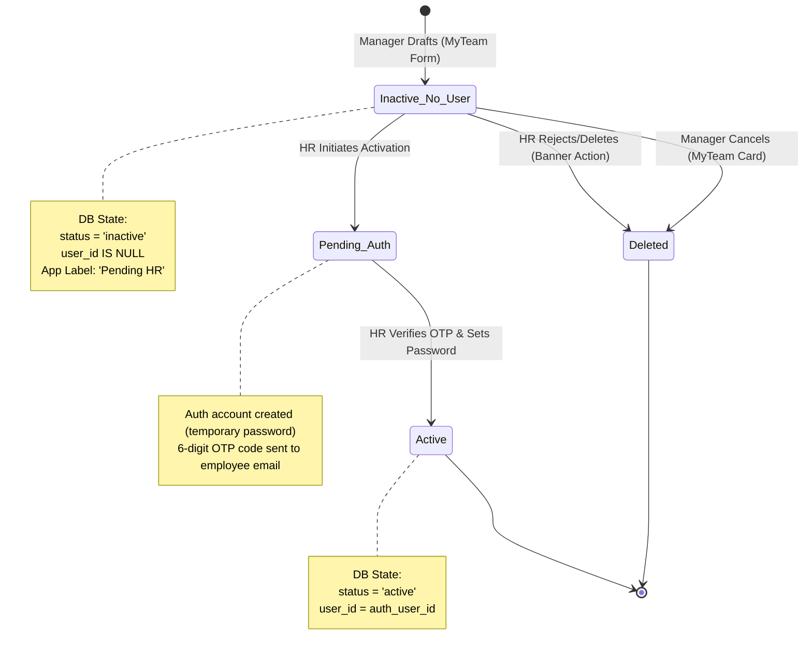
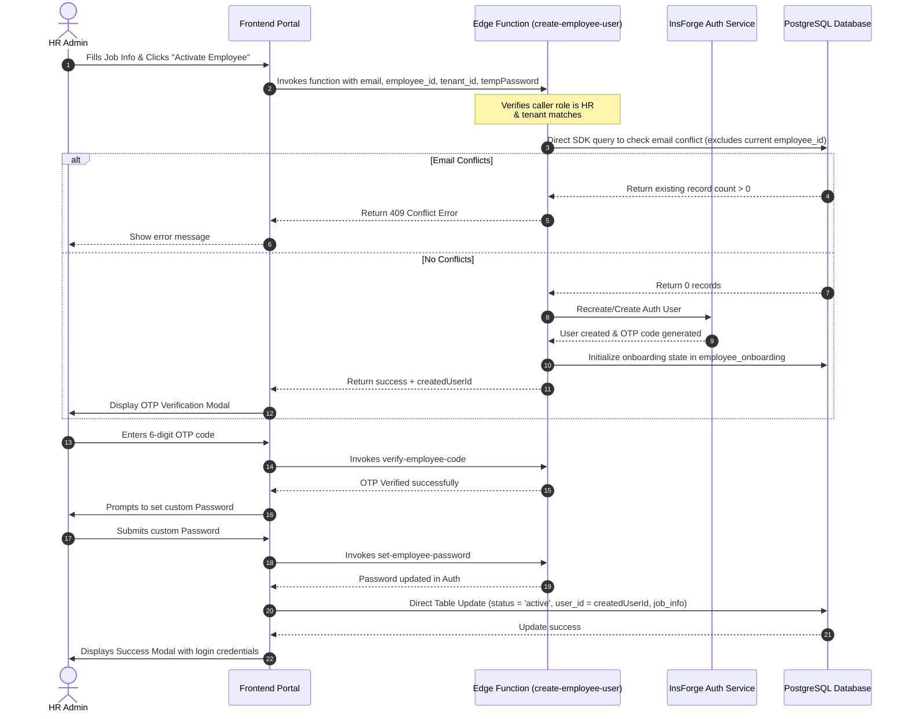

# Onboarding Lifecycle & Upgrade Documentation

This document describes the implementation architecture, database schema, security rules, and frontend workflows for the **Manager Drafts / HR Finalizes** onboarding flow.

---

## 1. Onboarding Lifecycle Overview

To support safe multi-tenant onboarding, the lifecycle utilizes an `inactive` status combined with a `null` or `uuid` value in the `user_id` field to represent different stages of an employee's profile.



### State Mapping Table

| Logical Status | Database `status` | Database `user_id` | UI Badge Label | Description |
| :--- | :--- | :--- | :--- | :--- |
| **Draft** | `inactive` | `NULL` | `Pending HR` | Profile drafted by manager. Cannot log in. Ghosted on org chart. |
| **Active** | `active` | `UUID` | `Active` | Activated by HR, credentials verified, fully active. |
| **Deactivated** | `inactive` | `UUID` | `Inactive` | Previously active employee who has been deactivated. |

---

## 2. Detailed Technical Workflows

### Employee Activation & OTP Sequence

When HR activates a drafted employee, they go through a 3-step verification wizard to prevent tenant desync or hijacking:



---

## 3. Database Architecture & RLS

### PostgreSQL RLS Policies

#### 1. Manager Draft Deletion Policy
Allows managers to cancel and delete draft reports they created, limited strictly to their own tenant and reports.
```sql
CREATE POLICY managers_can_delete_own_draft_reports 
ON public.employees
FOR DELETE
USING (
  status = 'inactive' 
  AND user_id IS NULL 
  AND manager_id = (
    SELECT id FROM public.employees 
    WHERE user_id = auth.uid() 
    LIMIT 1
  ) 
  AND tenant_id = (
    SELECT tenant_id FROM public.employees 
    WHERE user_id = auth.uid() 
    LIMIT 1
  )
);
```

#### 2. HR Admin Deletion Policy
Enforced by the `employees_hr_all` policy which grants HR role full command control on the `employees` table for records within their tenant.

---

## 4. Code Implementation Map

### Edge Functions
* **[`create-employee-user`](file:///c:/Users/Anuj/Desktop/hrms/HRMS-Talentmesh-Solutions/functions/create-employee-user.ts):** Checks for duplicate email registration by querying the database directly (excluding the active `employee_id`), deletes orphaned accounts belonging to the same tenant, and triggers user creation.

### Frontend Components
* **[`MyTeam.tsx`](file:///c:/Users/Anuj/Desktop/hrms/HRMS-Talentmesh-Solutions/src/employee/MyTeam.tsx):** 
  - Renders drafts under "My Team" with a "Pending HR" badge.
  - Exposes the "Cancel Request" trash control for managers to delete reports before activation.
* **[`EmployeeDetail.tsx`](file:///c:/Users/Anuj/Desktop/hrms/HRMS-Talentmesh-Solutions/src/hr/EmployeeDetail.tsx):**
  - Renders "Delete Draft" next to "Activate Employee" in the activation banner.
  - Implements the OTP + Password Activation Wizard modal overlay.
  - Directly updates the database from the client upon successful activation, bypassing gateway schema caching on RPC calls.
  - Standardized Identity & Bank tab fields to standard inputs with secure `disabled={!isEditing}` state and native browser masking `type={showSensitive || isEditing ? "text" : "password"}`.
