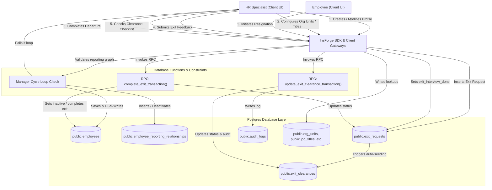
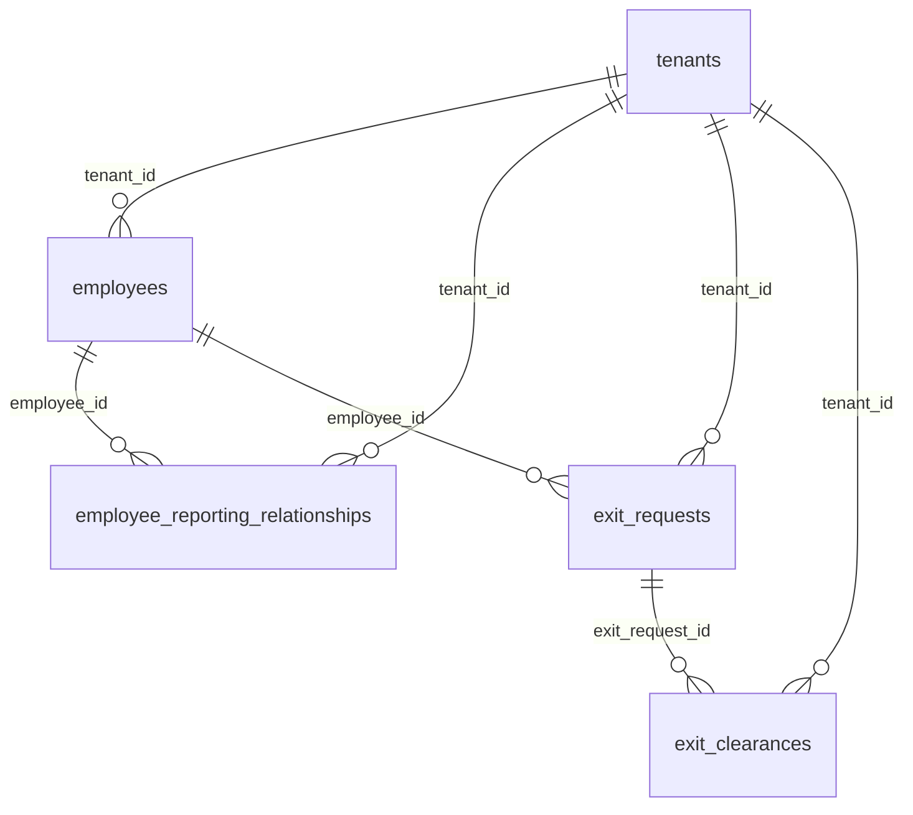
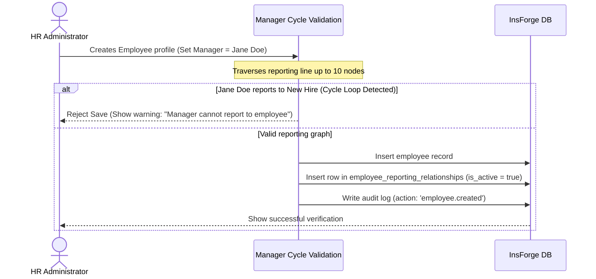
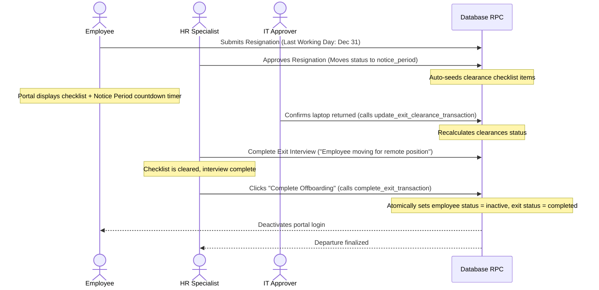

# HRMS People Suite: Architecture & Developer Guide
*Post-Upgrade Edition (v2.0)*

This document serves as the technical source of truth for the updated **HRMS People Suite** modules: **Employees Setup, Directory, Org Chart, and Offboarding**. It details the post-upgrade system architecture, complete database schemas, data flows, and real-world execution checklists for developers.

Important hardening note:

Before treating this People Suite as production-ready, read `new update doc/people_suite_edge_case_hardening_plan.md`.
Some protections described here are currently implemented as frontend behavior or multi-step client writes and must be moved into backend-safe read paths or transactional RPCs for real HRMS scale.

---

## 1. System Architecture & DFD Diagram

The People Suite is built on a React + Vite client using the InsForge TypeScript SDK, interacting with a secure PostgreSQL database on the InsForge preview backend.

### Data Flow Diagram (DFD)

---

## 2. Complete Database Schema

All tables enforce tenant isolation via Row Level Security (RLS) checked through client JWT tokens.

### 2.1. employees
Stores the primary worker record, supporting legacy fields for backward compatibility while linking to normalized lookup IDs.

| Column | Type | Nullable | Default | Description |
| --- | --- | --- | --- | --- |
| `id` | `uuid` | NO | `gen_random_uuid()` | Primary Key |
| `tenant_id` | `uuid` | NO | - | Foreign Key to `tenants` |
| `user_id` | `uuid` | YES | - | Link to auth.users |
| `full_name` | `text` | NO | - | Full name |
| `email` | `text` | NO | - | Corporate Email |
| `phone` | `text` | YES | - | Contact Number |
| `department` | `text` | YES | - | Legacy text department |
| `org_unit_id` | `uuid` | YES | - | FK to `org_units` (Normalized) |
| `designation` | `text` | YES | - | Legacy text title |
| `job_title_id` | `uuid` | YES | - | FK to `job_titles` (Normalized) |
| `location_id` | `uuid` | YES | - | FK to `locations` (Normalized) |
| `employment_type_id`| `uuid` | YES | - | FK to `employment_types` (Normalized) |
| `work_mode` | `text` | NO | `'office'` | `'office'`, `'remote'`, or `'hybrid'` |
| `grade` | `text` | YES | - | Pay/Role grade scale |
| `status` | `text` | NO | `'draft'` | `'draft'`, `'pending_onboarding'`, `'pending_hr_review'`, `'active'`, `'inactive'`, `'terminated'` |
| `manager_id` | `uuid` | YES | - | Primary reporting manager employee ID |
| `secondary_manager_id`| `uuid` | YES | - | Secondary/matrix manager employee ID |

---

### 2.2. employee_reporting_relationships
Maintains history of primary and matrix manager relationships.

| Column | Type | Nullable | Default | Description |
| --- | --- | --- | --- | --- |
| `id` | `uuid` | NO | `gen_random_uuid()` | Primary Key |
| `tenant_id` | `uuid` | NO | - | FK to `tenants` |
| `employee_id` | `uuid` | NO | - | FK to `employees` (Subject) |
| `manager_id` | `uuid` | NO | - | FK to `employees` (Manager) |
| `relationship_type` | `text` | NO | - | `'primary'` or `'secondary'` |
| `effective_from` | `date` | NO | `CURRENT_DATE` | Start date of relationship |
| `effective_to` | `date` | YES | - | End date of relationship |
| `is_active` | `boolean`| NO | `true` | Active status indicator |

---

### 2.3. exit_requests
Represents an initiated resignation or termination request.

| Column | Type | Nullable | Default | Description |
| --- | --- | --- | --- | --- |
| `id` | `uuid` | NO | `gen_random_uuid()` | Primary Key |
| `tenant_id` | `uuid` | NO | - | FK to `tenants` |
| `employee_id` | `uuid` | NO | - | FK to `employees` (Departing) |
| `initiated_by` | `uuid` | NO | - | FK to `employees` (HR/Staff) |
| `initiated_by_role` | `text` | NO | - | `'hr'` or `'employee'` |
| `exit_type` | `text` | NO | - | `'resignation'` or `'termination'` |
| `status` | `text` | NO | `'pending_approval'` | `'pending_approval'`, `'rejected'`, `'notice_period'`, `'clearance_pending'`, `'completed'`, `'withdrawn'` |
| `last_working_date` | `date` | YES | - | Final day of employment |
| `notice_period_days`| `integer`| YES | `30` | Number of contract notice days |
| `reason` | `text` | YES | - | Reason for departure |
| `exit_interview_done`| `boolean`| YES | `false` | HR interview completion check |
| `exit_feedback` | `text` | YES | - | Qualitative interview feedback text |

---

### 2.4. exit_clearances
Checklist clearances generated for each department when exit requests move into notice.

| Column | Type | Nullable | Default | Description |
| --- | --- | --- | --- | --- |
| `id` | `uuid` | NO | `gen_random_uuid()` | Primary Key |
| `tenant_id` | `uuid` | NO | - | FK to `tenants` |
| `exit_request_id` | `uuid` | NO | - | FK to `exit_requests` |
| `department` | `text` | NO | - | `'assets'`, `'it'`, `'finance'`, `'hr'`, `'admin'` |
| `label` | `text` | NO | - | Display label (e.g. "Laptop Return") |
| `status` | `text` | NO | `'pending'` | `'pending'`, `'approved'` |
| `approved_by` | `uuid` | YES | - | FK to `employees` (Approver) |
| `approved_at` | `timestamp`| YES | - | Date/time of approval |

---

## 3. Upgraded Functionalities & Steps of Use

### 3.1. Organization Setup Lookups
*   **Search & Filter Tabs**: Lookups (Org Units, Job Titles, Locations, Employment Types) feature client-side searches and Active/Archived filters.
*   **Archiving Safety Warning**: Displays active employee usage count. System halts archives and prompts warnings if employees are currently linked to the item.
*   **Self-Nesting Hierarchy Tree**: Org Units resolve their tree depths recursively on the client. It formats indented dropdown options (`Sales > Inbound`) and tree layouts automatically.

### 3.2. Employee Profiles & History Timeline
*   **completeness Score**: Evaluates profile completion percentages across 13 fields (Bio, Bank details, IDs, Joining Info) and renders a visual progress meter.
*   **Lifecycle History Timeline**: Captures key log entries (`employee.created`, `employee.manager_changed`, `employee.department_changed`, etc.) in a vertical timeline.

### 3.3. Right-Aligned Quick Directory Drawer
*   **Sliding Drawer Layout**: Replaces center detail modals. Clicking on any employee card triggers a smooth slide-out profile view.
*   **Role-Based Privacy Masking**: Standard workers only see name, title, department, work mode, and email. Private records (Mobile, Employee Code, Date of Joining) are hidden unless the viewer is HR or the worker themselves.
*   **Instant Shortcuts**: Integrates direct actions (Mail client redirect, click to call, and focus node inside the Org Chart).

### 3.4. Org Chart Graph Controls
*   **Relationship Source Table**: The chart builds company tree views dynamically based on the active rows in `employee_reporting_relationships` rather than the static column on the employee table.
*   **Data Quality Flags**: Emits real-time visual warnings:
    *   `AlertTriangle` (Red glowing ping): Highlight nodes locked in circular reporting cycles.
    *   `HelpCircle` (Yellow pulsing icon): Identifies orphan employees who lack managers (excluding the root Node).
*   **Matrix Reporting Overlay**: Detects secondary managers and highlights dotted-line associations (`Matrix: [Manager Name]`) at the card base.

### 3.5. Offboarding Clearance & Exit Interviews
*   **Department Clearance Summaries**: Computes total pending clearances by category (Assets, IT, Finance, HR, Admin) and displays them as dashboard totals.
*   **Qualitative Feedback Form**: Locks final completion until the HR specialist finishes the exit interview and writes a structured review to `exit_feedback`.
*   **Notice Period Countdown**: Displays a ticker on the employee portal counting down exact Days, Hours, Minutes, and Seconds remaining.

---

## 4. Real-World Execution Scenarios

### Use Case A: New Hire Setup & Reporting Line Validation

---

### Use Case B: Updating Manager Assignment (Dual-Write History)
1.  **HR opens employee detail page** for John Smith.
2.  **HR alters Primary Manager** from *Alice* to *Bob*.
3.  **Client performs pre-save cycle checking** (checks if John Smith is Bob's manager down the line).
4.  **Database operations executed synchronously**:
    *   Updates `employees` table: `manager_id = Bob`.
    *   Updates `employee_reporting_relationships` table: Deactivates Alice (`is_active = false`, `effective_to = today`).
    *   Inserts into `employee_reporting_relationships` table: Activates Bob (`is_active = true`, `effective_from = today`).
    *   Writes `audit_logs` record: `action = 'employee.manager_changed'`.
5.  John Smith's reporting node instantly relocates under Bob on the visual Org Chart canvas.

---

### Use Case C: Phased Exit Procedure & Transactional Closure

