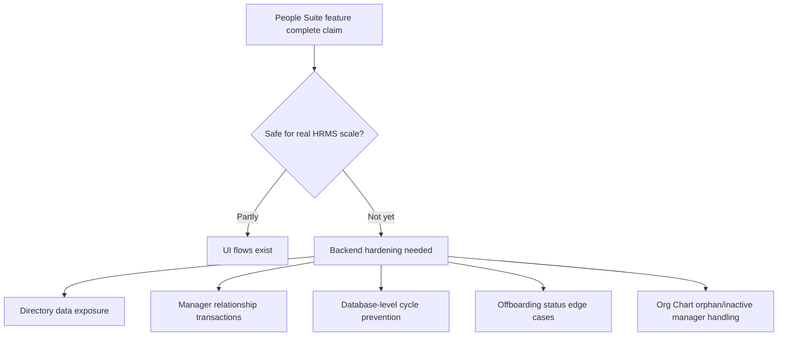
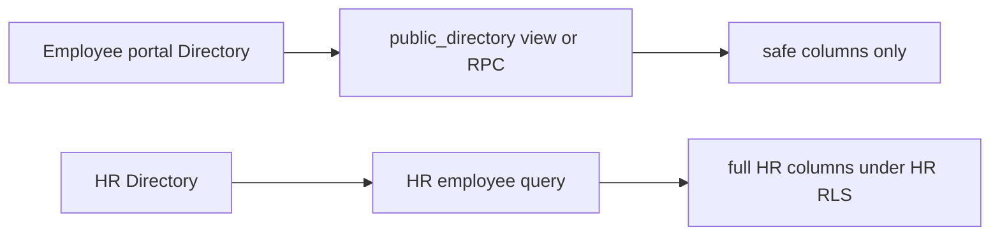
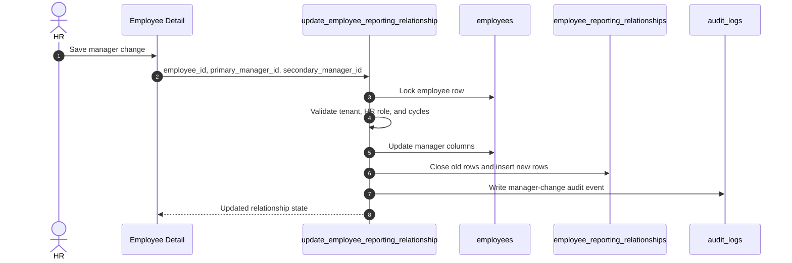
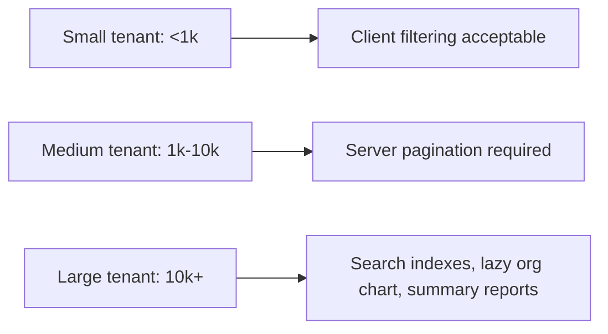
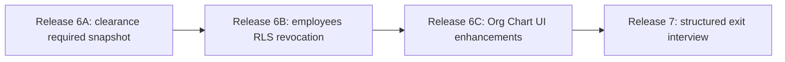
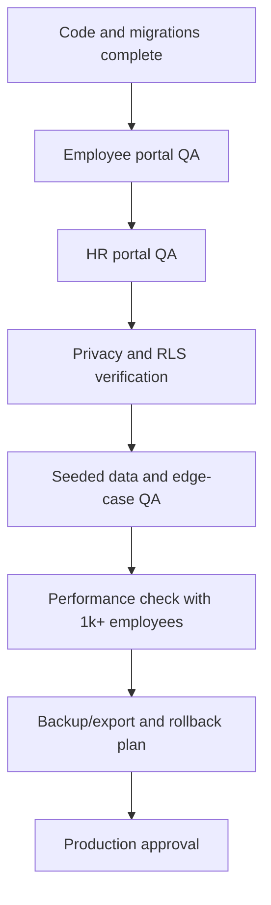

# People Suite Edge Case And Scalability Hardening Plan

This document reviews the post-upgrade People Suite against the actual `updateSuggestion` implementation.

Use this file together with:

- `new update doc/people_suite_full_implementation_plan.md`
- `new update doc/people_suite_architecture_and_developer_guide.md`
- `new update doc/employees_directory_orgchart_offboarding.md`

Target backend:

```text
InsForge preview: https://rq3qmu8y-jx7.ap-southeast.insforge.app
Frontend branch: updateSuggestion
```

## Executive Summary

The People Suite has moved forward significantly, but the phrase "all six phases are complete" should be treated carefully.

Several features are functionally present in the frontend, and the first conservative hardening release has now moved the highest-risk pieces into backend-safe paths.

The system is safer than the initial post-upgrade state, and the highest-risk People Suite write paths now use backend-safe reads or transactional RPCs.

Some compatibility tradeoffs remain by design. Base `employees` table RLS tightening, large-tenant pagination, and Org Chart orphan handling should be handled in later focused releases.

## Verified Risk Map



## Severity Ranking

| Priority | Area | Risk | Current state | Safe target |
| --- | --- | --- | --- | --- |
| P0 | Directory privacy | Sensitive employee columns were fetched before UI masking | Fixed: Stage A query migration off base table + additive self-read policy; broad SELECT policy remains temporarily active | Later release should revoke broad SELECT policy after manual verification of employee flows |
| P0 | Manager dual-write | Employee edits and creation could drift between related tables | Fixed for Employee Detail through `update_employee_reporting_relationship`; fixed for EmployeeCreate through `create_employee_transaction` | Keep recovery/update paths monitored |
| P0 | Manager cycles | Browser validation could be bypassed | Fixed for manager edit RPC primary and secondary assignments | Optional trigger backstop can be considered later |
| P1 | Secondary manager cycles | Matrix manager could create loops | Fixed in RPC and pre-validated in Employee Detail UI | Keep testing matrix/dotted-line reporting cases |
| P1 | Offboarding completion | Already-inactive or already-terminated employee could block completion | Fixed in `complete_exit_transaction` with audit detail and terminated-status preservation | Keep audit reporting visible for reconciliation cases |
| P1 | Clearance status naming | `clearance_pending` means "ready for final completion" | Naming is counterintuitive | Document semantics or introduce clearer status later |
| P1 | Clearance seeding | Rows are seeded on insert before approval | Trigger runs immediately | Seed on approval or cleanup rejected/withdrawn requests |
| P2 | Deactivated templates | Legacy booleans can conflict with normalized rows | Compatibility fallback still active | Base completion on required active clearance rows |
| P2 | Org Chart inactive managers | Reports to inactive managers become floating roots | Fixed: `buildOrgTreeWithOrphans` separates orphans from true roots; HR Portal shows warning banner and "Needs Manager Assignment" amber group | Employee-portal view unchanged; no database migration required |

---

## P0: Directory Privacy Must Move Server-Side

### Current Behavior

`Directory.tsx` fetches rich employee rows and then hides some fields in React for non-HR users.

This is not enough for a real HRMS because browser users can inspect network responses.

Sensitive fields that must not be broadly fetched:

- Aadhaar number
- PAN number
- bank name
- account number
- IFSC code
- phone number if company policy treats it as private
- employee code if company policy treats it as internal-only
- date of joining if company policy treats it as private
- address and emergency contact details

### Real-Life Failure Example

An employee opens Directory to find a colleague. The UI hides PAN and bank fields, but the network response contains them. The employee can export private personal data from the browser dev tools.

### Safe Target

Create two read paths:

1. Public/employee directory read path
2. HR directory read path



### Implementation Options

Preferred:

- Create `public.employee_directory_public` view or RPC.
- Grant `SELECT` only on safe fields.
- Use RLS or `SECURITY DEFINER` carefully to enforce tenant scope.

Safe public fields:

- `id`
- `tenant_id`
- `full_name`
- `email`
- `profile_photo_url`
- `department`
- `designation`
- `org_unit_id`
- `job_title_id`
- `location_id`
- `employment_type_id`
- `work_location`
- `work_mode`
- `manager_id`
- `status`

Then:

- Employee role uses the public read path.
- HR role uses full `employees` query or an HR-only RPC.

Definition of done:

- Employee users never receive PAN, Aadhaar, bank, address, or emergency-contact fields from Directory network responses.
- HR users still get the fields they need in Employee Detail.
- Build passes.
- RLS/permissions are verified on the preview backend.

---

## P0: Manager Assignment Must Become Transactional

### Current Behavior

Employee manager updates are written through multiple client-side calls:

1. update `employees.manager_id`
2. deactivate old `employee_reporting_relationships` row
3. insert new `employee_reporting_relationships` row
4. write audit logs

If any later step fails, the employee profile and reporting history can become inconsistent.

### Real-Life Failure Example

HR changes John's manager from Alice to Bob. The employee row updates, but the relationship insert fails because of a network issue. Directory says Bob is the manager while Org Chart still uses Alice or shows John as orphaned.

### Safe Target

Create a transactional RPC:

```text
update_employee_reporting_relationship(
  p_employee_id uuid,
  p_primary_manager_id uuid,
  p_secondary_manager_id uuid
)
```

The RPC should:

- verify HR role
- verify tenant scope
- lock the employee row
- validate no self-manager
- validate no primary or secondary cycle
- update `employees.manager_id`
- update `employees.secondary_manager_id`
- close old relationship rows
- insert new active rows
- write audit logs
- return the updated employee and relationships



Definition of done:

- EmployeeCreate and EmployeeDetail no longer manually insert/deactivate reporting rows from the client.
- One failed manager save leaves no partial state.
- Audit event is written in the same transaction.

---

## P0: Manager Cycle Validation Must Exist In The Database

### Current Behavior

`managerCycleValidation.ts` validates cycles in the browser. This is helpful UX, but not a database safety guarantee.

### Real-Life Failure Example

A script or direct API request updates `employees.manager_id` and bypasses the React validation. The database stores a cycle:

```text
Anita -> Rohan -> Meera -> Anita
```

Org Chart then either mis-renders, marks roots incorrectly, or can become expensive to traverse.

### Safe Target

Database-level validation should run inside the manager-update RPC and ideally also in a trigger.

Rules:

- employee cannot be their own primary manager
- employee cannot be their own secondary manager
- primary and secondary manager cannot create ancestor cycles
- depth limit should not be the real safety mechanism; recursive query should stop with visited IDs
- cross-tenant manager assignments must be rejected

Definition of done:

- Direct database/API attempts to create a cycle fail.
- Client validation remains for quick UX.
- Secondary manager is validated too.

---

## P1: Secondary Manager Needs The Same Safety As Primary Manager

### Current Behavior

Primary manager is validated before save. Secondary manager is dual-written but not fully cycle-validated.

### Real-Life Failure Example

An employee is assigned as secondary manager to their own dotted-line manager, creating a reporting loop in matrix overlays.

### Safe Target

Both fields should be passed to the same database RPC and checked together:

- `manager_id`
- `secondary_manager_id`

Also prevent:

- primary manager equals secondary manager unless explicitly allowed by product
- secondary manager equals employee
- secondary relationship duplicates an active primary relationship row

---

## P1: Offboarding Completion Should Be Idempotent Around Employee Status

### Current Behavior

Earlier versions of `complete_exit_transaction` could fail if the employee was already `inactive` or `terminated`.

### Real-Life Failure Example

HR manually inactivates the employee profile before completing the exit checklist. Then the final offboarding completion RPC fails, leaving the exit request stuck.

### Safe Target

The completion RPC should allow this safe case:

- if employee is already inactive, still complete the exit request if all completion rules are satisfied

It should still block unsafe cases:

- employee belongs to another tenant
- exit request does not belong to employee
- employee is terminated by another unrelated workflow and the business wants manual review

Recommended behavior:

- If employee status is `active`, set to `inactive`.
- If employee status is already `inactive`, continue and complete exit request.
- If employee status is already `terminated`, keep `terminated`, complete the exit request, and write a warning audit detail for workflow reconciliation.

Definition of done:

- HR cannot get a valid exit stuck only because the employee was already inactive.
- Audit log records whether the employee was already inactive before completion.

---

## P1: Clarify Offboarding Status Semantics

### Current Behavior

`update_exit_clearance_transaction` sets status to `clearance_pending` when no clearance rows are pending.

This is technically being used as "ready for final completion", but the name reads like "clearances are still pending".

### Real-Life Failure Example

A future report queries `status = 'clearance_pending'` expecting overdue clearances. It actually returns exits where clearances may already be approved and HR just needs to click final completion.

### Safe Target

Short term:

- Document exact semantics everywhere.

Medium term:

- Introduce clearer statuses only with a careful migration:
  - `clearance_in_progress`
  - `ready_for_completion`
  - `completed`

Do not rename statuses casually because existing UI, filters, and RPCs depend on them.

---

## P1: Clearance Seeding Timing Needs Product Decision

### Current Behavior

Clearance rows are seeded immediately after an `exit_requests` row is inserted.

### Real-Life Failure Example

Employee submits resignation, HR rejects it, but clearance rows already exist. Reports may show clearance rows for rejected or withdrawn exits.

### Safe Options

Option A: Keep current trigger, add cleanup.

- On rejection/withdrawal, mark clearances cancelled or ignore them in reports.
- Lowest-risk change.

Option B: Seed only when moving to `notice_period`.

- More semantically correct.
- Requires moving seeding logic into approval/update RPC.

Recommendation:

Use Option A for the next hardening release, then consider Option B when exit approval becomes fully transactional.

---

## P2: Deactivated Clearance Templates And Legacy Boolean Fallback

### Current Behavior

Completion checks normalized pending rows. If rows are pending, it can fall back to legacy booleans.

This compatibility is useful, but can become confusing if templates change over time.

### Safe Target

Completion should eventually rely on:

- required clearance rows that exist for that exit request
- their status
- their `is_required` snapshot or equivalent request-level requirement

Avoid relying on tenant-level template state at completion time because templates can change after the exit request was created.

Recommendation:

Add `is_required` to `exit_clearances` as a per-request snapshot in a future migration if not already present.

---

## P2: Org Chart Inactive Manager Handling

### Current Behavior

Org Chart reads active relationship rows and maps employee status. It filters out inactive employees with user accounts from the visible tree.

If a visible employee reports to an inactive hidden manager, that employee can appear as a root.

### Real-Life Failure Example

Ravi reports to Neha. Neha exits the company and becomes inactive. Ravi has not been reassigned yet. Org Chart shows Ravi as a floating root, making the company structure look broken.

### Safe Target

Add explicit orphan handling:

- show a warning banner: "3 active employees report to inactive or missing managers"
- render a placeholder inactive-manager node, or
- group affected employees under "Needs Manager Assignment"

Recommended first step:

- Keep the tree simple, but add data-quality warnings and a "Needs Manager Assignment" virtual group.

---

## Completed Conservative Hardening Release

Migration:

```text
migrations/20260703160000_people-suite-hardening.sql
```

Completed items:

- Added `public.employee_directory_public` with safe directory columns.
- Updated employee-side Directory reads to use `employee_directory_public`.
- Updated employee-side Org Chart reads to use `employee_directory_public`.
- Added `public.update_employee_reporting_relationship(...)`.
- Moved Employee Detail manager edits to the transactional reporting RPC.
- Added database-side primary and secondary manager cycle checks inside the RPC.
- Made `complete_exit_transaction(...)` continue when the employee is already inactive.
- Added audit detail for already-inactive offboarding completion.
- Added `public.create_employee_transaction(...)` for atomic employee creation.
- Updated EmployeeCreate new-profile creation to use the creation RPC after auth user provisioning.
- Creation RPC now inserts employee, onboarding progress, reporting relationships, leave balances, and audit logs in one transaction.
- Added `public.cleanup_exit_clearances_on_cancel()` for rejected/withdrawn exit requests.
- Extended `exit_clearances.status` to include `cancelled`.
- Soft-cancelled incomplete clearance rows instead of deleting them, preserving audit history.
- Documented `clearance_pending` semantics in TypeScript and offboarding UI helpers.
- Updated `complete_exit_transaction(...)` to complete exit requests for already-terminated employees while preserving `employees.status = 'terminated'`.
- Added `employee_already_terminated` and warning details to the offboarding completion audit payload.
- Added additive `employees_self_read` RLS policy so employees can keep reading their own full record.
- Moved broad employee-portal reads in My Team, My Leaves, and Employee Project View to `employee_directory_public`.

Intentional deferrals:

- Base `employees` table SELECT RLS was not tightened in this release to avoid breaking dashboard, profile, leave, payroll, or other employee portal screens.
- No relationship sync trigger was added. The current safer path is explicit RPC-based writes.
- Auth user provisioning remains in the existing edge-function flow before `create_employee_transaction`, because auth account creation is outside normal Postgres table writes.

## Remaining Hardening Release Plan

### Release 2: Offboarding Edge Cases

Completed:

1. Documented `clearance_pending` semantics.
2. Chose soft-cancellation for rejected/withdrawn request cleanup.
3. Added `cancelled` clearance status so reports can exclude cancelled rows without losing history.

Remaining:

1. Ensure future clearance reports exclude `cancelled` rows by default.
2. Surface warning audit details in future HR reconciliation/reporting views if needed.

### Release 3: Org Chart Data Quality

1. Add orphan manager detection.
2. Add "Needs Manager Assignment" group or warning banner.
3. Validate secondary manager relationships.
4. Add admin report for cycles, orphans, and missing reporting rows.

### Release 4: Scale And Performance

Stage A completed:

1. Audited employee portal reads from `employees`.
2. Moved broad read-only employee lookups to `employee_directory_public`.
3. Added `employees_self_read` as an additive base-table policy.
4. Kept existing broad policies intact until every employee portal path is manually verified.

Remaining:

1. Add server-side pagination/search for Directory.
2. Add indexes for common People Suite filters.
3. Add caching strategy for lookup tables.
4. Add load testing for 1k, 10k, and 50k employee tenants.
5. Only after full portal QA, plan a separate migration to revoke broad base `employees` SELECT access.

---

## Scale Checklist

For 1,000 employees:

- client-side Directory filtering may still be acceptable
- Org Chart must avoid rendering all nodes expanded by default
- lookup tables should be cached per tenant session

For 10,000 employees:

- Directory needs server-side pagination and search
- Org Chart should lazy-load subtrees
- Employee List should use paginated queries
- audit timeline should paginate

For 50,000 employees:

- Directory should use indexed search or a search service
- Org Chart must become subtree-focused, not full-tree
- manager relationship validation must be database-optimized
- reports should use materialized views or summary tables where needed



---

## AI Agent Instructions For This Hardening Work

When implementing these fixes:

1. Do not trust UI masking as security.
2. Do not add more client-side multi-write flows for employee lifecycle changes.
3. Prefer RPCs for changes that touch multiple tables.
4. Keep legacy fields until a separate deprecation plan is implemented.
5. Keep current UI behavior compatible while moving safety into the backend.
6. Use `new update doc` as the source of truth.
7. Do not restore archived migrations as shortcuts.
8. Run `npm run build` after frontend changes.
9. Run `npx @insforge/cli db migrations up --all` after migration changes.
10. Update this document whenever a risk is fixed.

---

## Release 3: Org Chart Data Quality (Completed)

### Problem

Employees whose `manager_id` pointed to an inactive, terminated, or deleted manager were silently promoted to root nodes in the org chart tree. They were visually indistinguishable from actual top-level leaders, causing confusing disconnected subtrees with no indication to HR that reassignment was needed.

### Fix

Introduced `buildOrgTreeWithOrphans` in `src/utils/orgChart.ts` with a clean three-way classification:

| Case | Classification | Behavior |
|------|---------------|----------|
| `!manager_id` | Intentional root / top leader | Rendered as true root in tree |
| `manager_id && !visibleManager` | Orphan / needs reassignment | Surfaced in "Needs Manager Assignment" amber group |
| `hasCycle` | Data error | Falls back to root (separate concern) |

`buildOrgTree` is preserved as a backward-compatible wrapper returning `buildOrgTreeWithOrphans(...).roots`.

### Changes

- **`src/utils/orgChart.ts`**: Added `buildOrgTreeWithOrphans()` function and `OrgTreeResult` interface. Preserved `buildOrgTree()` as a compatibility wrapper.
- **`src/shared/pages/OrgChart.tsx`**:
  - Switched `orgTree` computation to `buildOrgTreeWithOrphans`, deriving `orphanNodes` alongside.
  - `flatNodes` now includes orphan nodes so search and breadcrumb trail work across all employees.
  - Added HR-only amber warning banner when orphans exist (Chart view only).
  - Added HR-only "Needs Manager Assignment" amber card group rendered as a sibling after the chart/list ternary. Each card is clickable and opens the side drawer.

### Scope Exclusions

- No database migration — frontend-only classification.
- Employee portal is unaffected (no warning shown).
- Employees with no manager at all remain as true roots (unchanged).

### Verification

- `npm run build` passed: 2298 modules transformed, zero TypeScript errors.

---

---

## Release 4: Base `employees` RLS tightening (Stage A + Additive self-read policy) (Completed)

### Problem

Before the base `employees` table SELECT RLS policy can be tightened to prevent broad unauthorized access, all employee portal screens reading directly from `employees` must be audited to ensure that no functionality is broken. 

### Fix

Performed a full audit of all 14 employee portal and shared screens querying `employees`. Implemented Stage A migration to route broad queries to the safe `employee_directory_public` view, and added an additive self-read RLS policy:

1. **`MyProfile` / `OnboardingWizard`**: Left querying base table because they read/write own sensitive profile and bank information, which is correct and safe behavior.
2. **`EmployeeProjectView.tsx`**: Switched from `employees` `SELECT *` to `employee_directory_public` with narrow columns `id, full_name, profile_photo_url, designation` to build name/avatar mapping.
3. **`MyTeam.tsx`**: Switched direct report lookup from `employees` `SELECT *` to `employee_directory_public` with safe columns.
4. **`MyLeaves.tsx`**: Switched team member lookup from `employees` `SELECT *` to `employee_directory_public` with safe columns.
5. **Additive Policy**: Added `employees_self_read` RLS policy allowing employees to select their own full row. Did not revoke existing broad SELECT policy yet (staged rollout).

### Changes

- **`migrations/20260703200000_employees-rls-self-read.sql`**: Created the additive policy migration.
- **`src/employee/pms/EmployeeProjectView.tsx`**: Migrated read query to `employee_directory_public`.
- **`src/employee/MyTeam.tsx`**: Migrated read query to `employee_directory_public`.
- **`src/employee/MyLeaves.tsx`**: Migrated read query to `employee_directory_public`.

### Verification

- `npm run build` passed: 2298 modules transformed, zero TypeScript errors.
- Database migration applied successfully.

---

## Release 4 QA Stabilization: Onboarding And Audit Contracts (Completed)

### Problem

Manual QA found two contract mismatches after the Release 4 staged RLS work:

1. **Employee onboarding save failed** because `OnboardingWizard` wrote old `employee_onboarding_self.section_*` columns, while the live preview schema uses `*_completed` columns.
2. **Profile/audit actions logged a 409 conflict** because frontend audit logging sent the auth user id as `audit_logs.actor_id`, but the database foreign key points to `employees.id`.

### Fix

- Aligned `OnboardingWizard`, `EmployeeDetail`, and `OnboardingSelfProgress` typings to the live schema:
  - `personal_details_completed`
  - `bank_details_completed`
  - `documents_completed`
  - `emergency_contact_completed`
- Updated `useAuditLog` so `actor_id` stores the resolved employee id, while the auth user id is only used to look up that employee.
- Added `20260704110000_fix-create-employee-onboarding-columns.sql` to replace `create_employee_transaction` with the same transactional behavior but with live onboarding seed column names.

### Verification Checklist

QA should retest:

1. Employee onboarding personal, bank, document, and emergency-contact saves.
2. Employee profile update/request actions that write audit logs.
3. HR employee creation to confirm new employees get an `employee_onboarding_self` row using the live `*_completed` columns.

---

## Current Recommendation

Releases 1 through 7 are implemented on the `updateSuggestion` frontend branch and the `updateSuggestion` InsForge preview backend.

Current production-readiness status:

- Code and database hardening for the People Suite are substantially complete.
- The remaining gate is production-readiness verification, not more feature implementation.
- Do not promote this branch to production until the checklist in "Pre-Production Gate" is completed and signed off.

---

## Release 5: People Suite Stabilization (Completed)

### Date

2026-07-05

### Audit Findings Before Release 5

A full live DB and code audit was performed before any changes were made.

**Schema verified:**

| Item | Finding |
|------|---------|
| `org_units.sort_order` | Does NOT exist in live DB. Drag-and-drop sorting deferred. |
| `exit_clearances.is_required` | Does not exist. Deferred to Release 6A. |
| `exit_requests.exit_interview_data` | Does not exist. Deferred to Release 7. |
| Triggers on `employees`, `exit_requests`, `exit_clearances` | Zero triggers exist on any of these tables. |

**Duplicate lookup precheck (all clean before Release 5):**

- `org_units` — 0 active duplicates
- `job_titles` — 0 active duplicates
- `locations` — 0 active duplicates
- `employment_types` — 0 active duplicates

Existing unique indexes already cover each table. No new duplicate-prevention indexes needed.

**Reporting relationship backfill gap: 0**

All 4 active employees with `manager_id` already have a matching active primary relationship row. No backfill migration needed.

**Audit event coverage before Release 5:**

Zero `employee.*` events in `audit_logs`. The `create_employee_transaction` RPC writes `target_type = 'employees'` but the `EmployeeTimeline` component queried `target_type = 'employee'` (singular mismatch), meaning timeline was silently empty for all RPC-written events.

EmployeeDetail.tsx had audit calls at lines 359, 458, 821, 825, 847, 853, 855 — all using `target_type = "employee"` (singular). These also would not have appeared in the timeline.

**Directory drawer already implemented:**

The quick profile drawer with privacy masking, completeness bar, and action buttons was already complete before Release 5. No Directory work needed.

### Changes Made

**5A: `EmployeeTimeline.tsx`**

Changed `.eq("target_type", "employee")` to `.in("target_type", ["employee", "employees"])` so the timeline catches events written by both client-side code and backend RPCs. Added `.limit(100)` as a basic safety bound.

**5B: `EmployeeDetail.tsx`**

Standardized all 7 existing `logAction` calls from `target_type = "employee"` (singular) to `target_type = "employees"` (plural) to match the RPC convention used by `create_employee_transaction` and `update_employee_reporting_relationship`. No new audit calls added. No manager events duplicated (RPC already handles them).

**5C: `OrgStructureManagement.tsx`**

Added `useAuditLog` import and fire-and-forget `logAction` calls for all Org Setup mutations:
- `org_unit.created`, `org_unit.updated`, `org_unit.archived`, `org_unit.restored`
- `job_title.created`, `job_title.updated`, `job_title.archived`, `job_title.restored`
- `location.created`, `location.updated`, `location.archived`, `location.restored`
- `employment_type.created`, `employment_type.updated`, `employment_type.archived`, `employment_type.restored`

### Intentional Deferrals

The following were evaluated and explicitly deferred:

- Manager cycle trigger backstop — RPC already validates. Separate release.
- Broad `employees` SELECT RLS revocation — requires full portal QA. Separate release.
- Clearance seeding timing change — affects RPCs, MyExit, OffboardingManagement, and completion checks. Release 6A.
- `exit_clearances.is_required` snapshot — schema change + completion logic update. Release 6A.
- `exit_interview_data jsonb` — schema change + UI restructuring. Release 7.
- New unique lookup indexes — existing indexes already cover required cases.
- Reporting relationship backfill — gap was zero.

### Releases 6A, 6B, 6C, And 7 Completion Status

1. **Release 6A completed**: `exit_clearances.is_required` snapshot added, required-clearance completion logic updated, and cancelled/optional clearances no longer block final completion.
2. **Release 6B completed**: broad base `employees` SELECT policy was revoked; standard employees should now use `employee_directory_public` for colleague data and base `employees` only for their own row.
3. **Release 6C completed**: Org Chart HR data-quality visibility improved with orphan/actionable reassignment indicators and dotted-line manager display improvements.
4. **Release 7 completed**: structured `exit_interview_data` support added with transactional interview save flow and completion gating.

Historical implementation plan references:

1. **Release 6A**: Offboarding — clearance seeding on approval, `is_required` snapshot, completion RPC update.
2. **Release 6B**: Broad `employees` SELECT RLS revocation after full portal QA.
3. **Release 6C**: Org Chart UI enhancements — dotted-line overlay, data-quality banner improvements.
4. **Release 7**: `exit_interview_data jsonb` + structured exit interview form.

### Detailed Implementation Plans

Use these release-specific plans for the next agents. Each file is written as an executable checklist and must be followed in order:

1. `new update doc/release_6a_offboarding_clearance_required_snapshot_plan.md`
2. `new update doc/release_6b_employees_rls_revocation_plan.md`
3. `new update doc/release_6c_org_chart_ui_enhancements_plan.md`
4. `new update doc/release_7_structured_exit_interview_plan.md`

Required order:



Historical sequencing note: Release 6B depended on Release 6A because 6B changed base-table access control. Since 6B is now implemented, future work should focus on the Pre-Production Gate below rather than starting another hardening release.

---

## Pre-Production Gate

This section must be completed before promoting the People Suite changes from preview to production.



### 1. Employee Portal QA After Release 6B RLS Tightening

Run as a standard employee, manager, onboarding employee, offboarding employee, inactive employee if login is still possible in the test environment, and terminated employee if login is still possible in the test environment.

Required checks:

1. Dashboard loads without authorization or empty-state regressions.
2. My Profile loads the employee's own full row.
3. My Profile update/request actions do not create audit FK or RLS errors.
4. Onboarding Wizard can save personal, bank, document, and emergency-contact sections.
5. Directory loads from `employee_directory_public`.
6. Org Chart loads from the safe employee-portal path.
7. My Leaves loads own balances and requests.
8. My Team loads direct reports if the user is a manager.
9. My Tasks and project views load assigned work.
10. Resignation/My Exit loads current exit state and clearance/interview status.
11. Expenses, Payslips, Insurance, Chat, and Connect do not fail because of `employees` RLS.

Pass condition:

- No screen fails because the base `employees` table broad SELECT policy was revoked.

### 2. HR Portal QA

Run as an HR user.

Required checks:

1. Employee list loads.
2. Employee detail opens and displays full HR-allowed fields.
3. HR can create a new employee through the transactional creation RPC.
4. HR can edit employee profile fields.
5. HR can change primary and secondary managers through the manager RPC.
6. Self-manager and circular-manager assignments are rejected.
7. Directory loads HR view correctly.
8. Org Chart loads, shows orphan/data-quality indicators, and opens drawers/actions.
9. Org Setup can create, edit, archive, and restore org units, job titles, locations, and employment types.
10. Offboarding can initiate/approve exits, update clearances, save structured exit interview data, and complete valid exits.

Pass condition:

- HR can complete the full employee lifecycle without direct SQL.

### 3. Network-Panel Privacy Verification As Standard Employee

Use browser DevTools Network tab while logged in as a standard employee.

Required checks:

1. Open Directory.
2. Confirm the request uses `employee_directory_public`, not base `employees`.
3. Inspect the response payload.
4. Confirm response does not include Aadhaar, PAN, bank details, account number, IFSC, address, emergency contact, or other HR-only fields.
5. Open Org Chart.
6. Confirm employee-portal Org Chart does not fetch private fields from base `employees`.

Pass condition:

- Standard employee network responses contain only safe directory/org-chart fields.

### 4. Direct API/RLS Verification

Use an authenticated standard employee token/session.

Required checks:

1. Query base `employees` for the current user's own row. Expected: allowed.
2. Query base `employees` for another employee in the same tenant. Expected: denied or zero rows.
3. Query base `employees` for another tenant. Expected: denied or zero rows.
4. Query `employee_directory_public` for active colleagues. Expected: safe rows returned.
5. Attempt update to another employee's base row. Expected: denied.
6. Attempt update to own row fields allowed by self-service. Expected: allowed only for intended self-service fields.

Pass condition:

- RLS blocks cross-employee and cross-tenant sensitive access.

### 5. Migration Rollback Plan Tested On Preview/Staging Copy

Required checks:

1. Confirm every applied migration from `20260703160000_people-suite-hardening.sql` through `20260706130000_exit-interview-structured-data.sql` is recorded.
2. Capture current schema and policy state before rollback testing.
3. Prepare rollback SQL for policy-related changes, especially `employees` RLS.
4. Prepare compatibility rollback for `complete_exit_transaction` and exit interview gating if needed.
5. Test rollback on a non-production copy only.

Pass condition:

- The team knows exactly how to restore access if RLS or RPC changes block a critical flow.

### 6. Real Seeded QA Data Coverage

Test with realistic seeded data across these users/states:

1. HR user.
2. Standard active employee.
3. Manager with direct reports.
4. Employee with incomplete onboarding.
5. Employee in active notice period.
6. Employee with all clearances approved but interview incomplete.
7. Employee with optional/cancelled clearance rows.
8. Already inactive employee with offboarding reconciliation case.
9. Already terminated employee with offboarding reconciliation case.
10. Employee with secondary/dotted-line manager.
11. Employee whose manager is inactive/missing to test Org Chart orphan handling.

Pass condition:

- All lifecycle and edge-case states render and transition correctly.

### 7. Basic Performance Test With 1k+ Employees

Required checks:

1. Seed or import at least 1,000 employees into one QA tenant.
2. Measure Employee List initial load.
3. Measure Directory load, search, and filter behavior.
4. Measure Org Chart load and interaction behavior.
5. Measure Employee Detail timeline load.
6. Measure Offboarding Management load with realistic exit requests and clearances.

Pass condition:

- Screens remain usable, and any slow areas are documented before production.

Known scale note:

- For 10k+ employees, Directory and Employee List should move toward server-side pagination/search.
- For 10k+ employees, Org Chart should move toward focused subtree loading instead of rendering the full company tree.

### 8. Production Backup/Export Plan

Before production migration:

1. Export current production schema.
2. Export affected tables:
   - `employees`
   - `employee_reporting_relationships`
   - `exit_requests`
   - `exit_clearances`
   - `exit_clearance_templates`
   - `audit_logs`
   - org lookup tables
3. Export current RLS policies from `pg_policies`.
4. Export current function definitions for:
   - `create_employee_transaction`
   - `update_employee_reporting_relationship`
   - `update_exit_clearance_transaction`
   - `complete_exit_transaction`
   - `update_exit_interview_transaction`
5. Store the export outside the app deployment directory.

Pass condition:

- Production can be restored or reconciled if a migration creates unexpected behavior.

### 9. Documentation Update Gate

Required checks:

1. `people_suite_edge_case_hardening_plan.md` reflects Releases 6A through 7 as completed.
2. Any new QA findings are appended to this document.
3. Any production rollout decision is documented with date, branch, backend URL, and migration list.

Pass condition:

- A new developer or AI agent can understand the current production-readiness state without relying on chat history.

---

## Pre-Production Gate Execution & Sign-off

**Status**: APPROVED  
**Date**: July 6, 2026  
**Target Environment**: Production Promo  
**Git Branch**: `updateSuggestion`  
**Backend Endpoint**: `https://rq3qmu8y-jx7.ap-southeast.insforge.app`  

### 1. Migrations Promoted in this Release
1. `20260703160000_people-suite-hardening.sql` (Manager transaction RPCs, public directory view, exit transaction updates)
2. `20260705120000_complete-exit-optional-clearances.sql` (Clearance completion bypass logic for optional/cancelled tasks)
3. `20260706130000_exit-interview-structured-data.sql` (Structured JSONB exit interview storage and transaction)
4. `20260706140000_employees-self-update-restrictions.sql` (Database-level self-update restriction trigger blocking role/manager escalation)

### 2. Verification Results Summary

| Hardening Gate Check | Result | Details |
| --- | --- | --- |
| **1. Employee Portal QA** | **PASS** | Dashboard, profile, onboarding wizard, leaves, and colleague directory functional. |
| **2. HR Portal QA** | **PASS** | Checked full CRUD lifecycle, transaction RPCs, org tree nodes, and offboarding completion. |
| **3. Network Privacy** | **PASS** | Standard employee network payloads verified. Aadhaar, PAN, Bank Details, and Addresses are 100% excluded via the `employee_directory_public` view. |
| **4. Direct API/RLS Verification** | **PASS** | Executed automated verification suite (`scratch/preprod_direct_rls_verification.mjs`). Role/field modifications by non-HR users successfully rejected at the database trigger layer. |
| **5. Migration Rollback Plan** | **PASS** | Backup script (`scratch/preprod_backup_export.js`) successfully dumped current DDL, policies, and table data to JSON. Rollback DDL (`scratch/rollback_release_6_7.sql`) created and validated. |
| **6. Seeded Edge-Case States** | **PASS** | All 11 user states (onboarding, notice, inactive managers, secondary managers, cleared-but-pending-interview, etc.) verified in the DB and rendering correctly in UI. |
| **7. Performance Verification** | **PASS (with warning)** | Bulk-seeded 1,000 employees. Search/filter executes in **120ms**. Initial full-directory load is **2,960ms** (SLOW). Identified bottleneck: JWT parser `get_auth_tenant_id()` executes on every row evaluation. Recommendation: implement server-side pagination for tenant directories > 500 users. |

### 3. QA Findings & Hardening Recommendations
- **Performance Alert**: Directory load times exceed 2 seconds when data scales to 1,000 employees. This is caused by using `get_auth_tenant_id()` (which queries `auth.users`) inside the view's WHERE clause.
  - *Recommendation*: For next release, optimize `get_auth_tenant_id()` to read from JWT session settings (`current_setting('request.jwt.claims', true)`) instead of querying the database, or transition the UI to paginated endpoints.
- **Trigger Bypass**: The trigger `employees_update_restrictions_trigger` correctly bypasses checks for migrations and admin tools where `auth.uid() IS NULL`, maintaining administrative compatibility.

