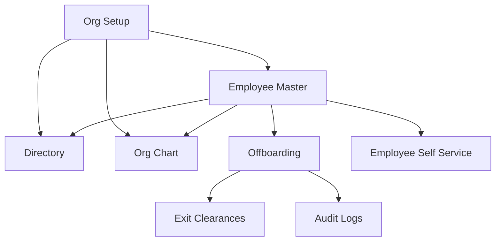
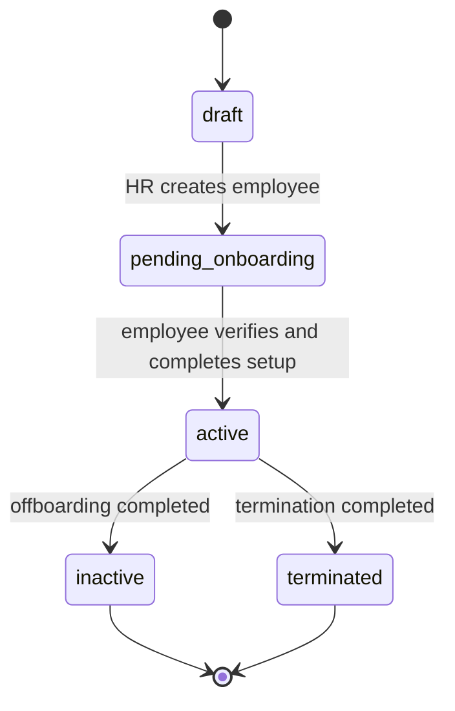
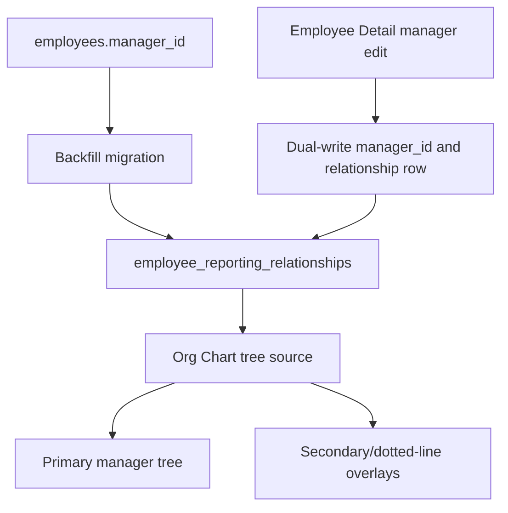
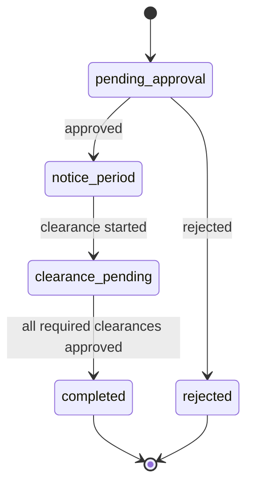
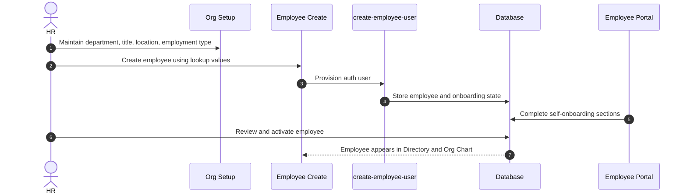
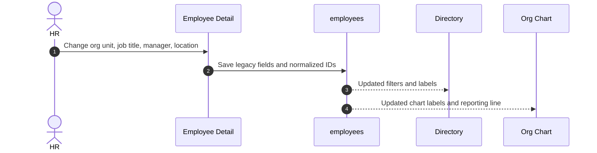
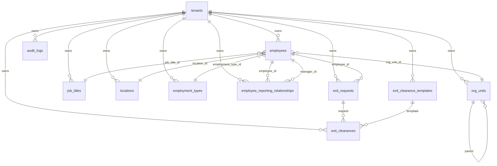

# People Suite Full Implementation Plan

This document is the implementation blueprint for completing the HRMS People Suite on the `updateSuggestion` branch.

It is written for:

- new developers joining the project
- AI coding agents that need reliable context
- HR/product reviewers validating whether the system behaves like a modern HRMS

Target backend:

```text
InsForge preview: https://rq3qmu8y-jx7.ap-southeast.insforge.app
Frontend branch: updateSuggestion
```

Do not use the older `doc` folder for this work. Treat the `new update doc` folder as the source of truth.

---

## Product Vision

The People Suite should feel like a complete HRMS foundation, not a set of disconnected screens.

The HR team should be able to:

- define the company structure
- create and activate employees
- maintain accurate employee records
- search the company directory
- understand reporting lines visually
- manage exits safely
- audit sensitive lifecycle changes

Employees should be able to:

- view their own profile and organization context
- find colleagues in the directory
- understand their team and reporting line
- track their exit process if offboarding is initiated

The system should support real organizations where departments change, managers change, people move locations, and offboarding needs proof, approvals, and audit history.

---

## Current Module Boundary



| Module | Purpose | Primary users |
| --- | --- | --- |
| Org Setup | Maintain organization lookup values and structure | HR |
| Employees | Employee master data and lifecycle | HR |
| Directory | Searchable people directory | HR and employees |
| Org Chart | Visual reporting structure | HR and employees |
| Offboarding | Resignation, termination, clearance, and exit completion | HR and employees |

---

## Target Experience

### 1. Org Setup

Org Setup is the administration area for company structure.

It should manage:

- org units
- job titles
- locations
- employment types
- reporting relationship readiness

Real-life example:

An HR admin creates this structure:

```text
TalentMesh Solutions
  Business Unit: Product Engineering
    Department: Frontend
    Department: Backend
  Business Unit: Operations
    Department: HR
    Department: Finance
```

Then HR adds:

- job title: Senior Software Engineer
- location: Bengaluru Office
- employment type: Full Time

When a new employee is created, HR selects these values instead of typing free-form strings.

#### Target Org Setup Behavior

| Feature | Target behavior |
| --- | --- |
| Org units | Hierarchical units with parent-child structure |
| Job titles | Stable titles with grade/level metadata |
| Locations | Employee work locations separate from attendance geofence offices |
| Employment types | Tenant-specific options such as full-time, intern, consultant |
| Archiving | Lookup rows are archived, not deleted |
| Usage protection | Lookups referenced by employees remain visible in history |
| Search | HR can search long lookup lists |
| Validation | Duplicate active names/codes should be prevented per tenant |

#### Current State

- `/hr/org-structure` exists.
- HR can maintain `org_units`, `job_titles`, `locations`, and `employment_types`.
- Employee forms already dual-write legacy fields plus normalized lookup IDs.

#### Remaining Implementation

1. Add duplicate prevention at database level where missing.
2. Add search and empty-state polish to the Org Setup UI.
3. Add dependency hints before archiving a lookup row.
4. Add optional sort ordering for org units.
5. Add future reporting-relationship management only after backfill from `employees.manager_id`.

---

### 2. Employees

Employees is the system of record for people.

It should support the full employee lifecycle:



Real-life example:

HR hires Priya Shah as a Frontend Engineer.

1. HR creates Priya with email, joining date, manager, department, job title, location, and employment type.
2. The system creates her auth account through the edge function.
3. Priya receives credentials or completes verification.
4. Priya completes self-onboarding sections.
5. HR reviews and activates the profile.
6. Priya appears in Directory and Org Chart.

#### Target Employee Fields

| Area | Examples |
| --- | --- |
| Identity | name, email, employee code, phone, profile photo |
| Employment | joining date, status, employment type, grade, probation status |
| Organization | org unit, job title, manager, secondary manager, location |
| Personal | date of birth, gender, address, emergency contact |
| Compliance | PAN, Aadhaar, bank details, documents |
| Access | auth user, role, portal access |

#### Target Employee Behavior

| Feature | Target behavior |
| --- | --- |
| Create employee | HR creates an employee with normalized lookup selections |
| Activate employee | HR can activate after verification/onboarding |
| Edit employee | HR can update profile and organization data safely |
| Employee code | Unique per tenant and searchable |
| Manager assignment | Prevent self-manager and circular reporting |
| Status changes | Sensitive transitions write audit logs |
| Legacy compatibility | Continue writing legacy text fields until deprecation |
| Bulk import | Future feature for onboarding many employees |

#### Current State

- `EmployeeCreate` writes legacy fields and normalized lookup IDs.
- `EmployeeDetail` edits and activates with the same dual-write strategy.
- Edge functions support employee user creation and verification.
- Legacy profile fields are preserved for compatibility.

#### Remaining Implementation

1. Add manager-cycle validation before saving manager changes.
2. Add audit events for key HR edits, especially manager, department, status, and role changes.
3. Add employee timeline/history panel.
4. Add document verification status if documents are used in onboarding.
5. Add bulk import only after field validation and duplicate rules are stable.

---

### 3. Directory

Directory is the everyday people search tool.

It should answer:

- Who is this person?
- What team are they in?
- Where do they work?
- Who is their manager?
- How do I contact them?

Real-life example:

An employee needs to contact someone from Finance.

They open Directory, filter Department = Finance, Location = Mumbai, and search "payroll".
They find the payroll specialist, view designation, manager, phone/email, and start a chat or email.

#### Target Directory Behavior

| Feature | Target behavior |
| --- | --- |
| Search | Search by name, email, employee code, title, department, location |
| Filters | Org unit, location, employment type, status, manager |
| Cards/list | Responsive view for desktop and mobile |
| Privacy | Employees see safe contact fields only |
| HR view | HR can see richer metadata and open employee detail |
| Employee view | Employees can browse active colleagues |
| Actions | Email, phone, chat, profile, org chart focus |

#### Current State

- Directory reads active employees.
- Filters support legacy strings and normalized lookup IDs.
- HR and employee portals share the Directory page.

#### Remaining Implementation

1. Add lookup labels consistently in all directory cards and tables.
2. Add manager and employment type filters.
3. Add a profile drawer for quick view without leaving Directory.
4. Add permission-aware field visibility.
5. Add empty-state guidance for HR when no employees match filters.

---

### 4. Org Chart

Org Chart is the visual map of reporting lines.

It should help HR and employees understand:

- who reports to whom
- team size
- department structure
- manager span of control
- open reporting issues

Real-life example:

The Head of Engineering wants to see all direct and indirect reports.

They open Org Chart, search their own name, focus the tree, and see Frontend, Backend, and QA team members. HR can spot that one employee has no manager assigned and fix it from Employee Detail.

#### Current Tree Decision

Org Chart currently uses:

- `employees.manager_id`
- `employees.secondary_manager_id`

It displays normalized labels from:

- `org_units`
- `job_titles`

Current decision:

Do not switch tree construction to `employee_reporting_relationships` yet.

Use `employee_reporting_relationships` later only after:

- backfill from `employees.manager_id`
- dual-write from employee edit forms
- validation that every active manager relation is represented
- conflict rules for dotted-line managers

#### Target Org Chart Behavior

| Feature | Target behavior |
| --- | --- |
| Tree view | Build company hierarchy from reporting relationships |
| Search | Find employee and focus their subtree |
| Labels | Show name, title, department/org unit, location, status |
| Manager view | Show direct reports and total reports |
| Data quality | Flag employees without managers or invalid manager cycles |
| Future dotted-line | Support secondary or project reporting |
| Export | Future export to image/PDF for HR review |

#### Org Chart Future Architecture



#### Remaining Implementation

1. Add manager-cycle detection utility.
2. Add data-quality banner showing employees without managers.
3. Add backfill migration for `employee_reporting_relationships`.
4. Add dual-write for manager changes only after backfill.
5. Move Org Chart read source from `manager_id` to active primary relationship rows.
6. Add dotted-line relationship display after primary manager migration is stable.

---

### 5. Offboarding

Offboarding is the controlled exit process.

It must be safe, auditable, and transactional because it changes employee status and company access.

Real-life example:

An employee resigns with a last working date of July 31.

1. HR initiates or approves the exit request.
2. The request moves into notice period.
3. IT confirms laptop return.
4. Finance confirms final settlement.
5. HR completes exit interview.
6. Admin confirms access card return.
7. HR completes offboarding.
8. The system marks the employee inactive and records audit logs.

#### Current Offboarding State Machine



#### Target Offboarding Behavior

| Feature | Target behavior |
| --- | --- |
| Exit request | HR or employee can initiate depending on policy |
| Approval | HR approves/rejects resignation requests |
| Notice period | Last working date and notice days are tracked |
| Clearance checklist | Template-driven clearances per tenant |
| Department ownership | IT, Finance, HR, Admin, Assets can own clearance items |
| Transaction safety | Clearance updates and final completion use RPCs |
| Employee view | Employee can track progress but not approve their own clearance |
| Audit | Every approval/completion writes audit history |
| Compatibility | Legacy boolean fields are mirrored until deprecation |

#### Current State

- `update_exit_clearance_transaction` handles clearance updates atomically.
- `complete_exit_transaction` completes employee exit atomically.
- `exit_clearances` is the normalized clearance foundation.
- Legacy clearance booleans are still mirrored for compatibility.
- Employee `MyExit` reads normalized clearances with fallback.

#### Remaining Implementation

1. Add permission-aware clearance ownership if department-level approvers are introduced.
2. Add exit-interview form support if HR wants structured feedback.
3. Add final settlement status if payroll is connected.
4. Add reports for pending clearances by department.
5. Deprecate direct legacy boolean writes only after every view/report reads `exit_clearances`.

---

## End-To-End Real-Life Workflows

### Workflow A: New Hire To Active Employee



Acceptance criteria:

- Employee appears in active Directory after activation.
- Employee appears under the selected manager in Org Chart.
- Employee profile stores both legacy text fields and normalized lookup IDs.
- Employee can access their portal after verification.

### Workflow B: Employee Changes Department



Acceptance criteria:

- Old free-text fields remain compatible.
- Directory filters match the new org unit/location.
- Org Chart displays updated title and org unit.
- Manager change does not create circular reporting.

### Workflow C: Employee Exit

```mermaid
sequenceDiagram
    autonumber
    actor HR as HR
    actor EMPLOYEE as Employee
    participant OFF as Offboarding UI
    participant RPC as Transactional RPC
    participant EC as exit_clearances
    participant ER as exit_requests
    participant AUD as audit_logs

    HR->>OFF: Initiate exit with last working date
    EMPLOYEE->>OFF: Tracks exit progress
    HR->>RPC: Approve IT clearance
    RPC->>EC: Upsert clearance row
    RPC->>ER: Mirror legacy clearance boolean
    RPC->>AUD: Write clearance event
    HR->>RPC: Complete offboarding
    RPC->>ER: Mark request completed
    RPC->>ER: Mark employee inactive
    RPC->>AUD: Write completion event
```

Acceptance criteria:

- Employee cannot be completed while required clearances are pending.
- Final completion marks employee inactive in the same transaction.
- Audit log records sensitive steps.
- Employee self-service shows the latest clearance state.

---

## Data Model Target



Important compatibility rule:

Keep the legacy employee fields until the full UI and reporting layer no longer depends on them.

Legacy fields:

- `department`
- `designation`
- `employment_type`
- `work_location`
- `manager_id`
- `secondary_manager_id`
- clearance boolean columns on `exit_requests`

Normalized fields:

- `org_unit_id`
- `job_title_id`
- `location_id`
- `employment_type_id`
- `employee_reporting_relationships`
- `exit_clearances`

---

## Security And Permissions

| Actor | Should be allowed |
| --- | --- |
| HR | Manage employees, org setup, offboarding, directory, org chart |
| Employee | View own profile, active directory, org chart, own exit status |
| Manager | Future: view team details and approve selected workflows |
| Superadmin | Tenant/company administration only |

Rules:

- RLS must enforce tenant isolation.
- HR-only writes should use `is_hr()` or equivalent server-side checks.
- Sensitive lifecycle changes should use RPC or edge functions.
- Client-side checks are convenience only, not security.

Sensitive actions that should be audited:

- employee creation
- employee activation
- manager changes
- status changes
- role changes
- offboarding initiation
- clearance approval/rejection
- offboarding completion

---

## Implementation Roadmap

### Phase 1: Stabilize Current People Foundation

Goal:

Make current Employees, Directory, Org Chart, Org Setup, and Offboarding consistent and safe.

Tasks:

1. Add duplicate constraints/indexes for active lookup rows where missing.
2. Add manager-cycle validation before manager changes.
3. Add consistent lookup label rendering in Employee List, Directory, Detail, and Org Chart.
4. Add audit events for employee lifecycle edits.
5. Add smoke tests or manual QA checklist for the people workflows.

Definition of done:

- No employee edit can create a self-manager or circular manager chain.
- Lookup-based labels appear consistently.
- Build passes.
- `db migrations up --all` reports no pending local migrations.

### Phase 2: Complete Org Setup

Goal:

Make Org Setup a reliable HR administration surface.

Tasks:

1. Add search/filter in each Org Setup tab.
2. Add active/archived filters.
3. Show usage count for each lookup row.
4. Warn before archiving a lookup used by active employees.
5. Add org-unit hierarchy view.

Definition of done:

- HR can maintain all lookup data without direct SQL.
- Archiving a lookup does not break existing employees.
- HR understands whether a lookup is currently in use.

### Phase 3: Improve Employee Master

Goal:

Make employee records complete enough for daily HR work.

Tasks:

1. Add employee lifecycle timeline.
2. Add change history for key profile fields.
3. Add profile completeness indicators.
4. Add manager and department transfer flow.
5. Add bulk import planning only after validations are stable.

Definition of done:

- HR can understand who changed important fields and when.
- Employee record is the single place to inspect lifecycle state.

### Phase 4: Upgrade Directory

Goal:

Make Directory the daily people discovery tool.

Tasks:

1. Add quick profile drawer.
2. Add manager, employment type, and status filters.
3. Add privacy-aware field visibility.
4. Add action buttons for email, phone, chat, and org chart focus.
5. Add mobile-first polish.

Definition of done:

- Employees can find colleagues quickly.
- HR can jump from Directory to Employee Detail.
- Sensitive fields are not exposed to ordinary employees.

### Phase 5: Upgrade Org Chart

Goal:

Move Org Chart toward a proper relationship model without breaking current manager fields.

Tasks:

1. Add data quality warnings for missing managers and cycles.
2. Backfill `employee_reporting_relationships` from `employees.manager_id`.
3. Dual-write manager changes to `manager_id` and active relationship rows.
4. Switch Org Chart reads to active primary relationships.
5. Add secondary/dotted-line relationship display.

Definition of done:

- Org Chart can be generated from relationship rows.
- Existing `manager_id` behavior remains compatible during migration.
- Dotted-line reporting can be added without changing employee master shape again.

### Phase 6: Complete Offboarding

Goal:

Make offboarding robust enough for real exits.

Tasks:

1. Add pending-clearance reports by department.
2. Add structured exit interview fields if required.
3. Add final settlement integration points for payroll.
4. Add department-level clearance ownership if needed.
5. Remove direct UI writes to legacy clearance booleans only after all readers use `exit_clearances`.

Definition of done:

- HR can track every exit from initiation to completion.
- Employees can see their own exit progress.
- Clearance updates and final completion remain transactional.
- Legacy boolean deprecation has a separate migration and rollback plan.

---

## AI Agent Guidance

When an AI agent works on this area, follow these rules:

1. Use only files in `new update doc` for architecture context.
2. Confirm the frontend branch is `updateSuggestion`.
3. Target the InsForge preview backend at `https://rq3qmu8y-jx7.ap-southeast.insforge.app`.
4. Before changing InsForge application code, inspect current SDK usage in the repo.
5. Before changing InsForge infrastructure, use InsForge CLI/docs and verify migration state.
6. Do not restore files from `migration-archive/pending-review` unless the user explicitly asks for a reviewed single-file restore.
7. Preserve legacy fields until a documented deprecation phase.
8. Prefer additive schema and UI changes.
9. Use transactional RPCs for sensitive offboarding state changes.
10. Run `npm run build` after frontend changes.
11. Run `npx @insforge/cli db migrations up --all` after migration changes.

Safe default:

If unsure, document the decision and keep compatibility rather than removing fields or changing live behavior.

---

## QA Checklist

### Org Setup

- HR can create, edit, archive, and restore org units.
- HR can create, edit, archive, and restore job titles.
- HR can create, edit, archive, and restore locations.
- HR can create, edit, archive, and restore employment types.
- Archived values do not appear in new employee selection lists.
- Existing employees referencing archived values still render safely.

### Employees

- HR can create employee with lookup values.
- HR can edit employee lookup values.
- HR can activate employee.
- Employee appears in Directory after activation.
- Employee appears in Org Chart under the selected manager.
- Self-manager is blocked.
- Circular manager chain is blocked.

### Directory

- Search works by name and email.
- Filters work by org unit and location.
- Legacy department/location filters still work for older employees.
- Employee role does not expose HR-only fields.

### Org Chart

- Root employees render.
- Employees with managers render under managers.
- Normalized org-unit and job-title labels display when present.
- Legacy labels display when lookup IDs are missing.
- Missing manager/cycle issues are detected before relationship migration.

### Offboarding

- HR can initiate exit.
- Employee can view own exit status.
- HR can update clearances.
- Clearance updates create/modify `exit_clearances`.
- Legacy clearance booleans remain mirrored.
- Completion marks employee inactive.
- Completion writes audit log.

---

## What Perfect Looks Like

A market-quality HRMS People Suite should feel boring in the best way: predictable, safe, and easy.

For HR:

- They should not need SQL to maintain departments, titles, locations, or employment types.
- They should not wonder whether a clearance checkbox actually saved.
- They should be able to explain any employee's current status from one profile.
- They should be able to see the organization structure without spreadsheet work.

For employees:

- They should know who their manager is.
- They should find colleagues quickly.
- They should see their own exit progress transparently.
- They should not see private HR-only information.

For developers:

- The data model should be understandable.
- Legacy compatibility should be explicit.
- Sensitive workflows should be transactional.
- Migration history should remain clean.
- Each release should have a clear rollback and QA path.

That is the bar for completing Employees, Directory, Org Chart, Org Setup, and Offboarding.
