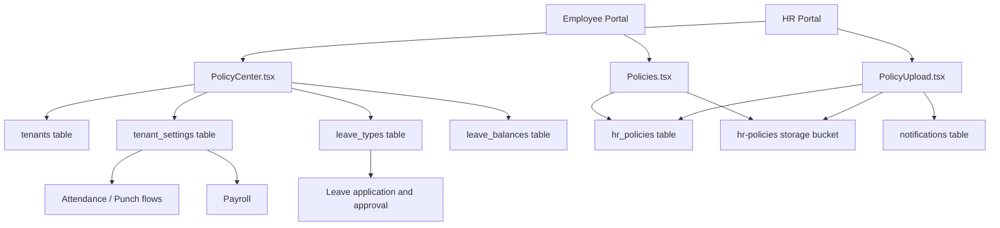
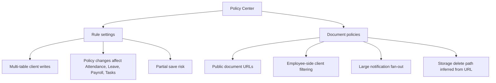
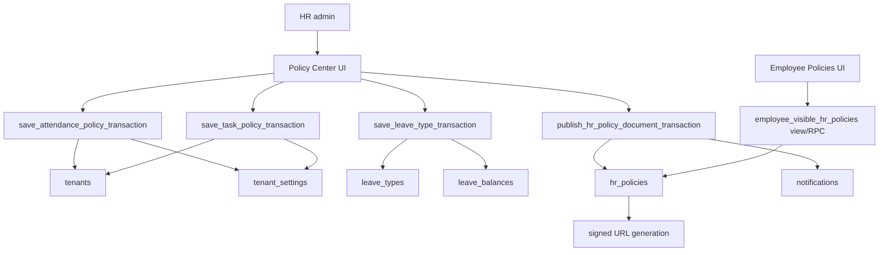
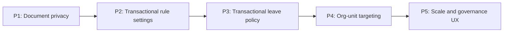

# Policy Center Audit And Implementation Plan

Target:

```text
Frontend branch: updateSuggestion
InsForge preview: https://rq3qmu8y-jx7.ap-southeast.insforge.app
```

Source rules:

- Use this `new update doc` folder as the source of truth.
- Do not use the old `doc` folder for Policy Center work.
- Keep the completed People Suite stable. Do not mix Policy Center changes with People Suite hotfixes unless a bug directly crosses both areas.

## Executive Summary

Policy Center is not yet at the same hardening level as the completed People Suite.

The current implementation is useful and already covers important HRMS configuration areas, but several flows still use client-side multi-write operations, public document URLs, and broad employee-side document reads that are filtered in React.

Recommended status:

```text
Policy Center: Functional, but not production-hardened yet
Next action: implement focused hardening releases before calling it best-HRMS production ready
```

## Scope Audited

Frontend files:

- `src/hr/PolicyCenter.tsx`
- `src/hr/PolicyUpload.tsx`
- `src/hr/Settings.tsx`
- `src/employee/Policies.tsx`
- `src/utils/policyValidation.ts`
- `src/App.tsx`

Database and migration references:

- `tenant_settings`
- `tenants`
- `leave_types`
- `leave_balances`
- `hr_policies`
- `notifications`
- `audit_logs`
- `insforge-enterprise-03-restrictive.sql`
- `insforge-task-policy-hardening.sql`
- People Suite migrations that already read `tenant_settings` and `leave_types`

Related modules consuming Policy Center:

- Employee Punch In/Out
- HR Attendance
- Employee My Leaves
- HR Leave Management
- Payroll Run
- Employee Policies
- HR Policy Upload

## Current Architecture



## Module Boundary

| Area | Current surface | Purpose |
| --- | --- | --- |
| Rule Policy Center | `/hr/policy-center` | Attendance, leave, salary, task, and company settings |
| Document Policy Management | `/hr/policies` | Upload and manage policy documents/handbooks |
| Employee Policy Library | `/employee/policies` | Employee reads/downloads visible HR policy documents |
| Legacy Settings route | `/hr/settings` | Redirects to `/hr/policy-center` |

Important routing note:

- `src/App.tsx` routes `/hr/settings` to `/hr/policy-center`.
- `src/hr/Settings.tsx` still exists but is not the active route.
- Future work should avoid reviving `Settings.tsx` accidentally unless there is a deliberate migration plan.

## Risk Map



## Findings

### P0: Policy Document Access Uses Public URLs

Current behavior:

- HR uploads documents to `hr-policies` storage.
- `hr_policies.file_url` stores a directly usable URL.
- HR preview uses Google Docs Viewer in `PolicyUpload.tsx`.
- Employee preview uses direct iframe URL in `Policies.tsx`.

Why this matters:

If the storage bucket is public, anyone with the URL can download the policy document. Some policy documents may contain internal rules, compensation policies, disciplinary processes, or compliance documents that should not be public.

Real HRMS example:

An employee forwards a policy document URL externally. If the URL is public and never expires, the document remains accessible outside the company.

Safe target:

- Store `storage_path` in `hr_policies`.
- Keep buckets private where InsForge supports private object access.
- Generate short-lived signed URLs for preview/download.
- Never depend on Google Docs Viewer for sensitive internal documents unless documents are intentionally public.

Status:

```text
Needs change before best-HRMS production readiness.
```

### P0: Employee Policy Library Filters Department Policies Client-Side

Current behavior in `src/employee/Policies.tsx`:

```ts
db.from("hr_policies")
  .select("*")
  .eq("tenant_id", tenantId)
  .in("visible_to", ["all", "department-specific"])
```

Then React filters department-specific records locally:

```ts
p.department_filter === employee.department
```

Why this matters:

Employees can receive policy rows for departments they do not belong to in the network payload, then the UI hides them. That repeats the same privacy pattern we already fixed in People Suite Directory.

Real HRMS example:

Finance uploads a department-specific payroll audit policy. An Engineering employee should not receive that record in the browser payload.

Safe target:

- Move visibility filtering server-side using a view or RPC.
- Employee policy read path should return only:
  - `visible_to = 'all'`
  - `visible_to = 'department-specific'` and matching the employee's department or org unit
  - never `hr_only`

Status:

```text
Needs change before best-HRMS production readiness.
```

### P0: Rule Policy Saves Are Multi-Step Client Writes

Current behavior:

- Attendance policy saves update `tenants`, then multiple `tenant_settings` rows.
- Task policy saves update `tenants`, then task settings.
- Leave type creation writes `leave_types`, then creates `leave_balances`.
- Leave type edits recalculate balance rows client-side in a loop.
- Salary templates are stored as `tenant_settings` JSON values.

Why this matters:

If one write succeeds and a later write fails, the policy state can become partially updated.

Real HRMS example:

HR saves attendance policy. `tenants.punch_in_start` updates, but `tenant_settings.geofence_enabled` fails. Employees see a different punch window but old geofence behavior.

Safe target:

- Use transactional RPCs for changes touching multiple rows/tables.
- Keep the frontend as form state and RPC caller, not the policy transaction engine.

Status:

```text
Needs phased hardening. Highest priority for attendance/task and leave type saves.
```

### P1: Leave Type Save Can Create Leave Balance Drift

Current behavior:

- Creating a leave type inserts `leave_types`.
- Then it fetches active employees.
- Then it upserts `leave_balances`.
- Editing `days_per_year` recalculates existing balance rows client-side.

Why this matters:

Leave policy updates affect payroll and employee balances. A failed partial update can make balances inconsistent.

Real HRMS example:

HR changes Sick Leave from 6 to 8 days. Some employee balances update, then the network fails. HR sees the leave type as 8 days, but some employees still have 6.

Safe target:

- Create `save_leave_type_transaction`.
- Create `initialize_leave_balances_transaction`.
- Do balance insert/recalculation inside the database with row locks and audit logging.

Status:

```text
Needs transactional backend hardening.
```

### P1: Policy Center Has Optimistic Concurrency, But Only In The Client

Current behavior:

- `PolicyCenter.tsx` checks `updated_at` before saving many settings.
- It throws `STALE_WRITE` if another admin changed the row.

What is good:

- The UI is already trying to prevent silent overwrites.

Remaining gap:

- The concurrency check is not centralized in database RPCs.
- Multiple rows are checked/updated sequentially from the browser.

Safe target:

- Move concurrency checks into transactional RPCs.
- Pass expected `updated_at` values or a policy version token.
- Return a clear stale-write error.

Status:

```text
Good UI guard, but not enough for production-grade policy transactions.
```

### P1: Notification Fan-Out On Policy Upload Can Fail At Scale

Current behavior in `PolicyUpload.tsx`:

- Upload document.
- Insert `hr_policies`.
- Query target active employees.
- Insert one notification per target employee in one browser request.

Why this matters:

For thousands of employees, this can hit payload size limits or timeouts.

Real HRMS example:

HR uploads an annual handbook for all employees in a 5,000-person tenant. Browser inserts 5,000 notifications and fails halfway or times out.

Safe target:

- Move upload metadata + notification fan-out to an RPC or background job.
- For large tenants, insert notifications in batches server-side.
- Consider digest/in-app announcement model instead of one row per employee for every global policy.

Status:

```text
Works for small tenants, needs scale hardening.
```

### P1: Policy Delete Infers Storage Path From URL

Current behavior:

```ts
const pathParts = deletePolicyItem.file_url.split("/hr-policies/");
```

Why this matters:

If the storage URL format changes, delete can remove the database row but fail to remove the storage object, causing orphaned files and storage growth.

Safe target:

- Add `hr_policies.storage_path`.
- Store it at upload time.
- Delete using `storage_path`, not URL parsing.

Status:

```text
Needs schema cleanup.
```

### P1: Department Options Are Legacy Static Values

Current behavior:

- `PolicyUpload.tsx` uses static department values:
  - `sales`
  - `dev`
  - `marketing`
  - `operations`
  - `design`
  - `other`
- Salary templates also use the same static departments.

Why this matters:

People Suite now uses normalized `org_units`. Policy Center should not keep creating new policy surfaces based only on old legacy department strings.

Real HRMS example:

HR creates an Org Unit called `Finance` in Org Setup, but Policy Upload cannot target Finance because it is not in the static list.

Safe target:

- Department-specific policies should support normalized `org_unit_id`.
- Keep legacy `department_filter` during compatibility.
- New UI should load active `org_units`.

Status:

```text
Needs gradual migration to normalized org structure.
```

### P1: Salary Templates Stored As Dynamic `tenant_settings` JSON

Current behavior:

- Salary templates are stored as keys like `salary_template_sales`.
- Values are JSON strings.

Why this matters:

JSON-in-settings is hard to validate, audit, query, and enforce. Payroll-grade configuration should be structured.

Safe target:

- Create `salary_templates` table in a payroll-focused release.
- Keep `tenant_settings` JSON as compatibility during migration.

Status:

```text
Acceptable for preview, not ideal for payroll-grade production.
```

### P2: Legacy `Settings.tsx` Still Exists

Current behavior:

- `/hr/settings` redirects to `/hr/policy-center`.
- `src/hr/Settings.tsx` still exists with overlapping settings functionality.

Why this matters:

Future agents may edit or route to the old settings page accidentally, causing policy behavior drift.

Safe target:

- Keep route redirect.
- Add documentation comment or archive the old component after confirming it is unused.
- Do not maintain two settings engines.

Status:

```text
Documentation cleanup recommended.
```

## What Is Working Well

- Policy Center has clear module tabs.
- Attendance, leave, salary, task, and company settings are centralized.
- Validation exists in `policyValidation.ts`.
- Unsaved changes/stale-write UX exists.
- Audit events are emitted for settings updates and policy upload/delete.
- `/hr/settings` already redirects to the active Policy Center.
- People Suite employee creation already reads `tenant_settings` and `leave_types`, so leave seeding is partly integrated.
- Punch In/Out reads policy settings for geofence, selfie, remote handling, and task gate behavior.
- Payroll reads salary policy settings and snapshots key values into payroll calculations.

## Target Production Architecture



## Recommended Safe Release Plan

Detailed agent-ready plans have been created for each release:

1. `new update doc/policy_center_release_p1_document_privacy_plan.md`
2. `new update doc/policy_center_release_p2_transactional_rule_settings_plan.md`
3. `new update doc/policy_center_release_p3_transactional_leave_policy_plan.md`
4. `new update doc/policy_center_release_p4_org_unit_policy_targeting_plan.md`
5. `new update doc/policy_center_release_p5_scale_operational_ux_plan.md`
6. `new update doc/policy_center_full_release_roadmap.md`

Required order:



### Release P1: Policy Document Privacy (COMPLETED)

Goal:

Stop exposing non-visible policy metadata and prepare for private/signed document URLs.

Status:
- **Completed**: July 2026.
- **Migration**: Applied `migrations/20260706190000_policy-documents-privacy-foundation.sql`.
- **Changes**: Added `hr_policies.storage_path`, backfilled existing rows, modified `PolicyUpload.tsx` to insert `storage_path` and delete using `storage_path` (with `extractPathFromUrl` fallback), implemented `get_employee_visible_hr_policies()` RPC, and modified employee `Policies.tsx` to call the RPC, eliminating client-side department filtering.
- **Signed URL Status**: The `hr-policies` storage bucket remains public because signed URLs are not yet available in the InsForge client storage SDK. This is deferred as a documented accepted risk.

Definition of done:

- Employee network response does not include HR-only or other-department policies.
- Delete no longer depends on splitting `file_url`.
- Upload rollback still removes orphaned storage files if DB insert fails.

### Release P2: Transactional Rule Settings (COMPLETED)

Goal:

Make attendance and task policy saves atomic.

Status:
- **Completed**: July 2026.
- **Migration**: Applied `migrations/20260706200000_policy-center-rule-settings-rpcs.sql`.
- **Changes**:
  - Created `save_attendance_policy_transaction` RPC: locks tenant row, checks stale `updated_at` for tenant and all 24 attendance setting keys, validates enum values and geofence constraints, updates `tenants` (punch times, work hours, lunch) and upserts all `tenant_settings` attendance keys in a single transaction, writes one `settings.updated` audit log, and returns `tenant_updated_at` + `setting_versions` map.
  - Created `save_task_policy_transaction` RPC: locks tenant row, checks stale versions for `task_eod_redmark_time` and `task_grace_period_minutes`, validates time format and grace minutes, updates `tenants.punch_out_gate_enabled` and upserts task settings atomically, writes one `settings.updated` audit log, returns updated version tokens.
  - Replaced `saveAttendancePolicy` internals in `PolicyCenter.tsx`: removed multi-step client writes, now calls `db.rpc("save_attendance_policy_transaction")`, updates `tenantUpdatedAt` and `settingUpdatedAtMap` from RPC response.
  - Replaced `saveTaskPolicy` internals in `PolicyCenter.tsx`: removed multi-step client writes, now calls `db.rpc("save_task_policy_transaction")`, updates version tokens from RPC response.
  - Updated `classifyDbError` to handle RPC-raised prefixes: `STALE_WRITE:`, `PERMISSION_DENIED:`, `INVALID_POLICY_VALUE:`.
  - Updated `toastSaveError` to handle new `"invalid"` category, surfacing the RPC's detail message.
  - `saveSettingRows` retained for leave and salary policy tabs (unchanged per P2 scope).
- **Build**: `tsc -b && vite build` passed clean (869.56 kB JS bundle).

Definition of done:

- Attendance policy cannot partially save tenant timings without matching settings. ✅
- Task gate cannot partially save between `tenants.punch_out_gate_enabled` and task settings. ✅
- Stale writes are blocked inside the database. ✅
- Build passes. ✅
- Migration applies successfully. ✅

### Release P3: Transactional Leave Policy And Balances (COMPLETED)

Goal:

Make leave type creation/editing and leave balance initialization atomic.

Status:
- **Completed**: July 2026.
- **Migration**: Applied `migrations/20260706210000_policy-center-leave-transactions.sql`.
- **Changes**:
  - Implemented `compute_initial_leave_balance` proration helper on the server, matching the exact React calculations.
  - Implemented `save_leave_type_transaction` RPC: validates name, code (max 5 chars), days_per_year, accrual_type, and other fields. Locks leave type row for update to stale-check `updated_at`. Prevents active duplicate code/name rows per tenant. On creation, seeds prorated current-year balances. On edits to `days_per_year` or `accrual_type`, recalculates balances, preserves `used_days`/`pending_days`, and prevents negative balances. Writes audit log.
  - Implemented `deactivate_leave_type_transaction` RPC: locks row, stale-checks, sets `is_active = false`, writes audit log.
  - Implemented `initialize_leave_balances_transaction` RPC: seeds missing combinations for target year, writes audit log.
  - Updated `PolicyCenter.tsx` (`saveLeaveType`, `deactivateLeaveType`, `setupDefaultLeaveTypes`, and `initializeLeaveBalances`) to call the RPC transactions, removing client-side DB loops and mutations.
- **Build**: `tsc -b && vite build` passed clean.

Definition of done:

- Creating a leave type cannot leave missing balances. ✅
- Updating `days_per_year` cannot partially update employee balances. ✅
- HR gets clear stale-write and validation errors. ✅
- Build passes. ✅
- Migration applies successfully. ✅

### Release P4: Normalize Policy Targeting To Org Units (COMPLETED)

Goal:

Align Policy Center with the completed People Suite organization structure.

Status:
- **Completed**: July 2026.
- **Migration**: Applied `migrations/20260706220000_policy-center-org-unit-targeting.sql`.
- **Changes**:
  - Added `org_unit_id` column to `public.hr_policies` referencing `public.org_units(id)`.
  - Created performance index `idx_hr_policies_tenant_org_unit` on `(tenant_id, org_unit_id)`.
  - Re-created `get_employee_visible_hr_policies()` RPC to match employee's `org_unit_id` with `org_unit_id` targeted policies, and support legacy `department_filter` fallback (matching employee's `department` when `org_unit_id` is null on the policy row). Returns `org_unit_id` and joined `org_unit_name` fields.
  - Updated `src/types/index.ts` (`HRPolicy` and `EmployeeVisibleHRPolicy` interfaces) to include optional `org_unit_id` and `org_unit_name`.
  - Modified `src/hr/PolicyUpload.tsx`:
    - Added loading of active `org_units` from database.
    - Updated UI dropdown to allow targeting Specific Org Unit if org units are active, falling back to legacy departments list otherwise.
    - Updated `handleUpload` to write `org_unit_id` and notify active employees targeted via `org_unit_id` or `department` fallback.
    - Updated visibility column in policy library table to display target org unit name or legacy department target.
  - Left salary templates unchanged (as Option A) to separate payroll-grade changes and focus on document privacy.
- **Build**: `tsc -b && vite build` passed clean.

Definition of done:

- HR can target policy documents to real Org Setup units. ✅
- Legacy department-based policies still work. ✅
- Build passes. ✅
- Migration applies successfully. ✅

### Release P5: Policy Center Scale And Operational UX (COMPLETED)

Goal:

Make Policy Center safe for larger tenants and operational review.

Status:
- **Completed**: July 2026.
- **Migration**: Applied `migrations/20260706230000_policy-center-scale-governance.sql`.
- **Changes**:
  - Added versioning, effective dates, expiry dates, requires_acknowledgement, and supersedes_policy_id columns to `hr_policies`.
  - Created `employee_policy_acknowledgements` table with UNIQUE constraints to prevent duplicate entries and enabled RLS (HR reads all, Employees manage own, Restrictive tenant fence).
  - Created `create_policy_notifications_transaction` RPC for server-side fan-out of notifications in a single transaction (no more browser bulk inserts).
  - Created `get_hr_policy_library` RPC returning paginated policy rows matching search queries/visibility filters with total counts and acknowledgement statistics.
  - Created `acknowledge_policy_transaction` RPC validating policy visibility to the calling employee and recording the acknowledgement.
  - Updated `get_employee_visible_hr_policies` to return paginated policies with acknowledgement status joined, version numbers, and expiry status.
  - Updated `PolicyUpload.tsx` with version/governance controls, search filter, visibility filter, pagination controls, version update modal/flow, and server-side RPC bindings.
  - Updated employee `Policies.tsx` with search, pagination, version badges, current/expired badges, and interactive acknowledgement panel.
  - Updated `PolicyCenter.tsx` with operational impact warning callouts (ShieldAlert) in Attendance, Leave, Salary, and Task tabs.
- **Build**: `tsc -b && vite build` passed clean.

Definition of done:

- Uploading a policy for 1k+ employees does not rely on a single browser bulk insert. ✅
- HR can understand which policy changes affect attendance, leave, or payroll before saving. ✅
- Policy documents support versions/effective dates. ✅
- Employee acknowledgements are tracked. ✅
- HR and employee policy libraries paginate. ✅
- Build passes. ✅
- Migration applies successfully. ✅

## QA Checklist For Current Policy Center

Before implementing changes, reproduce current issues:

1. Login as HR and open `/hr/policy-center`.
2. Save Attendance policy and verify `tenants` plus `tenant_settings` are both updated.
3. Simulate stale write with two HR sessions and verify one save is blocked.
4. Create a leave type and verify every active employee gets a leave balance.
5. Edit leave type `days_per_year` and verify balances recalculate consistently.
6. Upload a policy for `all` employees and verify notifications are created.
7. Upload a department-specific policy and inspect employee network payload from another department.
8. Delete a policy and verify both DB row and storage object are removed.
9. Open employee `/employee/policies` and verify HR-only policies do not appear.
10. Verify whether the file URL is public and directly accessible in a fresh unauthenticated browser session.

## Immediate Recommendation

Do not call Policy Center production-hardened yet.

Proceed with Release P1 first:

```text
Policy Document Privacy
```

Reason:

- It is the clearest privacy risk.
- It mirrors the People Suite Directory privacy problem already solved.
- It has a contained blast radius compared with attendance/payroll rule transactions.

After P1, implement P2 and P3 before considering the rule-setting engine production-grade.

## AI Agent Instructions

When working on Policy Center:

1. Use only `new update doc` for architecture context.
2. Keep the completed People Suite stable.
3. Do not revive `src/hr/Settings.tsx` unless explicitly requested.
4. Do not trust client-side filtering for policy visibility.
5. Do not add new multi-table client write flows.
6. Prefer RPCs for settings changes that touch `tenants`, `tenant_settings`, `leave_types`, or `leave_balances`.
7. Keep legacy `department_filter` until normalized `org_unit_id` policy targeting is fully rolled out.
8. Run `npm run build` after frontend changes.
9. Run `npx @insforge/cli db migrations up --all` after migration changes.
10. Update this document after every Policy Center release.
