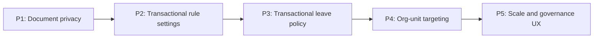

# Policy Center Full Release Roadmap

Target:

```text
Frontend branch: updateSuggestion
InsForge preview: https://rq3qmu8y-jx7.ap-southeast.insforge.app
```

This is the execution index for hardening Policy Center to the same standard as the completed People Suite.

Use only `new update doc` for context.

## Release Order



## Plans

1. `new update doc/policy_center_release_p1_document_privacy_plan.md`
2. `new update doc/policy_center_release_p2_transactional_rule_settings_plan.md`
3. `new update doc/policy_center_release_p3_transactional_leave_policy_plan.md`
4. `new update doc/policy_center_release_p4_org_unit_policy_targeting_plan.md`
5. `new update doc/policy_center_release_p5_scale_operational_ux_plan.md`

## Why This Order

### P1 First

Document privacy is the clearest risk because the QA walkthrough confirmed `hr-policies` storage is public and direct URLs are downloadable without authentication.

### P2 Second

Attendance and task policy saves affect daily work immediately. They should become transactional before deeper leave/payroll work.

### P3 Third

Leave policy affects employee balances and payroll. It needs careful transaction work after the simpler rule-setting RPC pattern exists.

### P4 Fourth

Org-unit targeting depends on the People Suite org structure and should be done after the core document and policy transaction foundations are safer.

### P5 Last

Versioning, acknowledgements, pagination, fan-out, and impact previews are best-HRMS features. They are important, but they should build on secure storage and transactional policy saves.

## Production Readiness Criteria

Policy Center can be called production-hardened when:

1. Policy documents are not permanently exposed through public URLs, or the public bucket risk is explicitly accepted by product/security.
2. Employee policy metadata is filtered server-side.
3. Attendance/task settings save atomically.
4. Leave type and balance changes save atomically.
5. Org-unit targeting works with legacy fallback.
6. Large policy notification fan-out does not depend on one browser request.
7. Policy library supports pagination for large tenants.
8. Critical policy changes are audited.
9. QA passes for HR and employee policy flows.
10. `new update doc/policy_center_audit_and_implementation_plan.md` is updated after each release.

## Agent Rules

1. Do not implement P2 before P1 unless the user explicitly changes priority.
2. Do not make storage private until signed URL behavior is verified.
3. Do not remove legacy `department_filter` until org-unit targeting is fully verified.
4. Do not remove `src/hr/Settings.tsx` unless the route and references are audited first.
5. Keep People Suite stable.
6. Run `npm run build` after frontend changes.
7. Run `npx @insforge/cli db migrations up --all` after DB changes.

