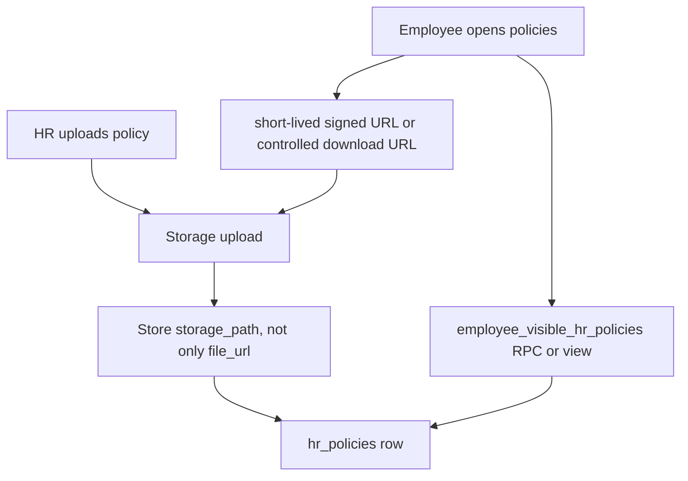

# Policy Center Release P1 Implementation Plan: Document Privacy And Visible Policy Reads

Target:

```text
Frontend branch: updateSuggestion
InsForge preview: https://rq3qmu8y-jx7.ap-southeast.insforge.app
```

Source of truth:

- `new update doc/policy_center_audit_and_implementation_plan.md`
- `new update doc/people_suite_edge_case_hardening_plan.md`
- `new update doc/people_suite_architecture_and_developer_guide.md`

Do not use the old `doc` folder.

## Goal

Make HR policy documents safe for production-style access by removing URL-derived storage behavior, preparing for signed/private document access, and making employee policy reads explicitly server-safe.

This release focuses on:

- `src/hr/PolicyUpload.tsx`
- `src/employee/Policies.tsx`
- `hr_policies`
- `hr-policies` storage bucket behavior

## Current Verified State

From QA walkthrough:

- Department-specific rows are already protected by a live DB RLS policy named `policies_visible_to_all`.
- The employee UI still does redundant local filtering in `src/employee/Policies.tsx`.
- The `hr-policies` storage bucket is public.
- Uploaded document URLs are directly downloadable without authentication.

Conclusion:

```text
The urgent production risk is public document object access.
The policy metadata read path should still be cleaned up for clarity and future safety.
```

## Production-Grade Target



## Database Changes

Create migration:

```text
migrations/20260706140000_policy-documents-privacy-foundation.sql
```

Timestamp can be adjusted if newer migrations exist.

### Step 1: Add Storage Path Column

```sql
alter table public.hr_policies
add column if not exists storage_path text;
```

Optional but recommended:

```sql
create index if not exists idx_hr_policies_tenant_visible_created
on public.hr_policies (tenant_id, visible_to, created_at desc);

create index if not exists idx_hr_policies_tenant_department
on public.hr_policies (tenant_id, department_filter)
where department_filter is not null;
```

### Step 2: Backfill `storage_path`

Backfill where possible from existing `file_url`.

Expected URL patterns may vary, so make this conservative:

```sql
update public.hr_policies
set storage_path = split_part(file_url, '/hr-policies/', 2)
where storage_path is null
  and file_url like '%/hr-policies/%';
```

If this does not work for current InsForge URLs, write a safer PL/pgSQL expression or leave unparseable rows null and document them.

### Step 3: Add Safe Employee Read RPC

Preferred over a normal view because visibility depends on the current employee.

Create:

```text
public.get_employee_visible_hr_policies()
```

Return only safe metadata:

- `id`
- `tenant_id`
- `title`
- `description`
- `file_name`
- `visible_to`
- `department_filter`
- `created_at`
- `updated_at`

Do not return private storage internals unless needed:

- avoid returning `storage_path` to standard employees
- avoid returning `uploaded_by` unless product needs it
- avoid returning `file_url` once signed URL flow is ready

Visibility rules:

```sql
visible_to = 'all'
or (
  visible_to = 'department-specific'
  and department_filter = current_employee.department
)
```

Never return:

```sql
visible_to = 'hr_only'
```

Use existing tenant helpers:

- `public.get_auth_tenant_id()`
- current auth user id helper used elsewhere in the project
- current employee lookup from `employees.user_id`

### Step 4: Signed URL Strategy

Check InsForge SDK support before implementing.

If signed URLs are supported:

- Add an RPC or edge/server helper to authorize document access and return a short-lived signed URL.
- Employee can request signed URL only for policies returned by `get_employee_visible_hr_policies`.
- HR can request signed URL for any policy in tenant.

If signed URLs are not supported yet:

- Keep `file_url` temporarily.
- Add a clear warning in this document and main audit doc that the bucket remains public.
- Still store `storage_path` so switching later is simple.

## Frontend Changes

### `src/hr/PolicyUpload.tsx`

Upload path should stay deterministic:

```ts
const filePath = `policies/${fileName}`;
```

Insert row must include:

```ts
storage_path: filePath
```

Delete must use:

```ts
deletePolicyItem.storage_path
```

Fallback for old rows only:

```ts
const legacyPath = extractPathFromUrl(deletePolicyItem.file_url);
```

Do not depend on URL splitting for new rows.

### `src/employee/Policies.tsx`

Replace direct `hr_policies` query with RPC:

```ts
const { data, error } = await db.rpc("get_employee_visible_hr_policies");
```

Remove redundant local filtering once the RPC is verified.

For preview/download:

- If signed URLs exist, request signed URL on button click.
- If not, keep existing `file_url` temporarily but document public bucket caveat.

### `src/types/index.ts`

Update `HRPolicy`:

```ts
storage_path?: string | null;
```

If employee RPC does not return `file_url`, create a separate type:

```ts
export interface EmployeeVisibleHRPolicy {
  id: string;
  tenant_id: string;
  title: string;
  description: string | null;
  file_name: string | null;
  visible_to: "all" | "department-specific";
  department_filter: string | null;
  created_at: string;
  updated_at: string;
}
```

## QA Checklist

### Automated

```powershell
npm run build
npx @insforge/cli db migrations up --all
```

### Manual / Browser

1. Login as HR.
2. Upload an `all` policy.
3. Verify `hr_policies.storage_path` is populated.
4. Delete the policy and verify storage object is removed using `storage_path`.
5. Upload a department-specific policy.
6. Login as employee from matching department; policy appears.
7. Login as employee from another department; policy does not appear.
8. Inspect employee network payload; it should not include HR-only rows or other-department rows.
9. Inspect whether downloaded document URL is signed/temporary if implemented.
10. If bucket remains public, verify the risk is documented as deferred.

## Rollback Plan

If frontend breaks:

1. Revert frontend to direct `hr_policies` query temporarily.
2. Keep `storage_path` column; additive column is safe.
3. Keep RPC if created; unused RPC is safe.

If delete flow breaks:

1. Re-enable legacy URL path extraction as fallback.
2. Do not remove `storage_path`.

## Definition Of Done

- New uploads store `storage_path`.
- New deletes use `storage_path`.
- Employee policy list uses server-side visible policy path.
- Employee network payload does not include non-visible policy metadata.
- Signed URL behavior is implemented or explicitly deferred with public-bucket risk documented.
- Build passes.
- Migration applies on updateSuggestion preview.
- Main audit doc is updated with P1 completion notes.

