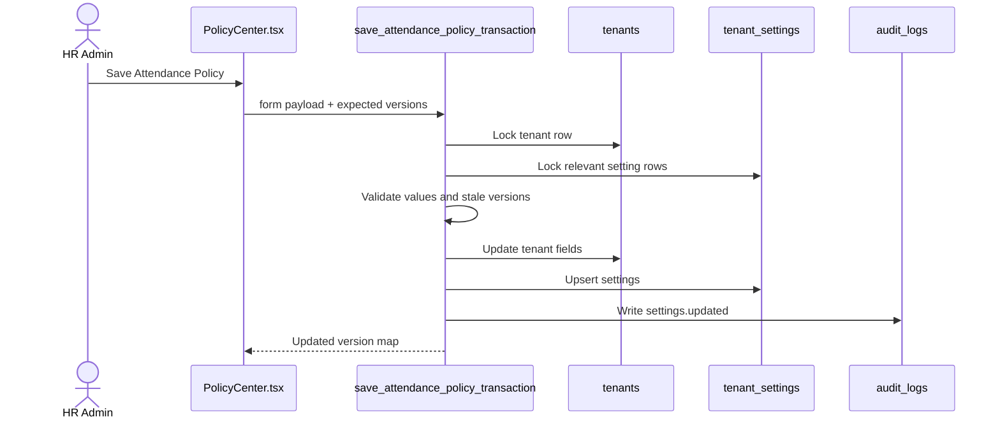

# Policy Center Release P2 Implementation Plan: Transactional Attendance And Task Rule Settings

Target:

```text
Frontend branch: updateSuggestion
InsForge preview: https://rq3qmu8y-jx7.ap-southeast.insforge.app
```

Source of truth:

- `new update doc/policy_center_audit_and_implementation_plan.md`
- `new update doc/policy_center_release_p1_document_privacy_plan.md`

Do not use the old `doc` folder.

## Goal

Move attendance and task policy saves from multi-step client writes into transactional database RPCs.

This release makes the most operationally sensitive Policy Center settings atomic:

- punch-in start/cutoff
- work hours
- lunch break
- geofence settings
- remote work handling
- GPS/selfie settings
- late mark and overtime settings
- punch-out task gate
- task red-mark/grace settings

## Current Behavior

`PolicyCenter.tsx` saves attendance policy by:

1. Updating `tenants`.
2. Updating/inserting multiple `tenant_settings` rows through `saveSettingRows`.

Task policy similarly updates:

1. `tenants.punch_out_gate_enabled`
2. `tenant_settings.task_eod_redmark_time`
3. `tenant_settings.task_grace_period_minutes`

This works in QA, but it is not atomic.

## Production-Grade Target



## Database Migration

Create:

```text
migrations/20260706150000_policy-center-rule-settings-rpcs.sql
```

### RPC 1: `save_attendance_policy_transaction`

Signature suggestion:

```sql
public.save_attendance_policy_transaction(
  p_tenant_id uuid,
  p_expected_tenant_updated_at timestamptz,
  p_expected_setting_versions jsonb,
  p_policy jsonb
) returns jsonb
```

`p_policy` fields:

- `punch_in_start`
- `punch_in_cutoff`
- `work_hours_per_day`
- `lunch_break_minutes`
- `late_mark_enabled`
- `late_mark_grace_minutes`
- `late_mark_threshold`
- `late_mark_deduction_hours`
- `overtime_enabled`
- `overtime_rate`
- `geofence_enabled`
- `office_lat`
- `office_lng`
- `geofence_radius_meters`
- `geofence_mode`
- `regularization_enabled`
- `regularization_window_days`
- `payroll_lock_date`
- `break_tracking_enabled`
- `break_deduction_mode`
- `short_break_limit_minutes`
- `remote_work_handling`
- `gps_verification_mode`
- `attendance_selfie_mode`
- `selfie_retention_days`
- `high_confidence_max`
- `medium_confidence_max`
- `low_confidence_max`

Rules:

- Verify HR permission.
- Verify `p_tenant_id = get_auth_tenant_id()`.
- Lock tenant row.
- Lock relevant `tenant_settings` rows.
- Reject stale tenant or setting versions.
- Validate enum values.
- Validate numeric values.
- If `geofence_enabled = true`, require valid lat/lng/radius.
- Update tenant and settings inside one transaction.
- Write one audit log event.
- Return:

```json
{
  "tenant_updated_at": "...",
  "setting_versions": {
    "late_mark_enabled": "...",
    "geofence_enabled": "..."
  }
}
```

### RPC 2: `save_task_policy_transaction`

Signature suggestion:

```sql
public.save_task_policy_transaction(
  p_tenant_id uuid,
  p_expected_tenant_updated_at timestamptz,
  p_expected_setting_versions jsonb,
  p_policy jsonb
) returns jsonb
```

`p_policy` fields:

- `punch_out_gate_enabled`
- `task_eod_redmark_time`
- `task_grace_period_minutes`

Rules:

- Verify HR permission.
- Verify tenant scope.
- Lock tenant row and settings rows.
- Reject stale versions.
- Validate time and grace values.
- Update `tenants.punch_out_gate_enabled`.
- Upsert task settings.
- Write audit log.
- Return updated versions.

## Frontend Changes

### `src/hr/PolicyCenter.tsx`

Replace `saveAttendancePolicy` internals:

- Keep form validation in `policyValidation.ts` for UX.
- Call `db.rpc("save_attendance_policy_transaction", ...)`.
- Update `tenantUpdatedAt` and `settingUpdatedAtMap` from RPC response.
- Update baselines only after RPC success.
- Remove direct tenant update and `saveSettingRows` call from attendance save.

Replace `saveTaskPolicy` internals similarly.

Keep `saveSettingRows` for leave/salary temporarily until later releases.

### Error Handling

RPC should raise stable messages/codes for:

- stale write
- permission denied
- invalid policy value

Frontend should map those to existing toast messages:

- "Another admin has modified these settings. Please refresh."
- "Permission denied."
- "Invalid policy value."

## QA Checklist

### Automated

```powershell
npm run build
npx @insforge/cli db migrations up --all
```

### Manual

1. Save Attendance policy with valid values.
2. Verify `tenants` and `tenant_settings` update together.
3. Force invalid geofence settings; RPC must reject.
4. Simulate stale write with two HR sessions; second save must fail.
5. Save Task policy.
6. Verify `tenants.punch_out_gate_enabled` and task settings update together.
7. Toggle punch-out gate and verify employee Punch In/Out behavior reads the new value.
8. Verify audit log contains a single `settings.updated` event per save.

## Rollback Plan

If RPC path breaks:

1. Restore frontend `saveAttendancePolicy` and `saveTaskPolicy` client-write paths.
2. Leave RPCs in database unused.
3. Do not drop RPCs unless explicitly requested.

## Definition Of Done

- Attendance policy save is one RPC call.
- Task policy save is one RPC call.
- Partial save between `tenants` and `tenant_settings` is no longer possible for these areas.
- Stale writes are blocked inside the database.
- Build passes.
- Migration applies successfully.
- Main audit doc is updated with P2 completion notes.

