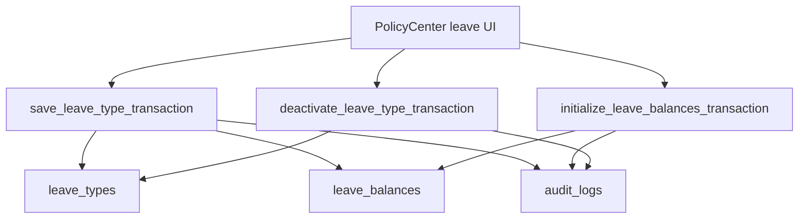

# Policy Center Release P3 Implementation Plan: Transactional Leave Policy And Balances

Target:

```text
Frontend branch: updateSuggestion
InsForge preview: https://rq3qmu8y-jx7.ap-southeast.insforge.app
```

Source of truth:

- `new update doc/policy_center_audit_and_implementation_plan.md`
- `new update doc/policy_center_release_p2_transactional_rule_settings_plan.md`

Do not use the old `doc` folder.

## Goal

Move leave type creation, editing, deactivation, default setup, and leave balance initialization into transactional database RPCs.

This is needed because leave policy affects:

- employee leave balances
- leave application validation
- payroll LOP calculations
- new employee creation leave seeding

## Current Behavior

`PolicyCenter.tsx` currently:

- inserts/updates `leave_types` directly
- fetches active employees from the client
- upserts `leave_balances` from the client
- recalculates balances row-by-row from the client
- deactivates leave types directly
- initializes missing balances directly

The QA walkthrough says these flows are currently functional, but they are still multi-step browser transactions.

## Production-Grade Target



## Database Migration

Create:

```text
migrations/20260706160000_policy-center-leave-transactions.sql
```

## RPC 1: `save_leave_type_transaction`

Signature suggestion:

```sql
public.save_leave_type_transaction(
  p_leave_type_id uuid,
  p_expected_updated_at timestamptz,
  p_payload jsonb
) returns jsonb
```

For new leave type:

- `p_leave_type_id` is null.

For edit:

- `p_leave_type_id` is existing id.
- stale check uses `p_expected_updated_at`.

Payload fields:

- `name`
- `code`
- `days_per_year`
- `accrual_type`
- `carry_forward_enabled`
- `carry_forward_max_days`
- `encashment_enabled`
- `applicable_from_day`
- `probation_restricted`
- `requires_document`
- `min_notice_days`
- `max_consecutive_days`
- `is_active`
- `is_paid`

Rules:

- Verify HR permission.
- Verify tenant scope.
- Validate all values.
- Enforce active duplicate code/name rules per tenant.
- Lock existing leave type when editing.
- Insert/update leave type.
- If creating active leave type, create missing leave balances for all active employees for current tenant year.
- If editing `days_per_year` or `accrual_type`, recalculate current-year balances consistently.
- Never overwrite `used_days`.
- Preserve pending days.
- Prevent negative balances unless product explicitly allows negative balances.
- Write audit event.

Return:

```json
{
  "leave_type_id": "...",
  "updated_at": "...",
  "balances_created": 10,
  "balances_updated": 10
}
```

## RPC 2: `initialize_leave_balances_transaction`

Signature:

```sql
public.initialize_leave_balances_transaction(
  p_year integer
) returns jsonb
```

Rules:

- Verify HR permission.
- Use current tenant.
- Fetch active employees.
- Fetch active leave types.
- Insert missing `leave_balances`.
- Do not overwrite existing balances.
- Return counts.
- Write audit event.

## RPC 3: `deactivate_leave_type_transaction`

Signature:

```sql
public.deactivate_leave_type_transaction(
  p_leave_type_id uuid,
  p_expected_updated_at timestamptz
) returns jsonb
```

Rules:

- Verify HR permission.
- Verify tenant scope.
- Stale-check `updated_at`.
- Set `is_active = false`.
- Keep historical leave balances and leave requests.
- Write audit event.

## Frontend Changes

### `src/hr/PolicyCenter.tsx`

Replace:

- `saveLeaveType`
- `deactivateLeaveType`
- `setupDefaultLeaveTypes`
- `initializeLeaveBalances`

With RPC calls.

Keep UI behavior:

- Same modal.
- Same validation for fast feedback.
- Same dry-run modal.

Dry-run should either:

- remain client-side for preview estimate, or
- use a new `preview_leave_balance_initialization` RPC if accurate server estimate is needed.

Recommendation:

Keep dry-run client-side in this release, but final write must be RPC.

## QA Checklist

### Automated

```powershell
npm run build
npx @insforge/cli db migrations up --all
```

### Manual

1. Create a new active leave type.
2. Verify balances are created for all active employees.
3. Create inactive leave type; verify balances are not created until active if that is the chosen rule.
4. Edit `days_per_year`; verify all current-year balances recalculate consistently.
5. Verify used days are not reset.
6. Verify negative balances are not introduced.
7. Deactivate a leave type; verify employee new leave application no longer shows it.
8. Run initialize leave balances; verify only missing combinations are inserted.
9. Simulate stale edit from two HR sessions.
10. Verify audit logs for create/update/deactivate/initialize.

## Rollback Plan

If RPCs fail:

1. Revert frontend to client-side leave write flow.
2. Keep RPCs unused.
3. Do not drop columns or existing balances.

## Definition Of Done

- Leave type create/edit/deactivate use RPC.
- Balance initialization uses RPC.
- No client-side multi-row balance mutation remains.
- Leave balance drift risk is reduced.
- Build passes.
- Migration applies successfully.
- Main audit doc is updated with P3 completion notes.

