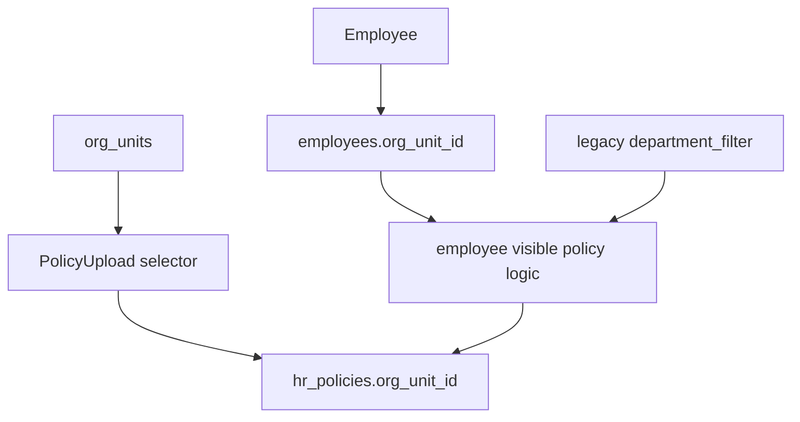

# Policy Center Release P4 Implementation Plan: Normalized Org Unit Policy Targeting

Target:

```text
Frontend branch: updateSuggestion
InsForge preview: https://rq3qmu8y-jx7.ap-southeast.insforge.app
```

Source of truth:

- `new update doc/policy_center_audit_and_implementation_plan.md`
- `new update doc/people_suite_architecture_and_developer_guide.md`

Do not use the old `doc` folder.

## Goal

Align Policy Center document targeting and salary templates with the normalized organization structure completed in People Suite.

This release moves Policy Center away from hard-coded legacy departments toward `org_units`.

## Problem

Current HR policy document targeting uses static legacy department values:

- `sales`
- `dev`
- `marketing`
- `operations`
- `design`
- `other`

But People Suite now supports real tenant-specific org units through `org_units`.

Real HRMS example:

HR creates:

```text
Finance
Engineering
Product
Customer Success
```

Policy Upload still only offers old static values, so HR cannot target the correct org units.

## Target Architecture



## Database Migration

Create:

```text
migrations/20260706170000_policy-center-org-unit-targeting.sql
```

### Add Columns

```sql
alter table public.hr_policies
add column if not exists org_unit_id uuid references public.org_units(id) on delete set null;
```

Optional future-proofing:

```sql
create index if not exists idx_hr_policies_tenant_org_unit
on public.hr_policies (tenant_id, org_unit_id)
where org_unit_id is not null;
```

### Update Visible Policy RPC

If P1 created `get_employee_visible_hr_policies`, update it:

Employee can see policy when:

- `visible_to = 'all'`
- `org_unit_id = employee.org_unit_id`
- legacy fallback: `department_filter = employee.department`

Never show:

- `visible_to = 'hr_only'`
- rows from another tenant

## Frontend Changes

### `src/hr/PolicyUpload.tsx`

Replace static department list with active org units:

- Load `org_units` for current tenant.
- Display hierarchical labels if parent-child data exists.
- Let HR choose org unit for department-specific policies.
- Keep legacy department fallback only for existing rows or if org unit data is missing.

Recommended UI labels:

- Visibility:
  - All employees
  - HR only
  - Specific org unit

Data writes:

- For org-unit targeting: set `org_unit_id`.
- Keep `department_filter` null for new org-unit policies.
- For legacy rows, continue displaying `department_filter`.

### `src/employee/Policies.tsx`

If using RPC from P1, frontend should not manually implement visibility rules.

Only update types/rendering if needed.

### Types

Update `HRPolicy`:

```ts
org_unit_id?: string | null;
org_unit_name?: string | null;
```

If RPC returns label, include it in employee visible policy type.

## Salary Template Decision

Current salary templates are dynamic `tenant_settings` JSON keys like:

```text
salary_template_sales
```

This release may either:

Option A:

- Leave salary templates unchanged and only normalize policy documents.
- Safer and smaller.

Option B:

- Add `salary_templates` table keyed by `org_unit_id`.
- Bigger payroll-impacting change.

Recommendation:

Use Option A in P4. Plan `salary_templates` as a future payroll release because payroll deserves separate QA.

## QA Checklist

### Automated

```powershell
npm run build
npx @insforge/cli db migrations up --all
```

### Manual

1. Create active org units in Org Setup.
2. Open HR Policy Upload.
3. Select "Specific org unit".
4. Verify org units load from database, not static list.
5. Upload policy for one org unit.
6. Login as employee in that org unit; policy appears.
7. Login as employee in another org unit; policy does not appear.
8. Verify legacy department-filtered policies still appear for matching legacy employees.
9. Verify HR can still see all policies in HR policy library.
10. Verify no People Suite Org Setup behavior regressed.

## Rollback Plan

If org-unit targeting breaks:

1. Keep `org_unit_id` column.
2. Revert frontend to legacy department selector temporarily.
3. Keep visible policy RPC legacy fallback.

## Definition Of Done

- HR can target policies to normalized org units.
- Employee visibility uses org unit safely server-side.
- Legacy department-filtered policies still work.
- Static department list is not the primary targeting mechanism.
- Build passes.
- Migration applies successfully.
- Main audit doc is updated with P4 completion notes.

