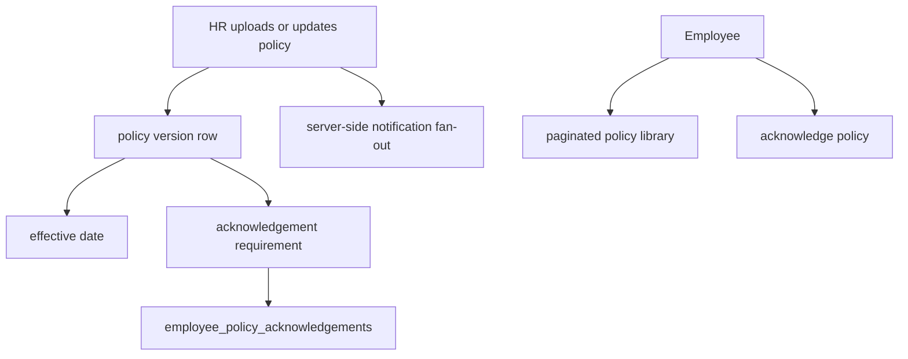

# Policy Center Release P5 Implementation Plan: Scale, Versioning, Acknowledgement, And Operational UX

Target:

```text
Frontend branch: updateSuggestion
InsForge preview: https://rq3qmu8y-jx7.ap-southeast.insforge.app
```

Source of truth:

- `new update doc/policy_center_audit_and_implementation_plan.md`
- Release P1 through P4 Policy Center plan files

Do not use the old `doc` folder.

## Goal

Bring Policy Center closer to best-HRMS behavior for larger tenants and real policy governance.

This release is intentionally later because it builds on:

- secure document access
- transactional settings
- transactional leave policies
- normalized org-unit targeting

## Best-HRMS Target

A mature HRMS Policy Center should support:

- policy versions
- effective dates
- employee acknowledgements
- safe document access
- server-side pagination
- scalable notification fan-out
- clear previews of operational impact before saving rules
- audit trails that HR/legal can understand

## Target Architecture



## Database Migration

Create:

```text
migrations/20260706180000_policy-center-scale-governance.sql
```

## Part A: Policy Versioning

Add columns to `hr_policies`:

```sql
alter table public.hr_policies
add column if not exists version_number integer not null default 1,
add column if not exists effective_date date,
add column if not exists expires_at timestamptz,
add column if not exists requires_acknowledgement boolean not null default false,
add column if not exists supersedes_policy_id uuid references public.hr_policies(id) on delete set null;
```

Rules:

- Do not overwrite old policy documents when HR uploads a new version.
- Create a new row with incremented `version_number`.
- Mark old row as superseded or expired.
- Keep audit trail.

## Part B: Employee Acknowledgements

Create:

```sql
create table if not exists public.employee_policy_acknowledgements (
  id uuid primary key default gen_random_uuid(),
  tenant_id uuid not null references public.tenants(id) on delete cascade,
  policy_id uuid not null references public.hr_policies(id) on delete cascade,
  employee_id uuid not null references public.employees(id) on delete cascade,
  acknowledged_at timestamptz not null default now(),
  acknowledgement_text text,
  created_at timestamptz not null default now(),
  unique (tenant_id, policy_id, employee_id)
);
```

Enable RLS:

- HR can read acknowledgements for tenant.
- Employee can read/insert own acknowledgement for visible policies.
- Tenant restrictive policy must apply.

## Part C: Server-Side Notification Fan-Out

Create RPC:

```text
public.create_policy_notifications_transaction(
  p_policy_id uuid
) returns jsonb
```

Rules:

- Verify HR permission.
- Determine audience server-side.
- Insert notifications in server-side batches.
- Return count.

Frontend should no longer bulk insert thousands of notifications directly.

## Part D: Pagination

HR policy library:

- Add page size.
- Add search by title.
- Add filters by visibility/org unit/effective status.

Employee policy library:

- Paginate visible policies.
- Filter current/expired.
- Show acknowledgement status.

Preferred RPCs:

```text
get_hr_policy_library(p_search text, p_visibility text, p_limit int, p_offset int)
get_employee_visible_hr_policies(p_search text, p_limit int, p_offset int)
```

## Part E: Operational Impact Preview

Before saving major rule changes, show impact preview.

Attendance policy preview examples:

- Changing punch-in cutoff may affect late/half-day classification.
- Enabling strict geofence may block remote/hybrid employees.
- Enabling selfie mode may affect employees without camera permission.

Leave policy preview examples:

- Changing leave days affects existing balances.
- Changing paid/unpaid setting affects payroll.

Payroll policy preview examples:

- Changing PF/ESI ceilings affects payslip calculations.
- Changing LOP method affects salary deductions.

Implementation:

- Start with static warning cards in UI.
- Later add RPC-based impact estimates.

## Frontend Changes

### `src/hr/PolicyUpload.tsx`

Add:

- version display
- effective date input
- requires acknowledgement toggle
- upload new version action
- paginated library
- search/filter controls

### `src/employee/Policies.tsx`

Add:

- paginated library
- current/expired badge
- acknowledgement required badge
- acknowledge button
- acknowledged timestamp display

### `src/hr/PolicyCenter.tsx`

Add operational impact preview panels:

- Attendance tab
- Leave tab
- Salary tab
- Task tab where relevant

Do not block saving unless the rule is invalid. Preview is advisory unless product later requires approval workflow.

## QA Checklist

### Automated

```powershell
npm run build
npx @insforge/cli db migrations up --all
```

### Manual

1. Upload version 1 policy requiring acknowledgement.
2. Employee sees acknowledgement required.
3. Employee acknowledges once.
4. Duplicate acknowledgement is blocked.
5. HR sees acknowledgement count.
6. Upload version 2 of same policy.
7. Employee must acknowledge version 2 separately.
8. Expired policies are hidden or marked according to UI rule.
9. Upload all-employee policy for 1k employees; notification fan-out succeeds server-side.
10. HR and employee libraries paginate correctly.
11. Policy impact warnings show before saving high-impact settings.

## Rollback Plan

If acknowledgement feature breaks:

1. Hide acknowledgement UI.
2. Keep acknowledgement table; additive table is safe.
3. Keep existing policy document library behavior.

If pagination breaks:

1. Revert to unpaginated list temporarily.
2. Keep RPCs unused.

## Definition Of Done

- Policy documents support versions/effective dates.
- Employee acknowledgements are tracked.
- Notification fan-out is no longer a browser bulk insert.
- HR and employee policy libraries paginate.
- Operational impact preview exists for high-impact settings.
- Build passes.
- Migration applies successfully.
- Main audit doc is updated with P5 completion notes.

