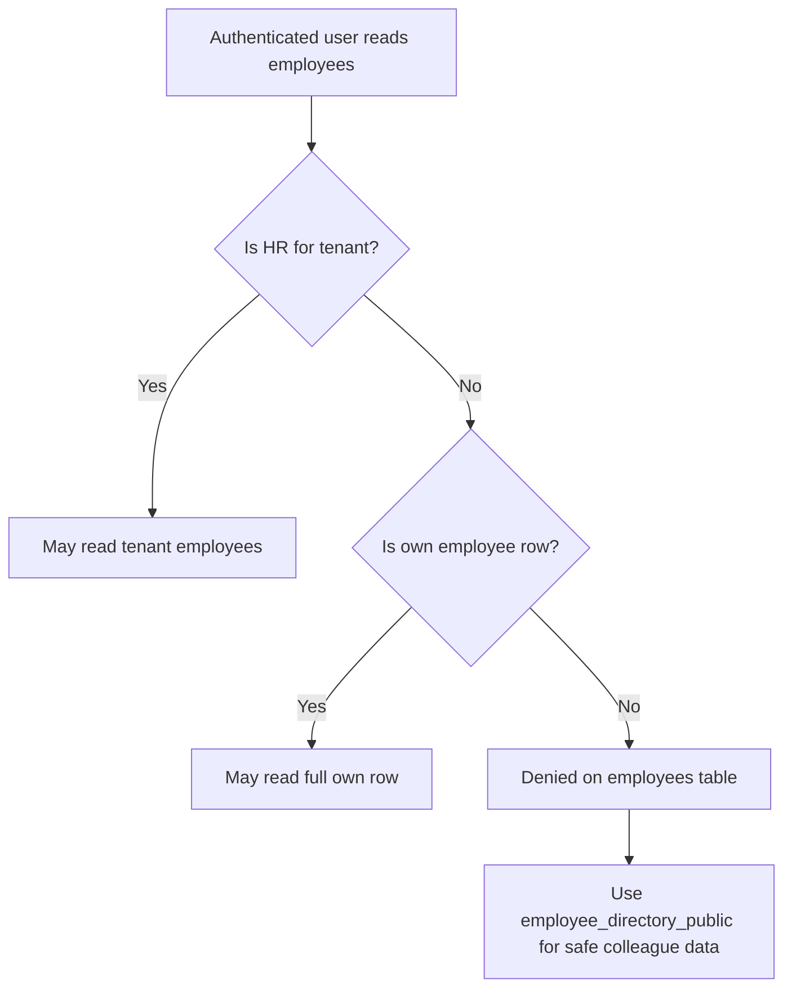

# Release 6B Implementation Plan: Base Employees RLS Revocation

Target:

```text
Frontend branch: updateSuggestion
InsForge preview: https://rq3qmu8y-jx7.ap-southeast.insforge.app
```

Source of truth:

- `new update doc/people_suite_edge_case_hardening_plan.md`
- `new update doc/people_suite_architecture_and_developer_guide.md`
- `new update doc/people_suite_full_implementation_plan.md`

Do not use the old `doc` folder.

## Goal

Finish the staged privacy hardening started in Release 4 by revoking broad standard-employee `SELECT` access on the base `public.employees` table.

After this release:

- HR users can still read employee records needed for HR workflows.
- Employees can still read their own full employee row.
- Employees can still browse safe colleague information through `employee_directory_public`.
- Standard employees cannot query other employees' sensitive base-table columns.

## Release Gate

Do not implement Release 6B until Release 6A is complete and QA has passed these employee portal screens:

- Dashboard
- My Profile
- Onboarding Wizard
- Directory
- Org Chart
- My Team
- My Leaves
- My Tasks
- Project view
- Expenses
- Payslips if enabled
- Resignation/My Exit
- Chat/Connect if enabled

This release changes access control. It is intentionally separate from feature work.

## Preflight Audit

Run these searches before writing the migration:

```powershell
rg "\.from\([\"']employees[\"']\)" src
rg "from\([\"']employees[\"']\)" src
rg "employee_directory_public" src
rg "employees_self_read" migrations
```

Classify every remaining base-table `employees` query:

| Query type | Allowed after 6B? | Required action |
| --- | --- | --- |
| HR portal employee management | Yes | Must be protected by HR role/RLS. |
| Employee reads own profile by `user_id` or employee id | Yes | Covered by `employees_self_read`. |
| Employee reads all active employees | No | Move to `employee_directory_public`. |
| Employee reads direct reports only | Prefer no | Move to safe view unless sensitive manager-only fields are required. |
| Auth/session tenant lookup | Maybe | Must select only own row or use a safe tenant/profile lookup. |

If any employee portal screen still needs broad base-table access, stop and migrate that screen first.

## Database Migration

Create a new migration:

```text
migrations/20260706110000_employees-rls-revoke-broad-select.sql
```

The exact timestamp can be adjusted only if a newer local migration already exists.

## Required Database Inspection

Before revoking anything, inspect actual policies on `public.employees`.

Use the available InsForge SQL mechanism or CLI equivalent to run:

```sql
select
  schemaname,
  tablename,
  policyname,
  permissive,
  roles,
  cmd,
  qual,
  with_check
from pg_policies
where schemaname = 'public'
  and tablename = 'employees'
order by policyname;
```

Document the policy names in the migration comments.

## Target Policy Model



### Keep Or Create: Employee Self Read

Release 4 added `employees_self_read`. Confirm it exists.

Expected behavior:

```sql
exists (
  select 1
  from public.employees self_emp
  where self_emp.user_id = auth.uid()
    and self_emp.id = employees.id
)
```

Use the actual InsForge/auth helper used in this project. Do not invent a helper without checking existing migrations.

### Keep Or Create: HR Read

Confirm HR can read tenant employees through an HR policy or helper.

The policy must enforce tenant scope.

Pseudo target:

```sql
is_hr_for_tenant(tenant_id)
```

Use the actual helper already present in migrations.

### Revoke Broad Employee Read

Drop or replace only the broad select policy that lets ordinary authenticated users read all tenant employees.

Do not drop:

- self-read policy
- HR read policy
- update/insert policies required by employee self-onboarding if they are scoped to own row
- service/admin policies used by edge functions if required

## Frontend Updates

This release should usually have little or no frontend work because Release 4 Stage A migrated broad reads already.

If the preflight audit finds unsafe base-table reads, update them before the RLS migration.

Use `employee_directory_public` for:

- colleague directory
- manager dropdowns in employee portal
- direct reports list if only safe fields are shown
- project member display maps
- org chart outside HR portal

Use base `employees` only for:

- current user's own full profile
- HR employee management
- HR offboarding screens
- HR employee detail

## QA Checklist

### Automated

```powershell
npm run build
npx @insforge/cli db migrations up --all
```

### Manual: Standard Employee

Login as a normal employee and verify:

1. Dashboard loads.
2. My Profile loads own full data.
3. My Profile update/request actions do not create audit 409 errors.
4. Directory loads and uses `employee_directory_public` in the network panel.
5. Directory response does not include Aadhaar, PAN, bank details, address, or emergency contact fields.
6. Org Chart loads outside HR portal.
7. My Team loads if the user has direct reports.
8. My Leaves loads own leaves and team leaves if manager logic exists.
9. My Tasks and Project views load assigned data.
10. Resignation/My Exit loads own exit state.

### Manual: HR User

Login as HR and verify:

1. Employee list loads.
2. Employee detail loads full HR fields.
3. HR can create an employee.
4. HR can update manager assignment through RPC.
5. HR can open Directory and see HR-allowed fields.
6. HR can open Org Chart and see data-quality warnings.
7. HR can manage offboarding.

### Manual: Direct API Privacy Check

As a standard employee session, attempt to query another employee from base `employees`.

Expected result:

- zero rows, or permission denied
- no sensitive columns returned

Then query `employee_directory_public`.

Expected result:

- safe colleague rows returned
- no sensitive columns returned

## Rollback Plan

If employee portal screens break:

1. Recreate the previous broad select policy temporarily.
2. Keep frontend migrations to `employee_directory_public`; they are still correct.
3. Record which screen still reads base `employees`.
4. Fix that screen before attempting revocation again.

The rollback should be a small SQL migration, not manual dashboard edits.

## Definition Of Done

- Every broad employee portal read has moved off base `employees`.
- Standard employees can read their own full row only.
- Standard employees cannot read other employees from base `employees`.
- Employee portal still works end-to-end.
- HR portal still works end-to-end.
- `npm run build` passes.
- Migration applies successfully on the updateSuggestion InsForge preview.
- `people_suite_edge_case_hardening_plan.md` is updated with Release 6B completion notes.

