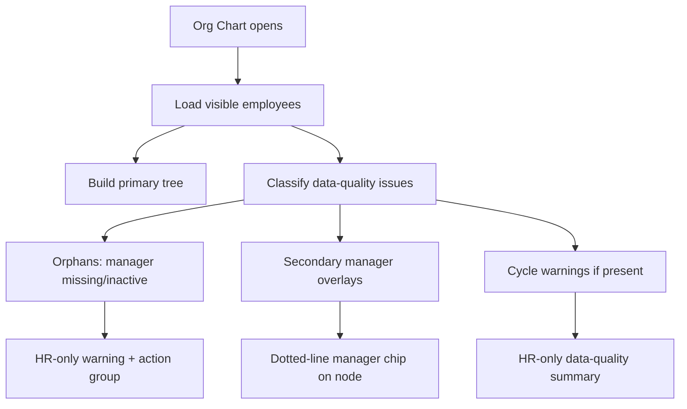

# Release 6C Implementation Plan: Org Chart UI Enhancements

Target:

```text
Frontend branch: updateSuggestion
InsForge preview: https://rq3qmu8y-jx7.ap-southeast.insforge.app
```

Source of truth:

- `new update doc/people_suite_edge_case_hardening_plan.md`
- `new update doc/people_suite_architecture_and_developer_guide.md`
- `new update doc/people_suite_full_implementation_plan.md`

Do not use the old `doc` folder.

## Goal

Improve Org Chart usability and data-quality visibility without changing the underlying reporting data model.

This release makes dotted-line relationships and reporting data issues easier for HR to understand, while keeping the existing `employee_reporting_relationships` and `manager_id` compatibility behavior stable.

## Release Scope

Implement only frontend/UI enhancements unless the preflight audit proves a missing safe field is required.

In scope:

1. Improve secondary manager/dotted-line display.
2. Improve the HR-only data-quality banner.
3. Add a compact data-quality summary panel for HR.
4. Make orphan cards more actionable.
5. Keep employee portal warnings minimal and non-HR safe.

Out of scope:

- No RLS changes. That is Release 6B.
- No exit interview changes. That is Release 7.
- No reporting relationship schema migration unless a missing index is discovered and clearly needed.
- No drag-and-drop org chart editing.

## Preflight Audit

Run:

```powershell
rg "buildOrgTreeWithOrphans" src
rg "secondary_manager" src
rg "employee_reporting_relationships" src
rg "OrgChartNode" src
rg "Needs Manager Assignment" src
```

Confirm current behavior:

| Check | Expected |
| --- | --- |
| `buildOrgTreeWithOrphans` exists | Yes, from Release 3. |
| `orphanNodes` are included in search/flat nodes | Yes. |
| HR-only orphan warning exists | Yes. |
| Secondary manager display exists | Existing dotted-line or text display may exist, but polish is needed. |
| Org Chart outside HR uses safe view | Yes, from earlier hardening. |

## Target UX



## Frontend Changes

### `src/shared/pages/OrgChart.tsx`

Add derived counts:

```ts
const dataQualitySummary = {
  orphanCount: orphanNodes.length,
  secondaryManagerCount: employees.filter((employee) => employee.secondary_manager_id).length,
};
```

Only compute `missingPrimaryRelationshipCount` if the current loaded data includes enough relationship information. If not, omit it instead of guessing.

Add an HR-only data-quality summary near the chart controls:

```text
Data quality
2 need manager reassignment
4 have dotted-line managers
0 cycle warnings
```

Rules:

- Show only in HR Portal.
- Do not show sensitive employee fields.
- Do not block chart rendering.
- If counts are zero, render a small "Structure looks clean" state or hide the panel.

Improve orphan action cards:

- show employee name
- show current missing manager id/name if available
- show department/org unit
- show job title
- HR Portal only: link or button to open Employee Detail for reassignment
- click card still opens the side drawer

### `src/shared/components/OrgChartNode.tsx`

Improve secondary manager display:

- Show a distinct "Dotted-line" or "Matrix" chip.
- Use manager name if already available.
- Use fallback text only if manager name is not available:

```text
Dotted-line manager assigned
```

Do not fetch extra data per node. Use data already loaded in `OrgChart.tsx`.

### `src/utils/orgChart.ts`

Do not rewrite `buildOrgTreeWithOrphans` unless there is a bug.

Allowed additions:

- helper for computing secondary manager labels from the loaded employee map
- helper for classifying data-quality counts

Keep `buildOrgTree` backward compatible.

## Optional Index Check

If Org Chart is slow or relationship queries are added, inspect whether these indexes exist:

```sql
employee_reporting_relationships(tenant_id, employee_id, is_active)
employee_reporting_relationships(tenant_id, manager_id, is_active)
employees(tenant_id, manager_id)
employees(tenant_id, secondary_manager_id)
```

Only add an index migration if a real query needs it and the index does not already exist.

If needed, use:

```text
migrations/20260706120000_org-chart-relationship-indexes.sql
```

## QA Checklist

### Automated

```powershell
npm run build
```

Run migrations only if an index migration is created:

```powershell
npx @insforge/cli db migrations up --all
```

### Manual

1. Open Org Chart as HR.
2. Verify normal root and child nodes still render.
3. Verify orphan employees appear under "Needs Manager Assignment", not as floating roots.
4. Verify the HR-only data-quality summary count matches the orphan group.
5. Assign a secondary manager to an employee and verify the node shows a dotted-line/matrix chip.
6. Click an orphan card and verify the side drawer opens.
7. Use the HR profile link/action and verify it opens the employee detail/edit route.
8. Open Org Chart as a standard employee and verify HR-only warnings/actions do not appear.
9. Verify search still finds normal nodes and orphan nodes.
10. Verify mobile layout does not overflow horizontally more than the existing chart behavior.

## Rollback Plan

This should be mostly frontend-only.

If a UI regression occurs:

1. Revert the Org Chart UI changes.
2. Keep `buildOrgTreeWithOrphans` from Release 3 intact.
3. Remove only any optional index migration if it has not been applied. If applied, leave it because additive indexes are safe.

## Definition Of Done

- HR gets a clearer Org Chart data-quality summary.
- Orphan employee cards are actionable.
- Secondary/dotted-line manager display is clearer.
- Employee portal does not expose HR-only warning/actions.
- `npm run build` passes.
- `people_suite_edge_case_hardening_plan.md` is updated with Release 6C completion notes.

